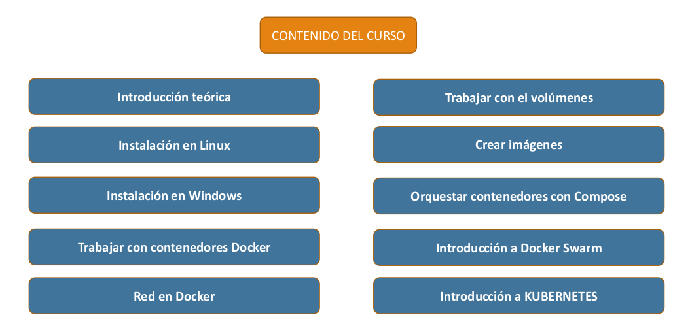
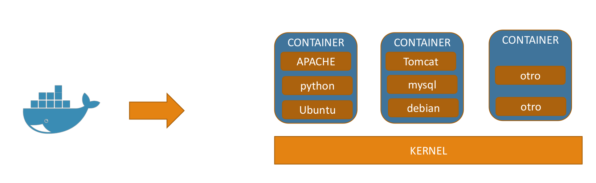
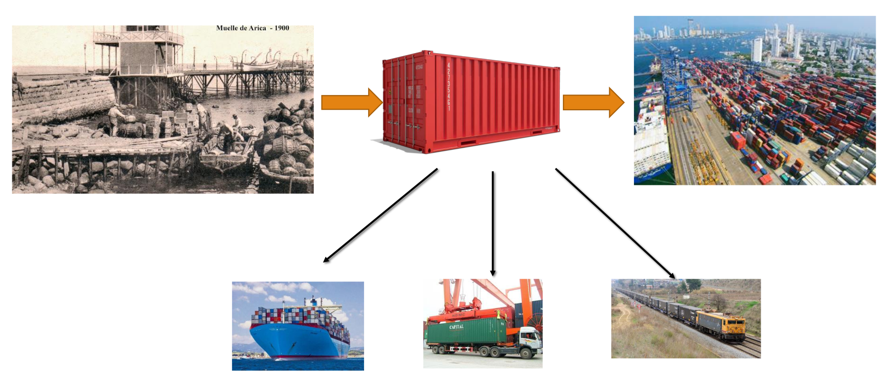
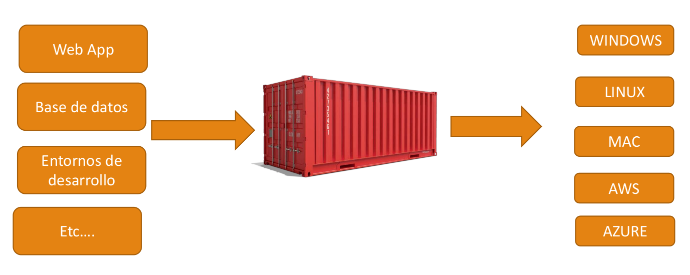
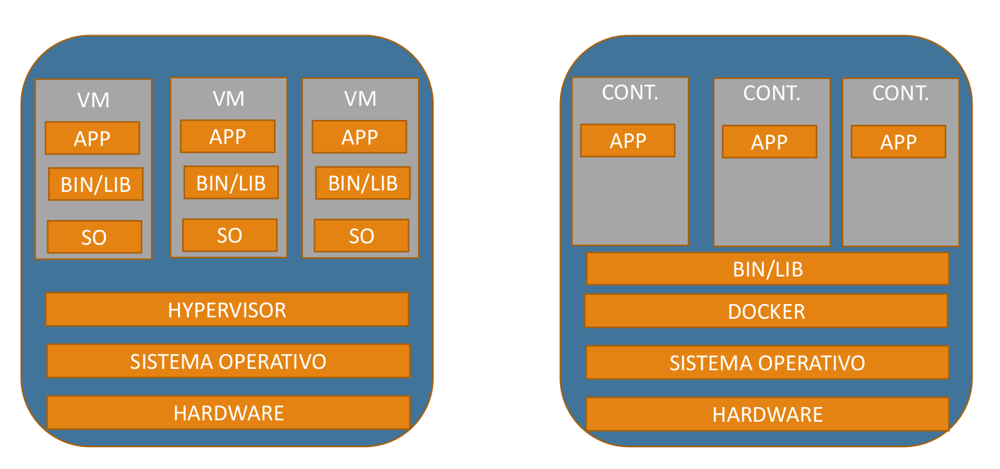
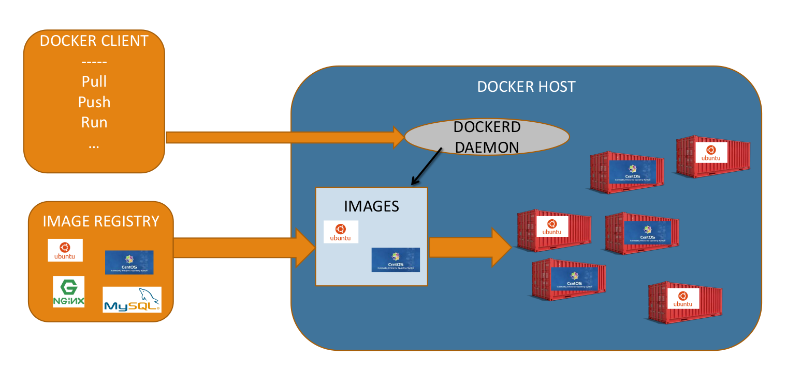
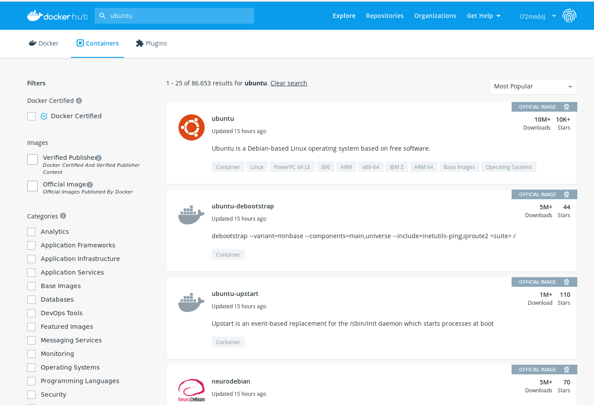
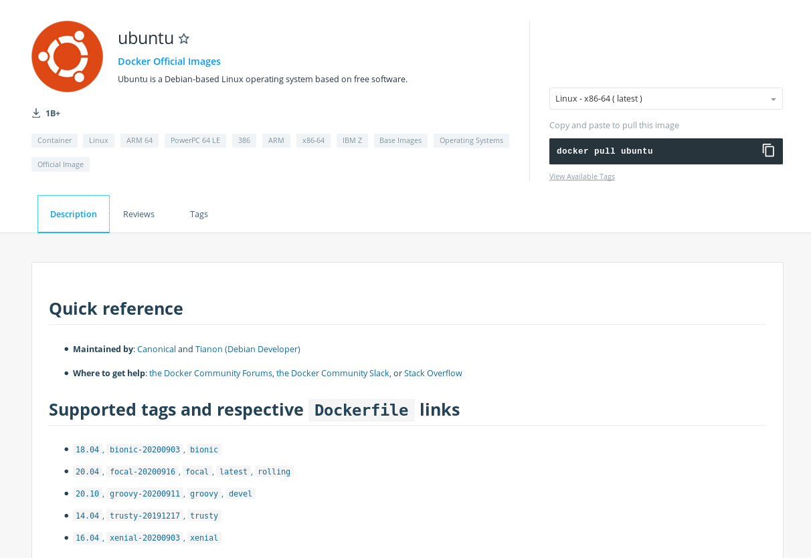
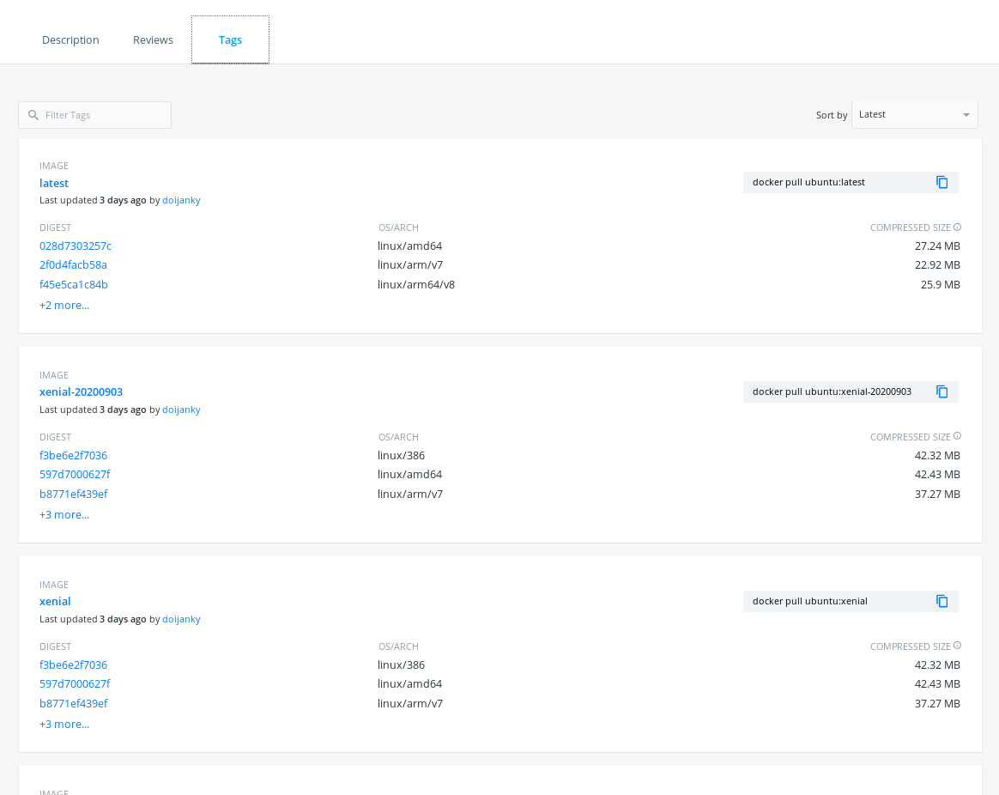
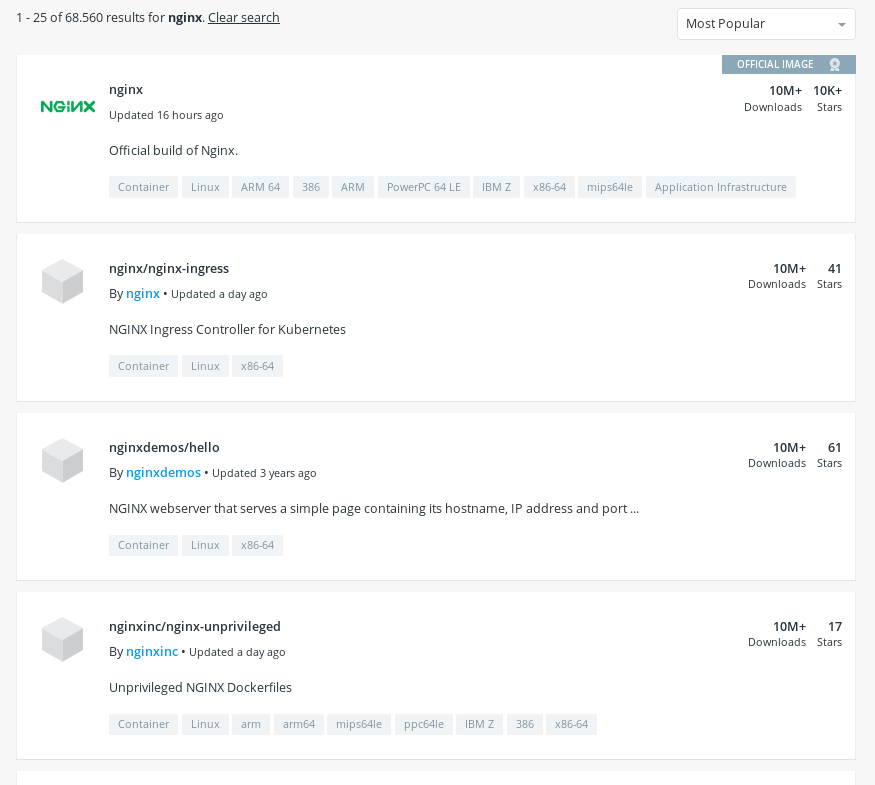

# Curso de Docker <!-- omit in toc -->


# Tabla de contenidos <!-- omit in toc -->

- [SECCIÓN 1: Introducción al curso](#sección-1-introducción-al-curso)
  - [1.1 Introducción al curso](#11-introducción-al-curso)
  - [1.2 Introducción a Docker](#12-introducción-a-docker)
  - [1.3 Diferencia con máquinas virtuales](#13-diferencia-con-máquinas-virtuales)
  - [1.4 Versiones de Docker](#14-versiones-de-docker)
  - [1.5 Instalación de Docker en Debian 10 Buster](#15-instalación-de-docker-en-debian-10-buster)
  - [1.6 Arquitectura de Docker, imágenes, contenedores y daemons](#16-arquitectura-de-docker-imágenes-contenedores-y-daemons)
- [SECCIÓN 2: Trabajar con contenedores](#sección-2-trabajar-con-contenedores)
  - [2.1 Arrancar y parar Docker](#21-arrancar-y-parar-docker)
  - [2.2 Crear nuestro primer contenedor](#22-crear-nuestro-primer-contenedor)
  - [2.3 Ver imágenes y contenedores](#23-ver-imágenes-y-contenedores)
  - [2.4 Crear un contenedor interactivo](#24-crear-un-contenedor-interactivo)
  - [2.5 Crear un contenedor en background](#25-crear-un-contenedor-en-background)
  - [2.6 Docker Hub](#26-docker-hub)
  - [2.7 Borrar imágenes y contenedores](#27-borrar-imágenes-y-contenedores)

# SECCIÓN 1: Introducción al curso

## 1.1 Introducción al curso

En este curso vamos a ver todo lo relacionado con la tecnología Docker, desde las bases hasta la parte de *clustering* con Docker Swarm y la parte de KUBERNETES, qué es y cómo se integra con Docker.



- **Introducción teórica**: Veremos las bases de la tecnología Docker, por ejemplo, qué es un contenedor, diferencias con las máquinas virtuales, ...
- **Instalación en Linux**
- **Instalación en Windows** Veremos algunos detalles, aunque el curso está enfocado al sistema GNU/Linux porque es el sistema operativo habitual en este tipo de plataformas
- **Trabajar con contenedores Docker**: Veremos cómo trabajar con contenedores dentro de Docker
- **Redes en Docker**: Veremos todo lo relacionado con redes en Docker, es decir, cómo se comunican estos contenedores entre sí y con el mundo exterior
- **Trabajar con volúmenes**: Veremos cómo trabajar con volúmenes, es decir, cómo guardar nuestros datos de forma que cada vez que trabajemos con un contenedor, tengamos la persistencia del dato y podamos recuperar la información generada con anterioridad.
- **Crear imágenes**: Veremos cómo crear nuestras propias imágenes y cómo subirlas a Docker Hub o a nuestros propios repositorios privados y en este caso vamos a utilizar la herramienta oficial de Docker que es Docker registry.
- **Orquestar contenedores con Compose**: Veremos Docker Compose, que es un orquestador sencillo de contenedores, que se utiliza mucho sobre todo cuando nuestros contenedores alcanzan cierta complejidad y más aún cuando tengo varios contenedores que se relacionan entre sí, de tal forma que no voy a poder trabajar de la manera habitual, sino que voy a necesitar de alguna herramienta que me permita integrar de manera correcta esos contenedores y sus relaciones. Esa herramienta es Docker Compose.
- **Introducción a Docker Swarm**: Docker Swarm nos permite realizar *clustering* de contenedores, es también un orquestador pero a mucho mayor nivel. Nos va a permitir alta disponibilidad, escalamiento de servicios, ... Digamos que es la herramienta de orquestación oficial de Docker.
- **Introducción a KUBERNETES**: Veremos una introducción a este *framework*, a este entorno. No es un curso completo, sino una idea general de qué es KUBERNETES, cómo funciona, crearemos un pequeño cluster y veremos cómo podemos trabajar con contenedores Docker dentro de ese cluster. Lo suficiente para introducirse en KUBERNETES.

## 1.2 Introducción a Docker

Vamos a ver una introducción sobre la arquitectura y los componentes que tiene Docker, veremos sus características y posibilidades y la diferencia respecto a las máquinas virtuales.

Docker es un proyecto *Open Source* que permite automatizar el despliegue de aplicaciones dentro de contenedores o *containers*.

Un contenedor empaqueta de manera ligera (ya veremos la diferencia con las máquinas virtuales) todo lo necesario para que uno o más procesos o aplicaciones funcionen: código, herramientas del sistema, bibliotecas del sistema, dependencias, ...

Dado que un contenedor es como una cápsula, una caja cerrada, podemos coger el contenedor y lanzarlo o usarlo en distintos entornos sin necesidad de tener que cambiar nada, es el propio contenedor el que se encarga de mantener esta infraestructura de manera transparente para el desarrollador o usuario final.



Para empezar, un contenedor se va a ejecutar en un servidor en el que, por supuesto, lo primero que tenemos es el kernel del sistema operativo del servidor.

Encima del kernel lo que vamos a tener son contenedores, y ya veremos que entre el kernel y los contenedores lo que hay es otra capa intermedia que es *dockerd* el *daemon* o proceso en *background* que es el que se encarga de gestionar los contenedores.

Cada contenedor va a tener sus propios productos, en el primer caso de la imagen, una aplicación que va con Apache, Python y que por debajo lleva Ubuntu y dentro del mismo entorno, podemos tener otro contenedor que corre otra aplicación con Tomcat, MySQL y con Debian y así sucesivamente.

Lo interesante de todo esto es que estos contenedores aprovechan la capa del *kernel* para utilizar de manera conjunta los recursos de la máquina donde están. Ya veremos que esto se diferencia y mucho con el concepto de máquina virtual.

Por lo que podemos decir que Docker es un conjunto de contenedores que están funcionando sobre una capa del sistema operativo que es el kernel de la máquina.

**¿Y qué diferencia hay entre el contenedor y cómo se hacía antes?**

Si hacemos una comparación con la evolución del transporte de mercancías.

Antes, cada integrante de la cadena de transporte tenía sus propios contenedores con sus propias medidas, lo que provocaba un problema de logística.

Entonces se deció crear un formato estándar de contenedor que evitar estos problemas, de tal forma que todos los integrantes de este flujo de trabajo, desde el camión, el barco, la grúa del puerto, los vagones de tren, ... están adaptados para estos contenedores estándar, lo que supone un enorme ahorro de coste y energía.

Es decir, no me importa lo que contenga un contenedor, lo importante es que tiene unas medidas estándar que me permiten transportarlo en camión, tren, barco, ...



Pues igual ocurre con el mundo informático, si quiero empaquetar una aplicación, lo que puedo hacer es hacer una orientación con Docker a la de la vida real. Tengo una serie de productos que yo quiero poder utilizar en distintas plataformas.

Nuestro producto puede ser una aplicación web, entornos de datos, entornos de desarrollo y me gustaría que funcionaran en cualquier sistema operativo que soporte Docker, como Linux, Windows, Mac, o plataformas en cloud como puede ser AWS o Azure.



Entonces esto es lo que pretende solucionar Docker, que el entorno se pueda *contenedorizar*, es decir, meter en un contenedor y que ese contenedor se pueda desplegar en cualquier plataforma soportada sin tener que cambiar absolutamente nada.

## 1.3 Diferencia con máquinas virtuales

Vamos a ver que aunque la filosofía es parecida, la solución impuesta a nivel de infraestructura es bastante distinta.

Una **máquina virtual** está compuesta básicamente por el hardware, el sistema operativo que tenemos por encima, por ejemplo GNU/Linux y luego un componente llamado hipervisor, que es el software de virtualización, por ejemplo VMware, VirtualBox, ... y lo que hace este hipervisor es que mantiene máquinas virtuales totalmente independientes. Cada máquina virtual está compuesta de su propio sistema operativo huesped, luego tiene su propio conjunto de librerías, binarios, ... y encima se ejecutan las aplicaciones. 

Entonces vemos que las máquinas virtuales tienen todas una estructura muy similar, sistema operativo, los componentes que lleve y aplicaciones. Es decir que son componentes monolíticos totalmente independientes unos de otros, con lo cual cada uno tiene su propia memoria, sus propios procesadores y sus propios rescursos de la máquina donde se aloja.

Por otro lado tendríamos los **contenedores**, que aunque parece que son algo parecido, no lo es, tenemos también el hardware, tenemos también el sistema operativo y luego tenemos un *daemon*, un demonio, un proceso llamado dockerd que se está ejecutando también en los servidores similar al hipervisor, pero a diferencia de las máquinas virtuales, los contenedores lo que hacen es aprovechar los recursos del sistema operativo donde se alojan para poder compartir opciones, características, librerías, binarios, ... es decir, no implementan su propio sistema operativo, no implementan sus propias librerías, no implementa sus propios binarios, sino que la comparten con el sistema operativo host, con la máquina donde están alojadas. Esto permite disponer de entornos más bajos de recursos de memoria, procesador, ... porque los contenedores, a diferencia de las máquinas virtuales, hacen uso compartido de esos recursos.



Viendo la imagen podemos observar que los contenedores son como procesos que se ejecutan en el sistema operativo y que son como cápsulas independientes unos de otros pero que a su vez también comparten recursos. En cambio las máquinas virtuales son entes totalmente monolíticos, independientes, que son máquinas realmente funcionales dentro de otra máquina. No es el caso de los contenedores, que utilizan más el concepto de procesos que comparten recursos.

Esto presenta distintas ventajas:

- Se pueden aplicar en distintos entornos tecnológicos, como modernizar aplicaciones tradicionales.
- Se puede utilizar de manera muy sencilla en CI (*Continuous Integration*) y CD (*Continuous Delivery*) en DEVOPS.
- Se puede integrar fácilmente en entornos cloud.
- Es una solución ideal para el concepto de microservicios, donde hay servicios totalmente independientes funcionando dentro de su entorno. Ahí los contenedores es la plataforma natural para este tipo de productos.
- ...

Realmente, los contenedores se pueden utilizar en muchos ámbitos del mundo tecnológico, y seguramente también podríamos alcanzar la misma o parecida solución utilizando máquinas virtuales, pero el ahorro de recursos hace que los contenedores sea una opción muy interesante para distintas plataformas y entornos tecnológicos.

## 1.4 Versiones de Docker

A la hora de hacer este curso, disponemos de dos versiones de Docker:

- *Docker CE (Docker Community Edition)*
- *Docker EE (Docker Enterprise Edition)*

La versión **Docker Community Edition** está pensada para desarrolladores y pequeñas empresas que necesitan este tipo de infraestructura.

Tiene dos líneas de actualización:

- *Stable*: Contiene la última versión estable
- *Edge*: Contiene las últimas novedades pero que no es muy, muy estable y no es recomendable utilizarla en entornos de producción.

La versión **Docker Enterprise Edition** está orientada para grandes infraestructuras donde vamos a necesitar soporte y una serie de herramientas más avanzadas, como herramientas gráficas, de soporte a la seguridad, ...

A su vez tiene tres versiones distintas:

- *Basic*
- *Standard*
- *Advanced*

Cuanto más avanzada, más dinero cuesta y más cosas tiene, más ámbitos de soporte, más herramientas, ...

Todo esto se puede consultar en la página oficial de [Docker](https://www.docker.com)

Este curso está enfocado a la versión  Docker Community Edition, aunque todo se puede aplicar a la versión Docker Enterprise Edition.

## 1.5 Instalación de Docker en Debian 10 Buster

Para realizar la instalación de Docker para los diferentes sistemas operativos, lo mejor es seguir las instrucciones que aparecen en la documentación oficial en [https://docs.docker.com](https://docs.docker.com)

En este caso, vamos a seguir las instrucciones para la instalación de Docker en Debian 10 Buster, para ello acudimos a la documentación oficial de Docker [Install Docker Engine on Debian](https://docs.docker.com/engine/install/debian/)

Actualizar los repositorios del sistema e instalar los paquetes necesarios

```console
$ sudo apt-get update

$ sudo apt-get install \
    apt-transport-https \
    ca-certificates \
    curl \
    gnupg-agent \
    software-properties-common
```

Añadir la clave GPG oficial de Docker

```console
$ curl -fsSL https://download.docker.com/linux/debian/gpg | sudo apt-key add -
```

Verificar que tenemos la clave con el fingerprint `9DC8 5822 9FC7 DD38 854A E2D8 8D81 803C 0EBF CD88`, mostrando los últimos 8 caracteres de la fingerprint

```console
$ sudo apt-key fingerprint 0EBFCD88

pub   4096R/0EBFCD88 2017-02-22
      Key fingerprint = 9DC8 5822 9FC7 DD38 854A  E2D8 8D81 803C 0EBF CD88
uid                  Docker Release (CE deb) <docker@docker.com>
sub   4096R/F273FCD8 2017-02-22
```

Crear un nuevo archivo de repositorio para Docker

```console
$ sudo add-apt-repository "deb [arch=amd64] https://download.docker.com/linux/debian $(lsb_release -cs) stable"
```

Actualizar los repositorios e instalamos la última versión de Docker Engine y containerd

```console
$ sudo apt-get update
$ sudo apt-get install docker-ce docker-ce-cli containerd.io
```

Comprobar el estado del servicio Docker y que está enabled para que arranque el servicio al iniciar el sistema

```consolesudo
$ systemctl status docker

● docker.service - Docker Application Container Engine
   Loaded: loaded (/lib/systemd/system/docker.service; enabled; vendor preset: enabled)
   Active: active (running) since Fri 2020-05-29 19:48:09 CEST; 2h 5min ago
     Docs: https://docs.docker.com
 Main PID: 4878 (dockerd)
    Tasks: 26
   Memory: 57.0M
   CGroup: /system.slice/docker.service
           └─4878 /usr/bin/dockerd -H fd:// --containerd=/run/containerd/containerd.sock
```

Comprobar que lo tenemos funcionando

```console
$ sudo docker --version

Docker version 19.03.11, build 42e35e61f3
```

## 1.6 Arquitectura de Docker, imágenes, contenedores y daemons

Vamos a ver los conceptos teóricos básicos sobre la arquitectura de Docker y cómo funciona.

**Arquitectura de Docker**



Dentro de la arquitectura de Docker, vamos a tener el *Docker Host*, que es la máquina, el servidor donde se va a ejecutar el servicio de Docker, el daemon *dockerd*. Este proceso es el que se va a encargar de toda la relación y todos los comandos que hay que dar entre los distintos clientes y los contenedores que vamos a utilizar en nuestro trabajo diario.

Luego tenemos los clientes, por defecto tenemos un cliente docker, el *docker client*, que se ejecuta en modo comando (la versión enterprise y algunos proyectos tienen herramientas gráficas orientadas a Docker) y mediante el docker client vamos a ir ejecutando determinados comandos: pull, push, run, ... Y este cliente es el que se conecta al docker daemon, y en realidad, por debajo lo que hace es comandos de tipo REST-API que son las que comunican al dockerd, al daemon, lo que tiene que hacer.

Por otra parte tenemos las *imágenes*, que son como plantillas de un determinado contenedor. Por ejemplo, podemos tener una imágen con Ubuntu, Python y con Git y en esa imagen estaría reflejado todo lo necesario para construir un contenedor con esas características, por eso una imagen es como una plantilla, y es de sólo lectura y a partir de ellas construimos los *containers*.

Entonces, las imágenes son las plantillas y los contenedores son los objetos ya reales, las máquinas que están ya funcinando, basadas en esas plantillas. Si hacemos un simil con programación, las imágenes serían como el concepto de una clase de objeto y los contenedores serían como las instancias de esos objetos.

Yo puedo crear tantos contenedores como quiera de esas imágenes y también veremos cómo podemos crear imágenes con un determinado sistema operativo, una determinada versión de python, ...

Las imágenes, como veremos, están en local, se quedan en el servidor, pero realmente se traen de un repositorio denominado *registro*. Un registro de imágenes es un sitio donde se guardan esas imágenes para poder utilizarlas. El repositorio más famoso es [Docker Hub](https://hub.docker.com), que es propiedad de Docker, y que contiene montones de imágenes ya creadas. Pero en definitiva, lo que debe quedar claro es que las imágenes se pueden guardar en un repositorio, tanto de Docker Hub o en un repositorio propio, un registro propio.

En la instalación lo que hemos hecho ha sido instalar el Docker Host y el Docker Client y a partir de ahora lo que vamos a aprender es a crear contenedores a partir de imágenes ya hechas y cómo poder crear imágenes y subirlas y descargarlas a nuestro repositorio.

# SECCIÓN 2: Trabajar con contenedores

## 2.1 Arrancar y parar Docker

En este capítulo vamos a ver cómo arrancar y para Docker.

Si escribimos `docker` en la terminal y tabulamos dos veces, vemos que aparecen dos entradas:

- *dockerd*: Es el demonio, el proceso background de docker, que como hemos comentado anteriormente, es uno de los componentes que forman parte de Docker.
- *docker*: Es la herramienta cliente que vamos a utilizar durante todo el curso.

En este capítulo vamos a hablar de *dockerd*, que es el demonio que permite arrancar los servicios y procesos de Docker.

En Linux, para arrancar, reiniciar, parar y activar servicios, se utiliza `systemctl`.

Para ver el estado del servicio Docker:

```console
$ sudo systemctl status docker

● docker.service - Docker Application Container Engine
   Loaded: loaded (/lib/systemd/system/docker.service; enabled; vendor preset: enabled)
   Active: active (running) since Wed 2020-09-02 20:44:05 CEST; 1s ago
     Docs: https://docs.docker.com
 Main PID: 7879 (dockerd)
    Tasks: 13
   Memory: 45.8M
   CGroup: /system.slice/docker.service
           └─7879 /usr/bin/dockerd -H fd:// --containerd=/run/containerd/containerd.sock

sep 02 20:44:04 debian dockerd[7879]: time="2020-09-02T20:44:04.497536335+02:00" level=warning msg="Your kernel does not support swap memory limit"
sep 02 20:44:04 debian dockerd[7879]: time="2020-09-02T20:44:04.497567139+02:00" level=warning msg="Your kernel does not support cgroup rt period"
sep 02 20:44:04 debian dockerd[7879]: time="2020-09-02T20:44:04.497582095+02:00" level=warning msg="Your kernel does not support cgroup rt runtime"
sep 02 20:44:04 debian dockerd[7879]: time="2020-09-02T20:44:04.497779946+02:00" level=info msg="Loading containers: start."
sep 02 20:44:05 debian dockerd[7879]: time="2020-09-02T20:44:05.304249702+02:00" level=info msg="Default bridge (docker0) is assigned with an IP address 172.17.0.0/16. Daemon option --bip can be used to set a pr
sep 02 20:44:05 debian dockerd[7879]: time="2020-09-02T20:44:05.493536735+02:00" level=info msg="Loading containers: done."
sep 02 20:44:05 debian dockerd[7879]: time="2020-09-02T20:44:05.570044003+02:00" level=info msg="Docker daemon" commit=48a66213fe graphdriver(s)=overlay2 version=19.03.12
sep 02 20:44:05 debian dockerd[7879]: time="2020-09-02T20:44:05.570243248+02:00" level=info msg="Daemon has completed initialization"
sep 02 20:44:05 debian dockerd[7879]: time="2020-09-02T20:44:05.628974130+02:00" level=info msg="API listen on /var/run/docker.sock"
sep 02 20:44:05 debian systemd[1]: Started Docker Application Container Engine.

```

En este caso se está ejecutando, pero si queremos arrancar el servicio de Docker:

```console
$ sudo systemctl start docker
```

Para pararlo:

```console
$ sudo systemctl stop docker
```

Además de arrancarlo, tenemos que activar el servicio de Docker. Eso es para que se inicie el servicio al iniciar el servidor (o computadora). Si sólo arrancamos el servicio, pero no lo activamos, al reiniciar el servidor, si comprobamos el estado del servicio veremos que está parado. Por eso hay que activarlo.

```console
$ sudo systemctl enable docker
```

**Ejercicio Práctico:**
> Práctica 01 - Arrancar y parar los servicios Docker.pdf

## 2.2 Crear nuestro primer contenedor

Primero vamos a ver algunos comandos generales.

> **Importante:** Docker hay que ejecutarlo como root o con el usuario sudo.

Para saber qué versión de Docker tenemos instalada:

```console
$ sudo docker --version

Docker version 19.03.12, build 48a66213fe
```

Con `docker info` obtenemos información mucho más amplia de lo que es toda la estructura de Docker


```console
$ sudo docker info

Client:
 Debug Mode: false

Server:
 Containers: 2
  Running: 0
  Paused: 0
  Stopped: 2
 Images: 11
 Server Version: 19.03.12
 Storage Driver: overlay2
  Backing Filesystem: extfs
  Supports d_type: true
  Native Overlay Diff: true
 Logging Driver: json-file
 Cgroup Driver: cgroupfs
 Plugins:
  Volume: local
  Network: bridge host ipvlan macvlan null overlay
  Log: awslogs fluentd gcplogs gelf journald json-file local logentries splunk syslog
 Swarm: inactive
 Runtimes: runc
 Default Runtime: runc
 Init Binary: docker-init
 containerd version: 7ad184331fa3e55e52b890ea95e65ba581ae3429
 runc version: dc9208a3303feef5b3839f4323d9beb36df0a9dd
 init version: fec3683
 Security Options:
  apparmor
  seccomp
   Profile: default
 Kernel Version: 4.19.0-10-amd64
 Operating System: Debian GNU/Linux 10 (buster)
 OSType: linux
 Architecture: x86_64
 CPUs: 4
 Total Memory: 7.5GiB
 Name: debian
 ID: 3OYJ:6JUF:2KAY:B5AI:MTQ7:HM47:2ISE:YR7M:AZFE:NIQ4:DUHH:44MG
 Docker Root Dir: /var/lib/docker
 Debug Mode: false
 Registry: https://index.docker.io/v1/
 Labels:
 Experimental: false
 Insecure Registries:
  127.0.0.0/8
 Live Restore Enabled: false

WARNING: No swap limit support
```

Nos muestra información detallada sobre la estructura de nuestro docker, por ejemplo, cuántos contenedores tenemos, si se están ejecutando, si están parados, número de imagenes, información del driver de almacenamiento que está utilizando, espacio libre que le queda o necesita, etc.

Si ejecutamos `docker` a secas, sin indicar ninguna opción o comando, muestra la manera de usarlo, las opciones que tenemos disponibles y sus descripciones y los comandos disponibles que están divididos en comandos de gestión y comandos asociados y sus descripciones.

```console
$ sudo docker

Usage:	docker [OPTIONS] COMMAND

A self-sufficient runtime for containers

Options:
      --config string      Location of client config files (default
                           "/root/.docker")
  -c, --context string     Name of the context to use to connect to the
                           daemon (overrides DOCKER_HOST env var and
                           default context set with "docker context use")
  -D, --debug              Enable debug mode
  -H, --host list          Daemon socket(s) to connect to
  -l, --log-level string   Set the logging level
                           ("debug"|"info"|"warn"|"error"|"fatal")
                           (default "info")
      --tls                Use TLS; implied by --tlsverify
      --tlscacert string   Trust certs signed only by this CA (default
                           "/root/.docker/ca.pem")
      --tlscert string     Path to TLS certificate file (default
                           "/root/.docker/cert.pem")
      --tlskey string      Path to TLS key file (default
                           "/root/.docker/key.pem")
      --tlsverify          Use TLS and verify the remote
  -v, --version            Print version information and quit

Management Commands:
  builder     Manage builds
  config      Manage Docker configs
  container   Manage containers
  context     Manage contexts
  engine      Manage the docker engine
  image       Manage images
  network     Manage networks
  node        Manage Swarm nodes
  plugin      Manage plugins
  secret      Manage Docker secrets
  service     Manage services
  stack       Manage Docker stacks
  swarm       Manage Swarm
  system      Manage Docker
  trust       Manage trust on Docker images
  volume      Manage volumes

Commands:
  attach      Attach local standard input, output, and error streams to a running container
  build       Build an image from a Dockerfile
  commit      Create a new image from a container's changes
  cp          Copy files/folders between a container and the local filesystem
  create      Create a new container
  diff        Inspect changes to files or directories on a container's filesystem
  events      Get real time events from the server
  exec        Run a command in a running container
  export      Export a container's filesystem as a tar archive
  history     Show the history of an image
  images      List images
  import      Import the contents from a tarball to create a filesystem image
  info        Display system-wide information
  inspect     Return low-level information on Docker objects
  kill        Kill one or more running containers
  load        Load an image from a tar archive or STDIN
  login       Log in to a Docker registry
  logout      Log out from a Docker registry
  logs        Fetch the logs of a container
  pause       Pause all processes within one or more containers
  port        List port mappings or a specific mapping for the container
  ps          List containers
  pull        Pull an image or a repository from a registry
  push        Push an image or a repository to a registry
  rename      Rename a container
  restart     Restart one or more containers
  rm          Remove one or more containers
  rmi         Remove one or more images
  run         Run a command in a new container
  save        Save one or more images to a tar archive (streamed to STDOUT by default)
  search      Search the Docker Hub for images
  start       Start one or more stopped containers
  stats       Display a live stream of container(s) resource usage statistics
  stop        Stop one or more running containers
  tag         Create a tag TARGET_IMAGE that refers to SOURCE_IMAGE
  top         Display the running processes of a container
  unpause     Unpause all processes within one or more containers
  update      Update configuration of one or more containers
  version     Show the Docker version information
  wait        Block until one or more containers stop, then print their exit codes

Run 'docker COMMAND --help' for more information on a command.
```

Podemos obtener ayuda sobre un comando determinado:

```console
$ sudo docker COMMAND --help
```

Ahora vamos a crear nuestro primer contenedor. Y para crear un contenedor hay que crearlo a partir de una imagen

 ```console
$ sudo docker run IMAGE
```

En realidad, este comando lo primero que va a hacer es buscar esa imagen, primero en nuestro repositorio local, privado, que se crea automáticamente en el servidor al instalar Docker y, si no la encuentra, va a buscarla a [DockerHub](https://hub.docker.com) y la va a descargar a nuestro repositorio privado local (pull).

Y después va a crear un nuevo contenedor a partir de esa imagen y lo ejecuta.

De todo esto se va a encargar el demonio *dockerd*

**Ejemplo**

Vamos a crear un nuevo contenedor a partir de la imagen *hello-world*. Este contenedor es muy sencillo, y lo único que va a hacer es arrancar, escribir *Hola Mundo* y parar.

```console
$ sudo docker run hello-world

Unable to find image 'hello-world:latest' locally
latest: Pulling from library/hello-world
0e03bdcc26d7: Pull complete 
Digest: sha256:7f0a9f93b4aa3022c3a4c147a449bf11e0941a1fd0bf4a8e6c9408b2600777c5
Status: Downloaded newer image for hello-world:latest

Hello from Docker!
This message shows that your installation appears to be working correctly.

To generate this message, Docker took the following steps:
 1. The Docker client contacted the Docker daemon.
 2. The Docker daemon pulled the "hello-world" image from the Docker Hub.
    (amd64)
 3. The Docker daemon created a new container from that image which runs the
    executable that produces the output you are currently reading.
 4. The Docker daemon streamed that output to the Docker client, which sent it
    to your terminal.

To try something more ambitious, you can run an Ubuntu container with:
 $ docker run -it ubuntu bash

Share images, automate workflows, and more with a free Docker ID:
 https://hub.docker.com/

For more examples and ideas, visit:
 https://docs.docker.com/get-started/
```

Si observamos la salida del comando, vemos que no encuentra la imagen localmente, por lo que la descarga (pull) de Docker Hub. Lo de latest es la etiqueta o última versión de la imagen (lo veremos más adelante)

También vemos que le asigna un ID a la imagen, porque en docker casi todos los objetos de Docker tienen un ID, los contenedores, las imágenes, ...

Luego crea el contenedor y lo ejecuta mostrando el *Hello from Docker!*

Y nos dice el proceso que ha seguido dockerd desde que se ejecuta el comando

- El cliente docker ha contactado con el docker daemon, el dockerd
- El dockerd ha hecho un pull, es decir, se ha traído la imagen hello-world de Docker Hub
- El dockerd ha creado un nuevo contenedor a partir de esa imagen y lo ejecuta
- El dockerd manda la salida del contenedor al cliente de docker y éste manda la salida al terminal

## 2.3 Ver imágenes y contenedores

Para listar las imágenes que tenemos en nuestro repositorio local

```console
$ sudo docker images

REPOSITORY          TAG                 IMAGE ID            CREATED             SIZE
hello-world         latest              bf756fb1ae65        8 months ago        13.3kB
```

La información que nos da es muy sencilla:

- el nombre del repositorio donde está, que es el mismo nombre de la imagen
- el tag
- el id de la imagen, que es un número hash que le asigna automáticamente
- cuándo se creó esa imagen (no cuándo se descargó sino cuando la creó el vendor de la imagen)
- y el tamaño

> **Nota:** Puede crear confusión que el primer valor que aparece sea el nombre del repositorio y no el de la imagen, porque en realidad, un repositorio es un conjunto de imágenes y el nombre de las imágenes está formado por el par repositorio:tag, lo que pasa es que el nombre del repositorio y el de la imagen suele coincidir, además, por defecto, si el nombre de imagen no lleva tag en realidad se le aplica la tag latest.

Estas imágenes están ahí porque, como se comentó en el apartado anterior, se han descargado de Docker Hub.

Para mostrar los contenedores:

```console
$ sudo docker ps

CONTAINER ID        IMAGE               COMMAND             CREATED             STATUS              PORTS               NAMES

```

Vemos que no nos muestra nada, y es porque este comando así, sin argumentos, me muestra los contenedores que se están ejecutando.

El contenedor que hemos creado antes, lo hemos arrancado, se ha ejecutado y ha parado.

Si queremos ver todos los contenedores, tanto los que se están ejecutando como los que están parados

```console
$ sudo docker ps -a

CONTAINER ID        IMAGE               COMMAND             CREATED             STATUS                  PORTS               NAMES
453dd5c83a09        hello-world         "/hello"            2 days ago          Exited (0) 2 days ago                       friendly_lichterman
```

Y la información que nos muestra es:

- el id del contenedor, que es un hash que le ha asignado automáticamente al crearlo
- la imagen desde la que se ha creado el contenedor
- el comando que se ha ejecutado cuando se ha arrancado el contenedor (ya veremos que se puede definir un comando que se ejecute justo después de arrancar un contenedor)
- cuándo se ha creado
- El estado, que puede se *Exited* (parado) o *Up* (ejecutándose), En el caso de Exited, cuándo se paró y el código de error, el  0 es que el contenedor se ha ejecutado correctamente y se ha salido bien. Y en el caso de Up, el tiempo que lleva ejecutándose
- los puertos que utiliza
- el nombre, que es un nombre aleatorio que le asigna automáticamente al crear un contenedor o el nombre que nosotros le hayamos asignado al crearlo (como parámetro de docker run)

> **Importante:** Cuando se ha creado el contendor, se ha ejecutado y ha terminado, el contenedor no se borra, no se elimina, se queda en estado parado. Por eso el comando `docker ps` sin argumentos no me lo muestra, hay que ponerle la opción `-a`

Después de ver los comandos básicos para ver y comprobar imágenes y contenedores, vamos a ver algunas opciones interesantes

Para ver las diferentes opciones disponibles para un comando, usamos la opción `--help`

```console
$ sudo docker ps --help

Usage:	docker ps [OPTIONS]

List containers

Options:
  -a, --all             Show all containers (default shows just running)
  -f, --filter filter   Filter output based on conditions provided
      --format string   Pretty-print containers using a Go template
  -n, --last int        Show n last created containers (includes all states) (default -1)
  -l, --latest          Show the latest created container (includes all states)
      --no-trunc        Don't truncate output
  -q, --quiet           Only display numeric IDs
  -s, --size            Display total file sizes
```

**Ejemplos**

La opción `-l` me muestra el último contenedor que se ha arrancado o sobre el que se ha hecho alguna operación, sea cual sea su estado.

```console
$ sudo docker ps -l

CONTAINER ID        IMAGE               COMMAND             CREATED             STATUS                    PORTS               NAMES
453dd5c83a09        hello-world         "/hello"            3 days ago          Exited (0) 13 hours ago                       friendly_lichterman
```

La opción `-n <integer>` Me muestra los n últimos contenedores sobre los que se ha hecho alguna operación, independientemente de cual sea su estado.

```console
$ sudo docker ps -n 4

CONTAINER ID        IMAGE               COMMAND                  CREATED              STATUS                          PORTS               NAMES
2555528c6189        fedora              "/bin/bash"              About a minute ago   Exited (0) About a minute ago                       charming_ganguly
9625ec03788f        ubuntu              "/bin/bash"              About a minute ago   Exited (0) About a minute ago                       friendly_kirch
c89ebbf6ab82        nginx               "/docker-entrypoint.…"   2 minutes ago        Exited (0) About a minute ago                       sad_hopper
453dd5c83a09        hello-world         "/hello"                 3 days ago           Exited (0) 13 hours ago                             friendly_lichterman
```

La opción `-q` muestra sólo los IDs de los contenedores en vez  toda la información. Esto viene muy bien para operaciones automáticas o scripts, por ejemplo para borrar un conjunto de contenedores

```console
$ sudo docker ps -q
```

Vemos que no muestra nada y es porque sólo muestra los que están en ejecución

> **Nota:** Hay que estar atento al leer la ayuda del comando. En la descripción podemos ver cosas como *(default shows just running)* o *(includes all states)*, pero si no pone nada, por defecto sólo muestra los contenedores que están en ejecución

Si ahora además de la opción `-q` añadimos la opción `-a`, va a mostrar los IDs de todos los contenedores, independientemente de cuál sea su estado.

```console
$ sudo docker ps -q -a

453dd5c83a09
```

> **Nota:** Si tenemos que utilizar varias opciones, podemos unirlas, de tal forma que `docker ps -a -q` es equivalente a `docker ps -aq`

La opción `-s` nos muestra lo que ocupan los contenedores, pero sólo los que se están ejecutando. Es interesante para conocer cuánto ocupan, ya que al pararse un contenedor no se elimina a no ser que los borre especificamente)

```console
$ sudo docker ps -s

CONTAINER ID        IMAGE               COMMAND             CREATED             STATUS              PORTS               NAMES               SIZE
```

Entonces, si añadimos la opción `-a`, podemos conocer cuánto ocupan todos los contenedores, independientemente de su estado.

```console
$ sudo docker ps -san 3
CONTAINER ID        IMAGE               COMMAND                  CREATED             STATUS                     PORTS               NAMES               SIZE
96d41d727d29        nginx               "/docker-entrypoint.…"   3 minutes ago       Exited (0) 2 minutes ago                       gallant_lumiere     1.11kB (virtual 133MB)
e2894f049fa4        fedora              "/bin/bash"              3 minutes ago       Exited (0) 3 minutes ago                       brave_lederberg     0B (virtual 183MB)
31ecbda6db5a        ubuntu              "/bin/bash"              4 minutes ago       Exited (0) 4 minutes ago                       friendly_swanson    0B (virtual 73.9MB)

```

Incluso podemos mostrar cuánto ocupan los 3 últimos contenedores utilizados

```console
$ sudo docker ps -n 3 -s

CONTAINER ID        IMAGE               COMMAND                  CREATED             STATUS                     PORTS               NAMES               SIZE
96d41d727d29        nginx               "/docker-entrypoint.…"   5 minutes ago       Exited (0) 4 minutes ago                       gallant_lumiere     1.11kB (virtual 133MB)
e2894f049fa4        fedora              "/bin/bash"              6 minutes ago       Exited (0) 6 minutes ago                       brave_lederberg     0B (virtual 183MB)
31ecbda6db5a        ubuntu              "/bin/bash"              6 minutes ago       Exited (0) 6 minutes ago                       friendly_swanson    0B (virtual 73.9MB)
```

Aquí no hemos puesto la opción `-a`, porque por defecto la opción `-n` muestra los contenedores sea cual sea su estado


La opción `-f` nos muestra sólo los contenedores que cumplan la condición indicada por los filtros. Se pueden utilizar comodines *. 

```console
$ sudo docker ps -f FILTER
```

Filtros disponibles:

```txt
id 			        Container’s ID
name 			    Container’s name
label 			    An arbitrary string representing either a key or a key-value pair. Expressed as <key> or <key>=<value>
exited 			    An integer representing the container’s exit code. Only useful with --all.
status 			    One of created, restarting, running, removing, paused, exited, or dead
ancestor 		    Filters containers which share a given image as an ancestor. Expressed as <image-name>[:<tag>], <image id>, or <image@digest>
before or since 	Filters containers created before or after a given container ID or name
volume 			    Filters running containers which have mounted a given volume or bind mount.
network 		    Filters running containers connected to a given network.
publish or expose 	Filters containers which publish or expose a given port. Expressed as <port>[/<proto>] or <startport-endport>/[<proto>]
health 			    Filters containers based on their healthcheck status. One of starting, healthy, unhealthy or none.
isolation 		    Windows daemon only. One of default, process, or hyperv.
is-task 		    Filters containers that are a “task” for a service. Boolean option (true or false)
```

La lista de filtros se puede obtener en la documentación oficial en el siguiente [enlace](https://docs.docker.com/engine/reference/commandline/ps/#filtering)

Por ejemplo, vamos a filtrar por el nombre del contenedor

```console
$ sudo docker ps -a -f "name=friendly_lichterman"

CONTAINER ID        IMAGE               COMMAND             CREATED             STATUS                    PORTS               NAMES
453dd5c83a09        hello-world         "/hello"            3 days ago          Exited (0) 14 hours ago                       friendly_lichterman
```

En el caso de las imágenes ocurre igual

Vamos a ver las imágenes que tengo

```console
$ sudo docker images

REPOSITORY          TAG                 IMAGE ID            CREATED             SIZE
nginx               latest              7e4d58f0e5f3        44 hours ago        133MB
ubuntu              latest              4e2eef94cd6b        3 weeks ago         73.9MB
fedora              latest              a368cbcfa678        2 months ago        183MB
hello-world         latest              bf756fb1ae65        8 months ago        13.3kB
```

Para mostrar las diferentes opciones utilizamos la opción `--help`

```console
$ sudo docker images --help

Usage:	docker images [OPTIONS] [REPOSITORY[:TAG]]

List images

Options:
  -a, --all             Show all images (default hides intermediate images)
      --digests         Show digests
  -f, --filter filter   Filter output based on conditions provided
      --format string   Pretty-print images using a Go template
      --no-trunc        Don't truncate output
  -q, --quiet           Only show numeric IDs

```

Con la opción `-q` sólo mostramos el id de las imágenes, que dijimos que era útil para scripts

```console
$ sudo docker images -q

7e4d58f0e5f3
4e2eef94cd6b
a368cbcfa678
bf756fb1ae65
```

O podemos utilizar la opción `-f` para filtrar por nombre, ID, ... Lo podemos ver en la documentación oficial

**Ejercicio Práctico:**
> Práctica 02 - Visualizar información de contenedores e imágenes.pdf

## 2.4 Crear un contenedor interactivo

Para crear un contenedor interactivo hay que indicarle la opción `-it`. Con `-i` le estamos diciendo que sea interactivo y con `-t` que saque la salida del contenedor por la pantalla, por el terminal tty.

Como ejemplo vamos a crear un contenedor interactivo a partir de la imagen de ubuntu.

```console
$ sudo docker run -it ubuntu

Unable to find image 'ubuntu:latest' locally
latest: Pulling from library/ubuntu
54ee1f796a1e: Pull complete 
f7bfea53ad12: Pull complete 
46d371e02073: Pull complete 
b66c17bbf772: Pull complete 
Digest: sha256:31dfb10d52ce76c5ca0aa19d10b3e6424b830729e32a89a7c6eee2cda2be67a5
Status: Downloaded newer image for ubuntu:latest
root@4af5d4d621e5:/# 
```

Como no lo tengo en el repositorio local, lo va a descargar. Se puede observar que  hace varias descargas, en este caso 4, y esto es porque una imagen de Docker está formada por varias capas y cada capa es independiente la una de la otra, tienen su propio ID y esto me permite utilizar esas capas entre distintas imagenes. Estos detalles los veremos más adelante.

También vemos que se ha puesto en modo interactivo, porque justo después de descargar la imagen, me ha cambiado el prompt, nos ha metido dentro del contendor. El prompt será el nombre de usuario, que en este caso es root, seguido del nombre del contenedor, que es el ID que le ha puesto cuando lo ha creado (El ID lo genera automáticamente con un algoritmo hash).

Si ahora en otra pestaña de la terminal ejecuto `docker ps` veré como ahora sí que aparece

```console
$ sudo docker ps

CONTAINER ID        IMAGE               COMMAND             CREATED             STATUS              PORTS               NAMES
4af5d4d621e5        ubuntu              "/bin/bash"         10 minutes ago      Up 10 minutes                           friendly_ritchie
```

Podemos observar que el CONTAINER ID coincide con el del prompt, que está basado en la imagen de ubuntu, que el comando que ha lanzado después de crearse en `/bin/bash` y que su estado es Up (ejecutándose)

La imagen de ubuntu contiene un pequeño sistema operativo ubuntu, de los que se llaman barebone y que contine lo esencial, no tienen ningún componente adicional. Habrá comandos que yo espero que estén en un sistema operativo normal, pero que en el contenedor no los tengo y eso es porque la imagen se habrá creado lo suficientemente restringida para que el contenedor ejecute la aplicación que necesita y ya está, para que no consuma más recursos de los necesarios.

En el momento que yo hago `exit`, como salgo del comando bash, se para el contenedor y vuelvo a mi sistema operativo

Si ahora hago `docker ps`, vemos que ya no aparece

```console
$ sudo docker ps

CONTAINER ID        IMAGE               COMMAND             CREATED             STATUS              PORTS               NAMES
```

Y para verlo tendré que hacer `docker ps -a`

```console
$ sudo docker ps -a

CONTAINER ID        IMAGE               COMMAND             CREATED             STATUS                      PORTS               NAMES
4af5d4d621e5        ubuntu              "/bin/bash"         39 minutes ago      Exited (0) 36 seconds ago                       friendly_ritchie
453dd5c83a09        hello-world         "/hello"            3 days ago          Exited (0) 23 hours ago                         friendly_lichterman
```

Si queremos volver a arrancarlo, utilizamos el comando `docker start`, que se utiliza para arrancar contenedores que están parados. Y con la opción `-i` para indicarle que queremos entrar en modo interactivo

```console
$ sudo docker start -i CONTAINER
```

Entonces en nuestro ejemplo:

```console
$ sudo docker start -i 4af5

root@4af5d4d621e5:/#  
```

Vemos que nos vuelve a cambiar el prompt y si vuelvo a ejecutar `docker ps` me aparece como ejecutándose.

> **Nota:** En Docker para referirnos a un contendor o una imagen, podemos utilizar el *"CONTAINER ID"* o el *"NAME"*. Y para el ID podemos utilizar los 4 primeros caracteres

Los contenedores una vez que se paran no se destruyen, no desaparecen. Esto tenemos que tenerlo en cuenta para que no ocupen espacio los que no utilicemos, aunque gracias al uso de imágenes hace que el contenedor final no ocupe mucho.

Si vuelvo a lanzar el comando `docker run` no va a coger el contendor que ya tengo creado, sino que va a crear un contenedor nuevo cada vez que lo ejecuto. Para ejecutar un contenedor que está creado y parado tendré que hacerlo con `docker start`

Si ejecuto de nuevo `docker run`

```console
$ sudo docker run -it ubuntu

root@34f23eda792b:/# 
```

Vemos en el prompt que en el nombre de la máquina tenemos otro *CONTAINER ID*

Y si hacemos un `docker ps -a`

```console
$ sudo docker ps -a

CONTAINER ID        IMAGE               COMMAND             CREATED             STATUS                      PORTS               NAMES
d257bd20af55        ubuntu              "/bin/bash"         28 seconds ago      Up 27 seconds                                   goofy_burnell
4af5d4d621e5        ubuntu              "/bin/bash"         About an hour ago   Exited (0) 20 minutes ago                       friendly_ritchie
453dd5c83a09        hello-world         "/hello"            3 days ago          Exited (0) 23 hours ago                         friendly_lichterman 
```

Vemos que tenemos dos contenedores basados en la imagen de ubuntu, uno parado, que es el que creamos antes y otro ejecutándose que es el que acabamos de crear.

Eso quiere decir que puedo tener muchos contenedores basados en la misma imagen, cada uno de ellos independiente. Por ejemplo, un equipo de desarrollo en el que cada desarrollador tiene que tener su propio contenedor para trabajar.

Para parar un contenedor que está en ejecución

```console
$ sudo docker stop CONTAINER
```

El contenedor lo indicamos por el nombre o por el ID y como hemos dicho, podemos indicar el ID con los 4 primeros caracteres.

**Ejemplo**

```console
$ sudo docker stop de4b
```

Con la opción `--rm` le decimos al contenedor que cuando acabe de ejecutarse y se pare, lo elimine y no se quede almacenado.

```console
$ sudo docker run -it --rm --name b1 busybox
```

**Ejercicio Práctico:**
> Práctica 03 - Contenedores interactivos.pdf

## 2.5 Crear un contenedor en background

Hemos visto cómo crear contenedores interactivos, es decir, arrancar un contenedor para luego trabajar con él, pero a veces lo que yo quiero es arrancar un contenedor que esté trabajando en modo background, que yo pueda interactuar con él, pero que no necesite tener un terminal, una shell o un bash activo.

Para crear un contenedor en modo background, utilizamos la opción `-d`, que es *detached*, y que lo que hace es crear y ejecutar un contenedor en background.

```console
$ sudo docker run -d IMAGE
```

Como ejemplo vamos a usar una imagen de nginx, que es un servidor web muy utilizado y que vamos a volver a trabajar con él a lo largo del curso

```console
$ sudo docker run -d nginx

Unable to find image 'nginx:latest' locally
latest: Pulling from library/nginx
d121f8d1c412: Pull complete 
ebd81fc8c071: Pull complete 
655316c160af: Pull complete en 
d15953c0e0f8: Pull complete 
2ee525c5c3cc: Pull complete 
Digest: sha256:9a1f8ed9e2273e8b3bbcd2e200024adac624c2e5c9b1d420988809f5c0c41a5e
Status: Downloaded newer image for nginx:latest
1e01904b5cb326b740838d7b8f8e1ddf4ff3a4fced7ee0faea57a02430183a92
```

Si hacemos `docker ps`

```console
$ sudo docker ps

CONTAINER ID        IMAGE               COMMAND                  CREATED              STATUS              PORTS               NAMES
1e01904b5cb3        nginx               "/docker-entrypoint.…"   About a minute ago   Up About a minute   80/tcp              sweet_ptolemy

```

Podemos comprobar que después de crearse el contenedor, se está ejecutando, pero no ha entrado en ninguna bash, es decir, que no nos ha dejado en un entorno interactivo, sino que se está ejecutando en modo background. 

Ya veremos más adelante cómo podemos acceder a un contenedor en modo background.

Entonces, tenemos dos maneras de trabajar con contenedores:

- *modo interactivo*: `-it`
- *modo background*: `-d`

y dependiendo de la imagen nos interesará trabajar de un modo u otro.

## 2.6 Docker Hub

En apartados anteriores hemos visto cómo arrancar un contenedor a partir de una imagen y hemos visto que al poner `docker run`, si no teníamos la imagen descargada en el repositorio local, se conectaba automáticamente a un repositorio para descargar la imagen que estamos buscando en el repositorio local. Ese repositorio es el repositorio llamado Docker Hub.

[DockerHub](https://hub.docker.com) es el repositorio centralizado de imagenes por defecto al que se conecta *dockerd* si no encuentra la imagen en nuestro repositorio privado local. En Docker Hub existen un montón de imágenes ya precreadas, tanto de productos oficiales como de particulares o empresas que van subiendo sus imágenes a ese repositorio.

Si en la página de DockerHub buscamos, por ejemplo, ubuntu, nos lleva a un listado donde aparecen todos los repositorios que contienen imagenes de ubuntu. Un repositorio no es más que un sitio centralizado donde yo puedo tener distintas imagenes.



En el listado, para cada repositorio podemos ver:

- el nombre del repositorio
- una breve descripción
- el tipo de repositorio (official image, verified publisher, nothing)
- la popularidad (el número de estrellas que ha conseguido)
- el número de pulls (número de descargas de esa imagen u otra de ese mismo repositorio)

Hay 2 tipos de repositorios, los *oficiales* y los *de usuario*, aunque los de usuario pueden ser de un *publicador de imagenes verificado* o de un *publicador de imagenes no verificado*.

Si accedemos al repositorio, en la descripción nos aparecen las *supported tags*, y vamos a ver qué son los tags.



Si vemos las imagenes que tenemos en nuestro repositorio local:

```console
$ sudo docker images

REPOSITORY          TAG                 IMAGE ID            CREATED             SIZE
ubuntu              latest              4e2eef94cd6b        4 weeks ago         73.9MB
```

Vemos que la primera columna no es el nombre de la imagen, sino *REPOSITORY*, y eso se refiere al nombre del repositorio de Docker Hub al que pertenece la imagen. Y que dentro de ese repositorio, se ha cogido una imagen que está etiquetada con *latest*.

Entonces, si volvemos a Docker Hub, vemos que hay diferentes versiones y que cada versión tiene asociadas distintas etiquetas. En el momento de escribir esto, la etiqueta *latest* del repositorio de ubuntu corresponde a la versión 20.04, llamada también *bionic*.

Cuando yo descargo una imagen de Docker Hub y no le indico nada más, me va a descargar por defecto la imagen que tiene la etiqueta *latest*.

Si yo quiero descargarme una imagen con una etiqueta diferente, tengo que indicarle el nombre del tag.

```console
$ sudo docker pull REPOSITORY:TAG
```

`docker pull` sólo descarga una imagen a mi repositorio local, pero no crea un contenedor, a diferencia de `docker run` que descarga la imagen si no la tiene, crea el contenedor y lo ejecuta.

**Ejemplos**

```console
$ sudo docker pull ubuntu:xenial
```

Y ejecutamos `docker images`, vemos que tenemos 2 imagenes del repositorio ubuntu, la *latest* que corresponde a *bionic* y la *xenial*.

```console
$ sudo docker images

REPOSITORY          TAG                 IMAGE ID            CREATED             SIZE
ubuntu              latest              4e5021d210f6        8 days ago          64.2MB
ubuntu              xenial              77be327e4b63        5 weeks ago         124MB
```

Igualmente, para crear un contenedor y ejecutarlo tendremos que indicarle el tag de la imagen

```console
$ sudo docker run -it ubuntu:xenial
```

Siguiendo con Docker Hub, vemos que después de los tags, hay una descripción más detallada donde el creador del repositorio pondrá lo que él considere adecuado para que sepamos qué estamos haciendo cuando descargamos esa imagen.

> **Nota:** Es conveniente leer bien la descripción detallada de un repostorio y sus imágenes o tags para configurar adecuadamente el contenedor

Arriba hay otra pestaña que es *Tags*, si accedemos, vemos cada una de las etiquetas, cuando fué la última actualización, el tamaño que ocupan, etc. Y el comando para descargarlas.



Si volvemos a la lista de repositorios, vemos que hay 2 tipos de repositorios, que son los repositorios root (oficiales) y los de usuario



- Los *repositorios root*, tienen un sólo nombre, el nombre el repositorio, y suelen pertenecer a empresas corporativas con las que Docker ha llegado a un acuerdo para que suban imagenes suyas a Docker Hub. Son los repositorios *oficiales*. Ejemplo: python

 - Los *repositorios de usuario*, antes del nombre del repositorio aparece el nombre de usuario, aparecen como nombre-usuario/nombre-repositorio. Pueden ser usuarios o empresas que suben sus imagenes. Ejemplo: centos/python-35-centos7. En este caso no es la oficial porque no es un centos puro, sino un centos con una versión de python.

Es conveniente ver quién es el propietario, que aparece en la descripción del repositorio, ya que habrá miles de repositorios, y muchos de ellos serán pruebas de otros usuarios.

Esto viene al caso porque al darnos de alta como usuario en Docker Hub, nuestros repositorios se van a llamar `nombre-usuario/nombre-repositorio`.

**Ejercicio Práctico:**
> Práctica 04 - Docker Hub.pdf

## 2.7 Borrar imágenes y contenedores

Para eliminar un contenedor

```console
$ sudo docker rm CONTAINER
```

Indicamos qué contenedor queremos eliminar a través de su ID (o los 4 primeros caracteres del ID) o de su nombre (el aleatorio generado automáticamente o el que nosotros le hayamos puesto).

Si la operación se ha realizado correctamente, devuelve el ID del contenedor o su nombre en función de lo que hayamos utilizado en la orden para eliminarlo.

Primero vamos a ver qué contenedores tenemos

```console
$ sudo docker ps -a

CONTAINER ID        IMAGE               COMMAND                  CREATED             STATUS                           PORTS               NAMES
a3f66d8239ea        ubuntu:xenial       "bash"                   About an hour ago   Exited (100) About an hour ago                       xenodochial_curran
1e01904b5cb3        nginx               "/docker-entrypoint.…"   6 days ago          Exited (0) 6 days ago                                sweet_ptolemy
861de649ce7c        fedora              "/bin/bash"              6 days ago          Exited (0) 6 days ago                                competent_stonebraker
d257bd20af55        ubuntu              "/bin/bash"              6 days ago          Exited (127) 6 days ago                              goofy_burnell
4af5d4d621e5        ubuntu              "/bin/bash"              7 days ago          Exited (0) 6 days ago                                friendly_ritchie
453dd5c83a09        hello-world         "/hello"                 10 days ago         Exited (0) 7 days ago                                friendly_lichterman
```

Vamos a borrar el contenedor basado en la imagen hello-world

```console
$ sudo docker rm 453d

453d
```

Vemos cómo devuelve el ID abreviado del contenedor para confirmar que el contenedor se ha borrado correctamente.

Y si hago

```console
$ sudo docker ps -a

CONTAINER ID        IMAGE               COMMAND                  CREATED             STATUS                           PORTS               NAMES
a3f66d8239ea        ubuntu:xenial       "bash"                   About an hour ago   Exited (100) About an hour ago                       xenodochial_curran
1e01904b5cb3        nginx               "/docker-entrypoint.…"   6 days ago          Exited (0) 6 days ago                                sweet_ptolemy
861de649ce7c        fedora              "/bin/bash"              6 days ago          Exited (0) 6 days ago                                competent_stonebraker
d257bd20af55        ubuntu              "/bin/bash"              6 days ago          Exited (127) 6 days ago                              goofy_burnell
4af5d4d621e5        ubuntu              "/bin/bash"              7 days ago          Exited (0) 6 days ago                                friendly_ritchie                                friendly_lichterman
```

Podemos comprobar que ya no lo tenemos

Para eliminar una imagen

```console
$ sudo docker rmi IMAGE
```

Indicamos qué imagen eliminar mediante el nombre del repositorio y el tag o mediante su ID, tanto completo como abreviado.

Si la imagen se ha borrado correctamente, desetiqueta la imagen y elimina todas las pilas o capas que forma la imagen

Vamos a ver las imágenes que tenemos

```console
$ sudo docker images

REPOSITORY          TAG                 IMAGE ID            CREATED             SIZE
ubuntu              xenial              c871c45b1573        2 days ago          127MB
nginx               latest              7e4d58f0e5f3        9 days ago          133MB
busybox             latest              6858809bf669        10 days ago         1.23MB
ubuntu              latest              4e2eef94cd6b        4 weeks ago         73.9MB
fedora              latest              a368cbcfa678        2 months ago        183MB
hello-world         latest              bf756fb1ae65        8 months ago        13.3kB
```

Vamos a borrar la imagen hello-world

```console
$ sudo docker rmi bf756fb1ae65

Untagged: hello-world:latest
Untagged: hello-world@sha256:7f0a9f93b4aa3022c3a4c147a449bf11e0941a1fd0bf4a8e6c9408b2600777c5
Deleted: sha256:bf756fb1ae65adf866bd8c456593cd24beb6a0a061dedf42b26a993176745f6b
Deleted: sha256:9c27e219663c25e0f28493790cc0b88bc973ba3b1686355f221c38a36978ac63
```

Vemos que desetiqueta la imagen y elimina todas las pilas que la componen

Si volvemos a comprobar las imágenes que tengo para comprobar que ya no la tenemos

```console
$ sudo docker images

REPOSITORY          TAG                 IMAGE ID            CREATED             SIZE
ubuntu              xenial              c871c45b1573        2 days ago          127MB
nginx               latest              7e4d58f0e5f3        9 days ago          133MB
busybox             latest              6858809bf669        10 days ago         1.23MB
ubuntu              latest              4e2eef94cd6b        4 weeks ago         73.9MB
fedora              latest              a368cbcfa678        2 months ago        183MB
```

Sin embargo existen contenedores utilizando esa imagen y nos va a decir que no la puede eliminar porque hay contenedores basados en esa imagen.

Vamos a intentar borrar la imagen de ubuntu:xenial

```console
$ sudo docker rmi ubuntu:xenial

Error response from daemon: conflict: unable to remove repository reference "ubuntu:xenial" (must force) - container a3f66d8239ea is using its referenced image c871c45b1573
```

Me indica un error que dice que no se puede eliminar el repositorio ubuntu:xenial porque el contenedor con el ID a3f66d8239ea la está referenciando.

Entonces, tenemos dos opciones, o eliminamos primero los contenedores basados en esa imagen y después la imagen, o forzamos a que la elimine aunque tenga contenedores basados en ella.

Para forzar el borrado de una imagen aunque tenga contenedores basados en ella

```console
$ sudo docker rmi -f IMAGE
```

Entonces vamos a forzar el borrado de la imagen ubuntu:xenial

```console
$ sudo docker rmi -f ubuntu:xenial

Untagged: ubuntu:xenial
Untagged: ubuntu@sha256:e02d30494327090a50e9a6575c018d067428ae3abdcadb208e9ecd9cb496cf98
Deleted: sha256:c871c45b1573465016d2a378057b42004660f5bf2521c2ce6c96484673cb2a98
```

Si volvemos a listar las imágenes que tenemos, vemos que ubuntu:xenial ya no está

```console
$ sudo docker images

REPOSITORY          TAG                 IMAGE ID            CREATED             SIZE
nginx               latest              7e4d58f0e5f3        9 days ago          133MB
busybox             latest              6858809bf669        10 days ago         1.23MB
ubuntu              latest              4e2eef94cd6b        4 weeks ago         73.9MB
fedora              latest              a368cbcfa678        2 months ago        183MB
```

Al forzar el borrado de una imagen, elimina la imagen, pero no los contenedores.

Entonces, al listar los contenedores, los contenedores cuya imagen se haya borrado con `-f` tendrán una imagen *"fantasma"*, es decir, aparecerá un hash en vez de un nombre de imagen.

```console
$ sudo docker ps -a
CONTAINER ID        IMAGE               COMMAND                  CREATED             STATUS                           PORTS               NAMES
a3f66d8239ea        c871c45b1573        "bash"                   About an hour ago   Exited (100) About an hour ago                       xenodochial_curran
1e01904b5cb3        nginx               "/docker-entrypoint.…"   6 days ago          Exited (0) 6 days ago                                sweet_ptolemy
861de649ce7c        fedora              "/bin/bash"              6 days ago          Exited (0) 6 days ago                                competent_stonebraker
d257bd20af55        ubuntu              "/bin/bash"              6 days ago          Exited (127) 6 days ago                              goofy_burnell
4af5d4d621e5        ubuntu              "/bin/bash"              7 days ago          Exited (0) 6 days ago                                friendly_ritchie
```

Vemos que en el primero, en la columna *IMAGE*, en vez del nombre aparece un ID, el *c871c45b1573*, ese ID es el que tenía la imagen que hemos borrado, pero ya no existe.

Si queremos borrar esos contenedores *"fantasma"*, habría que borrar los contenedores fantasma que existan uno a uno

O usar un comando de consola tipo

```console
$ sudo docker rm `docker ps -aq | grep c871c45b1573`
```

Este comando lo que hace es eliminar todos los contenedores por el ID de la imagen en la que estaba basada. Y su ID lo obtenemos mediante el comando `docker ps -aq | grep c871c45b1573` que devuelve los IDs de las líneas que contengan la cadena *c871c45b1573*

> **Nota:** Este comando no funciona, pero sería algo parecido