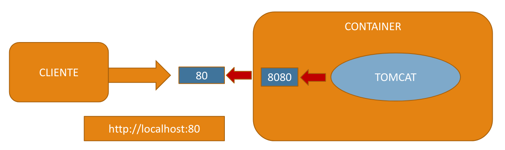
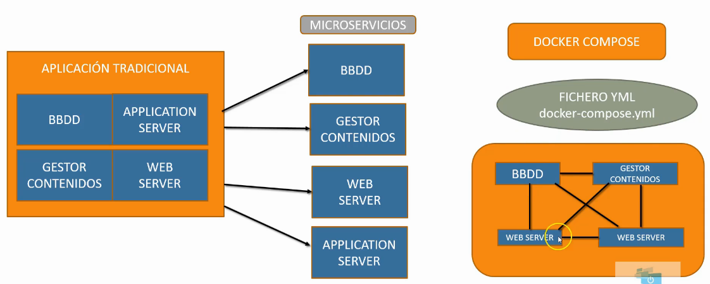
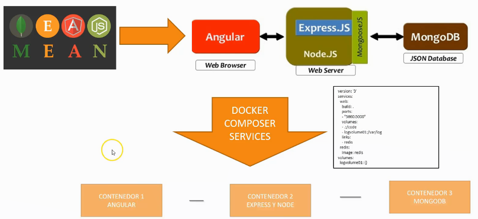

# Curso de Docker <!-- omit in toc -->


# Tabla de contenidos <!-- omit in toc -->

- [SECCIÓN 1: Introducción al curso](#SECCIÓN-1-Introducción-al-curso)
  - [1.1 Introducción al curso](#1.1-Introducción-al-curso)
  - [1.2 Introducción a Docker](#1.2-Introducción-a-Docker)
  - [1.3 Diferencia con máquinas virtuales](#1.3-Diferencia-con-máquinas-virtuales)
  - [1.4 Versiones de Docker](#1.4-Versiones-de-Docker)
  - [1.5 Instalación de Docker en Debian 10 Buster](#1.5-Instalación-de-Docker-en-Debian-10-Buster)
  - [1.6 Arquitectura de Docker, imágenes, contenedores y daemons](#1.6-Arquitectura-de-Docker-imágenes-contenedores-y-daemons)
- [SECCIÓN 2: Trabajar con contenedores](#SECCIÓN-2-Trabajar-con-contenedores)
  - [2.1 Arrancar y parar Docker](#2.1-Arrancar-y-parar-Docker)
  - [2.2 Crear nuestro primer contenedor](#2.2-Crear-nuestro-primer-contenedor)
  - [2.3 Ver imágenes y contenedores](#2.3-Ver-imágenes-y-contenedores)
  - [2.4 Crear un contenedor interactivo](#2.4-Crear-un-contenedor-interactivo)
  - [2.5 Crear un contenedor en background](#2.5-Crear-un-contenedor-en-background)
  - [2.6 Docker Hub](#2.6-Docker-Hub)
  - [2.7 Borrar imágenes y contenedores](#2.7-Borrar-imágenes-y-contenedores)
  - [2.8 Docker exec: ejecutar comandos contra contenedores](#2.8-Docker-exec-ejecutar-comandos-contra-contenedores)
  - [2.9 Comandos docker image y docker container](#2.9-Comandos-docker-image-y-docker-container)
  - [2.10 Comandos docker logs y docker kill](#2.10-Comandos-docker-logs-y-docker-kill)
  - [2.11 Comandos docker top y docker stats](#2.11-Comandos-docker-top-y-docker-stats)
  - [2.12 Comando docker inspect](#2.12-Comando-docker-inspect)
- [SECCIÓN 3: Redes en Docker](#SECCIÓN-3-Redes-en-docker)
  - [3.1 Introducción a los puertos en Docker](#3.1-Introducción-a-los-puertos-en-docker)
  - [3.2 Gestionar puertos para acceder al contenedor](#3.2-Gestionar-puertos-para-acceder-al-contenedor)
  - [3.3 Redes en Docker](#3.3-Redes-en-Docker)
    - [Redes de tipo bridge, que tienen un driver bridge](#Redes-de-tipo-bridge-que-tienen-un-driver-bridge)
    - [Redes de tipo host, que tienen un driver host](#Redes-de-tipo-host-que-tienen-un-driver-host)
    - [Redes de tipo none, que tienen un driver null](#Redes-de-tipo-none-que-tienen-un-driver-null)
  - [3.4 Inspeccionar una red](#3.4-Inspeccionar-una-red)
  - [3.5 Crear una nueva red](#3.5-Crear-una-nueva-red)
  - [3.6 Asociar contenedores a una red](#3.6-Asociar-contenedores-a-una-red)
  - [3.7 Enlazar contenedores a la red bridge por defecto con *--link*](#3.7-Enlazar-contenedores-a-la-red-bridge-por-defecto-con---link)
    - [Enlazar contenedores con la red bridge por defecto](#Enlazar-contenedores-con-la-red-bridge-por-defecto)
  - [3.8 Enlazar contenedores en redes personalizadas](#3.8-Enlazar-contenedores-en-redes-personalizadas)
    - [Ejemplo enlazar contenedores. WordPress y MySQL](#Ejemplo-enlazar-contenedores-WordPress-y-MySQL)
  - [3.9 Borrar una red](#3.9-Borrar-una-red)
- [SECCIÓN 4: Volúmenes](#SECCIÓN-4-Volúmenes)
  - [4.1 Conceptos de volúmenes](#4.1-Conceptos-de-volúmenes)
  - [4.2 Crear un volumen en un contenedor](#4.2-Crear-un-volumen-en-un-contenedor)
  - [4.3 Visualizar información de volúmenes](#4.3-Visualizar-información-de-volúmenes)
  - [4.4 Crear un directorio compartido con el host](#4.4-Crear-un-directorio-compartido-con-el-host)
  - [4.5 Compartir volúmenes entre contenedores](#4.5-Compartir-volúmenes-entre-contenedores)
  - [4.6 Crear un volumen independiente](#4.6-Crear-un-volumen-independiente)
  - [4.7 Borrar un volumen](#4.7-Borrar-un-volumen)
- [SECCIÓN 5: Crear y gestionar imágenes](#SECCIÓN-5-Crear-y-gestionar-imágenes)
  - [5.1 Introducción a las imágenes Docker](#5.1-Introducción-a-las-imágenes-Docker)
  - [5.2 Modificar un contenedor](#5.2-Modificar-un-contenedor)
  - [5.3 Docker commit. Crear una imagen manualmente](#5.3-Docker-commit.-Crear-una-imagen-manualmente)
  - [5.4 Dockerfile](#5.4-Dockerfile)
  - [5.5 Crear una imagen de un Dockerfile](##-5.5-Crear-una-imagen-de-un-Dockerfile)
  - [5.6 RUN](##-5.6-RUN)
  - [5.7 CMD](##-5.7-CMD)
  - [5.8 ENTRYPOINT](##-5.8-ENTRYPOINT)
  - [5.9 WORKDIR](##-5.9-WORKDIR)
  - [5.10 COPY - ADD](##-5.10-COPY---ADD)
    - [COPY](###-COPY)
    - [Comentarios](###-Comentarios)
    - [ADD](###-ADD)
  - [5.11 ENV](##-5.11-ENV)
  - [5.12 ARG](##-5.12-ARG)
  - [5.13 EXPOSE](##-5.13-EXPOSE)
  - [5.14 VOLUME](##-5.14-VOLUME)
  - [5.15 Subir imágenes a Docker Hub](##-5.15-Subir-imágenes-a-Docker-Hub)
- [SECCIÓN 6: Docker Compose](#-SECCIÓN-6:-Docker-Compose)
  - [6.1 Introducción a Docker Compose](##-6.1-Introducción-a-Docker-Compose)
  - [6.2 Instalar Docker Compose](##-6.2-Instalar-Docker-Compose)
  - [6.3 Fichero docker-compose.yml](##-6.3-Fichero-docker-compose.yml)
  - [6.4 Mi primer proyecto Compose](##-6.4-Mi-primer-proyecto-Compose)
  - [6.5 Docker Compose enlazar contenedores, puertos y variables](##-6.5-Docker-Compose-enlazar-contenedores,-puertos-y-variables)
  - [6.6 Diversos comandos de Docker Compose](##-6.6-Diversos-comandos-de-Docker-Compose)
  - [6.7 Volúmenes en Docker Compose](##-6.7-Volúmenes-en-Docker-Compose)

# SECCIÓN 1: Introducción al curso

## 1.1 Introducción al curso

En este curso vamos a ver todo lo relacionado con la tecnología Docker, desde las bases hasta la parte de *clustering* con Docker Swarm y la parte de KUBERNETES, qué es y cómo se integra con Docker.


- **Introducción teórica**: Veremos las bases de la tecnología Docker, por ejemplo, qué es un contenedor, diferencias con las máquinas virtuales, ...
- **Instalación en Linux**
- **Instalación en Windows** Veremos algunos detalles, aunque el curso está enfocado al sistema GNU/Linux porque es el sistema operativo habitual en este tipo de plataformas
- **Trabajar con contenedores Docker**: Veremos cómo trabajar con contenedores dentro de Docker
- **Redes en Docker**: Veremos todo lo relacionado con redes en Docker, es decir, cómo se comunican estos contenedores entre sí y con el mundo exterior
- **Trabajar con volúmenes**: Veremos cómo trabajar con volúmenes, es decir, cómo guardar nuestros datos de forma que cada vez que trabajemos con un contenedor, tengamos la persistencia del dato y podamos recuperar la información generada con anterioridad.
- **Crear imágenes**: Veremos cómo crear nuestras propias imágenes y cómo subirlas a Docker Hub o a nuestros propios repositorios privados y en este caso vamos a utilizar la herramienta oficial de Docker que es Docker registry.
- **Orquestar contenedores con Compose**: Veremos Docker Compose, que es un orquestador sencillo de contenedores, que se utiliza mucho sobre todo cuando nuestros contenedores alcanzan cierta complejidad y más aún cuando tengo varios contenedores que se relacionan entre sí, de tal forma que no voy a poder trabajar de la manera habitual, sino que voy a necesitar de alguna herramienta que me permita integrar de manera correcta esos contenedores y sus relaciones. Esa herramienta es Docker Compose.
- **Introducción a Docker Swarm**: Docker Swarm nos permite realizar *clustering* de contenedores, es también un orquestador pero a mucho mayor nivel. Nos va a permitir alta disponibilidad, escalamiento de servicios, ... Digamos que es la herramienta de orquestación oficial de Docker.
- **Introducción a KUBERNETES**: Veremos una introducción a este *framework*, a este entorno. No es un curso completo, sino una idea general de qué es KUBERNETES, cómo funciona, crearemos un pequeño cluster y veremos cómo podemos trabajar con contenedores Docker dentro de ese cluster. Lo suficiente para introducirse en KUBERNETES.

## 1.2 Introducción a Docker

Vamos a ver una introducción sobre la arquitectura y los componentes que tiene Docker, veremos sus características y posibilidades y la diferencia respecto a las máquinas virtuales.

Docker es un proyecto *Open Source* que permite automatizar el despliegue de aplicaciones dentro de contenedores o *containers*.

Un contenedor empaqueta de manera ligera (ya veremos la diferencia con las máquinas virtuales) todo lo necesario para que uno o más procesos o aplicaciones funcionen: código, herramientas del sistema, bibliotecas del sistema, dependencias, ...

Dado que un contenedor es como una cápsula, una caja cerrada, podemos coger el contenedor y lanzarlo o usarlo en distintos entornos sin necesidad de tener que cambiar nada, es el propio contenedor el que se encarga de mantener esta infraestructura de manera transparente para el desarrollador o usuario final.


Para empezar, un contenedor se va a ejecutar en un servidor en el que, por supuesto, lo primero que tenemos es el kernel del sistema operativo del servidor.

Encima del kernel lo que vamos a tener son contenedores, y ya veremos que entre el kernel y los contenedores lo que hay es otra capa intermedia que es *dockerd* el *daemon* o proceso en *background* que es el que se encarga de gestionar los contenedores.

Cada contenedor va a tener sus propios productos, en el primer caso de la imagen, una aplicación que va con Apache, Python y que por debajo lleva Ubuntu y dentro del mismo entorno, podemos tener otro contenedor que corre otra aplicación con Tomcat, MySQL y con Debian y así sucesivamente.

Lo interesante de todo esto es que estos contenedores aprovechan la capa del *kernel* para utilizar de manera conjunta los recursos de la máquina donde están. Ya veremos que esto se diferencia y mucho con el concepto de máquina virtual.

Por lo que podemos decir que Docker es un conjunto de contenedores que están funcionando sobre una capa del sistema operativo que es el kernel de la máquina.

**¿Y qué diferencia hay entre el contenedor y cómo se hacía antes?**

Si hacemos una comparación con la evolución del transporte de mercancías.

Antes, cada integrante de la cadena de transporte tenía sus propios contenedores con sus propias medidas, lo que provocaba un problema de logística.

Entonces se deció crear un formato estándar de contenedor que evitar estos problemas, de tal forma que todos los integrantes de este flujo de trabajo, desde el camión, el barco, la grúa del puerto, los vagones de tren, ... están adaptados para estos contenedores estándar, lo que supone un enorme ahorro de coste y energía.

Es decir, no me importa lo que contenga un contenedor, lo importante es que tiene unas medidas estándar que me permiten transportarlo en camión, tren, barco, ...


Pues igual ocurre con el mundo informático, si quiero empaquetar una aplicación, lo que puedo hacer es hacer una orientación con Docker a la de la vida real. Tengo una serie de productos que yo quiero poder utilizar en distintas plataformas.

Nuestro producto puede ser una aplicación web, entornos de datos, entornos de desarrollo y me gustaría que funcionaran en cualquier sistema operativo que soporte Docker, como Linux, Windows, Mac, o plataformas en cloud como puede ser AWS o Azure.


Entonces esto es lo que pretende solucionar Docker, que el entorno se pueda *contenedorizar*, es decir, meter en un contenedor y que ese contenedor se pueda desplegar en cualquier plataforma soportada sin tener que cambiar absolutamente nada.

## 1.3 Diferencia con máquinas virtuales

Vamos a ver que aunque la filosofía es parecida, la solución impuesta a nivel de infraestructura es bastante distinta.

Una **máquina virtual** está compuesta básicamente por el hardware, el sistema operativo que tenemos por encima, por ejemplo GNU/Linux y luego un componente llamado hipervisor, que es el software de virtualización, por ejemplo VMware, VirtualBox, ... y lo que hace este hipervisor es que mantiene máquinas virtuales totalmente independientes. Cada máquina virtual está compuesta de su propio sistema operativo huesped, luego tiene su propio conjunto de librerías, binarios, ... y encima se ejecutan las aplicaciones. 

Entonces vemos que las máquinas virtuales tienen todas una estructura muy similar, sistema operativo, los componentes que lleve y aplicaciones. Es decir que son componentes monolíticos totalmente independientes unos de otros, con lo cual cada uno tiene su propia memoria, sus propios procesadores y sus propios rescursos de la máquina donde se aloja.

Por otro lado tendríamos los **contenedores**, que aunque parece que son algo parecido, no lo es, tenemos también el hardware, tenemos también el sistema operativo y luego tenemos un *daemon*, un demonio, un proceso llamado dockerd que se está ejecutando también en los servidores similar al hipervisor, pero a diferencia de las máquinas virtuales, los contenedores lo que hacen es aprovechar los recursos del sistema operativo donde se alojan para poder compartir opciones, características, librerías, binarios, ... es decir, no implementan su propio sistema operativo, no implementan sus propias librerías, no implementa sus propios binarios, sino que la comparten con el sistema operativo host, con la máquina donde están alojadas. Esto permite disponer de entornos más bajos de recursos de memoria, procesador, ... porque los contenedores, a diferencia de las máquinas virtuales, hacen uso compartido de esos recursos.


Viendo la imagen podemos observar que los contenedores son como procesos que se ejecutan en el sistema operativo y que son como cápsulas independientes unos de otros pero que a su vez también comparten recursos. En cambio las máquinas virtuales son entes totalmente monolíticos, independientes, que son máquinas realmente funcionales dentro de otra máquina. No es el caso de los contenedores, que utilizan más el concepto de procesos que comparten recursos.

Esto presenta distintas ventajas:

- Se pueden aplicar en distintos entornos tecnológicos, como modernizar aplicaciones tradicionales.
- Se puede utilizar de manera muy sencilla en CI (*Continuous Integration*) y CD (*Continuous Delivery*) en DEVOPS.
- Se puede integrar fácilmente en entornos cloud.
- Es una solución ideal para el concepto de microservicios, donde hay servicios totalmente independientes funcionando dentro de su entorno. Ahí los contenedores es la plataforma natural para este tipo de productos.
- ...

Realmente, los contenedores se pueden utilizar en muchos ámbitos del mundo tecnológico, y seguramente también podríamos alcanzar la misma o parecida solución utilizando máquinas virtuales, pero el ahorro de recursos hace que los contenedores sea una opción muy interesante para distintas plataformas y entornos tecnológicos.

## 1.4 Versiones de Docker

A la hora de hacer este curso, disponemos de dos versiones de Docker:

- *Docker CE (Docker Community Edition)*
- *Docker EE (Docker Enterprise Edition)*

La versión **Docker Community Edition** está pensada para desarrolladores y pequeñas empresas que necesitan este tipo de infraestructura.

Tiene dos líneas de actualización:

- *Stable*: Contiene la última versión estable
- *Edge*: Contiene las últimas novedades pero que no es muy, muy estable y no es recomendable utilizarla en entornos de producción.

La versión **Docker Enterprise Edition** está orientada para grandes infraestructuras donde vamos a necesitar soporte y una serie de herramientas más avanzadas, como herramientas gráficas, de soporte a la seguridad, ...

A su vez tiene tres versiones distintas:

- *Basic*
- *Standard*
- *Advanced*

Cuanto más avanzada, más dinero cuesta y más cosas tiene, más ámbitos de soporte, más herramientas, ...

Todo esto se puede consultar en la página oficial de [Docker](https://www.docker.com)

Este curso está enfocado a la versión  Docker Community Edition, aunque todo se puede aplicar a la versión Docker Enterprise Edition.

## 1.5 Instalación de Docker en Debian 10 Buster

Para realizar la instalación de Docker para los diferentes sistemas operativos, lo mejor es seguir las instrucciones que aparecen en la documentación oficial en [https://docs.docker.com](https://docs.docker.com)

En este caso, vamos a seguir las instrucciones para la instalación de Docker en Debian 10 Buster, para ello acudimos a la documentación oficial de Docker [Install Docker Engine on Debian](https://docs.docker.com/engine/install/debian/)

Actualizar los repositorios del sistema e instalar los paquetes necesarios

```console
$ sudo apt-get update

$ sudo apt-get install \
    apt-transport-https \
    ca-certificates \
    curl \
    gnupg-agent \
    software-properties-common
```

Añadir la clave GPG oficial de Docker

```console
$ curl -fsSL https://download.docker.com/linux/debian/gpg | sudo apt-key add -
```

Verificar que tenemos la clave con el fingerprint `9DC8 5822 9FC7 DD38 854A E2D8 8D81 803C 0EBF CD88`, mostrando los últimos 8 caracteres de la fingerprint

```console
$ sudo apt-key fingerprint 0EBFCD88

pub   4096R/0EBFCD88 2017-02-22
      Key fingerprint = 9DC8 5822 9FC7 DD38 854A  E2D8 8D81 803C 0EBF CD88
uid                  Docker Release (CE deb) <docker@docker.com>
sub   4096R/F273FCD8 2017-02-22
```

Crear un nuevo archivo de repositorio para Docker

```console
$ sudo add-apt-repository "deb [arch=amd64] https://download.docker.com/linux/debian $(lsb_release -cs) stable"
```

Actualizar los repositorios e instalamos la última versión de Docker Engine y containerd

```console
$ sudo apt-get update
$ sudo apt-get install docker-ce docker-ce-cli containerd.io
```

Comprobar el estado del servicio Docker y que está enabled para que arranque el servicio al iniciar el sistema

```consolesudo
$ systemctl status docker

● docker.service - Docker Application Container Engine
   Loaded: loaded (/lib/systemd/system/docker.service; enabled; vendor preset: enabled)
   Active: active (running) since Fri 2020-05-29 19:48:09 CEST; 2h 5min ago
     Docs: https://docs.docker.com
 Main PID: 4878 (dockerd)
    Tasks: 26
   Memory: 57.0M
   CGroup: /system.slice/docker.service
           └─4878 /usr/bin/dockerd -H fd:// --containerd=/run/containerd/containerd.sock
```

Comprobar que lo tenemos funcionando

```console
$ sudo docker --version

Docker version 19.03.11, build 42e35e61f3
```

## 1.6 Arquitectura de Docker, imágenes, contenedores y daemons

Vamos a ver los conceptos teóricos básicos sobre la arquitectura de Docker y cómo funciona.

**Arquitectura de Docker**


Dentro de la arquitectura de Docker, vamos a tener el *Docker Host*, que es la máquina, el servidor donde se va a ejecutar el servicio de Docker, el daemon *dockerd*. Este proceso es el que se va a encargar de toda la relación y todos los comandos que hay que dar entre los distintos clientes y los contenedores que vamos a utilizar en nuestro trabajo diario.

Luego tenemos los clientes, por defecto tenemos un cliente docker, el *docker client*, que se ejecuta en modo comando (la versión enterprise y algunos proyectos tienen herramientas gráficas orientadas a Docker) y mediante el docker client vamos a ir ejecutando determinados comandos: pull, push, run, ... Y este cliente es el que se conecta al docker daemon, y en realidad, por debajo lo que hace es comandos de tipo REST-API que son las que comunican al dockerd, al daemon, lo que tiene que hacer.

Por otra parte tenemos las *imágenes*, que son como plantillas de un determinado contenedor. Por ejemplo, podemos tener una imágen con Ubuntu, Python y con Git y en esa imagen estaría reflejado todo lo necesario para construir un contenedor con esas características, por eso una imagen es como una plantilla, y es de sólo lectura y a partir de ellas construimos los *containers*.

Entonces, las imágenes son las plantillas y los contenedores son los objetos ya reales, las máquinas que están ya funcinando, basadas en esas plantillas. Si hacemos un simil con programación, las imágenes serían como el concepto de una clase de objeto y los contenedores serían como las instancias de esos objetos.

Yo puedo crear tantos contenedores como quiera de esas imágenes y también veremos cómo podemos crear imágenes con un determinado sistema operativo, una determinada versión de python, ...

Las imágenes, como veremos, están en local, se quedan en el servidor, pero realmente se traen de un repositorio denominado *registro*. Un registro de imágenes es un sitio donde se guardan esas imágenes para poder utilizarlas. El repositorio más famoso es [Docker Hub](https://hub.docker.com), que es propiedad de Docker, y que contiene montones de imágenes ya creadas. Pero en definitiva, lo que debe quedar claro es que las imágenes se pueden guardar en un repositorio, tanto de Docker Hub o en un repositorio propio, un registro propio.

En la instalación lo que hemos hecho ha sido instalar el Docker Host y el Docker Client y a partir de ahora lo que vamos a aprender es a crear contenedores a partir de imágenes ya hechas y cómo poder crear imágenes y subirlas y descargarlas a nuestro repositorio.

# SECCIÓN 2: Trabajar con contenedores

## 2.1 Arrancar y parar Docker

En este capítulo vamos a ver cómo arrancar y para Docker.

Si escribimos `docker` en la terminal y tabulamos dos veces, vemos que aparecen dos entradas:

- *dockerd*: Es el demonio, el proceso background de docker, que como hemos comentado anteriormente, es uno de los componentes que forman parte de Docker.
- *docker*: Es la herramienta cliente que vamos a utilizar durante todo el curso.

En este capítulo vamos a hablar de *dockerd*, que es el demonio que permite arrancar los servicios y procesos de Docker.

En Linux, para arrancar, reiniciar, parar y activar servicios, se utiliza `systemctl`.

Para ver el estado del servicio Docker:

```console
$ sudo systemctl status docker

● docker.service - Docker Application Container Engine
   Loaded: loaded (/lib/systemd/system/docker.service; enabled; vendor preset: enabled)
   Active: active (running) since Wed 2020-09-02 20:44:05 CEST; 1s ago
     Docs: https://docs.docker.com
 Main PID: 7879 (dockerd)
    Tasks: 13
   Memory: 45.8M
   CGroup: /system.slice/docker.service
           └─7879 /usr/bin/dockerd -H fd:// --containerd=/run/containerd/containerd.sock

sep 02 20:44:04 debian dockerd[7879]: time="2020-09-02T20:44:04.497536335+02:00" level=warning msg="Your kernel does not support swap memory limit"
sep 02 20:44:04 debian dockerd[7879]: time="2020-09-02T20:44:04.497567139+02:00" level=warning msg="Your kernel does not support cgroup rt period"
sep 02 20:44:04 debian dockerd[7879]: time="2020-09-02T20:44:04.497582095+02:00" level=warning msg="Your kernel does not support cgroup rt runtime"
sep 02 20:44:04 debian dockerd[7879]: time="2020-09-02T20:44:04.497779946+02:00" level=info msg="Loading containers: start."
sep 02 20:44:05 debian dockerd[7879]: time="2020-09-02T20:44:05.304249702+02:00" level=info msg="Default bridge (docker0) is assigned with an IP address 172.17.0.0/16. Daemon option --bip can be used to set a pr
sep 02 20:44:05 debian dockerd[7879]: time="2020-09-02T20:44:05.493536735+02:00" level=info msg="Loading containers: done."
sep 02 20:44:05 debian dockerd[7879]: time="2020-09-02T20:44:05.570044003+02:00" level=info msg="Docker daemon" commit=48a66213fe graphdriver(s)=overlay2 version=19.03.12
sep 02 20:44:05 debian dockerd[7879]: time="2020-09-02T20:44:05.570243248+02:00" level=info msg="Daemon has completed initialization"
sep 02 20:44:05 debian dockerd[7879]: time="2020-09-02T20:44:05.628974130+02:00" level=info msg="API listen on /var/run/docker.sock"
sep 02 20:44:05 debian systemd[1]: Started Docker Application Container Engine.

```

En este caso se está ejecutando, pero si queremos arrancar el servicio de Docker:

```console
$ sudo systemctl start docker
```

Para pararlo:

```console
$ sudo systemctl stop docker
```

Además de arrancarlo, tenemos que activar el servicio de Docker. Eso es para que se inicie el servicio al iniciar el servidor (o computadora). Si sólo arrancamos el servicio, pero no lo activamos, al reiniciar el servidor, si comprobamos el estado del servicio veremos que está parado. Por eso hay que activarlo.

```console
$ sudo systemctl enable docker
```

**Ejercicio Práctico:**
> Práctica 01 - Arrancar y parar los servicios Docker.pdf

## 2.2 Crear nuestro primer contenedor

Primero vamos a ver algunos comandos generales.

> **Importante:** Docker hay que ejecutarlo como root o con el usuario sudo.

Para saber qué versión de Docker tenemos instalada:

```console
$ sudo docker --version

Docker version 19.03.12, build 48a66213fe
```

Con `docker info` obtenemos información mucho más amplia de lo que es toda la estructura de Docker


```console
$ sudo docker info

Client:
 Debug Mode: false

Server:
 Containers: 2
  Running: 0
  Paused: 0
  Stopped: 2
 Images: 11
 Server Version: 19.03.12
 Storage Driver: overlay2
  Backing Filesystem: extfs
  Supports d_type: true
  Native Overlay Diff: true
 Logging Driver: json-file
 Cgroup Driver: cgroupfs
 Plugins:
  Volume: local
  Network: bridge host ipvlan macvlan null overlay
  Log: awslogs fluentd gcplogs gelf journald json-file local logentries splunk syslog
 Swarm: inactive
 Runtimes: runc
 Default Runtime: runc
 Init Binary: docker-init
 containerd version: 7ad184331fa3e55e52b890ea95e65ba581ae3429
 runc version: dc9208a3303feef5b3839f4323d9beb36df0a9dd
 init version: fec3683
 Security Options:
  apparmor
  seccomp
   Profile: default
 Kernel Version: 4.19.0-10-amd64
 Operating System: Debian GNU/Linux 10 (buster)
 OSType: linux
 Architecture: x86_64
 CPUs: 4
 Total Memory: 7.5GiB
 Name: debian
 ID: 3OYJ:6JUF:2KAY:B5AI:MTQ7:HM47:2ISE:YR7M:AZFE:NIQ4:DUHH:44MG
 Docker Root Dir: /var/lib/docker
 Debug Mode: false
 Registry: https://index.docker.io/v1/
 Labels:
 Experimental: false
 Insecure Registries:
  127.0.0.0/8
 Live Restore Enabled: false

WARNING: No swap limit support
```

Nos muestra información detallada sobre la estructura de nuestro docker, por ejemplo, cuántos contenedores tenemos, si se están ejecutando, si están parados, número de imagenes, información del driver de almacenamiento que está utilizando, espacio libre que le queda o necesita, etc.

Si ejecutamos `docker` a secas, sin indicar ninguna opción o comando, muestra la manera de usarlo, las opciones que tenemos disponibles y sus descripciones y los comandos disponibles que están divididos en comandos de gestión y comandos asociados y sus descripciones.

```console
$ sudo docker

Usage:	docker [OPTIONS] COMMAND

A self-sufficient runtime for containers

Options:
      --config string      Location of client config files (default
                           "/root/.docker")
  -c, --context string     Name of the context to use to connect to the
                           daemon (overrides DOCKER_HOST env var and
                           default context set with "docker context use")
  -D, --debug              Enable debug mode
  -H, --host list          Daemon socket(s) to connect to
  -l, --log-level string   Set the logging level
                           ("debug"|"info"|"warn"|"error"|"fatal")
                           (default "info")
      --tls                Use TLS; implied by --tlsverify
      --tlscacert string   Trust certs signed only by this CA (default
                           "/root/.docker/ca.pem")
      --tlscert string     Path to TLS certificate file (default
                           "/root/.docker/cert.pem")
      --tlskey string      Path to TLS key file (default
                           "/root/.docker/key.pem")
      --tlsverify          Use TLS and verify the remote
  -v, --version            Print version information and quit

Management Commands:
  builder     Manage builds
  config      Manage Docker configs
  container   Manage containers
  context     Manage contexts
  engine      Manage the docker engine
  image       Manage images
  network     Manage networks
  node        Manage Swarm nodes
  plugin      Manage plugins
  secret      Manage Docker secrets
  service     Manage services
  stack       Manage Docker stacks
  swarm       Manage Swarm
  system      Manage Docker
  trust       Manage trust on Docker images
  volume      Manage volumes

Commands:
  attach      Attach local standard input, output, and error streams to a running container
  build       Build an image from a Dockerfile
  commit      Create a new image from a container's changes
  cp          Copy files/folders between a container and the local filesystem
  create      Create a new container
  diff        Inspect changes to files or directories on a container's filesystem
  events      Get real time events from the server
  exec        Run a command in a running container
  export      Export a container's filesystem as a tar archive
  history     Show the history of an image
  images      List images
  import      Import the contents from a tarball to create a filesystem image
  info        Display system-wide information
  inspect     Return low-level information on Docker objects
  kill        Kill one or more running containers
  load        Load an image from a tar archive or STDIN
  login       Log in to a Docker registry
  logout      Log out from a Docker registry
  logs        Fetch the logs of a container
  pause       Pause all processes within one or more containers
  port        List port mappings or a specific mapping for the container
  ps          List containers
  pull        Pull an image or a repository from a registry
  push        Push an image or a repository to a registry
  rename      Rename a container
  restart     Restart one or more containers
  rm          Remove one or more containers
  rmi         Remove one or more images
  run         Run a command in a new container
  save        Save one or more images to a tar archive (streamed to STDOUT by default)
  search      Search the Docker Hub for images
  start       Start one or more stopped containers
  stats       Display a live stream of container(s) resource usage statistics
  stop        Stop one or more running containers
  tag         Create a tag TARGET_IMAGE that refers to SOURCE_IMAGE
  top         Display the running processes of a container
  unpause     Unpause all processes within one or more containers
  update      Update configuration of one or more containers
  version     Show the Docker version information
  wait        Block until one or more containers stop, then print their exit codes

Run 'docker COMMAND --help' for more information on a command.
```

Podemos obtener ayuda sobre un comando determinado:

```console
$ sudo docker COMMAND --help
```

Ahora vamos a crear nuestro primer contenedor. Y para crear un contenedor hay que crearlo a partir de una imagen

 ```console
$ sudo docker run IMAGE
```

En realidad, este comando lo primero que va a hacer es buscar esa imagen, primero en nuestro repositorio local, privado, que se crea automáticamente en el servidor al instalar Docker y, si no la encuentra, va a buscarla a [DockerHub](https://hub.docker.com) y la va a descargar a nuestro repositorio privado local (pull).

Y después va a crear un nuevo contenedor a partir de esa imagen y lo ejecuta.

De todo esto se va a encargar el demonio *dockerd*

**Ejemplo**

Vamos a crear un nuevo contenedor a partir de la imagen *hello-world*. Este contenedor es muy sencillo, y lo único que va a hacer es arrancar, escribir *Hola Mundo* y parar.

```console
$ sudo docker run hello-world

Unable to find image 'hello-world:latest' locally
latest: Pulling from library/hello-world
0e03bdcc26d7: Pull complete 
Digest: sha256:7f0a9f93b4aa3022c3a4c147a449bf11e0941a1fd0bf4a8e6c9408b2600777c5
Status: Downloaded newer image for hello-world:latest

Hello from Docker!
This message shows that your installation appears to be working correctly.

To generate this message, Docker took the following steps:
 1. The Docker client contacted the Docker daemon.
 2. The Docker daemon pulled the "hello-world" image from the Docker Hub.
    (amd64)
 3. The Docker daemon created a new container from that image which runs the
    executable that produces the output you are currently reading.
 4. The Docker daemon streamed that output to the Docker client, which sent it
    to your terminal.

To try something more ambitious, you can run an Ubuntu container with:
 $ docker run -it ubuntu bash

Share images, automate workflows, and more with a free Docker ID:
 https://hub.docker.com/

For more examples and ideas, visit:
 https://docs.docker.com/get-started/
```

Si observamos la salida del comando, vemos que no encuentra la imagen localmente, por lo que la descarga (pull) de Docker Hub. Lo de latest es la etiqueta o última versión de la imagen (lo veremos más adelante)

También vemos que le asigna un ID a la imagen, porque en docker casi todos los objetos de Docker tienen un ID, los contenedores, las imágenes, ...

Luego crea el contenedor y lo ejecuta mostrando el *Hello from Docker!*

Y nos dice el proceso que ha seguido dockerd desde que se ejecuta el comando

- El cliente docker ha contactado con el docker daemon, el dockerd
- El dockerd ha hecho un pull, es decir, se ha traído la imagen hello-world de Docker Hub
- El dockerd ha creado un nuevo contenedor a partir de esa imagen y lo ejecuta
- El dockerd manda la salida del contenedor al cliente de docker y éste manda la salida al terminal

## 2.3 Ver imágenes y contenedores

Para listar las imágenes que tenemos en nuestro repositorio local

```console
$ sudo docker images

REPOSITORY          TAG                 IMAGE ID            CREATED             SIZE
hello-world         latest              bf756fb1ae65        8 months ago        13.3kB
```

La información que nos da es muy sencilla:

- el nombre del repositorio donde está, que es el mismo nombre de la imagen
- el tag
- el id de la imagen, que es un número hash que le asigna automáticamente
- cuándo se creó esa imagen (no cuándo se descargó sino cuando la creó el vendor de la imagen)
- y el tamaño

> **Nota:** Puede crear confusión que el primer valor que aparece sea el nombre del repositorio y no el de la imagen, porque en realidad, un repositorio es un conjunto de imágenes y el nombre de las imágenes está formado por el par repositorio:tag, lo que pasa es que el nombre del repositorio y el de la imagen suele coincidir, además, por defecto, si el nombre de imagen no lleva tag en realidad se le aplica la tag latest.

Estas imágenes están ahí porque, como se comentó en el apartado anterior, se han descargado de Docker Hub.

Para mostrar los contenedores:

```console
$ sudo docker ps

CONTAINER ID        IMAGE               COMMAND             CREATED             STATUS              PORTS               NAMES

```

Vemos que no nos muestra nada, y es porque este comando así, sin argumentos, me muestra los contenedores que se están ejecutando.

El contenedor que hemos creado antes, lo hemos arrancado, se ha ejecutado y ha parado.

Si queremos ver todos los contenedores, tanto los que se están ejecutando como los que están parados

```console
$ sudo docker ps -a

CONTAINER ID        IMAGE               COMMAND             CREATED             STATUS                  PORTS               NAMES
453dd5c83a09        hello-world         "/hello"            2 days ago          Exited (0) 2 days ago                       friendly_lichterman
```

Y la información que nos muestra es:

- el id del contenedor, que es un hash que le ha asignado automáticamente al crearlo
- la imagen desde la que se ha creado el contenedor
- el comando que se ha ejecutado cuando se ha arrancado el contenedor (ya veremos que se puede definir un comando que se ejecute justo después de arrancar un contenedor)
- cuándo se ha creado
- El estado, que puede se *Exited* (parado) o *Up* (ejecutándose), En el caso de Exited, cuándo se paró y el código de error, el  0 es que el contenedor se ha ejecutado correctamente y se ha salido bien. Y en el caso de Up, el tiempo que lleva ejecutándose
- los puertos que utiliza
- el nombre, que es un nombre aleatorio que le asigna automáticamente al crear un contenedor o el nombre que nosotros le hayamos asignado al crearlo (como parámetro de docker run)

> **Importante:** Cuando se ha creado el contendor, se ha ejecutado y ha terminado, el contenedor no se borra, no se elimina, se queda en estado parado. Por eso el comando `docker ps` sin argumentos no me lo muestra, hay que ponerle la opción `-a`

Después de ver los comandos básicos para ver y comprobar imágenes y contenedores, vamos a ver algunas opciones interesantes

Para ver las diferentes opciones disponibles para un comando, usamos la opción `--help`

```console
$ sudo docker ps --help

Usage:	docker ps [OPTIONS]

List containers

Options:
  -a, --all             Show all containers (default shows just running)
  -f, --filter filter   Filter output based on conditions provided
      --format string   Pretty-print containers using a Go template
  -n, --last int        Show n last created containers (includes all states) (default -1)
  -l, --latest          Show the latest created container (includes all states)
      --no-trunc        Don't truncate output
  -q, --quiet           Only display numeric IDs
  -s, --size            Display total file sizes
```

**Ejemplos**

La opción `-l` me muestra el último contenedor que se ha arrancado o sobre el que se ha hecho alguna operación, sea cual sea su estado.

```console
$ sudo docker ps -l

CONTAINER ID        IMAGE               COMMAND             CREATED             STATUS                    PORTS               NAMES
453dd5c83a09        hello-world         "/hello"            3 days ago          Exited (0) 13 hours ago                       friendly_lichterman
```

La opción `-n <integer>` Me muestra los n últimos contenedores sobre los que se ha hecho alguna operación, independientemente de cual sea su estado.

```console
$ sudo docker ps -n 4

CONTAINER ID        IMAGE               COMMAND                  CREATED              STATUS                          PORTS               NAMES
2555528c6189        fedora              "/bin/bash"              About a minute ago   Exited (0) About a minute ago                       charming_ganguly
9625ec03788f        ubuntu              "/bin/bash"              About a minute ago   Exited (0) About a minute ago                       friendly_kirch
c89ebbf6ab82        nginx               "/docker-entrypoint.…"   2 minutes ago        Exited (0) About a minute ago                       sad_hopper
453dd5c83a09        hello-world         "/hello"                 3 days ago           Exited (0) 13 hours ago                             friendly_lichterman
```

La opción `-q` muestra sólo los IDs de los contenedores en vez  toda la información. Esto viene muy bien para operaciones automáticas o scripts, por ejemplo para borrar un conjunto de contenedores

```console
$ sudo docker ps -q
```

Vemos que no muestra nada y es porque sólo muestra los que están en ejecución

> **Nota:** Hay que estar atento al leer la ayuda del comando. En la descripción podemos ver cosas como *(default shows just running)* o *(includes all states)*, pero si no pone nada, por defecto sólo muestra los contenedores que están en ejecución

Si ahora además de la opción `-q` añadimos la opción `-a`, va a mostrar los IDs de todos los contenedores, independientemente de cuál sea su estado.

```console
$ sudo docker ps -q -a

453dd5c83a09
```

> **Nota:** Si tenemos que utilizar varias opciones, podemos unirlas, de tal forma que `docker ps -a -q` es equivalente a `docker ps -aq`

La opción `-s` nos muestra lo que ocupan los contenedores, pero sólo los que se están ejecutando. Es interesante para conocer cuánto ocupan, ya que al pararse un contenedor no se elimina a no ser que los borre especificamente)

```console
$ sudo docker ps -s

CONTAINER ID        IMAGE               COMMAND             CREATED             STATUS              PORTS               NAMES               SIZE
```

Entonces, si añadimos la opción `-a`, podemos conocer cuánto ocupan todos los contenedores, independientemente de su estado.

```console
$ sudo docker ps -san 3
CONTAINER ID        IMAGE               COMMAND                  CREATED             STATUS                     PORTS               NAMES               SIZE
96d41d727d29        nginx               "/docker-entrypoint.…"   3 minutes ago       Exited (0) 2 minutes ago                       gallant_lumiere     1.11kB (virtual 133MB)
e2894f049fa4        fedora              "/bin/bash"              3 minutes ago       Exited (0) 3 minutes ago                       brave_lederberg     0B (virtual 183MB)
31ecbda6db5a        ubuntu              "/bin/bash"              4 minutes ago       Exited (0) 4 minutes ago                       friendly_swanson    0B (virtual 73.9MB)

```

Incluso podemos mostrar cuánto ocupan los 3 últimos contenedores utilizados

```console
$ sudo docker ps -n 3 -s

CONTAINER ID        IMAGE               COMMAND                  CREATED             STATUS                     PORTS               NAMES               SIZE
96d41d727d29        nginx               "/docker-entrypoint.…"   5 minutes ago       Exited (0) 4 minutes ago                       gallant_lumiere     1.11kB (virtual 133MB)
e2894f049fa4        fedora              "/bin/bash"              6 minutes ago       Exited (0) 6 minutes ago                       brave_lederberg     0B (virtual 183MB)
31ecbda6db5a        ubuntu              "/bin/bash"              6 minutes ago       Exited (0) 6 minutes ago                       friendly_swanson    0B (virtual 73.9MB)
```

Aquí no hemos puesto la opción `-a`, porque por defecto la opción `-n` muestra los contenedores sea cual sea su estado


La opción `-f` nos muestra sólo los contenedores que cumplan la condición indicada por los filtros. Se pueden utilizar comodines *. 

```console
$ sudo docker ps -f FILTER
```

Filtros disponibles:

```txt
id 			        Container’s ID
name 			    Container’s name
label 			    An arbitrary string representing either a key or a key-value pair. Expressed as <key> or <key>=<value>
exited 			    An integer representing the container’s exit code. Only useful with --all.
status 			    One of created, restarting, running, removing, paused, exited, or dead
ancestor 		    Filters containers which share a given image as an ancestor. Expressed as <image-name>[:<tag>], <image id>, or <image@digest>
before or since 	Filters containers created before or after a given container ID or name
volume 			    Filters running containers which have mounted a given volume or bind mount.
network 		    Filters running containers connected to a given network.
publish or expose 	Filters containers which publish or expose a given port. Expressed as <port>[/<proto>] or <startport-endport>/[<proto>]
health 			    Filters containers based on their healthcheck status. One of starting, healthy, unhealthy or none.
isolation 		    Windows daemon only. One of default, process, or hyperv.
is-task 		    Filters containers that are a “task” for a service. Boolean option (true or false)
```

La lista de filtros se puede obtener en la documentación oficial en el siguiente [enlace](https://docs.docker.com/engine/reference/commandline/ps/#filtering)

Por ejemplo, vamos a filtrar por el nombre del contenedor

```console
$ sudo docker ps -a -f "name=friendly_lichterman"

CONTAINER ID        IMAGE               COMMAND             CREATED             STATUS                    PORTS               NAMES
453dd5c83a09        hello-world         "/hello"            3 days ago          Exited (0) 14 hours ago                       friendly_lichterman
```

En el caso de las imágenes ocurre igual

Vamos a ver las imágenes que tengo

```console
$ sudo docker images

REPOSITORY          TAG                 IMAGE ID            CREATED             SIZE
nginx               latest              7e4d58f0e5f3        44 hours ago        133MB
ubuntu              latest              4e2eef94cd6b        3 weeks ago         73.9MB
fedora              latest              a368cbcfa678        2 months ago        183MB
hello-world         latest              bf756fb1ae65        8 months ago        13.3kB
```

Para mostrar las diferentes opciones utilizamos la opción `--help`

```console
$ sudo docker images --help

Usage:	docker images [OPTIONS] [REPOSITORY[:TAG]]

List images

Options:
  -a, --all             Show all images (default hides intermediate images)
      --digests         Show digests
  -f, --filter filter   Filter output based on conditions provided
      --format string   Pretty-print images using a Go template
      --no-trunc        Don't truncate output
  -q, --quiet           Only show numeric IDs

```

Con la opción `-q` sólo mostramos el id de las imágenes, que dijimos que era útil para scripts

```console
$ sudo docker images -q

7e4d58f0e5f3
4e2eef94cd6b
a368cbcfa678
bf756fb1ae65
```

O podemos utilizar la opción `-f` para filtrar por nombre, ID, ... Lo podemos ver en la documentación oficial

**Ejercicio Práctico:**
> Práctica 02 - Visualizar información de contenedores e imágenes.pdf

## 2.4 Crear un contenedor interactivo

Para crear un contenedor interactivo hay que indicarle la opción `-it`. Con `-i` le estamos diciendo que sea interactivo y con `-t` que saque la salida del contenedor por la pantalla, por el terminal tty.

Como ejemplo vamos a crear un contenedor interactivo a partir de la imagen de ubuntu.

```console
$ sudo docker run -it ubuntu

Unable to find image 'ubuntu:latest' locally
latest: Pulling from library/ubuntu
54ee1f796a1e: Pull complete 
f7bfea53ad12: Pull complete 
46d371e02073: Pull complete 
b66c17bbf772: Pull complete 
Digest: sha256:31dfb10d52ce76c5ca0aa19d10b3e6424b830729e32a89a7c6eee2cda2be67a5
Status: Downloaded newer image for ubuntu:latest
root@4af5d4d621e5:/# 
```

Como no lo tengo en el repositorio local, lo va a descargar. Se puede observar que  hace varias descargas, en este caso 4, y esto es porque una imagen de Docker está formada por varias capas y cada capa es independiente la una de la otra, tienen su propio ID y esto me permite utilizar esas capas entre distintas imagenes. Estos detalles los veremos más adelante.

También vemos que se ha puesto en modo interactivo, porque justo después de descargar la imagen, me ha cambiado el prompt, nos ha metido dentro del contendor. El prompt será el nombre de usuario, que en este caso es root, seguido del nombre del contenedor, que es el ID que le ha puesto cuando lo ha creado (El ID lo genera automáticamente con un algoritmo hash).

Si ahora en otra pestaña de la terminal ejecuto `docker ps` veré como ahora sí que aparece

```console
$ sudo docker ps

CONTAINER ID        IMAGE               COMMAND             CREATED             STATUS              PORTS               NAMES
4af5d4d621e5        ubuntu              "/bin/bash"         10 minutes ago      Up 10 minutes                           friendly_ritchie
```

Podemos observar que el CONTAINER ID coincide con el del prompt, que está basado en la imagen de ubuntu, que el comando que ha lanzado después de crearse en `/bin/bash` y que su estado es Up (ejecutándose)

La imagen de ubuntu contiene un pequeño sistema operativo ubuntu, de los que se llaman barebone y que contine lo esencial, no tienen ningún componente adicional. Habrá comandos que yo espero que estén en un sistema operativo normal, pero que en el contenedor no los tengo y eso es porque la imagen se habrá creado lo suficientemente restringida para que el contenedor ejecute la aplicación que necesita y ya está, para que no consuma más recursos de los necesarios.

En el momento que yo hago `exit`, como salgo del comando bash, se para el contenedor y vuelvo a mi sistema operativo

Si ahora hago `docker ps`, vemos que ya no aparece

```console
$ sudo docker ps

CONTAINER ID        IMAGE               COMMAND             CREATED             STATUS              PORTS               NAMES
```

Y para verlo tendré que hacer `docker ps -a`

```console
$ sudo docker ps -a

CONTAINER ID        IMAGE               COMMAND             CREATED             STATUS                      PORTS               NAMES
4af5d4d621e5        ubuntu              "/bin/bash"         39 minutes ago      Exited (0) 36 seconds ago                       friendly_ritchie
453dd5c83a09        hello-world         "/hello"            3 days ago          Exited (0) 23 hours ago                         friendly_lichterman
```

Si queremos volver a arrancarlo, utilizamos el comando `docker start`, que se utiliza para arrancar contenedores que están parados. Y con la opción `-i` para indicarle que queremos entrar en modo interactivo

```console
$ sudo docker start -i CONTAINER
```

Entonces en nuestro ejemplo:

```console
$ sudo docker start -i 4af5

root@4af5d4d621e5:/#  
```

Vemos que nos vuelve a cambiar el prompt y si vuelvo a ejecutar `docker ps` me aparece como ejecutándose.

> **Nota:** En Docker para referirnos a un contendor o una imagen, podemos utilizar el *"CONTAINER ID"* o el *"NAME"*. Y para el ID podemos utilizar los 4 primeros caracteres

Los contenedores una vez que se paran no se destruyen, no desaparecen. Esto tenemos que tenerlo en cuenta para que no ocupen espacio los que no utilicemos, aunque gracias al uso de imágenes hace que el contenedor final no ocupe mucho.

Si vuelvo a lanzar el comando `docker run` no va a coger el contendor que ya tengo creado, sino que va a crear un contenedor nuevo cada vez que lo ejecuto. Para ejecutar un contenedor que está creado y parado tendré que hacerlo con `docker start`

Si ejecuto de nuevo `docker run`

```console
$ sudo docker run -it ubuntu

root@34f23eda792b:/# 
```

Vemos en el prompt que en el nombre de la máquina tenemos otro *CONTAINER ID*

Y si hacemos un `docker ps -a`

```console
$ sudo docker ps -a

CONTAINER ID        IMAGE               COMMAND             CREATED             STATUS                      PORTS               NAMES
d257bd20af55        ubuntu              "/bin/bash"         28 seconds ago      Up 27 seconds                                   goofy_burnell
4af5d4d621e5        ubuntu              "/bin/bash"         About an hour ago   Exited (0) 20 minutes ago                       friendly_ritchie
453dd5c83a09        hello-world         "/hello"            3 days ago          Exited (0) 23 hours ago                         friendly_lichterman 
```

Vemos que tenemos dos contenedores basados en la imagen de ubuntu, uno parado, que es el que creamos antes y otro ejecutándose que es el que acabamos de crear.

Eso quiere decir que puedo tener muchos contenedores basados en la misma imagen, cada uno de ellos independiente. Por ejemplo, un equipo de desarrollo en el que cada desarrollador tiene que tener su propio contenedor para trabajar.

Para parar un contenedor que está en ejecución

```console
$ sudo docker stop CONTAINER
```

El contenedor lo indicamos por el nombre o por el ID y como hemos dicho, podemos indicar el ID con los 4 primeros caracteres.

**Ejemplo**

```console
$ sudo docker stop de4b
```

Con la opción `--rm` le decimos al contenedor que cuando acabe de ejecutarse y se pare, lo elimine y no se quede almacenado.

```console
$ sudo docker run -it --rm --name b1 busybox
```

**Ejercicio Práctico:**
> Práctica 03 - Contenedores interactivos.pdf

## 2.5 Crear un contenedor en background

Hemos visto cómo crear contenedores interactivos, es decir, arrancar un contenedor para luego trabajar con él, pero a veces lo que yo quiero es arrancar un contenedor que esté trabajando en modo background, que yo pueda interactuar con él, pero que no necesite tener un terminal, una shell o un bash activo.

Para crear un contenedor en modo background, utilizamos la opción `-d`, que es *detached*, y que lo que hace es crear y ejecutar un contenedor en background.

```console
$ sudo docker run -d IMAGE
```

Como ejemplo vamos a usar una imagen de nginx, que es un servidor web muy utilizado y que vamos a volver a trabajar con él a lo largo del curso

```console
$ sudo docker run -d nginx

Unable to find image 'nginx:latest' locally
latest: Pulling from library/nginx
d121f8d1c412: Pull complete 
ebd81fc8c071: Pull complete 
655316c160af: Pull complete en 
d15953c0e0f8: Pull complete 
2ee525c5c3cc: Pull complete 
Digest: sha256:9a1f8ed9e2273e8b3bbcd2e200024adac624c2e5c9b1d420988809f5c0c41a5e
Status: Downloaded newer image for nginx:latest
1e01904b5cb326b740838d7b8f8e1ddf4ff3a4fced7ee0faea57a02430183a92
```

Si hacemos `docker ps`

```console
$ sudo docker ps

CONTAINER ID        IMAGE               COMMAND                  CREATED              STATUS              PORTS               NAMES
1e01904b5cb3        nginx               "/docker-entrypoint.…"   About a minute ago   Up About a minute   80/tcp              sweet_ptolemy

```

Podemos comprobar que después de crearse el contenedor, se está ejecutando, pero no ha entrado en ninguna bash, es decir, que no nos ha dejado en un entorno interactivo, sino que se está ejecutando en modo background. 

Ya veremos más adelante cómo podemos acceder a un contenedor en modo background.

Entonces, tenemos dos maneras de trabajar con contenedores:

- *modo interactivo*: `-it`
- *modo background*: `-d`

y dependiendo de la imagen nos interesará trabajar de un modo u otro.

## 2.6 Docker Hub

En apartados anteriores hemos visto cómo arrancar un contenedor a partir de una imagen y hemos visto que al poner `docker run`, si no teníamos la imagen descargada en el repositorio local, se conectaba automáticamente a un repositorio para descargar la imagen que estamos buscando en el repositorio local. Ese repositorio es el repositorio llamado Docker Hub.

[DockerHub](https://hub.docker.com) es el repositorio centralizado de imagenes por defecto al que se conecta *dockerd* si no encuentra la imagen en nuestro repositorio privado local. En Docker Hub existen un montón de imágenes ya precreadas, tanto de productos oficiales como de particulares o empresas que van subiendo sus imágenes a ese repositorio.

Si en la página de DockerHub buscamos, por ejemplo, ubuntu, nos lleva a un listado donde aparecen todos los repositorios que contienen imagenes de ubuntu. Un repositorio no es más que un sitio centralizado donde yo puedo tener distintas imagenes.


En el listado, para cada repositorio podemos ver:

- el nombre del repositorio
- una breve descripción
- el tipo de repositorio (official image, verified publisher, nothing)
- la popularidad (el número de estrellas que ha conseguido)
- el número de pulls (número de descargas de esa imagen u otra de ese mismo repositorio)

Hay 2 tipos de repositorios, los *oficiales* y los *de usuario*, aunque los de usuario pueden ser de un *publicador de imagenes verificado* o de un *publicador de imagenes no verificado*.

Si accedemos al repositorio, en la descripción nos aparecen las *supported tags*, y vamos a ver qué son los tags.


Si vemos las imagenes que tenemos en nuestro repositorio local:

```console
$ sudo docker images

REPOSITORY          TAG                 IMAGE ID            CREATED             SIZE
ubuntu              latest              4e2eef94cd6b        4 weeks ago         73.9MB
```

Vemos que la primera columna no es el nombre de la imagen, sino *REPOSITORY*, y eso se refiere al nombre del repositorio de Docker Hub al que pertenece la imagen. Y que dentro de ese repositorio, se ha cogido una imagen que está etiquetada con *latest*.

Entonces, si volvemos a Docker Hub, vemos que hay diferentes versiones y que cada versión tiene asociadas distintas etiquetas. En el momento de escribir esto, la etiqueta *latest* del repositorio de ubuntu corresponde a la versión 20.04, llamada también *bionic*.

Cuando yo descargo una imagen de Docker Hub y no le indico nada más, me va a descargar por defecto la imagen que tiene la etiqueta *latest*.

Si yo quiero descargarme una imagen con una etiqueta diferente, tengo que indicarle el nombre del tag.

```console
$ sudo docker pull REPOSITORY:TAG
```

`docker pull` sólo descarga una imagen a mi repositorio local, pero no crea un contenedor, a diferencia de `docker run` que descarga la imagen si no la tiene, crea el contenedor y lo ejecuta.

**Ejemplos**

```console
$ sudo docker pull ubuntu:xenial
```

Y ejecutamos `docker images`, vemos que tenemos 2 imagenes del repositorio ubuntu, la *latest* que corresponde a *bionic* y la *xenial*.

```console
$ sudo docker images

REPOSITORY          TAG                 IMAGE ID            CREATED             SIZE
ubuntu              latest              4e5021d210f6        8 days ago          64.2MB
ubuntu              xenial              77be327e4b63        5 weeks ago         124MB
```

Igualmente, para crear un contenedor y ejecutarlo tendremos que indicarle el tag de la imagen

```console
$ sudo docker run -it ubuntu:xenial
```

Siguiendo con Docker Hub, vemos que después de los tags, hay una descripción más detallada donde el creador del repositorio pondrá lo que él considere adecuado para que sepamos qué estamos haciendo cuando descargamos esa imagen.

> **Nota:** Es conveniente leer bien la descripción detallada de un repostorio y sus imágenes o tags para configurar adecuadamente el contenedor

Arriba hay otra pestaña que es *Tags*, si accedemos, vemos cada una de las etiquetas, cuando fué la última actualización, el tamaño que ocupan, etc. Y el comando para descargarlas.


Si volvemos a la lista de repositorios, vemos que hay 2 tipos de repositorios, que son los repositorios root (oficiales) y los de usuario


- Los *repositorios root*, tienen un sólo nombre, el nombre el repositorio, y suelen pertenecer a empresas corporativas con las que Docker ha llegado a un acuerdo para que suban imagenes suyas a Docker Hub. Son los repositorios *oficiales*. Ejemplo: python

 - Los *repositorios de usuario*, antes del nombre del repositorio aparece el nombre de usuario, aparecen como nombre-usuario/nombre-repositorio. Pueden ser usuarios o empresas que suben sus imagenes. Ejemplo: centos/python-35-centos7. En este caso no es la oficial porque no es un centos puro, sino un centos con una versión de python.

Es conveniente ver quién es el propietario, que aparece en la descripción del repositorio, ya que habrá miles de repositorios, y muchos de ellos serán pruebas de otros usuarios.

Esto viene al caso porque al darnos de alta como usuario en Docker Hub, nuestros repositorios se van a llamar `nombre-usuario/nombre-repositorio`.

**Ejercicio Práctico:**
> Práctica 04 - Docker Hub.pdf

## 2.7 Borrar imágenes y contenedores

Para eliminar un contenedor

```console
$ sudo docker rm CONTAINER
```

Indicamos qué contenedor queremos eliminar a través de su ID (o los 4 primeros caracteres del ID) o de su nombre (el aleatorio generado automáticamente o el que nosotros le hayamos puesto).

Si la operación se ha realizado correctamente, devuelve el ID del contenedor o su nombre en función de lo que hayamos utilizado en la orden para eliminarlo.

Primero vamos a ver qué contenedores tenemos

```console
$ sudo docker ps -a

CONTAINER ID        IMAGE               COMMAND                  CREATED             STATUS                           PORTS               NAMES
a3f66d8239ea        ubuntu:xenial       "bash"                   About an hour ago   Exited (100) About an hour ago                       xenodochial_curran
1e01904b5cb3        nginx               "/docker-entrypoint.…"   6 days ago          Exited (0) 6 days ago                                sweet_ptolemy
861de649ce7c        fedora              "/bin/bash"              6 days ago          Exited (0) 6 days ago                                competent_stonebraker
d257bd20af55        ubuntu              "/bin/bash"              6 days ago          Exited (127) 6 days ago                              goofy_burnell
4af5d4d621e5        ubuntu              "/bin/bash"              7 days ago          Exited (0) 6 days ago                                friendly_ritchie
453dd5c83a09        hello-world         "/hello"                 10 days ago         Exited (0) 7 days ago                                friendly_lichterman
```

Vamos a borrar el contenedor basado en la imagen hello-world

```console
$ sudo docker rm 453d

453d
```

Vemos cómo devuelve el ID abreviado del contenedor para confirmar que el contenedor se ha borrado correctamente.

Y si hago

```console
$ sudo docker ps -a

CONTAINER ID        IMAGE               COMMAND                  CREATED             STATUS                           PORTS               NAMES
a3f66d8239ea        ubuntu:xenial       "bash"                   About an hour ago   Exited (100) About an hour ago                       xenodochial_curran
1e01904b5cb3        nginx               "/docker-entrypoint.…"   6 days ago          Exited (0) 6 days ago                                sweet_ptolemy
861de649ce7c        fedora              "/bin/bash"              6 days ago          Exited (0) 6 days ago                                competent_stonebraker
d257bd20af55        ubuntu              "/bin/bash"              6 days ago          Exited (127) 6 days ago                              goofy_burnell
4af5d4d621e5        ubuntu              "/bin/bash"              7 days ago          Exited (0) 6 days ago                                friendly_ritchie                                friendly_lichterman
```

Podemos comprobar que ya no lo tenemos

Para eliminar una imagen

```console
$ sudo docker rmi IMAGE
```

Indicamos qué imagen eliminar mediante el nombre del repositorio y el tag o mediante su ID, tanto completo como abreviado.

Si la imagen se ha borrado correctamente, desetiqueta la imagen y elimina todas las pilas o capas que forma la imagen

Vamos a ver las imágenes que tenemos

```console
$ sudo docker images

REPOSITORY          TAG                 IMAGE ID            CREATED             SIZE
ubuntu              xenial              c871c45b1573        2 days ago          127MB
nginx               latest              7e4d58f0e5f3        9 days ago          133MB
busybox             latest              6858809bf669        10 days ago         1.23MB
ubuntu              latest              4e2eef94cd6b        4 weeks ago         73.9MB
fedora              latest              a368cbcfa678        2 months ago        183MB
hello-world         latest              bf756fb1ae65        8 months ago        13.3kB
```

Vamos a borrar la imagen hello-world

```console
$ sudo docker rmi bf756fb1ae65

Untagged: hello-world:latest
Untagged: hello-world@sha256:7f0a9f93b4aa3022c3a4c147a449bf11e0941a1fd0bf4a8e6c9408b2600777c5
Deleted: sha256:bf756fb1ae65adf866bd8c456593cd24beb6a0a061dedf42b26a993176745f6b
Deleted: sha256:9c27e219663c25e0f28493790cc0b88bc973ba3b1686355f221c38a36978ac63
```

Vemos que desetiqueta la imagen y elimina todas las pilas que la componen

Si volvemos a comprobar las imágenes que tengo para comprobar que ya no la tenemos

```console
$ sudo docker images

REPOSITORY          TAG                 IMAGE ID            CREATED             SIZE
ubuntu              xenial              c871c45b1573        2 days ago          127MB
nginx               latest              7e4d58f0e5f3        9 days ago          133MB
busybox             latest              6858809bf669        10 days ago         1.23MB
ubuntu              latest              4e2eef94cd6b        4 weeks ago         73.9MB
fedora              latest              a368cbcfa678        2 months ago        183MB
```

Sin embargo existen contenedores utilizando esa imagen y nos va a decir que no la puede eliminar porque hay contenedores basados en esa imagen.

Vamos a intentar borrar la imagen de ubuntu:xenial

```console
$ sudo docker rmi ubuntu:xenial

Error response from daemon: conflict: unable to remove repository reference "ubuntu:xenial" (must force) - container a3f66d8239ea is using its referenced image c871c45b1573
```

Me indica un error que dice que no se puede eliminar el repositorio ubuntu:xenial porque el contenedor con el ID a3f66d8239ea la está referenciando.

Entonces, tenemos dos opciones, o eliminamos primero los contenedores basados en esa imagen y después la imagen, o forzamos a que la elimine aunque tenga contenedores basados en ella.

Para forzar el borrado de una imagen aunque tenga contenedores basados en ella

```console
$ sudo docker rmi -f IMAGE
```

Entonces vamos a forzar el borrado de la imagen ubuntu:xenial

```console
$ sudo docker rmi -f ubuntu:xenial

Untagged: ubuntu:xenial
Untagged: ubuntu@sha256:e02d30494327090a50e9a6575c018d067428ae3abdcadb208e9ecd9cb496cf98
Deleted: sha256:c871c45b1573465016d2a378057b42004660f5bf2521c2ce6c96484673cb2a98
```

Si volvemos a listar las imágenes que tenemos, vemos que ubuntu:xenial ya no está

```console
$ sudo docker images

REPOSITORY          TAG                 IMAGE ID            CREATED             SIZE
nginx               latest              7e4d58f0e5f3        9 days ago          133MB
busybox             latest              6858809bf669        10 days ago         1.23MB
ubuntu              latest              4e2eef94cd6b        4 weeks ago         73.9MB
fedora              latest              a368cbcfa678        2 months ago        183MB
```

Al forzar el borrado de una imagen, elimina la imagen, pero no los contenedores.

Entonces, al listar los contenedores, los contenedores cuya imagen se haya borrado con `-f` tendrán una imagen *"fantasma"*, es decir, aparecerá un hash en vez de un nombre de imagen.

```console
$ sudo docker ps -a
CONTAINER ID        IMAGE               COMMAND                  CREATED             STATUS                           PORTS               NAMES
a3f66d8239ea        c871c45b1573        "bash"                   About an hour ago   Exited (100) About an hour ago                       xenodochial_curran
1e01904b5cb3        nginx               "/docker-entrypoint.…"   6 days ago          Exited (0) 6 days ago                                sweet_ptolemy
861de649ce7c        fedora              "/bin/bash"              6 days ago          Exited (0) 6 days ago                                competent_stonebraker
d257bd20af55        ubuntu              "/bin/bash"              6 days ago          Exited (127) 6 days ago                              goofy_burnell
4af5d4d621e5        ubuntu              "/bin/bash"              7 days ago          Exited (0) 6 days ago                                friendly_ritchie
```

Vemos que en el primero, en la columna *IMAGE*, en vez del nombre aparece un ID, el *c871c45b1573*, ese ID es el que tenía la imagen que hemos borrado, pero ya no existe.

Si queremos borrar esos contenedores *"fantasma"*, habría que borrar los contenedores fantasma que existan uno a uno.

## 2.8 Docker exec: ejecutar comandos contra contenedores

Docker exec nos permite ejecutar una determinada orden o comando sobre un contenedor que está funcionando.

> **Nota:** Es importante que esté en ejecución, sino dará error

```console
$ sudo docker exec CONTAINER COMMAND
```

Vamos a hacer un ejemplo, además vamos a aprender a crear un contenedor con nombre

```console
$ sudo docker run -it --name my_fedora fedora bash

Unable to find image 'fedora:latest' locally
latest: Pulling from library/fedora
c7def56d621e: Pull complete 
Digest: sha256:d6a6d60fda1b22b6d5fe3c3b2abe2554b60432b7b215adc11a2b5fae16f50188
Status: Downloaded newer image for fedora:latest
[root@304905e291ca /]# 
```

Lo que va a hacer es crear y ejecutar un contenedor de manera interactiva, `-i`, y que la salida sea por la terminal tty, `-t`, con nombre `--name` *my_fedora*, basado en la imagen *fedora:latest* y con el comando que quiero lanzar cuando acabe que va a ser *bash*.

Y vemos que me entra en la bash

Si en otra pestaña de la terminal miramos los contenedores que tenemos ejecutándose

```console
$ sudo docker ps

CONTAINER ID        IMAGE               COMMAND             CREATED             STATUS              PORTS               NAMES
304905e291ca        fedora              "bash"              2 minutes ago       Up 2 minutes                            my_fedora
```

Podemos ver, que se está ejecutando, que el CONTAINER ID coincide con el nombre de la máquina del contenedor de fedora y que el nombre ya no es un nombre raro aleatorio, sino que es el que yo le he puesto.

Como ya se está ejecutando, podemos lanzarle un comando con `docker exec`, por ejemplo, vamos a actualizar el sistema

```console
$ sudo docker exec my_fedora dnf update -y

Fedora 32 openh264 (From Cisco) - x86_64        1.8 kB/s | 2.5 kB     00:01    
Fedora Modular 32 - x86_64                      451 kB/s | 4.9 MB     00:11    
Fedora Modular 32 - x86_64 - Updates            2.3 MB/s | 3.7 MB     00:01    
Fedora 32 - x86_64 - Updates                    4.9 MB/s |  23 MB     00:04    
Fedora 32 - x86_64                               10 MB/s |  70 MB     00:07    
Dependencies resolved.
================================================================================
 Package                        Arch      Version              Repository  Size
================================================================================
Upgrading:
 curl                           x86_64    7.69.1-6.fc32        updates    289 k
 elfutils-default-yama-scope    noarch    0.181-1.fc32         updates     17 k
 elfutils-libelf                x86_64    0.181-1.fc32         updates    192 k
 elfutils-libs                  x86_64    0.181-1.fc32         updates    265 k
 fedora-gpg-keys                noarch    32-6                 updates    105 k
 fedora-repos                   noarch    32-6                 updates     11 k
 glib2                          x86_64    2.64.5-1.fc32        updates    2.7 M
 glibc                          x86_64    2.31-4.fc32          updates    3.5 M
 glibc-common                   x86_64    2.31-4.fc32          updates    1.8 M

...

Complete!
```

No vamos a poner toda la salida, porque recien instalado hay muchas actualizaciones, pero hay que darse cuenta de que el resultado me lo saca en la misma pestaña del terminal donde lo he ejecutado, y no en la pestaña donde tengo el bash del contenedor.

Esto viene muy bien para ejecutar comandos  en contenedores que se están ejecutando en modo background, `-d`, es decir, contenedores que se ejecutan sin que tengan una salida por pantalla, porque hay contenedores que no tienen esa funcionalidad.

Incluso yo puedo loguearme en la bash en un contenedor que se esté ejecutando

```console
$ sudo docker exec -it my_fedora bash

[root@304905e291ca /]# 
```

Antes, en el ejemplo de la actualización de fedora no hemos puesto `-it` porque no era necesaria una terminal interactiva, sino ejecutar un comando en el contenedor en ejecución.

Vamos a hacer otro ejemplo, vamos a crear un contenedor a partir de una imagen de python, así que nos vamos a Docker Hub, lo buscamos y miramos sus detalles.

En vez de que lo descargue automáticamente, vamos a descargar primero la imagen y luego crearemos el contenedor con la imagen ya en el repositorio local

```console
$ sudo docker pull python

Using default tag: latest
latest: Pulling from library/python
57df1a1f1ad8: Pull complete 
71e126169501: Pull complete 
1af28a55c3f3: Pull complete 
03f1c9932170: Pull complete 
65b3db15f518: Pull complete 
3e3b8947ed83: Pull complete 
a4850b8bdbb7: Pull complete 
416533994968: Pull complete 
1b580f9ce4ce: Pull complete 
Digest: sha256:e9b7e3b4e9569808066c5901b8a9ad315a9f14ae8d3949ece22ae339fff2cad0
Status: Downloaded newer image for python:latest
docker.io/library/python:latest
```

Con `docker pull` sólo me descarga la imagen del repositorio de Docker Hub a mi repositorio local. Y al no ponerle etiqueta, me descarga la imagen cuya etiqueta es *latest*.

A diferencia de `docker run`, `docker pull` no me crea ningún contenedor, sólo descarga la imagen.

Ahora es cuando vamos a crear un contenedor interactivo, llamado *my_python* y que esté basado en la imagen *python*.

```console
$ sudo docker run -it --name my_python python

Python 3.8.5 (default, Sep 10 2020, 16:47:10) 
[GCC 8.3.0] on linux
Type "help", "copyright", "credits" or "license" for more information.
>>> 
```

Aquí no se ha puesto *bash* al final porque el contenedor arranca automáticamente la consola de python.

Entonces, si yo estoy trabajando con el contenedor y por algún motivo quiero realizar alguna modificación en el contenedor, tengo dos opciones:

- Pararlo y ejecutarlo añadiéndo *bash* al final, realizar las modificaciones y volver a ejecutarlo normal, para acceder a la consola de python y ejecutar órdenes de python.

- O ejecutar `docker exec -it my_python bash` en otro terminal o pestaña y realizar las modificaciones que sean necesarias, mientras que el contenedor sigue ejecutándose.

Entonces, en resumen, lo que me permite es que aquellos contenedores que no sean interactivos a través del sistema operativo, le pueda pasar comandos con `exec`.

Recordar que los contenedores tienen que estar arrancados, ejecutándose

```console
$ sudo docker exec -it my_python ls
```

Y no tengo que parar el contenedor, es más, el contenedor es necesario que se esté ejecutando.

Podemos ejecutar varios comandos al mismo tiempo, separándolos por *;*

```console
$ sudo docker exec CONTAINER COMMAND1; COMMAND2; ...
```

El `-it` es sólo si queremos un terminal interactivo, para introducir comandos directamente, si sólo queremos ejecutar un comando o varios comandos al arrancar el contenedor lo hacemos con `exec` pero sin `-it`.

**Tip:** Si tengo una lista muy grande de contenedores y sólo queremos ver los contenedores que tengo basados en fedora

```console
$ sudo docker ps -a | grep fedora
```

**Ejercicio Práctico:**
> Práctica 05 - docker exec y docker rm.pdf

## 2.9 Comandos docker image y docker container

Si ejecutamos docker a secas

```console
$ sudo docker

Usage:	docker [OPTIONS] COMMAND

A self-sufficient runtime for containers

Options:
      --config string      Location of client config files (default
                           "/home/jesus/.docker")
  -c, --context string     Name of the context to use to connect to the
                           daemon (overrides DOCKER_HOST env var and
                           default context set with "docker context use")
  -D, --debug              Enable debug mode
  -H, --host list          Daemon socket(s) to connect to
  -l, --log-level string   Set the logging level
                           ("debug"|"info"|"warn"|"error"|"fatal")
                           (default "info")
      --tls                Use TLS; implied by --tlsverify
      --tlscacert string   Trust certs signed only by this CA (default
                           "/home/jesus/.docker/ca.pem")
      --tlscert string     Path to TLS certificate file (default
                           "/home/jesus/.docker/cert.pem")
      --tlskey string      Path to TLS key file (default
                           "/home/jesus/.docker/key.pem")
      --tlsverify          Use TLS and verify the remote
  -v, --version            Print version information and quit

Management Commands:
  builder     Manage builds
  config      Manage Docker configs
  container   Manage containers
  context     Manage contexts
  engine      Manage the docker engine
  image       Manage images
  network     Manage networks
  node        Manage Swarm nodes
  plugin      Manage plugins
  secret      Manage Docker secrets
  service     Manage services
  stack       Manage Docker stacks
  swarm       Manage Swarm
  system      Manage Docker
  trust       Manage trust on Docker images
  volume      Manage volumes

Commands:
  attach      Attach local standard input, output, and error streams to a running container
  build       Build an image from a Dockerfile
  commit      Create a new image from a container's changes
  cp          Copy files/folders between a container and the local filesystem
  create      Create a new container
  deploy      Deploy a new stack or update an existing stack
  diff        Inspect changes to files or directories on a container's filesystem
  events      Get real time events from the server
  exec        Run a command in a running container
  export      Export a container's filesystem as a tar archive
  history     Show the history of an image
  images      List images
  import      Import the contents from a tarball to create a filesystem image
  info        Display system-wide information
  inspect     Return low-level information on Docker objects
  kill        Kill one or more running containers
  load        Load an image from a tar archive or STDIN
  login       Log in to a Docker registry
  logout      Log out from a Docker registry
  logs        Fetch the logs of a container
  pause       Pause all processes within one or more containers
  port        List port mappings or a specific mapping for the container
  ps          List containers
  pull        Pull an image or a repository from a registry
  push        Push an image or a repository to a registry
  rename      Rename a container
  restart     Restart one or more containers
  rm          Remove one or more containers
  rmi         Remove one or more images
  run         Run a command in a new container
  save        Save one or more images to a tar archive (streamed to STDOUT by default)
  search      Search the Docker Hub for images
  start       Start one or more stopped containers
  stats       Display a live stream of container(s) resource usage statistics
  stop        Stop one or more running containers
  tag         Create a tag TARGET_IMAGE that refers to SOURCE_IMAGE
  top         Display the running processes of a container
  unpause     Unpause all processes within one or more containers
  update      Update configuration of one or more containers
  version     Show the Docker version information
  wait        Block until one or more containers stop, then print their exit codes

Run 'docker COMMAND --help' for more information on a command.
```

Vemos que además de una serie de comandos básicos, hay una serie de comandos que agrupan comandos relacionados y que nos permiten gestionar imágenes, contenedores, ...

Para gestionar imágenes

```console
$ sudo docker image

Usage:	docker image COMMAND

Manage images

Commands:
  build       Build an image from a Dockerfile
  history     Show the history of an image
  import      Import the contents from a tarball to create a filesystem image
  inspect     Display detailed information on one or more images
  load        Load an image from a tar archive or STDIN
  ls          List images
  prune       Remove unused images
  pull        Pull an image or a repository from a registry
  push        Push an image or a repository to a registry
  rm          Remove one or more images
  save        Save one or more images to a tar archive (streamed to STDOUT by default)
  tag         Create a tag TARGET_IMAGE that refers to SOURCE_IMAGE

Run 'docker image COMMAND --help' for more information on a command.
```

Es un comando que agrupa todos los comandos que tienen que ver con imágenes para gestionarlas

Algunos, no todos, son equivalentes a los que ya hemos visto, en realidad son alias, por ejemplo

| Comando | Comando equivalente |
| --- | --- |
| `docker images` | `docker image ls` |
| `docker rmi <image>` | `docker image rm <image>` |

```console
$ sudo docker images

REPOSITORY          TAG                 IMAGE ID            CREATED             SIZE
nginx               latest              7e4d58f0e5f3        12 days ago         133MB
busybox             latest              6858809bf669        13 days ago         1.23MB
ubuntu              latest              4e2eef94cd6b        4 weeks ago         73.9MB
fedora              latest              a368cbcfa678        2 months ago        183MB
```

```console
$ sudo docker image ls

REPOSITORY          TAG                 IMAGE ID            CREATED             SIZE
nginx               latest              7e4d58f0e5f3        12 days ago         133MB
busybox             latest              6858809bf669        13 days ago         1.23MB
ubuntu              latest              4e2eef94cd6b        4 weeks ago         73.9MB
fedora              latest              a368cbcfa678        2 months ago        183MB
```

Vemos que son iguales

Para gestionar contenedores

```console
$ sudo docker container

Usage:	docker container COMMAND

Manage containers

Commands:
  attach      Attach local standard input, output, and error streams to a running container
  commit      Create a new image from a container's changes
  cp          Copy files/folders between a container and the local filesystem
  create      Create a new container
  diff        Inspect changes to files or directories on a container's filesystem
  exec        Run a command in a running container
  export      Export a container's filesystem as a tar archive
  inspect     Display detailed information on one or more containers
  kill        Kill one or more running containers
  logs        Fetch the logs of a container
  ls          List containers
  pause       Pause all processes within one or more containers
  port        List port mappings or a specific mapping for the container
  prune       Remove all stopped containers
  rename      Rename a container
  restart     Restart one or more containers
  rm          Remove one or more containers
  run         Run a command in a new container
  start       Start one or more stopped containers
  stats       Display a live stream of container(s) resource usage statistics
  stop        Stop one or more running containers
  top         Display the running processes of a container
  unpause     Unpause all processes within one or more containers
  update      Update configuration of one or more containers
  wait        Block until one or more containers stop, then print their exit codes

Run 'docker container COMMAND --help' for more information on a command.
```

Es un comando que agrupa todos los comandos que tienen que ver con contenedores para gestionarlos

Algunos son equivalentes a los que ya hemos visto, en realidad son alias, por ejemplo

| Comando | Comando equivalente |
| --- | --- |
| `docker ps` | `docker container ls` |
| `docker ps -a` | `docker container ls -a` |

Recordar que si no tenemos ni idea de lo que hace un comando, podemos ver la ayuda añadiéndo `--help` al final del comando

```console
$ sudo docker container ls --help

Usage:	docker container ls [OPTIONS]

List containers

Aliases:
  ls, ps, list

Options:
  -a, --all             Show all containers (default shows just running)
  -f, --filter filter   Filter output based on conditions provided
      --format string   Pretty-print containers using a Go template
  -n, --last int        Show n last created containers (includes all states) (default -1)
  -l, --latest          Show the latest created container (includes all states)
      --no-trunc        Don't truncate output
  -q, --quiet           Only display numeric IDs
  -s, --size            Display total file sizes
```

En resumidas cuentas, con `docker image` y `docker container` podemos tener agrupados todos los comandos que tienen que ver con imágenes y con contenedores respectivamente.

## 2.10 Comandos docker logs y docker kill

Hemos visto que puede haber contenedores que se ejecutan en modo background, y no podemos saber qué es lo que están haciendo.

Vamos a ver un ejemplo, vamos a crear un contenedor en modo background basado en ubuntu y que cuando se cree, que ejecute un comando que va a mostrar la fecha en un bucle infinito

```console
$ sudo docker run -d ubuntu sh -c "while true; do date; done"

9b680cbc07c3698ff5dd4434ce3193d77856d64f768b8def9f2d97cb1821eefe
```

Podemos ver que se ha creado porque devuelve el ID, pero como está en modo background, no podemos ver lo que está haciendo.

Podemos comprobar que se está ejecutando

```console
$ $ sudo docker ps

CONTAINER ID        IMAGE               COMMAND                  CREATED             STATUS              PORTS               NAMES
9b680cbc07c3        ubuntu              "sh -c 'while true; …"   29 seconds ago      Up 27 seconds                           competent_goldwasser
```

Pero si yo quiero saber qué está sacando por pantalla en ese momento, o sea, qué está pintando, lo puedo ver con `docker log` y el nombre o ID del contenedor

```console
$ sudo docker logs 9b68

...
Thu Sep 24 12:50:48 UTC 2020
Thu Sep 24 12:50:48 UTC 2020
Thu Sep 24 12:50:48 UTC 2020
Thu Sep 24 12:50:48 UTC 2020
Thu Sep 24 12:50:48 UTC 2020
Thu Sep 24 12:50:48 UTC 2020
Thu Sep 24 12:50:48 UTC 2020
Thu Sep 24 12:50:48 UTC 2020
Thu Sep 24 12:50:48 UTC 2020
Thu Sep 24 12:50:48 UTC 2020
Thu Sep 24 12:50:48 UTC 2020
Thu Sep 24 12:50:48 UTC 2020
Thu Sep 24 12:50:48 UTC 2020
Thu Sep 24 12:50:48 UTC 2020
Thu Sep 24 12:50:48 UTC 2020
Thu Sep 24 12:50:48 UTC 2020
Thu Sep 24 12:50:48 UTC 2020
```

El comando `docker logs` me saca por pantalla todo lo que ha hecho desde el principio, desde que empezó a ejecutarse el contenedor hasta el momento de lanzar `docker logs` y se para.

A veces muestra muchas líneas y no necesitamos tantas, pero se puede acotar con opciones del comando.

Para mostrar sólo las últimas líneas se puede utilzar la opción `--tail` seguida del número de líneas que queremos que muestre. Ejemplo, mostrar las 10 últimas líneas

```console
$ $ sudo docker logs 9b68 --tail 10

Thu Sep 24 12:56:19 UTC 2020
Thu Sep 24 12:56:19 UTC 2020
Thu Sep 24 12:56:19 UTC 2020
Thu Sep 24 12:56:19 UTC 2020
Thu Sep 24 12:56:19 UTC 2020
Thu Sep 24 12:56:19 UTC 2020
Thu Sep 24 12:56:19 UTC 2020
Thu Sep 24 12:56:19 UTC 2020
Thu Sep 24 12:56:19 UTC 2020
Thu Sep 24 12:56:19 UTC 2020
```

Para mostrar de manera continuada, sin parar, podemos utilizar la opción `-f`, que es muy parecida al comando `tail -f` de *Linux*.

```console
$ sudo docker logs 9b68 -f

...
Thu Sep 24 12:50:48 UTC 2020
Thu Sep 24 12:50:48 UTC 2020
Thu Sep 24 12:50:48 UTC 2020
Thu Sep 24 12:50:48 UTC 2020
Thu Sep 24 12:50:48 UTC 2020
Thu Sep 24 12:50:48 UTC 2020
Thu Sep 24 12:50:48 UTC 2020
Thu Sep 24 12:50:48 UTC 2020
Thu Sep 24 12:50:48 UTC 2020
Thu Sep 24 12:50:48 UTC 2020
Thu Sep 24 12:50:48 UTC 2020
Thu Sep 24 12:50:48 UTC 2020
Thu Sep 24 12:50:48 UTC 2020
Thu Sep 24 12:50:48 UTC 2020
Thu Sep 24 12:50:48 UTC 2020
Thu Sep 24 12:50:48 UTC 2020
Thu Sep 24 12:50:48 UTC 2020
...
```

No va a parar de pintar líneas hasta que pulsemos `Ctrl + C` para que acabe.

Para pararlo podríamos utilizar el comando `docker stop` que ya lo hemos visto, pero vamos a utilizar el comando `docker kill`, que me permite matar un contendor.

```console
$ sudo docker kill 9b68

9b68
```

Y podemos comprobar que ya no se está ejecutando

```console
$ $ sudo docker ps

CONTAINER ID        IMAGE               COMMAND                  CREATED             STATUS              PORTS               NAMES
```

Ahora vamos a comprobar que está parado

```console
$ sudo docker ps -a

CONTAINER ID        IMAGE               COMMAND                  CREATED             STATUS                            PORTS               NAMES
9b680cbc07c3        ubuntu              "sh -c 'while true; …"   21 minutes ago      Exited (137) About a minute ago                       competent_goldwasser
62f61e24cf29        28a4c88cdbbf        "python3"                3 days ago          Exited (0) 3 days ago                                 my_python
aea7f15a7b87        nginx               "/docker-entrypoint.…"   3 days ago          Exited (0) 3 days ago                                 hopeful_brattain
304905e291ca        fedora              "bash"                   3 days ago          Exited (0) 3 days ago                                 my_fedora
da8110ccc4ee        c871c45b1573        "/bin/bash"              4 days ago          Exited (0) 4 days .ago                                 sharp_kare
1e01904b5cb3        nginx               "/docker-entrypoint.…"   11 days ago         Exited (0) 11 days ago                                sweet_ptolemy
d257bd20af55        ubuntu              "/bin/bash"              11 days ago         Exited (127) 11 days ago                              goofy_burnell
4af5d4d621e5        ubuntu              "/bin/bash"              11 days ago         Exited (0) 11 days ago                                friendly_ritchie
```

A diferencia de `docker stop`, como no lo hemos parado mediante `docker stop`, sino que lo hemos matado con `docker kill`, al hacer un `docker ps -a`, en la columna *STATUS* aparecerá `Exited (137)` en vez de `Exited (0)`. `Exited (0)` es cuando se ha salido del conteneodro de manera correcta.

## 2.11 Comandos docker top y docker stats

Estos comandos nos permiten recopilar información sobre cómo están trabajando a nivel de recursos los contenedores.

Como ejemplo, vamos a arrancar un contenedor interactivo basado en ubuntu y va a ejecutar un bash

```console
$ sudo docker run -it ubuntu bash

root@383d456a3939:/# 
```

Vamos a ver que efectivamente se está ejecutando

```console
$ sudo docker ps

CONTAINER ID        IMAGE               COMMAND             CREATED             STATUS              PORTS               NAMES
383d456a3939        ubuntu              "bash"              2 minutes ago       Up 2 minutes                            loving_einstein
```

El comando `docker top` me permite conocer qué procesos son los que más recursos están consumiendo dentro del contenedor en ese momento. El contenedor se indica por su ID completa o abreviada o por su nombre.

```console
$ sudo docker top 383d

UID                 PID                 PPID                C                   STIME               TTY                 TIME                CMD
root                9881                9864                0                   18:30               pts/0               00:00:00            bash
```

Como vemos, en este momento el proceso que más recursos está consumiendo es el bash. Además es el único porque está recién arrancado, si ejecutase algo en el contenedor, también aparecería ahí.

El comando `docker stats` me permite conocer información sobre ese contenedor, como el nombre, el uso que está haciendo de CPU, el uso de memoria y el límite que tiene, E/S de la red y la E/S a nivel del bloques.

```console
$ sudo docker stats 383d

CONTAINER ID        NAME                CPU %               MEM USAGE / LIMIT   MEM %               NET I/O             BLOCK I/O           PIDS
383d456a3939        loving_einstein     0.00%               2.176MiB / 7.5GiB   0.03%               3.91kB / 0B         0B / 0B             1
```

La información que muestra está en modo continuo y se actualiza continuamente, de tal forma que si en el contenedor ejecutamos algo, se ve reflejado al instante, se ve que aumenta el uso de la memoria, procesador, ...

Se sale con `Ctrl + C`

**Ejercicio Práctico:**
> Práctica 06 - Comprobar estado de contenedores.pdf

## 2.12 Comando docker inspect

El comando `docker inspect` nos permite obtener información sobre una imagen o un contenedor a nivel de configuración, o sea, lo que contiene, sus características.

Vamos a ver los contenedores que tengo

```console
$ sudo docker ps -a

CONTAINER ID        IMAGE               COMMAND                  CREATED             STATUS                     PORTS               NAMES
f071b38e85d6        nginx               "/docker-entrypoint.…"   2 hours ago         Exited (137) 2 hours ago                       nginx1
383d456a3939        ubuntu              "bash"                   2 hours ago         Exited (130) 2 hours ago                       loving_einstein
9b680cbc07c3        ubuntu              "sh -c 'while true; …"   6 hours ago         Exited (137) 6 hours ago                       competent_goldwasser
62f61e24cf29        28a4c88cdbbf        "python3"                3 days ago          Exited (0) 3 days ago                          my_python
aea7f15a7b87        nginx               "/docker-entrypoint.…"   4 days ago          Exited (0) 4 days ago                          hopeful_brattain
304905e291ca        fedora              "bash"                   4 days ago          Exited (0) 3 days ago                          my_fedora
da8110ccc4ee        c871c45b1573        "/bin/bash"              5 days ago          Exited (0) 5 days ago                          sharp_kare
1e01904b5cb3        nginx               "/docker-entrypoint.…"   11 days ago         Exited (0) 11 days ago                         sweet_ptolemy
d257bd20af55        ubuntu              "/bin/bash"              12 days ago         Exited (127) 12 days ago                       goofy_burnell
4af5d4d621e5        ubuntu              "/bin/bash"              12 days ago         Exited (0) 12 days ago                         friendly_ritchie

```

Como ejemplo vamos a inspeccionar el contenedor de ubuntu creado anteriormente

```console
$ sudo docker inspect 383d

[
    {
        "Id": "383d456a39397f12e3d8754e69f67b9229d980a2dca6ef625417a8874d056f93",
        "Created": "2020-09-24T16:30:37.696592114Z",
        "Path": "bash",
        "Args": [],
        "State": {
            "Status": "exited",
            "Running": false,
            "Paused": false,
            "Restarting": false,
            "OOMKilled": false,
            "Dead": false,
            "Pid": 0,
            "ExitCode": 130,
            "Error": "",
            "StartedAt": "2020-09-24T16:30:38.241608189Z",
            "FinishedAt": "2020-09-24T16:48:47.57437268Z"
        },
        "Image": "sha256:4e2eef94cd6b93dd4d794c18b45c763f72edc22858e0da5b6e63a4566a54c03c",
        "ResolvConfPath": "/var/lib/docker/containers/383d456a39397f12e3d8754e69f67b9229d980a2dca6ef625417a8874d056f93/resolv.conf",
        "HostnamePath": "/var/lib/docker/containers/383d456a39397f12e3d8754e69f67b9229d980a2dca6ef625417a8874d056f93/hostname",
        "HostsPath": "/var/lib/docker/containers/383d456a39397f12e3d8754e69f67b9229d980a2dca6ef625417a8874d056f93/hosts",
        "LogPath": "/var/lib/docker/containers/383d456a39397f12e3d8754e69f67b9229d980a2dca6ef625417a8874d056f93/383d456a39397f12e3d8754e69f67b9229d980a2dca6ef625417a8874d056f93-json.log",
        "Name": "/loving_einstein",
        "RestartCount": 0,
        "Driver": "overlay2",
        "Platform": "linux",
        "MountLabel": "",
        "ProcessLabel": "",
        "AppArmorProfile": "docker-default",
        "ExecIDs": null,
        "HostConfig": {
            "Binds": null,
            "ContainerIDFile": "",
            "LogConfig": {
                "Type": "json-file",
                "Config": {}
            },
            "NetworkMode": "default",
            "PortBindings": {},
            "RestartPolicy": {
                "Name": "no",
                "MaximumRetryCount": 0
            },
            "AutoRemove": false,
            "VolumeDriver": "",
            "VolumesFrom": null,
            "CapAdd": null,
            "CapDrop": null,
            "Capabilities": null,
            "Dns": [],
            "DnsOptions": [],
            "DnsSearch": [],
            "ExtraHosts": null,
            "GroupAdd": null,
            "IpcMode": "private",
            "Cgroup": "",
            "Links": null,
            "OomScoreAdj": 0,
            "PidMode": "",
            "Privileged": false,
            "PublishAllPorts": false,
            "ReadonlyRootfs": false,
            "SecurityOpt": null,
            "UTSMode": "",
            "UsernsMode": "",
            "ShmSize": 67108864,
            "Runtime": "runc",
            "ConsoleSize": [
                0,
                0
            ],
            "Isolation": "",
            "CpuShares": 0,
            "Memory": 0,
            "NanoCpus": 0,
            "CgroupParent": "",
            "BlkioWeight": 0,
            "BlkioWeightDevice": [],
            "BlkioDeviceReadBps": null,
            "BlkioDeviceWriteBps": null,
            "BlkioDeviceReadIOps": null,
            "BlkioDeviceWriteIOps": null,
            "CpuPeriod": 0,
            "CpuQuota": 0,
            "CpuRealtimePeriod": 0,
            "CpuRealtimeRuntime": 0,
            "CpusetCpus": "",
            "CpusetMems": "",
            "Devices": [],
            "DeviceCgroupRules": null,
            "DeviceRequests": null,
            "KernelMemory": 0,
            "KernelMemoryTCP": 0,
            "MemoryReservation": 0,
            "MemorySwap": 0,
            "MemorySwappiness": null,
            "OomKillDisable": false,
            "PidsLimit": null,
            "Ulimits": null,
            "CpuCount": 0,
            "CpuPercent": 0,
            "IOMaximumIOps": 0,
            "IOMaximumBandwidth": 0,
            "MaskedPaths": [
                "/proc/asound",
                "/proc/acpi",
                "/proc/kcore",
                "/proc/keys",
                "/proc/latency_stats",
                "/proc/timer_list",
                "/proc/timer_stats",
                "/proc/sched_debug",
                "/proc/scsi",
                "/sys/firmware"
            ],
            "ReadonlyPaths": [
                "/proc/bus",
                "/proc/fs",
                "/proc/irq",
                "/proc/sys",
                "/proc/sysrq-trigger"
            ]
        },
        "GraphDriver": {
            "Data": {
                "LowerDir": "/var/lib/docker/overlay2/912f5a835e4468881f661313703680bdc8c9c6e2937bed793ae60ea2063f31dd-init/diff:/var/lib/docker/overlay2/b97751139057e1a100a8cb88d7b1d5cb169b57558b35dff81eca5f05dff7b640/diff:/var/lib/docker/overlay2/fdee6f56155cc2995be72a8e52780da26a1d0d4d3d46e473ba060c3c5fbe305b/diff:/var/lib/docker/overlay2/5442ce33ad80d1bfef09c4b82937f4fbe029996df174f061eb09878e23e0ddc1/diff:/var/lib/docker/overlay2/80540da123ff322d8cd8bd2ed63c9a98706c624792e98f3d65ccc910652b2748/diff",
                "MergedDir": "/var/lib/docker/overlay2/912f5a835e4468881f661313703680bdc8c9c6e2937bed793ae60ea2063f31dd/merged",
                "UpperDir": "/var/lib/docker/overlay2/912f5a835e4468881f661313703680bdc8c9c6e2937bed793ae60ea2063f31dd/diff",
                "WorkDir": "/var/lib/docker/overlay2/912f5a835e4468881f661313703680bdc8c9c6e2937bed793ae60ea2063f31dd/work"
            },
            "Name": "overlay2"
        },
        "Mounts": [],
        "Config": {
            "Hostname": "383d456a3939",
            "Domainname": "",
            "User": "",
            "AttachStdin": true,
            "AttachStdout": true,
            "AttachStderr": true,
            "Tty": true,
            "OpenStdin": true,
            "StdinOnce": true,
            "Env": [
                "PATH=/usr/local/sbin:/usr/local/bin:/usr/sbin:/usr/bin:/sbin:/bin"
            ],
            "Cmd": [
                "bash"
            ],
            "Image": "ubuntu",
            "Volumes": null,
            "WorkingDir": "",
            "Entrypoint": null,
            "OnBuild": null,
            "Labels": {}
        },
        "NetworkSettings": {
            "Bridge": "",
            "SandboxID": "a01c49e6c414607b589b5eff255ecbbd3e537ced0dd8913c3fe1b22064340edc",
            "HairpinMode": false,
            "LinkLocalIPv6Address": "",
            "LinkLocalIPv6PrefixLen": 0,
            "Ports": {},
            "SandboxKey": "/var/run/docker/netns/a01c49e6c414",
            "SecondaryIPAddresses": null,
            "SecondaryIPv6Addresses": null,
            "EndpointID": "",
            "Gateway": "",
            "GlobalIPv6Address": "",
            "GlobalIPv6PrefixLen": 0,
            "IPAddress": "",
            "IPPrefixLen": 0,
            "IPv6Gateway": "",
            "MacAddress": "",
            "Networks": {
                "bridge": {
                    "IPAMConfig": null,
                    "Links": null,
                    "Aliases": null,
                    "NetworkID": "a1624a71584bc19c6775e74d4df06131fc6fd4165b45bb2f35024908b7ab6680",
                    "EndpointID": "",
                    "Gateway": "",
                    "IPAddress": "",
                    "IPPrefixLen": 0,
                    "IPv6Gateway": "",
                    "GlobalIPv6Address": "",
                    "GlobalIPv6PrefixLen": 0,
                    "MacAddress": "",
                    "DriverOpts": null
                }
            }
        }
    }
]
```

Nos devuelve un archivo json

Nos da información sobre:

- su nombre
- su id
- su estado
- el comando
- imagen en la que está basado
- configuración de red
- configuración de volúmenes
- ...

> **Tip:** Se puede guardar la salida del comando en un fichero.json para poder inspeccionarlo mejor.
> `$ sudo docker inspect container > fichero.json`

Igual ocurre con las imágenes

```console
$ sudo docker images

REPOSITORY          TAG                 IMAGE ID            CREATED             SIZE
nginx               latest              7e4d58f0e5f3        2 weeks ago         133MB
busybox             latest              6858809bf669        2 weeks ago         1.23MB
ubuntu              latest              4e2eef94cd6b        5 weeks ago         73.9MB
fedora              latest              a368cbcfa678        2 months ago        183MB
```

Vamos a inspeccionar la de ubuntu

```console
$ sudo docker inspect 7e4d

[
    {
        "Id": "sha256:7e4d58f0e5f3b60077e9a5d96b4be1b974b5a484f54f9393000a99f3b6816e3d",
        "RepoTags": [
            "nginx:latest"
        ],
        "RepoDigests": [
            "nginx@sha256:9a1f8ed9e2273e8b3bbcd2e200024adac624c2e5c9b1d420988809f5c0c41a5e"
        ],
        "Parent": "",
        "Comment": "",
        "Created": "2020-09-10T12:33:10.502421624Z",
        "Container": "c72d14cf840a1720d6a3edc1d2217754786d41b89e7afa9f3ca8f1a47e0bb8a7",
        "ContainerConfig": {
            "Hostname": "c72d14cf840a",
            "Domainname": "",
            "User": "",
            "AttachStdin": false,
            "AttachStdout": false,
            "AttachStderr": false,
            "ExposedPorts": {
                "80/tcp": {}
            },
            "Tty": false,
            "OpenStdin": false,
            "StdinOnce": false,
            "Env": [
                "PATH=/usr/local/sbin:/usr/local/bin:/usr/sbin:/usr/bin:/sbin:/bin",
                "NGINX_VERSION=1.19.2",
                "NJS_VERSION=0.4.3",
                "PKG_RELEASE=1~buster"
            ],
            "Cmd": [
                "/bin/sh",
                "-c",
                "#(nop) ",
                "CMD [\"nginx\" \"-g\" \"daemon off;\"]"
            ],
            "ArgsEscaped": true,
            "Image": "sha256:fe23bd2ff69e7a6bd80fa4202a69b90c15b49850cef46324611096b4d1c960ff",
            "Volumes": null,
            "WorkingDir": "",
            "Entrypoint": [
                "/docker-entrypoint.sh"
            ],
            "OnBuild": null,
            "Labels": {
                "maintainer": "NGINX Docker Maintainers <docker-maint@nginx.com>"
            },
            "StopSignal": "SIGTERM"
        },
        "DockerVersion": "18.09.7",
        "Author": "",
        "Config": {
            "Hostname": "",
            "Domainname": "",
            "User": "",
            "AttachStdin": false,
            "AttachStdout": false,
            "AttachStderr": false,
            "ExposedPorts": {
                "80/tcp": {}
            },
            "Tty": false,
            "OpenStdin": false,
            "StdinOnce": false,
            "Env": [
                "PATH=/usr/local/sbin:/usr/local/bin:/usr/sbin:/usr/bin:/sbin:/bin",
                "NGINX_VERSION=1.19.2",
                "NJS_VERSION=0.4.3",
                "PKG_RELEASE=1~buster"
            ],
            "Cmd": [
                "nginx",
                "-g",
                "daemon off;"
            ],
            "ArgsEscaped": true,
            "Image": "sha256:fe23bd2ff69e7a6bd80fa4202a69b90c15b49850cef46324611096b4d1c960ff",
            "Volumes": null,
            "WorkingDir": "",
            "Entrypoint": [
                "/docker-entrypoint.sh"
            ],
            "OnBuild": null,
            "Labels": {
                "maintainer": "NGINX Docker Maintainers <docker-maint@nginx.com>"
            },
            "StopSignal": "SIGTERM"
        },
        "Architecture": "amd64",
        "Os": "linux",
        "Size": 132640291,
        "VirtualSize": 132640291,
        "GraphDriver": {
            "Data": {
                "LowerDir": "/var/lib/docker/overlay2/82cede408c0c812f0fb9ceb8e63d8a8566b0d0a6b59b1dce5e88c380f840033f/diff:/var/lib/docker/overlay2/f2b7266f576fec2fa960368ec330f3f78d6dfb76bc3850ee066cbf32d3ad8281/diff:/var/lib/docker/overlay2/57337486b9a3d88a4bdf672bc8564b699e1e65d3e7e89da4ab4d2bcbfb4822e8/diff:/var/lib/docker/overlay2/2a38ad461d4d8ed73752362c60fcf90aa4366b4c94d2180274cc8210b475ade0/diff",
                "MergedDir": "/var/lib/docker/overlay2/265928f59959372e9dcee51b627ccba557ca700ab09b7931118bf25f4b8c352d/merged",
                "UpperDir": "/var/lib/docker/overlay2/265928f59959372e9dcee51b627ccba557ca700ab09b7931118bf25f4b8c352d/diff",
                "WorkDir": "/var/lib/docker/overlay2/265928f59959372e9dcee51b627ccba557ca700ab09b7931118bf25f4b8c352d/work"
            },
            "Name": "overlay2"
        },
        "RootFS": {
            "Type": "layers",
            "Layers": [
                "sha256:07cab433985205f29909739f511777a810f4a9aff486355b71308bb654cdc868",
                "sha256:f431d0917d4154d878551a6b8f716dead84d7ac71601616672a173d67e9edb6c",
                "sha256:60c688e8765e549c1debb75e10b37c9f56528a21c408e15191b36181ac342282",
                "sha256:eabfa4cd2d12ea36b06f20ac0104ceb66b026ea1950de9ec3a80d74d6d8cc54f",
                "sha256:908cf8238301a162a7fc4e2ddb482dacc52d4b96138fbdb18fe8fac30591e852"
            ]
        },
        "Metadata": {
            "LastTagTime": "0001-01-01T00:00:00Z"
        }
    }
]
```

También nos va a devolver un json.

La información va a ser muy parecida a la de un contenedor, porque un contenedor no es nada más que una imagen en ejecución y algunas cosas más.

Más adelante veremos en más detalle algunas de esas propiedades.

> **Tip:** Podemos usar grep para inspeccionar un campo concreto. 

Por ejemplo, ver la dirección IP que le ha asignado al contenedor

```console
$ sudo docker inspect 383d | grep IPAddr
            
            "SecondaryIPAddresses": null,
            "IPAddress": "",
                    "IPAddress": "",
```

Así, si conocemos el nombre de la propiedad en el json, podemos obtener directamente su valor

**Ejercicio Práctico:**
> Práctica 07 - Docker inspect.pdf

# SECCIÓN 3: Redes en Docker

## 3.1 Introducción a los puertos en Docker

Hasta ahora hemos trabajado con contenedores, vamos a decir simples, en el sentido de que los arrancaba y dentro tenían alguna opción con la que poder trabajar, pero en muchas ocasiones, los componentes que hay dentro de un contenedor tienen que ser accesibles desde fuera, pero además, accesibles desde fuera como si formaran parte de una máquina.

Por ejemplo, si tenemos un contenedor que tenga un Apache, Nginx, Tomcat, MySQL, ... que requiera que los clientes que se conectan a ese contenedor, a esa máquina, lo hagan a través de un puerto.

Por defecto, los puertos de un contenedor son privados, es decir, no pueden ser accedidos públicamente desde fuera.

Por lo tanto, yo lo que tengo que hacer es hacerlos públicos y, además, puedo mapearlos con un puerto del host donde se está ejecutando el contenedor.

Vamos a ver un ejemplo:



Tengo un contenedor en el que se está ejecutándo un Tomcat, que por defecto escucha por el puerto 8080 dentro del contenedor. Pues bueno, para poder acceder a ese Tomcat, ese puerto tengo que hacerlo público, tengo que exponer el puerto del contenedor y además, tengo que mapearlo con otro puerto dentro de la máquina host, la máquina real, por ejemplo, el puerto 80.

Lo que le estoy diciendo es que el puerto 8080 del contenedor va a ser accesible a través del puerto 80 de la máquina host. Entonces cuando un cliente se quiera conectar al Tomcat, tendrá que hacerlo a través del puerto 80 y Docker se encargará de mapear ese puerto 80 de la máquina host con el puerto 8080 del contenedor. 

Para acceder al contenedor [http://localhost:80](http://localhost:80)

Será localhost o el nombre o IP que tenga la máquina host, la máquina real.

Entonces, cuando tenemos un contenedor que tiene esta arquitecturra, tendremos que indicarle cómo podemos usar ese puerto y cómo podemos publicarlo, exponerlo, para que los clientes accedan al servicio del contenedor.

## 3.2 Gestionar puertos para acceder al contenedor

Vamos a hacer un ejemplo con Nginx

Para ello vamos a DockerHub y buscamos Nginx.

En DockerHub, cuando se trate de un producto al que necesitamos acceder por algún puerto, lo normal es que en la descripción se indiquen las instrucciones necesarias para exponer los puertos. Es decir, cómo podemos acceder al producto dentro del contenedor desde la máquina host.

En el caso de nginx, podemos ver que dentro del contenedor va a utilizar el puerto 80 y podemos acceder desde el host a través del puerto 8080.

Ahora vamos a crear un contenedor de nginx en nuestro docker.

Lo primero es descargar la imagen

```console
$ sudo docker pull nginx

Using default tag: latest
latest: Pulling from library/nginx
d121f8d1c412: Pull complete 
66a200539fd6: Pull complete 
e9738820db15: Pull complete 
d74ea5811e8a: Pull complete 
ffdacbba6928: Pull complete 
Digest: sha256:fc66cdef5ca33809823182c9c5d72ea86fd2cef7713cf3363e1a0b12a5d77500
Status: Downloaded newer image for nginx:latest
docker.io/library/nginx:latest
```

Vamos a comprobar que la imagen se ha descargado

```console
$ sudo docker images

REPOSITORY          TAG                 IMAGE ID            CREATED             SIZE
nginx               latest              992e3b7be046        5 days ago          133MB
```

Ahora vamos a configurar un contendor que podamos acceder al Nginx que hay dentro, porque sino no podríamos acceder a él.

```console
$ sudo docker run -d -P nginx

30bfdba664453f0184d9f7c42c1e451ab2307b834427d7944d5a4decd858de0c
```

Con `-P` lo que hace es que todos los puertos que estén dentro del contenedor los convertimos en públicos, lo que quiere decir es que se puede acceder desde fuera a ellos. Y Docker lo que va a hacer es que le va a asignar un puerto dentro de la máquina principal.

Vamos a ver que el contendor se está ejecutando

```console
$ sudo docker ps

CONTAINER ID        IMAGE               COMMAND                  CREATED             STATUS              PORTS                   NAMES
30bfdba66445        nginx               "/docker-entrypoint.…"   59 seconds ago      Up 58 seconds       0.0.0.0:32768->80/tcp   compassionate_merkle
```

Vamos a fijarnos en la columna PORTS.

Con `0.0.0.0` significa que vamos a poder acceder por cualquier IP que tenga la máquina principal. Por ejemplo si la máquina principal tiene 2 direcciones IP y queremos que se acceda sólo por una de ellas, entonces aquí pondríamos la dirección IP por la que queremos que se acceda.

Luego lo que dice es que el puerto de la máquina principal 32768 va a estar mapeado con el puerto 80 del contenedor. Entonces cada vez que en la máquina principal accedamos a ese puerto, al 32768, en realidad vamos a estar accediendo al puerto 80 del contenedor.

[http://localhost:32768](http://localhost:32768)

Y vemos que hemos accedido a Nginx.

El inconveniente es que Docker le ha asignado un puerto aleatorio (en realidad empiezan en `32768`), y eso significa que no tenemos mucho control sobre el puerto cuando arranco el contenedor.

Lo mejor es hacer lo siguiente:

```console
$ sudo docker run -d --name nginx2 -p 8080:80 nginx
```

Con `-p` le estoy diciendo que al puerto 80 de este contenedor, nginx2, voy a poder acceder a través del puerto 8080 de la máquina física.

Entonces para acceder a él:

[http://localhost:8080](http://localhost:8080)

Entonces, con `-P` si queremos que Docker se encargue del mapeo de puertos o `-p` para indicar el mapeo de puertos que yo quiero.

## 3.3 Redes en Docker

Hemos visto cómo podemos configurar un contenedor para que escuche por un determiando puerto, pero realmente todo esto se basa en que Docker mantiene una arquitectura de redes por debajo que nos permite gestionar las distintas redes que vamos a usar o que podemos usar dentro de Docker para que estas redes se conecten a cada contenedor.

Vamos a ver cómo funcionan conceptualmente estas redes

Hay un comando, `docker network`, que nos da información sobre las redes que tenemos y los objetos que están asociados a la misma dentro de Docker

```console
$ sudo docker network

Usage:	docker network COMMAND

Manage networks

Commands:
  connect     Connect a container to a network
  create      Create a network
  disconnect  Disconnect a container from a network
  inspect     Display detailed information on one or more networks
  ls          List networks
  prune       Remove all unused networks
  rm          Remove one or more networks

Run 'docker network COMMAND --help' for more information on a command.
```

En este capítulo vamos a ver sobre todo `docker network ls` para ver cómo funcionan y qué características tienen

```console
$ docker network ls

NETWORK ID          NAME                DRIVER              SCOPE
93c3fbcbd2e0        bridge              bridge              local
37250215cc83        host                host                local
2006762eef86        none                null                local
```

Vemos que existen 3 redes de Docker:

- Redes de tipo *bridge*, que tienen un driver *bridge*
- Redes de tipo *host*, que tienen un driver *host*
- Redes de tipo *none*, que tienen un driver *null*

### Redes de tipo bridge, que tienen un driver bridge

Las redes de tipo bridge permiten que haya como redes privadas dentro de una máquina que se puedan conectar a través de la red física de la propia máquina al exterior.

Por defecto, al instalar Docker, existe una red que se llama bridge y que utiliza un driver que también se llama bridge, pero eso no quiere decir el driver y el nombre que se le pone a la red sean lo mismo. Más adelante crearemos una red con otro nombre y le diremos que el driver sea de tipo bridge.

Y luego tenemos el ámbito, que significa que sólo funciona en local o que puede extenderse o ampliarse a otras máquinas.

De momento, quedarse con que la red de tipo bridge es la que utilizan los contenedores por defecto si no le indicamos lo contrario. 

### Redes de tipo host, que tienen un driver host

La red de tipo host, que lo que hace es que todos los contenedores que pertenecen a esta red sólo dialogan o se pueden ver con el host principal, es decir, no se pueden ver o comunicar entre sí.

Está pensado para contenedores que tienen que ser totalmente autónomos y que tienen una funcionalidad totalmente independiente.

### Redes de tipo none, que tienen un driver null

Se aplica a contenedores que no tienen red, porque no la necesiten, por ejemplo para ejecutar un proceso o lo que sea.

Por defecto, todos los contenedores usan la red bridge si no le decimos lo contrario.

Entonces, una vez vistos los tipos de redes, vamos a verlo con el ejemplo de los docker de Nginx que teníamos corriendo

Listamos los contenedores que se están ejecutando

```console
$ sudo docker ps

CONTAINER ID        IMAGE               COMMAND                  CREATED             STATUS              PORTS                   NAMES
9e8caab3a488        nginx               "/docker-entrypoint.…"   4 hours ago         Up 4 hours          0.0.0.0:8080->80/tcp    nginx2
30bfdba66445        nginx               "/docker-entrypoint.…"   4 hours ago         Up 4 hours          0.0.0.0:32768->80/tcp   compassionate_merkle
```

Recordemos que docker inspect nos permitía conocer las características de un contenedor

Entonces, si los inspeccionamos y vemos la dirección IP que les ha asignado:

```console
$ docker inspect compassionate_merkle | grep IPAd

            "SecondaryIPAddresses": null,
            "IPAddress": "172.17.0.2",
                    "IPAddress": "172.17.0.2",
```

```console
$ docker inspect nginx2 | grep IPAd

            "SecondaryIPAddresses": null,
            "IPAddress": "172.17.0.3",
                    "IPAddress": "172.17.0.3",
```

Vemos que las IP de los contenedores son 172.17.0.2 y 172.17.0.3 respectivamente.

En realidad, la red bridge, que como hemos visto es la red por defecto, tiene asociadas un rango de IPs de las que puede disponer, al primer contenedor le asigna la primera IP disponible, que es 172.17.0.2, ya que la 172.17.0.1 es la puerta de enlace. Al segundo contenedor le ha asignado la IP 172.17.0.3, que es la siguiente IP. Y a cada contenedor que se va creando, le va asignando la siguiente IP del rango de IPs disponibles.

Entonces, si creo un nuevo contenedor de Nginx

```console
$ sudo docker run -d --name nginx3 -p 9080:80 nginx

3c8117c31d8d9833470899c04d45a2f537af9cfc51c356755156fa7307beda7f
```

Vemos que ha arrancado

```console
$ sudo docker ps

CONTAINER ID        IMAGE               COMMAND                  CREATED             STATUS              PORTS                   NAMES
3c8117c31d8d        nginx               "/docker-entrypoint.…"   39 seconds ago      Up 37 seconds       0.0.0.0:9080->80/tcp    nginx3
9e8caab3a488        nginx               "/docker-entrypoint.…"   4 hours ago         Up 4 hours          0.0.0.0:8080->80/tcp    nginx2
30bfdba66445        nginx               "/docker-entrypoint.…"   4 hours ago         Up 4 hours          0.0.0.0:32768->80/tcp   compassionate_merkle
```

E inspeccionamos sus propiedades

```console
$ docker inspect nginx3 | grep IPAd

            "SecondaryIPAddresses": null,
            "IPAddress": "172.17.0.4",
                    "IPAddress": "172.17.0.4",
```

Vemos que le ha asignado la IP 172.17.0.4, que era la siguiente disponible dentro del rango de IPs disponibles

Entonces podemos ver que cuando estamos trabajando con una red de tipo bridge, a todos los contenedores que se van añadiendo a esa red, se les va asignando una dirección IP.

Resumiendo, tenemos una red de tipo bridge y a esa red de tipo bridge se van añadiendo, asociando los contenedores que voy creando y a cada contenedor se le va a ir dando una IP con la cual yo puedo trabajar.

Si por ejemplo hacemos un ping desde la máquina host a esas IPs vemos que podemos llegar.
 
 Si por ejemplo hacemos un ping desde la máquina host a cualquiera de esas IPs

```console
$ ping 172.17.0.3
PING 172.17.0.3 (172.17.0.3) 56(84) bytes of data.
64 bytes from 172.17.0.3: icmp_seq=1 ttl=64 time=0.077 ms
64 bytes from 172.17.0.3: icmp_seq=2 ttl=64 time=0.053 ms
64 bytes from 172.17.0.3: icmp_seq=3 ttl=64 time=0.051 ms
^C
--- 172.17.0.3 ping statistics ---
3 packets transmitted, 3 received, 0% packet loss, time 39ms
rtt min/avg/max/mdev = 0.051/0.060/0.077/0.013 ms
```

Vemos que podemos llegar, por lo tanto, vemos que tanto la máquina host como los contenedores están en la misma red.

¿Cómo sabemos a qué red pertenece cada contenedor?

Ya lo veremos más adelante en más profundidad, pero de momento podemos hacer `docker inspect` para ver las características o propiedades del contenedor, en el apartado "NetworkSettings"

```console
$ docker inspect nginx2

[

    ...

	"NetworkSettings": {
            "Bridge": "",
            "SandboxID": "ab4b2016929194baee8ded4f845c852cb042488eba0ca995a5943eb097ee7e29",
            "HairpinMode": false,
            "LinkLocalIPv6Address": "",
            "LinkLocalIPv6PrefixLen": 0,
            "Ports": {
                "80/tcp": [
                    {
                        "HostIp": "0.0.0.0",
                        "HostPort": "8080"
                    }
                ]
            },
            "SandboxKey": "/var/run/docker/netns/ab4b20169291",
            "SecondaryIPAddresses": null,
            "SecondaryIPv6Addresses": null,
            "EndpointID": "a56d2aaeccab9d453634840051782688f6c7a9df30ef50d10898ce353c289c77",
            "Gateway": "172.17.0.1",
            "GlobalIPv6Address": "",
            "GlobalIPv6PrefixLen": 0,
            "IPAddress": "172.17.0.3",
            "IPPrefixLen": 16,
            "IPv6Gateway": "",
            "MacAddress": "02:42:ac:11:00:03",
            "Networks": {
                "bridge": {
                    "IPAMConfig": null,
                    "Links": null,
                    "Aliases": null,
                    "NetworkID": "93c3fbcbd2e0e6baae6916e3b8f01f11b4ef54272bfd420c100a09bcffda090a",
                    "EndpointID": "a56d2aaeccab9d453634840051782688f6c7a9df30ef50d10898ce353c289c77",
                    "Gateway": "172.17.0.1",
                    "IPAddress": "172.17.0.3",
                    "IPPrefixLen": 16,
                    "IPv6Gateway": "",
                    "GlobalIPv6Address": "",
                    "GlobalIPv6PrefixLen": 0,
                    "MacAddress": "02:42:ac:11:00:03",
                    "DriverOpts": null
                }
            }
        }

    ...

]
```

Podemos ver que:

- pertenece a una red de tipo bridge
- el puerto con el que se está mapeando
- la dirección IP
- la puerta de enlace, Gateway

Entonces podemos ver que es muy sencillo obtener información acerca de la red del contenedor a través del comando `docker inspect`.

También podemos conocer el mapeo de puertos de un contenedor con la máquina host con `docker port`

```console
$ sudo docker port nginx2

80/tcp -> 0.0.0.0:8080
```

Lo que muestra es que el puerto 80 del contenedor está mapeado con el puerto 8080 de cualquier IP de la máquina host. Recordemos que 0.0.0.0 indicaba que aceptaba conexiones desde cualquier IP de la máquina host.

## 3.4 Inspeccionar una red

En el capítulo anterior hemos visto cómo podemos conocer las características o propiedades de un contenedor respecto a la red donde se encuentra, como la dirección IP, mapeo de puertos, ...

En este capítulo lo que vamos a ver son las propiedades o características, no del contenedor, sino de la red propiamente dicha. Y lo vamos a hacer con `docker network inspect`

Primero vamos a ver las redes que tenemos

```console
$ sudo docker network ls

NETWORK ID          NAME                DRIVER              SCOPE
93c3fbcbd2e0        bridge              bridge              local
37250215cc83        host                host                local
2006762eef86        none                null                local
```

Y vamos a inspeccionar la red bridge (bridge se refiere al nombre bridge, no al driver bridge)

```console
$ sudo docker network inspect bridge

[
    {
        "Name": "bridge",
        "Id": "93c3fbcbd2e0e6baae6916e3b8f01f11b4ef54272bfd420c100a09bcffda090a",
        "Created": "2020-10-11T11:12:23.548888296+02:00",
        "Scope": "local",
        "Driver": "bridge",
        "EnableIPv6": false,
        "IPAM": {
            "Driver": "default",
            "Options": null,
            "Config": [
                {
                    "Subnet": "172.17.0.0/16",
                    "Gateway": "172.17.0.1"
                }
            ]
        },
        "Internal": false,
        "Attachable": false,
        "Ingress": false,
        "ConfigFrom": {
            "Network": ""
        },
        "ConfigOnly": false,
        "Containers": {
            "30bfdba664453f0184d9f7c42c1e451ab2307b834427d7944d5a4decd858de0c": {
                "Name": "compassionate_merkle",
                "EndpointID": "62276a4b59f5a0db082f0aec553efb63770782517da7a7b4d62e5208d357c8ae",
                "MacAddress": "02:42:ac:11:00:02",
                "IPv4Address": "172.17.0.2/16",
                "IPv6Address": ""
            },
            "3c8117c31d8d9833470899c04d45a2f537af9cfc51c356755156fa7307beda7f": {
                "Name": "nginx3",
                "EndpointID": "208f803f1af7ae9a03470eee5ad6acc1a0a813444253bb2a872b55d5a3da9170",
                "MacAddress": "02:42:ac:11:00:04",
                "IPv4Address": "172.17.0.4/16",
                "IPv6Address": ""
            },
            "9e8caab3a488abab61d0d20c1c5f7424d0e4cd6a079125ffdc0507106a0b62c6": {
                "Name": "nginx2",
                "EndpointID": "a56d2aaeccab9d453634840051782688f6c7a9df30ef50d10898ce353c289c77",
                "MacAddress": "02:42:ac:11:00:03",
                "IPv4Address": "172.17.0.3/16",
                "IPv6Address": ""
            }
        },
        "Options": {
            "com.docker.network.bridge.default_bridge": "true",
            "com.docker.network.bridge.enable_icc": "true",
            "com.docker.network.bridge.enable_ip_masquerade": "true",
            "com.docker.network.bridge.host_binding_ipv4": "0.0.0.0",
            "com.docker.network.bridge.name": "docker0",
            "com.docker.network.driver.mtu": "1500"
        },
        "Labels": {}
    }
]
```

Muestra las propiedades y características de la red:

- el nombre de la red: *bridge*
- el driver que está utilizando: *bridge*
- la subred, que nos va a indicar el rango de IPs que puede ir asignando a los contenedores que se vayan asociando a la red: *172.17.0.0/16*
- La puerta de enlace, cuya IP es la primera del rango de direcciones IP: *172.17.0.1*
- Los contenedores asociados a esta red que están en ejecución. Si no se están ejecutando no aparecen. *compassionate_merkle*, *nginx3* y *nginx2*. El orden en que aparecen los contenedores es el orden alfabético del ID que se le asocia al crearlos.

Entonces si yo quiero saber cuántos contenedores están asociados a una determinada red, lo mejor es mirarlo en la propia red y no ir contenedor a contenedor.

Si yo paro un contenedor, por ejemplo nginx3

```console
$ sudo docker stop nginx3

nginx3
```

Y vuelvo a inspeccionar la red bridge

```console
$ sudo docker network inspect bridge

[
    {
        "Name": "bridge",
        "Id": "93c3fbcbd2e0e6baae6916e3b8f01f11b4ef54272bfd420c100a09bcffda090a",
        "Created": "2020-10-11T11:12:23.548888296+02:00",
        "Scope": "local",
        "Driver": "bridge",
        "EnableIPv6": false,
        "IPAM": {
            "Driver": "default",
            "Options": null,
            "Config": [
                {
                    "Subnet": "172.17.0.0/16",
                    "Gateway": "172.17.0.1"
                }
            ]
        },
        "Internal": false,
        "Attachable": false,
        "Ingress": false,
        "ConfigFrom": {
            "Network": ""
        },
        "ConfigOnly": false,
        "Containers": {
            "30bfdba664453f0184d9f7c42c1e451ab2307b834427d7944d5a4decd858de0c": {
                "Name": "compassionate_merkle",
                "EndpointID": "62276a4b59f5a0db082f0aec553efb63770782517da7a7b4d62e5208d357c8ae",
                "MacAddress": "02:42:ac:11:00:02",
                "IPv4Address": "172.17.0.2/16",
                "IPv6Address": ""
            },
            "9e8caab3a488abab61d0d20c1c5f7424d0e4cd6a079125ffdc0507106a0b62c6": {
                "Name": "nginx2",
                "EndpointID": "a56d2aaeccab9d453634840051782688f6c7a9df30ef50d10898ce353c289c77",
                "MacAddress": "02:42:ac:11:00:03",
                "IPv4Address": "172.17.0.3/16",
                "IPv6Address": ""
            }
        },
        "Options": {
            "com.docker.network.bridge.default_bridge": "true",
            "com.docker.network.bridge.enable_icc": "true",
            "com.docker.network.bridge.enable_ip_masquerade": "true",
            "com.docker.network.bridge.host_binding_ipv4": "0.0.0.0",
            "com.docker.network.bridge.name": "docker0",
            "com.docker.network.driver.mtu": "1500"
        },
        "Labels": {}
    }
]
```

Podemos comprobar que ahora sólo aparecen dos contenedores, *compassionate_merkle* y *nginx2*

El contenedor *nginx3* ya no aparece porque lo he parado, y al pararlo, le quita todas las características de red, ... que tenga

De hecho, si lo vuelvo a arrancar

```console
$ sudo docker start nginx3

nginx3
```

Y vuelvo a inspeccionar la red bridge

```console
$ sudo docker network inspect bridge

[
    {
        "Name": "bridge",
        "Id": "93c3fbcbd2e0e6baae6916e3b8f01f11b4ef54272bfd420c100a09bcffda090a",
        "Created": "2020-10-11T11:12:23.548888296+02:00",
        "Scope": "local",
        "Driver": "bridge",
        "EnableIPv6": false,
        "IPAM": {
            "Driver": "default",
            "Options": null,
            "Config": [
                {
                    "Subnet": "172.17.0.0/16",
                    "Gateway": "172.17.0.1"
                }
            ]
        },
        "Internal": false,
        "Attachable": false,
        "Ingress": false,
        "ConfigFrom": {
            "Network": ""
        },
        "ConfigOnly": false,
        "Containers": {
            "30bfdba664453f0184d9f7c42c1e451ab2307b834427d7944d5a4decd858de0c": {
                "Name": "compassionate_merkle",
                "EndpointID": "62276a4b59f5a0db082f0aec553efb63770782517da7a7b4d62e5208d357c8ae",
                "MacAddress": "02:42:ac:11:00:02",
                "IPv4Address": "172.17.0.2/16",
                "IPv6Address": ""
            },
            "9e8caab3a488abab61d0d20c1c5f7424d0e4cd6a079125ffdc0507106a0b62c6": {
                "Name": "nginx2",
                "EndpointID": "a56d2aaeccab9d453634840051782688f6c7a9df30ef50d10898ce353c289c77",
                "MacAddress": "02:42:ac:11:00:03",
                "IPv4Address": "172.17.0.3/16",
                "IPv6Address": ""
            }
        },
        "Options": {
            "com.docker.network.bridge.default_bridge": "true",
            "com.docker.network.bridge.enable_icc": "true",
            "com.docker.network.bridge.enable_ip_masquerade": "true",
            "com.docker.network.bridge.host_binding_ipv4": "0.0.0.0",
            "com.docker.network.bridge.name": "docker0",
            "com.docker.network.driver.mtu": "1500"
        },
        "Labels": {}
    }
]
```

Vemos que vuelve a estar el contenedor *nginx3*

A medida que se van asignando contenedores a una red le va a ir asignando direcciones IP y estas direcciones IP se reutilizan, por lo que si yo paro un contenedor y lo vuelvo a arrancar más tarde, puede ser que tenga la misma dirección IP u otra diferente, por lo que un contenedor no va a tener siempre la misma dirección IP.

**Ejercicio Práctico:**
> Práctica 08 - Trabajar con puertos y redes.pdf

## 3.5 Crear una nueva red

Recordemos que teníamos 3 redes: bridge, host y none

```console
$ sudo docker network ls

NETWORK ID          NAME                DRIVER              SCOPE
a41535dfc3b3        bridge              bridge              local
37250215cc83        host                host                local
2006762eef86        none                null                local
```

Cuando creamos una red hay que indicarle un par de cosas:

- el nombre que va a tener
- el driver al que va a pertenecer

Tenemos que tener en cuenta que cuando creamos una red de tipo bridge, nuestra, que no sea la red bridge por defecto, tiene más características que la red bridge por defecto.

La red bridge por defecto tiene una serie de limitaciones, como por ejemplo que para enlazar contenedores tenemos que utilizar la opción "link", que es un proceso que se considera de tipo *legacy*, mientras que si creamos una red bridge nuestra, los contenedores que asociemos a esa red, exponen todos sus puertos entre ellos y no hay que hacer nada adicional, sin embargo con la red bridge por defecto sí que tenemos que configurarlo.

Vamos a ver las opciones del comando `docker network create` que es el comando con el que creamos una red.

```console
$ sudo docker network create --help

Usage:	docker network create [OPTIONS] NETWORK

Create a network

Options:
      --attachable           Enable manual container attachment
      --aux-address map      Auxiliary IPv4 or IPv6 addresses used by
                             Network driver (default map[])
      --config-from string   The network from which copying the configuration
      --config-only          Create a configuration only network
  -d, --driver string        Driver to manage the Network (default "bridge")
      --gateway strings      IPv4 or IPv6 Gateway for the master subnet
      --ingress              Create swarm routing-mesh network
      --internal             Restrict external access to the network
      --ip-range strings     Allocate container ip from a sub-range
      --ipam-driver string   IP Address Management Driver (default "default")
      --ipam-opt map         Set IPAM driver specific options (default map[])
      --ipv6                 Enable IPv6 networking
      --label list           Set metadata on a network
  -o, --opt map              Set driver specific options (default map[])
      --scope string         Control the network's scope
      --subnet strings       Subnet in CIDR format that represents a
                             network segment
```

Aunque hay muchas opciones y no vamos a verlas todas, pero vemos que hay algunas muy interesantes

La opción `-d`, el driver, que puede ser bridge, host o none, aunque hay más como el "overlay", que se utiliza para cuando tenemos docker en cluster. También podemos tener drivers personalizados. Por defecto, si no le decimos nada, va a ser de tipo bridge.

La opción `--gateway`, para indicarle qué tipo de subred va a coger. Por ejemplo de la 172.18..., lo que sea.

Vamos a crear una red muy sencillita

```console
$ sudo docker network create red1

4dd04c1b445f9f5f0b2b6a9302c9992ca7ecadf20a002f2cedd8bf62449c05ea
```

Vemos que nos devuelve el ID de esa red *red1*

Si ahora miramos las redes que tenemos

```console
$ sudo docker network ls

NETWORK ID          NAME                DRIVER              SCOPE
a41535dfc3b3        bridge              bridge              local
37250215cc83        host                host                local
2006762eef86        none                null                local
4dd04c1b445f        red1                bridge              local
```

Podemos comprobar que tenemos otra red de tipo bridge y que se llama red1

Antes de seguir, dentro de la máquina host, la máquina real, vamos a ver el comando `nmcli` (*network manager command line interface*), que nos va a decir las conexiones que tenemos dentro del sistema operativo.

- `nmcli`: Muestra todas las conexiones independientemente del estado
- `nmcli con`: Muestra as conexiones activas

Si ejecutamos el comando `nmcli con`

```console
$ nmcli con

NAME                UUID                                  TYPE      DEVICE      
br-4dd04c1b445f     47703c50-8127-4598-8538-4a13650196d3  bridge    br-4dd04c1b4
Wired connection 1  8726f9ac-2ef1-44d7-9b05-c3dc9a75ed83  ethernet  enp0s31f6	
```

Vemos que está la br-4dd04c1b445f y que se corresponde con el NETWORK ID de la conexión de red que hemos creado. (`br` de bridge).

Si ejecutamos el comando `nmcli` para que nos aparezcan todas las conexiones de red, independientemente del estado que tengan

```console
$ nmcli

enp0s31f6: conectado to Wired connection 1
        "Intel Ethernet"
        ethernet (e1000e), 30:9C:23:3E:E5:22, hw, mtu 1500
        ip4 default
        inet4 192.168.1.71/24
        route4 0.0.0.0/0
        route4 192.168.1.0/24
        inet6 fe80::329c:23ff:fe3e:e522/64
        route6 fe80::/64
        route6 ff00::/8

br-4dd04c1b445f: conectado to br-4dd04c1b445f
        "br-4dd04c1b445f"
        bridge, 02:42:6A:6A:DE:23, sw, mtu 1500
        inet4 172.18.0.1/16
        route4 172.18.0.0/16

docker0: sin gestión
        "docker0"
        bridge, 02:42:6C:0C:08:FF, sw, mtu 1500

lo: sin gestión
        "lo"
        loopback (unknown), 00:00:00:00:00:00, sw, mtu 65536

DNS configuration:
        servers: 80.58.61.250 80.58.61.254
        interface: enp0s31f6

Use "nmcli device show" to get complete information about known devices and
"nmcli connection show" to get an overview on active connection profiles.

Consult nmcli(1) and nmcli-examples(5) manual pages for complete usage details.	
```

Observamos que aparte de la conexión *br-4dd04c1b445f*, existe una que es *docker0*, y que es la red bridge por defecto.

Si además queremos ver las IPs que tenemos,

```console
$ ip a | more

1: lo: <LOOPBACK,UP,LOWER_UP> mtu 65536 qdisc noqueue state UNKNOWN group default qlen 1000
    link/loopback 00:00:00:00:00:00 brd 00:00:00:00:00:00
    inet 127.0.0.1/8 scope host lo
       valid_lft forever preferred_lft forever
    inet6 ::1/128 scope host 
       valid_lft forever preferred_lft forever
2: enp0s31f6: <BROADCAST,MULTICAST,UP,LOWER_UP> mtu 1500 qdisc pfifo_fast state UP group default qlen 1000
    link/ether 30:9c:23:3e:e5:22 brd ff:ff:ff:ff:ff:ff
    inet 192.168.1.71/24 brd 192.168.1.255 scope global dynamic noprefixroute enp0s31f6
       valid_lft 40936sec preferred_lft 40936sec
    inet6 fe80::329c:23ff:fe3e:e522/64 scope link noprefixroute 
       valid_lft forever preferred_lft forever
3: docker0: <NO-CARRIER,BROADCAST,MULTICAST,UP> mtu 1500 qdisc noqueue state DOWN group default 
    link/ether 02:42:6c:0c:08:ff brd ff:ff:ff:ff:ff:ff
    inet 172.17.0.1/16 brd 172.17.255.255 scope global docker0
       valid_lft forever preferred_lft forever
4: br-4dd04c1b445f: <NO-CARRIER,BROADCAST,MULTICAST,UP> mtu 1500 qdisc noqueue state DOWN group default 
    link/ether 02:42:6a:6a:de:23 brd ff:ff:ff:ff:ff:ff
    inet 172.18.0.1/16 brd 172.18.255.255 scope global br-4dd04c1b445f
       valid_lft forever preferred_lft forever
```

Vemos que está:

- *docker0*, que estaría representando a la red bridge por defecto de docker. El rango que está utilizando 172.17 por eso nos ponía esas direcciones IP a los contenedores.

- *br-4dd04c1b445f*, que representa a la red red1 que hemos creado y que por defecto le ha puesto la subred 172.18 y eso lo que quiere decir es que cuando yo asocie un contenedor a esa red, le va a dar una dirección IP 172.18....

Eso lo podemos comprobar que es así al inspeccionar la red *red1*, en el apartado Subnet

```console
$ sudo docker network inspect red1

[
    {
        "Name": "red1",
        "Id": "4dd04c1b445f9f5f0b2b6a9302c9992ca7ecadf20a002f2cedd8bf62449c05ea",
        "Created": "2020-10-12T10:50:18.842945166+02:00",
        "Scope": "local",
        "Driver": "bridge",
        "EnableIPv6": false,
        "IPAM": {
            "Driver": "default",
            "Options": {},
            "Config": [
                {
                    "Subnet": "172.18.0.0/16",
                    "Gateway": "172.18.0.1"
                }
            ]
        },
        "Internal": false,
        "Attachable": false,
        "Ingress": false,
        "ConfigFrom": {
            "Network": ""
        },
        "ConfigOnly": false,
        "Containers": {},
        "Options": {},
        "Labels": {}
    }
]
```

Docker dice que es preferible que crees tus propias redes porque todos los contenedores que se asocien a la red van a publicar o van a ver sus puertos de manera automática entre sí.

Podemos poner otra serie de opciones, por ejemplo

Podemos especificar el rango de IPs de la Subnet y la puerta de enlace Gateway

```console
$ sudo docker network create --subnet=172.57.0.0/16 --gateway=172.57.0.1 red2

f82c4fc40f9e051c5e343921e4067fd7afe390a2fd570b6b2ab1bd6707a5914e
```

Y si queremos crear una nueva red indicándole el rango de direcciones IP (Subnet) y la puerta de enlace (Gateway) y la dirección IP a partir de la cual le va ir asociando IPs a los contenedores que pertenezcan a esa red

```console
$ sudo docker network create --subnet=172.30.0.0/16 --gateway=172.30.0.1 --ip-range=172.30.10.0/24 red3

249cc99d9b0c07edd469092a87034b673bd457932bc1e8ee6326f89b97700ed5
```
Con el comando `nmcli con` podemos ver que se han creado las nuevas redes de tipo bridge para dar soporte a estas nuevas redes *red2* y *red3* que acabamos de crear.

```console
$ nmcli con

NAME                UUID                                  TYPE      DEVICE          
br-249cc99d9b0c     d204972b-27d9-491f-b7c3-6261e9e1ba81  bridge    br-249cc99d9b0c 
br-4dd04c1b445f     47703c50-8127-4598-8538-4a13650196d3  bridge    br-4dd04c1b445f 
br-f82c4fc40f9e     842cc610-be68-426a-b962-87a909ce81cd  bridge    br-f82c4fc40f9e 
Wired connection 1  8726f9ac-2ef1-44d7-9b05-c3dc9a75ed83  ethernet  enp0s31f6 
```

También podemos comprobar el rango de IPs y la puerta de enlace inspeccionando la red *red3*

```console
$ sudo docker inspect red3

[
    {
        "Name": "red3",
        "Id": "249cc99d9b0c07edd469092a87034b673bd457932bc1e8ee6326f89b97700ed5",
        "Created": "2020-10-12T11:45:57.633299512+02:00",
        "Scope": "local",
        "Driver": "bridge",
        "EnableIPv6": false,
        "IPAM": {
            "Driver": "default",
            "Options": {},
            "Config": [
                {
                    "Subnet": "172.30.0.0/16",
                    "IPRange": "172.30.10.0/24",
                    "Gateway": "172.30.0.1"
                }
            ]
        },
        "Internal": false,
        "Attachable": false,
        "Ingress": false,
        "ConfigFrom": {
            "Network": ""
        },
        "ConfigOnly": false,
        "Containers": {},
        "Options": {},
        "Labels": {}
    }
]
```
## 3.6 Asociar contenedores a una red

Hemos visto que en las redes de tipo bridge, los contenedores que están en ella pueden conectarse entre sí.

Ahora vamos a ver cómo podemos asociar un contenedor a una determinada red.

Vamos a crear un contenedor en modo interactivo basado en la imagen de ubuntu, con el nombre ubuntua y lo vamos a asociar a la red1

```console
$ sudo docker run -it --name ubuntua --network red1 ubuntu

root@f18258103b30:/# 
```

Si ahora inspeccionamos el contenedor ubuntua y miramos la parte de la red

```console
$ sudo docker inspect ubuntua | grep IPAdd

            "SecondaryIPAddresses": null,
            "IPAddress": "",
                    "IPAddress": "172.18.0.2",
```

Vemos la IP que le ha asignado es la 172.18.0.2 y es porque cuando creamos la red1 le asignamos el rango de direcciones 172.18...

Ahora vamos a crear otro contenedor en modo background, basado en la imagen de nginx, con el nombre nginx4 y también lo vamos a asignar a la red1

```console
$ sudo docker run -d --name nginx4 --network red1 nginx

d3dd4657b41b09a0a19c46d488a6c9790ff4d3cf92331cb57bd9bb53caa36d02
```

Vamos a ver la IP que le ha asignado

```console
$ sudo docker inspect nginx4 | grep IPAdd

            "SecondaryIPAddresses": null,
            "IPAddress": "",
                    "IPAddress": "172.18.0.3",
```

Y ahora vamos a hacer un ping desde el contenedor ubuntua al nginx4

**Nota:** 
> ping no viene instalado, hay que hacer `apt update` y `apt install iputils-ping`

```console
root@f18258103b30:/# ping 172.18.0.3

PING 172.18.0.3 (172.18.0.3) 56(84) bytes of data.
64 bytes from 172.18.0.3: icmp_seq=1 ttl=64 time=0.158 ms
64 bytes from 172.18.0.3: icmp_seq=2 ttl=64 time=0.077 ms
64 bytes from 172.18.0.3: icmp_seq=3 ttl=64 time=0.081 ms
64 bytes from 172.18.0.3: icmp_seq=4 ttl=64 time=0.081 ms
^C
--- 172.18.0.3 ping statistics ---
4 packets transmitted, 4 received, 0% packet loss, time 3061ms
rtt min/avg/max/mdev = 0.077/0.099/0.158/0.033 ms
```

Y podemos comprobar que llega sin problemas.

Y vemos que todos los contenedores que yo creo dentro de la misma red, comparten el mismo rango de IPs.

Aparte de poder asociar un contenedor a una red cuando lo arranco, también lo puedo hacer con el `docker network connect` y lo bueno del `docker network connect` es que lo puedo hacer en caliente, online.

Vamos a conectar el contenedor ubuntua a la red2

```console
$ sudo docker network connect red2 ubuntua
```

Lo añade a la red2, pero no lo quita de la red anterior, la red1

Si ahora inspeccionamos la dirección IP del contenedor ubuntua

```console
$ sudo docker inspect ubuntua | grep IPAdd

            "SecondaryIPAddresses": null,
            "IPAddress": "",
                    "IPAddress": "172.18.0.2",
                    "IPAddress": "172.57.0.2",
```

Vemos que ahora tiene 2 direcciones IP, por lo que el contenedor *ubuntua* puede trabajar tanto con contenedores de la *red1* como con contenedores de la *red2*.

Como vemos, trabajar con redes de tipo bridge personalizadas me ofrece muchas ventajas.

Si quiero desconectar el contenedor *ubuntua* de la *red2*

```console
$ sudo docker network disconnect red2 ubuntua
```

Por lo que si ahora miro su dirección IP

```console
$ sudo docker inspect ubuntua | grep IPAdd

            "SecondaryIPAddresses": null,
            "IPAddress": "",
                    "IPAddress": "172.18.0.2",
```

Y vemos que me lo ha quitado de la red *red2* y que sólo tiene la IP que pertenece a la red *red1*.

Vamos a comprobar ahora que cuando creamos una red personalizada, Docker genera un DNS interno que nos permite acceder a los contenedores con el nombre que le pusimos con la opción –name al crearlos.

Por lo que dentro de un contenedor podemos hacer ping por su nombre a otro que esté corriendoo en la misma red.

Entonces, desde *ubuntua* podemos hacer un ping al contenedor *nginx4* por su nombre

```console
root@f18258103b30:/# ping nginx4

PING nginx4 (172.18.0.3) 56(84) bytes of data.
64 bytes from nginx4.red1 (172.18.0.3): icmp_seq=1 ttl=64 time=0.119 ms
64 bytes from nginx4.red1 (172.18.0.3): icmp_seq=2 ttl=64 time=0.079 ms
64 bytes from nginx4.red1 (172.18.0.3): icmp_seq=3 ttl=64 time=0.078 ms
^C
--- nginx4 ping statistics ---
3 packets transmitted, 3 received, 0% packet loss, time 2037ms
rtt min/avg/max/mdev = 0.078/0.092/0.119/0.019 ms
```

Y vemos que funciona perfectamente, ya que la red personalizada se encarga
de gestionar los nombre de los contenedores

**Ejercicio Práctico:**
> Práctica 09 - Creación de redes y asociación de contenedores.pdf

## 3.7 Enlazar contenedores a la red bridge por defecto con *--link*

Vamos a ver cómo enlazar contenedores y lo vamos a hacer de dos maneras:

- con la red bridge por defecto
- con las redes de tipo bridge personalizadas

Y veremos que hay una gran diferencia entre las dos.

Para enlazar contenedores a la red bridge por defecto podemos utilizar un componente que se llama *legacy* y es la opción `--link`.

Y si se lee la [documentación oficial](https://docs.docker.com/network/links/), vemos que se recomienda no utilizarlos. 

Entonces, cuando queremos enlazar contenedores a la red bridge por defecto, vamos a tener que utilizar la opción `--link` y veremos que cuando utilizamos contenedores asociados a otra red, esta opción ya no es necesaria.

> **Tip:** Si tenemos muchos contenedores y queremos saber el número de contenedores que tenemos, podemos utilizar el comando de linux `wc`, *word counter*, y con la opción `-l`, cuenta el número de líneas

```console
$ sudo docker ps -a | wc -l

10
```

Vemos los contenedores que tenemos arrancados

```console
$ sudo docker ps

CONTAINER ID        IMAGE               COMMAND                  CREATED             STATUS              PORTS                      NAMES
6c5b70b10f25        mongo               "docker-entrypoint.s…"   About an hour ago   Up About an hour    27017/tcp                  mongo3
7500920968f8        mongo               "docker-entrypoint.s…"   About an hour ago   Up About an hour    0.0.0.0:27018->27017/tcp   mongo2
84ea2d34a2ea        mongo               "docker-entrypoint.s…"   About an hour ago   Up About an hour    0.0.0.0:27017->27017/tcp   mongo1
d3dd4657b41b        nginx               "/docker-entrypoint.…"   2 hours ago         Up 2 hours          80/tcp                     nginx4
```

Paramos todos los contenedores, recordemos con sudo docker ps -q nos devuelve los ids de los contenedores que se están ejecutando

```console
$ sudo docker container stop `sudo docker ps -q`
```

En Linux podemos hacer (con las comillas simples invertidas). Lo que hace es que se ejecuta el comando de dentro y el resultado se lo pasa al comando de fuera.

Y los borramos todos

```console
sudo docker rm `sudo docker ps -aq`
```

### Enlazar contenedores con la red bridge por defecto

Para el ejemplo vamos a utilizar la imagen Busybox, que es un sistema Linux muy pequeñito utilizado normalmente para probar componentes.

Vamos a crear un contenedor interactivo que se llame *b1* a partir de la imagen *busybox* y le decimos que cuando acabemos con él, que lo borre.

```console
$ sudo docker run -it --rm --name b1 busybox

/ # 
```

Recordemos que la opción `--rm` se utiliza para que cuando se pare el contenedor se borre automáticamente y no se quede almacenado como parado.

Vamos a comprobar que se ha creado

```console
$ sudo docker ps

CONTAINER ID        IMAGE               COMMAND             CREATED             STATUS              PORTS               NAMES
477a68e1d5a0        busybox             "sh"                2 minutes ago       Up 2 minutes                            b1

```

Y este contenedor pertenece a la red bridge por defecto porque no se le ha asignado a ninguna otra red.

Si inspeccionamos la red con nombre *bridge*, que es la red bridge por defecto

```console
$ sudo docker network inspect bridge

[
    {
        "Name": "bridge",
        "Id": "a41535dfc3b35f8b3413d918ac1558ffb9b48744d23b06a2f8813a030843aa6f",
        "Created": "2020-10-12T10:37:49.833682534+02:00",
        "Scope": "local",
        "Driver": "bridge",
        "EnableIPv6": false,
        "IPAM": {
            "Driver": "default",
            "Options": null,
            "Config": [
                {
                    "Subnet": "172.17.0.0/16",
                    "Gateway": "172.17.0.1"
                }
            ]
        },
        "Internal": false,
        "Attachable": false,
        "Ingress": false,
        "ConfigFrom": {
            "Network": ""
        },
        "ConfigOnly": false,
        "Containers": {
            "477a68e1d5a03e22a88f5dec4f926089c07cb2149730f346da7c7c78236d2c1b": {
                "Name": "b1",
                "EndpointID": "7bc043d845b2f40bc6308d4fec54d327437157f7bc01cbf6fb416ba9590a6d26",
                "MacAddress": "02:42:ac:11:00:02",
                "IPv4Address": "172.17.0.2/16",
                "IPv6Address": ""
            }
        },
        "Options": {
            "com.docker.network.bridge.default_bridge": "true",
            "com.docker.network.bridge.enable_icc": "true",
            "com.docker.network.bridge.enable_ip_masquerade": "true",
            "com.docker.network.bridge.host_binding_ipv4": "0.0.0.0",
            "com.docker.network.bridge.name": "docker0",
            "com.docker.network.driver.mtu": "1500"
        },
        "Labels": {}
    }
]
```

Podemos comprobar que aparece el contenedor *b1* que hemos creado.

> **Tip:** Es muy importante que al crear un contenedor le pongamos un nombre, porque sino, le va a asignar un nombre aleatorio que es poco descriptivo y en el `docker inspect` va a aparecer por el ID del contenedor, cosa que no es muy útil, no me da mucha pista, tendría que ir a ver a qué contenedor pertenece ese ID. Esto se aplica a todo lo que se le pueda dar un nombre porque podemos inspeccionar contenedores, redes, ...

Vamos a crear un segundo contenedor con las mismas características, pero llamado `b2`

```console
$ sudo docker run -it --rm --name b2 busybox

/ # 
```

Dentro de los contenedores, como son Linux, podemos saber qué IP les ha puesto con el comando `cat /etc/hosts`.

Dentro del contenedor *b1*

```console
# cat /etc/hosts 

127.0.0.1	localhost
::1	localhost ip6-localhost ip6-loopback
fe00::0	ip6-localnet
ff00::0	ip6-mcastprefix
ff02::1	ip6-allnodes
ff02::2	ip6-allrouters
172.17.0.2	477a68e1d5a0
```

Dentro del contenedor *b2*

```console
# cat /etc/hosts

127.0.0.1	localhost
::1	localhost ip6-localhost ip6-loopback
fe00::0	ip6-localnet
ff00::0	ip6-mcastprefix
ff02::1	ip6-allnodes
ff02::2	ip6-allrouters
172.17.0.3	4bbedaa44035
```

Vemos que al contenedor *b1* le ha asignado la IP 172.17.0.2 y al conteneodr *b2* le ha asignado la IP 172.17.0.3

Entonces aquí ya puedo empezar a hacer pruebas

Si hacemos un ping desde el contenedor *b1* al contenedor *b2* por su IP

```console
$ ping 172.17.0.3

PING 172.17.0.3 (172.17.0.3): 56 data bytes
64 bytes from 172.17.0.3: seq=0 ttl=64 time=0.131 ms
64 bytes from 172.17.0.3: seq=1 ttl=64 time=0.115 ms
64 bytes from 172.17.0.3: seq=2 ttl=64 time=0.120 ms
64 bytes from 172.17.0.3: seq=3 ttl=64 time=0.123 ms
^C
--- 172.17.0.3 ping statistics ---
4 packets transmitted, 4 packets received, 0% packet loss
round-trip min/avg/max = 0.115/0.122/0.131 ms
```

Vemos que llegamos. Y a la inversa ocurre igual.

Pero si intentamos hacer un ping del contenedor *b1* al contenedor *b2* por su nombre

```console
$ ping b2

ping: bad address 'b2'
```

Vemos que nos da error

Eso es porque en la red bridge por defecto sólo podemos acceder a un contendor a través de su IP y no a través de su nombre y eso es porque no tiene un DNS interno para relacionar IPs con nombres de los contenedores

Pero al crear un contenedor (sin asignarle una red de tipo bridge presonalizada, por lo que utilizará la red de tipo bridge por defecto) yo puedo enlazarlo con otro contenedor que pertenezca a la red bridge por defecto. Incluso puedo asignarle un alias, de tal forma que sí pueda referirme a él a través de su nombre.

Vamos a crear un tercer contenedor interactivo, que se borre cuando se pare, que se llame `b3` y que lo enlace con el contenedor `b1` con el alias `maquina1` (*maquina1* es como se va a dirigir al contenedor *b1*)

```console
$ sudo docker run -it --rm --name b3 --link b1:maquina1 busybox

/ # 
```

Si ejecutamos el comando `cat /etc/hosts` en el contenedor *b3*

```console
# cat /etc/hosts

127.0.0.1	localhost
::1	localhost ip6-localhost ip6-loopback
fe00::0	ip6-localnet
ff00::0	ip6-mcastprefix
ff02::1	ip6-allnodes
ff02::2	ip6-allrouters
172.17.0.2	maquina1 477a68e1d5a0 b1
172.17.0.4	d3a5d500755c
```

Puedo comprobar que no sólo me ha creado la IP propia del contenedor b3, sino que también me ha creado un enlace contra la otra máquina y puedo referirme a ella a través de su alias, su nombre o su ID

Entonces yo puedo acceder al contenedor *b1* desde el contenedor *b3*

a través de su IP

```console
# ping 172.17.0.2

PING 172.17.0.2 (172.17.0.2): 56 data bytes
64 bytes from 172.17.0.2: seq=0 ttl=64 time=0.142 ms
64 bytes from 172.17.0.2: seq=1 ttl=64 time=0.125 ms
64 bytes from 172.17.0.2: seq=2 ttl=64 time=0.126 ms
^C
--- 172.17.0.2 ping statistics ---
3 packets transmitted, 3 packets received, 0% packet loss
round-trip min/avg/max = 0.125/0.131/0.142 ms
```

a través de su nombre

```console
# ping b1

PING b1 (172.17.0.2): 56 data bytes
64 bytes from 172.17.0.2: seq=0 ttl=64 time=0.190 ms
64 bytes from 172.17.0.2: seq=1 ttl=64 time=0.121 ms
64 bytes from 172.17.0.2: seq=2 ttl=64 time=0.121 ms
^C
--- b1 ping statistics ---
3 packets transmitted, 3 packets received, 0% packet loss
round-trip min/avg/max = 0.121/0.144/0.190 ms
```

o a través de su alias

```console
# ping maquina1

PING maquina1 (172.17.0.2): 56 data bytes
64 bytes from 172.17.0.2: seq=0 ttl=64 time=0.133 ms
64 bytes from 172.17.0.2: seq=1 ttl=64 time=0.123 ms
64 bytes from 172.17.0.2: seq=2 ttl=64 time=0.118 ms
64 bytes from 172.17.0.2: seq=3 ttl=64 time=0.120 ms
^C
--- maquina1 ping statistics ---
4 packets transmitted, 4 packets received, 0% packet loss
round-trip min/avg/max = 0.118/0.122/0.133 ms
```

o a través de su ID

```console
# ping 477a68e1d5a0

PING 477a68e1d5a0 (172.17.0.2): 56 data bytes
64 bytes from 172.17.0.2: seq=0 ttl=64 time=0.132 ms
64 bytes from 172.17.0.2: seq=1 ttl=64 time=0.119 ms
64 bytes from 172.17.0.2: seq=2 ttl=64 time=0.119 ms
^C
--- 477a68e1d5a0 ping statistics ---
3 packets transmitted, 3 packets received, 0% packet loss
round-trip min/avg/max = 0.119/0.123/0.132 ms
```

Entonces la opción `--link` es muy interesante, porque me permite enlazar contra otro contenedor y a su vez me añade automáticamente en el `/etc/hosts` lo necesario para poder conectarme.

El inconveniente es que si me voy a la máquina *b1* e intengo hacer un ping contra *b3*, pues no me funciona, porque *b1* no sabe lo que es *b3*, tendría que hacerlo a través de su IP, por lo que los enlaces son unidireccionales en ese sentido.

```console
# ping b3

ping: bad address 'b3'
```

En resumen, cuando trabajo con la red bridge predefinida, tengo que utilizar la claúsula `--link` para enlazar el contenedor que estoy creando con el contenedor que quiero utilizar. Entonces puede ser útil pero se queda un poco cojo.

**Ejercicio Práctico:**
> Práctica 10 - Enlazar con --link.pdf

## 3.8 Enlazar contenedores en redes personalizadas

Vamos a ver cómo trabajar con contenedores enlazados en una red de tipo bridge creada por nosotros.

Recordemos que teníamos creadas dos redes, la *red1* y la *red2*

```console
$ sudo docker network ls

NETWORK ID          NAME                DRIVER              SCOPE
5a24f36afb9d        bridge              bridge              local
774c8fbbcfaf        host                host                local
f79b96876cfa        none                null                local
4f38703504be        red1                bridge              local
4e7ecd0c7748        red2                bridge              local
```

Para nuestro ejemplo vamos a utilizar la imagen de MySQL y si leemos la documentación oficial de la imagen MySQL de Docker Hub, vemos que para crear un contenedor de esta imagen y que en la configuración mínima me crea automáticamente las bases de datos predefinidas por defecto (information_schema, sql, performance_schema y sys), y lo único que tengo que pasarle es la password del usuario root.

```console
docker run --name some-mysql -e MYSQL_ROOT_PASSWORD=my-secret-pw -d mysql:tag
```

Esa password se la vamos a pasar como una variable de entorno (environment variable) con la opción `-e`. Si seguimos leyendo más abajo podemos ver que hay más variables de entorno disponibles como definir el usuario, el nombre de la BD, ...

Para probar, nosotros vamos a tener un contenedor MySQL servidor y otro MySQL cliente y veremos que por el hecho de estar en la misma red personalizada, automáticamente vamos a poder enlazar los dos contenedores sin tener que configurar nada como tuvimos que hacer en la red bridge por defecto.

Creamos el contenedor de MySQL servidor

```console
$ sudo docker run -d --name mysql_server --rm  --network red1 -e MYSQL_ROOT_PASSWORD=secret mysql

Unable to find image 'mysql:latest' locally
latest: Pulling from library/mysql
bb79b6b2107f: Pull complete 
49e22f6fb9f7: Pull complete 
842b1255668c: Pull complete 
9f48d1f43000: Pull complete 
c693f0615bce: Pull complete 
8a621b9dbed2: Pull complete 
0807d32aef13: Pull complete 
a56aca0feb17: Pull complete 
de9d45fd0f07: Pull complete 
1d68a49161cc: Pull complete 
d16d318b774e: Pull complete 
49e112c55976: Pull complete 
Digest: sha256:8c17271df53ee3b843d6e16d46cff13f22c9c04d6982eb15a9a47bd5c9ac7e2d
Status: Downloaded newer image for mysql:latest
2de068430fbd7650dfce4bd3b66ca6450c801a4668981d0132412b1ff3949800
```

Como vemos, no hemos publicado ningún puerto, no hemos puesto el `-p` 3306 de MySQL, porque yo no quiero acceder desde la máquina host, sino que quiero acceder desde otro contenedor.

Vamos a comprobar que realmente se ha creado y está funcionando el contenedor *mysql_server*

```console
$ sudo docker ps

CONTAINER ID        IMAGE               COMMAND                  CREATED             STATUS              PORTS                 NAMES
2de068430fbd        mysql               "docker-entrypoint.s…"   6 minutes ago       Up 6 minutes        3306/tcp, 33060/tcp   mysql_server
```

Me conecto en modo interactivo al contenedor

```console
$ sudo docker exec -it mysql_server bash

root@2de068430fbd:/# 
```

Voy a conectarme con MySQL

```console
root@2de068430fbd:/# mysql -u root -p
Enter password: 

Welcome to the MySQL monitor.  Commands end with ; or \g.
Your MySQL connection id is 9
Server version: 8.0.22 MySQL Community Server - GPL

Copyright (c) 2000, 2020, Oracle and/or its affiliates. All rights reserved.

Oracle is a registered trademark of Oracle Corporation and/or its
affiliates. Other names may be trademarks of their respective
owners.

Type 'help;' or '\h' for help. Type '\c' to clear the current input statement.

mysql> show databases;
+--------------------+
| Database           |
+--------------------+
| information_schema |
| mysql              |
| performance_schema |
| sys                |
+--------------------+
4 rows in set (0.00 sec)

mysql> 
```

Veo que me puedo conectar sin problemas y al ejecutar `show databases;` me muestra las bases de datos predefinidas que tengo en cualquier MySQL.

>**Nota:** Al conectarnos por consola nos estamos conectando como cliente 

Ahora vamos a crear el contenedor MySQL cliente

```console
$ sudo docker run -it --rm --name mysql_client --network red1 mysql bash

root@aad7ea0cad1f:/#
```

En este caso pongo -it porque voy a conectarme como cliente y bash para que entre en modo bash, porque sino va a intentar crearme la BD.

Y fijarse que en la opción `--network` también le hemos dicho que utilice la red *red1* para que estén en la misma red.

```console
root@aad7ea0cad1f:/# mysql -h mysql_server -u root -p
Enter password: 

Welcome to the MySQL monitor.  Commands end with ; or \g.
Your MySQL connection id is 11
Server version: 8.0.22 MySQL Community Server - GPL

Copyright (c) 2000, 2020, Oracle and/or its affiliates. All rights reserved.

Oracle is a registered trademark of Oracle Corporation and/or its
affiliates. Other names may be trademarks of their respective
owners.

Type 'help;' or '\h' for help. Type '\c' to clear the current input statement.

mysql> show databases;
+--------------------+
| Database           |
+--------------------+
| information_schema |
| mysql              |
| performance_schema |
| sys                |
+--------------------+
4 rows in set (0.00 sec)

mysql> 
```

La opción `-h` es para especificar el host remoto

Entonces, vemos que no hemos tenido que configurar en ningún momento el nombre de la máquina, hemos utilizado directamente el `-h` con el nombre de la máquina, no he tenido que configurar el nombre de *mysql_server*, no he tenido que acceder por la dirección IP, sino que al entrar en una red personalizada, él crea un DNS de forma que todas las máquinas se ven entre sí sin tener que poner el `--link` ni otras opciones.

### Ejemplo enlazar contenedores. WordPress y MySQL

Vamos a hacer un ejemplo en el cual vamos a ver cómo conectarnos desde un Wordpress a un MySQL.

Lo que vamos a hacer es lo siguiente:

- Vamos a tener por un lado mi máquina host
- dentro de mi máquina host voy a tener dos contenedores, el contenedor de Wordpress y el contenedor de MySQL
- El contenedor de MySQL se va a llamar *mysql_wp* y va a contener la BD de Wordpress, porque la imagen de Wordpress por defecto utiliza MySQL
- El contenedor de Wordpress se va a llamar *wp* y que funciona con Apache
- Primero arranco el contenedor de MySQL
- Luego arranco el contenedor de Wordpress, que se va a conectar y que va a crear una BD en el contenedor de MySQL llamada *wordpress*
- Luego desde un navegador de la máquina host voy a conectarme al wp Apache y para utilizarlo le voy a decir que el cliente, que es mi máquina, va a utilizar el puerto 8080, pero dentro del contenedor, el Apache de WordPress va a utilizar el puerto 80.

> **Nota:** En la versión 8 de MySQL han cambiado el tratamiento de las password y las aplicaciones que no están preparadas, no funcionan, por ejemplo Wordpress y Joomla. Por lo tanto hay que descargarse la imagen de la versión 5.7 o anterior.

Entonces, vamos a crear el contenedor *mysql_wp* de MySQL

```console
$ sudo docker run -d --name mysql_wp --rm --network red1 -e MYSQL_ROOT_PASSWORD=secret mysql:5.7

Unable to find image 'mysql:5.7' locally
5.7: Pulling from library/mysql
bb79b6b2107f: Already exists 
49e22f6fb9f7: Already exists 
842b1255668c: Already exists 
9f48d1f43000: Already exists 
c693f0615bce: Already exists 
8a621b9dbed2: Already exists 
0807d32aef13: Already exists 
f15d42f48bd9: Pull complete 
098ceecc0c8d: Pull complete 
b6fead9737bc: Pull complete 
351d223d3d76: Pull complete 
Digest: sha256:4d2b34e99c14edb99cdd95ddad4d9aa7ea3f2c4405ff0c3509a29dc40bcb10ef
Status: Downloaded newer image for mysql:5.7
140aaa1cf84934fd041e54b8adb876339c3e69835d9cfb79d26508648b29eab1
```

Ahora creamos el de Wordpress y vamos a Docker Hub a la documentación oficial de la imagen wordpress y vemos que vamos a necesitar 2 variables de entorno, el host o máquina donde está la base de datos, el usuario no hace falta porque es root y la password que le pusimos al usuario root en MySQL.

Hay que leer con cuidado los valores por defecto, ya que si no le ponemos el nombre de la máquina donde está el servidor MySQL, va buscar una que se llame *mysql*, y va a dar error porque no la va a encontrar porque la nuestra se llama *mysql_wp*. Igual ocurre con el usuario de la BD o con otras variables de entorno.

```console
$ sudo docker run -d --name wp --rm --network red1 -p 8080:80 -e WORDPRESS_DB_HOST=mysql_wp -e WORDPRESS_DB_PASSWORD=secret wordpress

Unable to find image 'wordpress:latest' locally
latest: Pulling from library/wordpress
bb79b6b2107f: Already exists 
80f7a64e4b25: Pull complete 
da391f3e81f0: Pull complete 
8199ae3052e1: Pull complete 
284fd0f314b2: Pull complete 
f38db365cd8a: Pull complete 
1416a501db13: Pull complete 
1a45b5b978cd: Pull complete 
c662caa8d2ec: Pull complete 
2db216a7247d: Pull complete 
c3a7647076e8: Pull complete 
e40fcea67f94: Pull complete 
7f3f9920f7b8: Pull complete 
815cf81de52a: Pull complete 
680504ca4ff0: Pull complete 
9ffcc5a051ce: Pull complete 
b9db15beb1db: Pull complete 
d5b4974eafaa: Pull complete 
0265b92c6601: Pull complete 
3342ef871b20: Pull complete 
Digest: sha256:6bfe0d4bdb581493c2350da80c48fca089d39315d8fa309bdff7984442e13ba9
Status: Downloaded newer image for wordpress:latest
032c265b25210ba1bcc5c4240ac964b9132c9cbde42bf3c91a33cf00078008bc
```

Vamos a ver que se han creado los contenedores y que están arrancados

```console
$ sudo docker ps

CONTAINER ID        IMAGE               COMMAND                  CREATED             STATUS              PORTS                  NAMES
032c265b2521        wordpress           "docker-entrypoint.s…"   2 minutes ago       Up 2 minutes        0.0.0.0:8080->80/tcp   wp
140aaa1cf849        mysql:5.7           "docker-entrypoint.s…"   14 minutes ago      Up 14 minutes       3306/tcp, 33060/tcp    mysql_wp
```

Y vamos a comprobar que se ha desplegado y configurado correctamente y que se ha creado la BD wordpress en el contenedor de MySQL mysql_wp

```console
$ sudo docker exec -it mysql_wp bash

root@140aaa1cf849:/# mysql -u root -p

Enter password: 
Welcome to the MySQL monitor.  Commands end with ; or \g.
Your MySQL connection id is 7
Server version: 5.7.32 MySQL Community Server (GPL)

Copyright (c) 2000, 2020, Oracle and/or its affiliates. All rights reserved.

Oracle is a registered trademark of Oracle Corporation and/or its
affiliates. Other names may be trademarks of their respective
owners.

Type 'help;' or '\h' for help. Type '\c' to clear the current input statement.

mysql> show databases;
+--------------------+
| Database           |
+--------------------+
| information_schema |
| mysql              |
| performance_schema |
| sys                |
| wordpress          |
+--------------------+
5 rows in set (0.00 sec)

mysql> 
```

Y vemos que hay una BD llamada wordpress.

Si inspeccionamos las tablas:

```
mysql> use wordpress;
Database changed

mysql> show tables;
Empty set (0.00 sec)
```

No hay ninguna tabla aún porque se van a crear al configura Wordpress desde el navegador.

Entonces, vamos al navegador y ponemos:

localhost:8080

Y vemos cómo se inicia la instalación de WP.

Entonces, con dos contenedores, uno de MySQL y otro de Wordpress, de una manera muy sencilla, utilizando una red personalizada, de forma que no he tenido que configurar ni nombres ni nada porque docker ha creado todo lo necesario.

Si hubiesemos tenido que utilizar la red bridge por defecto, sí que tendríamos que hacer una configuración adicional y utilizar la opción --link.

**Ejercicio Práctico:**
> Práctica 11 - Enlazar contenedores con redes personalizadas.pdf

## 3.9 Borrar una red

Primero vamos a ver las redes que tenemos

```console
$ sudo docker network ls

NETWORK ID          NAME                DRIVER              SCOPE
3511fae02db2        bridge              bridge              local
37250215cc83        host                host                local
2006762eef86        none                null                local
4dd04c1b445f        red1                bridge              local
f82c4fc40f9e        red2                bridge              local
```

Vamso a borrar la red *red1*

```console
$ sudo docker network rm red1

Error response from daemon: error while removing network: network red1 id 4dd04c1b445f9f5f0b2b6a9302c9992ca7ecadf20a002f2cedd8bf62449c05ea has active endpoints
```

Me da error porque todavía se están ejecutanto los contenedores que hemos creado antes y que están enlazados con la *red1*.

```console
sudo docker ps

CONTAINER ID        IMAGE               COMMAND                  CREATED             STATUS              PORTS                  NAMES
dc87e29e8be7        wordpress           "docker-entrypoint.s…"   3 minutes ago       Up 3 minutes        0.0.0.0:8080->80/tcp   wp
152830177e51        mysql:5.7           "docker-entrypoint.s…"   4 minutes ago       Up 4 minutes        3306/tcp, 33060/tcp    mysql_wp
```

Y si inspeccionamos la red *red1*

```console
$ sudo docker network inspect red1

[
    {
        "Name": "red1",
        "Id": "4dd04c1b445f9f5f0b2b6a9302c9992ca7ecadf20a002f2cedd8bf62449c05ea",
        "Created": "2020-10-12T10:50:18.842945166+02:00",
        "Scope": "local",
        "Driver": "bridge",
        "EnableIPv6": false,
        "IPAM": {
            "Driver": "default",
            "Options": {},
            "Config": [
                {
                    "Subnet": "172.18.0.0/16",
                    "Gateway": "172.18.0.1"
                }
            ]
        },
        "Internal": false,
        "Attachable": false,
        "Ingress": false,
        "ConfigFrom": {
            "Network": ""
        },
        "ConfigOnly": false,
        "Containers": {
            "152830177e5102e2249b34259fe1f369fefb8609f6939a9476d2304da8cfc632": {
                "Name": "mysql_wp",
                "EndpointID": "15adbf1fcc4359399bfcec6c1b4516269439b1dd53d07294ae059fc5706b9be2",
                "MacAddress": "02:42:ac:12:00:03",
                "IPv4Address": "172.18.0.3/16",
                "IPv6Address": ""
            },
            "dc87e29e8be7e577af745ad3f7fb841dd18c8d921cbcb334ca5b8eb24162bf51": {
                "Name": "wp",
                "EndpointID": "34f10354dd4930b2530a5c9b78810dfc9fef5815a8dfeb51e9f0851ad58744b3",
                "MacAddress": "02:42:ac:12:00:04",
                "IPv4Address": "172.18.0.4/16",
                "IPv6Address": ""
            }
        },
        "Options": {},
        "Labels": {}
    }
]

```

Podemos comprobar que sigo teniendo los dos contenedores asociados y por lo tanto no me va a dejar eliminar la red.

Para borrarla, primero tengo que parar los contenedores que tiene enlazados

```console
$ sudo docker stop mysql_wp

mysql_wp

$ sudo docker stop wp

wp
```

Entonces si intentamos borrarla de nuevo, ya me va a dejar

```console
$ sudo docker network rm red1

red1
```

Vamos a comprobarlo

```console
$ sudo docker network ls

NETWORK ID          NAME                DRIVER              SCOPE
3511fae02db2        bridge              bridge              local
37250215cc83        host                host                local
2006762eef86        none                null                local
4dd04c1b445f        red1                bridge              local
f82c4fc40f9e        red2                bridge              local
```

Vemos que se ha eliminado la rede *red1*, ya no aparece.

# SECCIÓN 4: Volúmenes

## 4.1 Conceptos de volúmenes

Los volúmenes es un componente muy importante de la arquitectura de Docker.

Los volúmenes son el mecanismo que se utiliza dentro de docker para persistir la información.

Hasta ahora, cuando hemos trabajado con contenedores, los contenedores se ejecutaban, se paraban, se volvían a lanzar, ... pero realmente, si yo dejo la información dentro del contenedor, esa información no es fácil de trasladar a otros contenedores o incluso al host.

Entonces, dentro de los volúmenes yo puedo compartir recursos, compartir datos tanto entre los distintos contenedores como con el host.

Una ventaja de los volúmenes es que los administra completamente Docker y no el sistema operativo, por lo que:

- son más fáciles de migrar, 
- de hacer backups, 
- se administran directamente con comandos de docker, 
- funcionan tanto en Linux como en Windows, 
- se pueden compartir entre distintos contenedores, 
- se puede almacenar un volumen en un sitio remoto, como una NAS o en una unidad NFS para poder compartirlo entre distintos elementos
- los contenidos de un volumen pueden ser previamente rellenados por un contenedor para que puedan ser utilizados por otro.

La mecánica es bastante sencilla. 

Los volúmenes parten de que yo tengo un contenedor y dentro tengo el File System del contenedor, es decir, el que se crea por ejemplo si yo creo un contenedor de una imagen de Ubuntu, pues yo tendré hay el / con su /tmp, /var, /var/log, ...pero yo puedo crear un directorio llamado /datos y que en vez de tener la información, los datos, el almacenamiento, dentro del contenedor, lo tenga en un volumen separado de tal forma que cuando yo realmente esté accediendo a /datos, estoy accediendo en realidad a una información, a unos datos que están fuera, que ya veremos que realmente están en un directorio, pero que puede ser gestionado de manera externa.

Y además los volúmenes pueden:

- Usarse para almacenar de forma persistente información de ese contenedor de forma que cuando vuelva a arrancar los datos estén ahí sin problemas,
- Puedo compartir esos datos entre el host y el contenedor
- Puedo compartir el almacenamiento entre distintos contenedores

## 4.2 Crear un volumen en un contenedor

Vamos a crear un volumen de manera interactiva, de manera dinámica, cuando creamos un contenedor, es decir, la forma más básica de crear un volumen es decírselo cuando creo un contenedor, hay una opción que es `-v` y que permite crear un contenedor con un volúmen.

Antes que nada vamos a ver una parte de administración pura de Docker

Nos vamos a ir al directorio `/var/lib/docker` y listamos el contenido

```console
$ cd /var/lib/docker

# ls -l

total 64
drwx------   2 root root  4096 oct 10 20:10 builder
drwx--x--x   4 root root  4096 oct 10 20:10 buildkit
drwx------   4 root root  4096 oct 31 19:24 containers
drwx------   3 root root  4096 oct 10 20:10 image
drwxr-x---   3 root root  4096 oct 10 20:10 network
drwx------ 118 root root 20480 oct 31 19:24 overlay2
drwx------   4 root root  4096 oct 10 20:10 plugins
drwx------   2 root root  4096 oct 31 19:03 runtimes
drwx------   2 root root  4096 oct 10 20:10 swarm
drwx------   2 root root  4096 oct 31 19:15 tmp
drwx------   2 root root  4096 oct 10 20:10 trust
drwx------  18 root root  4096 oct 31 19:24 volumes
```

Vemos que tengo una serie de directorios donde va a almacenar la información que se va generando al trabajar con Docker: los containers, las imagenes, las redes, ... 

Este directorio no se debe de tocar, a no ser que sepamos muy bien lo que estamos haciendo, porque este directorio con todos sus subdirectorios se gestiona o se mantiene de manera automática por parte de Docker. De hecho si accedemos a cualquier directorio vemos que el contenido no es muy *visible*, por lo que no se suele tocar a mano ese directorio, sino que se hace a través de Docker.

Entonces vamos a ir directorio volumes, para poder comprobar que según vayamos creando volúmenes, van a ir apareciendo ahí, en `/var/lib/docker/volumes`.

```console
# cd volumes

# pwd

/var/lib/docker/volumes

# ls -l

total 96
drwxr-xr-x 3 root root  4096 oct 12 18:24 383d0829399e2e84b7ead519fea1ed2c698e43ddbf595c2bc8a032d10643365b
drwxr-xr-x 3 root root  4096 oct 11 20:03 3d5149e4e0da6e8796f1b8e9ab59d132bdd9e61bc1eacd3c254fe2188b1f2aba
drwxr-xr-x 3 root root  4096 oct 12 18:33 5aaf706b819053e9c814ab96e61ff1f08c086b2f4e4a9e6736bdca5d8945de0e
drwxr-xr-x 3 root root  4096 oct 11 20:33 67bcc0db41d872464987c97d500705165e6b42a868b015f549b628b953f0b005
drwxr-xr-x 3 root root  4096 oct 12 18:20 6dcb70d3e3e102c0da695117284045c24217903f93cdef02a1dc68da1fd3e3b5
drwxr-xr-x 3 root root  4096 oct 12 18:29 7500e69fee9079054002ddbd04b5cc48cce0c9663f27f556c0407368dd527ddc
drwxr-xr-x 3 root root  4096 oct 12 18:33 84462a4c567e2eb052f975b66ad5a3b9b0d1e53ddf539fd0d9dec01ab2c37343
drwxr-xr-x 3 root root  4096 oct 12 18:24 925d5fcb346b33a26af56da0e26c4f388226db89debc127b72db1622dd48b41d
drwxr-xr-x 3 root root  4096 oct 12 20:41 a83dc1dbb05316b633fc96a5eacb8c9d40b3a4b73da9c1afae0b259b5d2959d6
drwxr-xr-x 3 root root  4096 oct 12 18:23 ac9cc64efd9e52ef46dc7e488f47c9fce054e233e5f9cb511fa2fffb338f530a
drwxr-xr-x 3 root root  4096 oct 11 20:13 bd35098b083b77d673025e21d0bb3100b83e7a6017dbfd28b25546176c871488
drwxr-xr-x 3 root root  4096 oct 12 18:23 ce55bfdde6f702cfb3ec5c33e55655d0b6be7df6e0c881887ee6aa84f84801dc
drwxr-xr-x 3 root root  4096 oct 11 20:03 d792aabd9549a800b28ce03e5ea4ab62f423bc67372a3b438963b03652dad694
drwxr-xr-x 3 root root  4096 oct 12 18:20 da931c49d6f0b998cb212930f4fb848abe2e8f38ba5b09dc3f5e872bc9cf97f9
drwxr-xr-x 3 root root  4096 oct 12 18:29 e369027d36b232888596dbb8966efc2cf8de46db3bd0737a704c7c093eb95847
drwxr-xr-x 3 root root  4096 oct 11 20:13 f612229b5f00beccae63f0a99324a01a990def3eb381b7bc89681bd9d4698381
-rw------- 1 root root 65536 oct 31 19:24 metadata.db
```

Como hemos dicho, esa información no es muy visible, pero sí vamos a poder comprobar si se ha creado un nuevo volumen.

Entonces vamos a crear un contenedor con un volumen, y vamos a probar con un Ubuntu.

```console
$ sudo docker run -it --name ubuntu1 -v /datos ubuntu bash

root@538b1987fad7:/# 
```

Con `-v` lo que hace es que dentro del contenedor va a crear un directorio llamado /datos que va a crear automáticamente un volumen, un volúmen que como hemos visto antes, es un almacenamiento persistente que está fuera del contenedor y que por defecto lo guarda en `/var/lib/docker/volumes`, a no ser que se especifique la ruta. Entonces cada vez que yo cree un volumen en un contenedor, el espacio de almacenamiento lo va a poner en esa ruta y dentro de `volumes` va a tener el nombre del ID del volumen.

Como el contenedor es interactivo y le he puesto que ejecute bash al arrancar, si listo los directorios del raíz

```console
root@538b1987fad7:/# ls -l

total 52
lrwxrwxrwx   1 root root    7 Sep 25 01:20 bin -> usr/bin
drwxr-xr-x   2 root root 4096 Apr 15  2020 boot
drwxr-xr-x   2 root root 4096 Oct 31 19:06 datos
drwxr-xr-x   5 root root  360 Oct 31 19:06 dev
drwxr-xr-x   1 root root 4096 Oct 31 19:06 etc
drwxr-xr-x   2 root root 4096 Apr 15  2020 home
lrwxrwxrwx   1 root root    7 Sep 25 01:20 lib -> usr/lib
lrwxrwxrwx   1 root root    9 Sep 25 01:20 lib32 -> usr/lib32
lrwxrwxrwx   1 root root    9 Sep 25 01:20 lib64 -> usr/lib64
lrwxrwxrwx   1 root root   10 Sep 25 01:20 libx32 -> usr/libx32
drwxr-xr-x   2 root root 4096 Sep 25 01:20 media
drwxr-xr-x   2 root root 4096 Sep 25 01:20 mnt
drwxr-xr-x   2 root root 4096 Sep 25 01:20 opt
dr-xr-xr-x 313 root root    0 Oct 31 19:06 proc
drwx------   2 root root 4096 Sep 25 01:23 root
drwxr-xr-x   1 root root 4096 Sep 25 22:34 run
lrwxrwxrwx   1 root root    8 Sep 25 01:20 sbin -> usr/sbin
drwxr-xr-x   2 root root 4096 Sep 25 01:20 srv
dr-xr-xr-x  13 root root    0 Oct 31 19:06 sys
drwxrwxrwt   2 root root 4096 Sep 25 01:23 tmp
drwxr-xr-x   1 root root 4096 Sep 25 01:20 usr
drwxr-xr-x   1 root root 4096 Sep 25 01:23 var
```

Puedo comprobar que tengo un directorio llamado `/datos` que se corresponde con el nombre que yo le he dado al volumen al crear el contenedor con la opción `-v`.

Y si nos vamos a `/var/lib/docker/volumes` podemos ver que me acaba de crear otro volúmen, y vemos que es bastante inmanejable el número hash que le asigna, pero ya veremos más adelante cómo crear volúmenes con nombres, compartir en otros directorios, ...

```console
# ls -l

total 100
drwxr-xr-x 3 root root  4096 oct 12 18:24 383d0829399e2e84b7ead519fea1ed2c698e43ddbf595c2bc8a032d10643365b
drwxr-xr-x 3 root root  4096 oct 11 20:03 3d5149e4e0da6e8796f1b8e9ab59d132bdd9e61bc1eacd3c254fe2188b1f2aba
drwxr-xr-x 3 root root  4096 oct 12 18:33 5aaf706b819053e9c814ab96e61ff1f08c086b2f4e4a9e6736bdca5d8945de0e
drwxr-xr-x 3 root root  4096 oct 11 20:33 67bcc0db41d872464987c97d500705165e6b42a868b015f549b628b953f0b005
drwxr-xr-x 3 root root  4096 oct 12 18:20 6dcb70d3e3e102c0da695117284045c24217903f93cdef02a1dc68da1fd3e3b5
drwxr-xr-x 3 root root  4096 oct 12 18:29 7500e69fee9079054002ddbd04b5cc48cce0c9663f27f556c0407368dd527ddc
drwxr-xr-x 3 root root  4096 oct 31 20:06 755b1ccd999f6e89d0c676a2ab478c03130b039a6a2068a31308f163ae761db7
drwxr-xr-x 3 root root  4096 oct 12 18:33 84462a4c567e2eb052f975b66ad5a3b9b0d1e53ddf539fd0d9dec01ab2c37343
drwxr-xr-x 3 root root  4096 oct 12 18:24 925d5fcb346b33a26af56da0e26c4f388226db89debc127b72db1622dd48b41d
drwxr-xr-x 3 root root  4096 oct 12 20:41 a83dc1dbb05316b633fc96a5eacb8c9d40b3a4b73da9c1afae0b259b5d2959d6
drwxr-xr-x 3 root root  4096 oct 12 18:23 ac9cc64efd9e52ef46dc7e488f47c9fce054e233e5f9cb511fa2fffb338f530a
drwxr-xr-x 3 root root  4096 oct 11 20:13 bd35098b083b77d673025e21d0bb3100b83e7a6017dbfd28b25546176c871488
drwxr-xr-x 3 root root  4096 oct 12 18:23 ce55bfdde6f702cfb3ec5c33e55655d0b6be7df6e0c881887ee6aa84f84801dc
drwxr-xr-x 3 root root  4096 oct 11 20:03 d792aabd9549a800b28ce03e5ea4ab62f423bc67372a3b438963b03652dad694
drwxr-xr-x 3 root root  4096 oct 12 18:20 da931c49d6f0b998cb212930f4fb848abe2e8f38ba5b09dc3f5e872bc9cf97f9
drwxr-xr-x 3 root root  4096 oct 12 18:29 e369027d36b232888596dbb8966efc2cf8de46db3bd0737a704c7c093eb95847
drwxr-xr-x 3 root root  4096 oct 11 20:13 f612229b5f00beccae63f0a99324a01a990def3eb381b7bc89681bd9d4698381
-rw------- 1 root root 65536 oct 31 20:06 metadata.db
```

Vemos que ha creado el volumen *755b1ccd999f6e89d0c676a2ab478c03130b039a6a2068a31308f163ae761db7*

Si entramos dentro del volumen, vemos que hay otro directorio llamado `_data` y que por defecto el directorio está vacío.

```console
# pwd

/var/lib/docker/volumes/755b1ccd999f6e89d0c676a2ab478c03130b039a6a2068a31308f163ae761db7/_data

# ls -l

total 0
```

Y fijarse que si dentro del contenedor voy al directorio `/datos` creo un fichero, por ejemplo con touch, y me voy al volumen de la máquina host `/var/lib/docker/volumes/755b1ccd999f6e89d0c676a2ab478c03130b039a6a2068a31308f163ae761db7/_data`, vemos que ahí está.

```console
root@538b1987fad7:/# cd datos/

root@538b1987fad7:/datos# ls -l

total 0

root@538b1987fad7:/datos# touch fichero.txt

root@538b1987fad7:/datos# ls

total 0
-rw-r--r-- 1 root root 0 Oct 31 19:29 fichero.txt
```

```console
root@debian:/var/lib/docker/volumes/755b1ccd999f6e89d0c676a2ab478c03130b039a6a2068a31308f163ae761db7/_data# ls -l

total 0
-rw-r--r-- 1 root root 0 oct 31 20:29 fichero.txt
```

Entonces ahora se entiende mejor lo de la persistencia y la compartición de la información entre contenedores y la máquina host, de forma que todo lo que yo voy haciendo en el directorio `/datos` del contenedor se va a guardar en un directorio de la máquina host, de la máquina física.

Y al contrario también funciona, es decir, si yo creo un archivo en `/var/lib/docker/volumes/{hash}/_data/` se va a reflejar en el directorio `/datos` del contenedor.

Entonces, la creación de un volumen es muy automática, con el inconveniente de que si sólo le pongo el `-v`, me va a crear el volumen en ese directorio y con ese nombre que es un hash.

Lo interesante de los volúmenes es que si yo hago un `exit` del contenedor, veo que el contenido del volumen sigue estando en la máquina host, aunque el contenedor esté parado.

Si vuelvo a arrancarlo con `$ sudo docker start -i ubuntu1` vemos que vuelve a estar el directorio /datos y dentro sigue estando el contenido.

Entonces cuando yo creo un contenedor con un volumen, ese volumen es persistente a lo largo del tiempo, hasta que evidentemente cuando no exista el contenedor y no le apunte, ese volumen se queda inválido. Ya lo veremos más adelante.

## 4.3 Visualizar información de volúmenes

Hay un comando específico para volúmenes, que es `docker volume` y que nos permite gestionar volúmenes

```console
$ sudo docker volume

Usage:	docker volume COMMAND

Manage volumes

Commands:
  create      Create a volume
  inspect     Display detailed information on one or more volumes
  ls          List volumes
  prune       Remove all unused local volumes
  rm          Remove one or more volumes

Run 'docker volume COMMAND --help' for more information on a command.
```

Y como vemos, a su vez tiene otros comandos específicos gestionar volúmenes.

```console
$ sudo docker volume ls

DRIVER              VOLUME NAME
local               3d5149e4e0da6e8796f1b8e9ab59d132bdd9e61bc1eacd3c254fe2188b1f2aba
local               5aaf706b819053e9c814ab96e61ff1f08c086b2f4e4a9e6736bdca5d8945de0e
local               6dcb70d3e3e102c0da695117284045c24217903f93cdef02a1dc68da1fd3e3b5
local               67bcc0db41d872464987c97d500705165e6b42a868b015f549b628b953f0b005
local               383d0829399e2e84b7ead519fea1ed2c698e43ddbf595c2bc8a032d10643365b
local               755b1ccd999f6e89d0c676a2ab478c03130b039a6a2068a31308f163ae761db7
local               925d5fcb346b33a26af56da0e26c4f388226db89debc127b72db1622dd48b41d
local               7500e69fee9079054002ddbd04b5cc48cce0c9663f27f556c0407368dd527ddc
local               84462a4c567e2eb052f975b66ad5a3b9b0d1e53ddf539fd0d9dec01ab2c37343
local               a83dc1dbb05316b633fc96a5eacb8c9d40b3a4b73da9c1afae0b259b5d2959d6
local               ac9cc64efd9e52ef46dc7e488f47c9fce054e233e5f9cb511fa2fffb338f530a
local               bd35098b083b77d673025e21d0bb3100b83e7a6017dbfd28b25546176c871488
local               ce55bfdde6f702cfb3ec5c33e55655d0b6be7df6e0c881887ee6aa84f84801dc
local               d792aabd9549a800b28ce03e5ea4ab62f423bc67372a3b438963b03652dad694
local               da931c49d6f0b998cb212930f4fb848abe2e8f38ba5b09dc3f5e872bc9cf97f9
local               e369027d36b232888596dbb8966efc2cf8de46db3bd0737a704c7c093eb95847
local               f612229b5f00beccae63f0a99324a01a990def3eb381b7bc89681bd9d4698381
```

Más adelante veremos que le podemos dar un nombre a los volúmenes en vez del hash que le asigna por defecto.

También podemos inspeccionar un volumen

```console
$ sudo docker volume inspect 755b1ccd999f6e89d0c676a2ab478c03130b039a6a2068a31308f163ae761db7

[
    {
        "CreatedAt": "2020-10-31T20:29:47+01:00",
        "Driver": "local",
        "Labels": null,
        "Mountpoint": "/var/lib/docker/volumes/755b1ccd999f6e89d0c676a2ab478c03130b039a6a2068a31308f163ae761db7/_data",
        "Name": "755b1ccd999f6e89d0c676a2ab478c03130b039a6a2068a31308f163ae761db7",
        "Options": null,
        "Scope": "local"
    }
]
```

Nos va a dar toda información sobre el volumen, en formato de fichero json, com por ejemplo cuándo se creó, el driver, punto de montaje, ...

Si inspeccionamos un contenedor, podemos ver si tiene asociado un volumen y qué volumen es.

```console
$sudo docker inspect ubuntu1

        "Mounts": [
            {
                "Type": "volume",
                "Name": "755b1ccd999f6e89d0c676a2ab478c03130b039a6a2068a31308f163ae761db7",
                "Source": "/var/lib/docker/volumes/755b1ccd999f6e89d0c676a2ab478c03130b039a6a2068a31308f163ae761db7/_data",
                "Destination": "/datos",
                "Driver": "local",
                "Mode": "",
                "RW": true,
                "Propagation": ""
            }
        ],
```

Para borrar todos los volúmenes que están sin usar

```console
$ sudo docker volume prune

WARNING! This will remove all local volumes not used by at least one container.
Are you sure you want to continue? [y/N] y	
Deleted Volumes:
f612229b5f00beccae63f0a99324a01a990def3eb381b7bc89681bd9d4698381
6dcb70d3e3e102c0da695117284045c24217903f93cdef02a1dc68da1fd3e3b5
84462a4c567e2eb052f975b66ad5a3b9b0d1e53ddf539fd0d9dec01ab2c37343
d792aabd9549a800b28ce03e5ea4ab62f423bc67372a3b438963b03652dad694
5aaf706b819053e9c814ab96e61ff1f08c086b2f4e4a9e6736bdca5d8945de0e
925d5fcb346b33a26af56da0e26c4f388226db89debc127b72db1622dd48b41d
bd35098b083b77d673025e21d0bb3100b83e7a6017dbfd28b25546176c871488
e369027d36b232888596dbb8966efc2cf8de46db3bd0737a704c7c093eb95847
383d0829399e2e84b7ead519fea1ed2c698e43ddbf595c2bc8a032d10643365b
67bcc0db41d872464987c97d500705165e6b42a868b015f549b628b953f0b005
7500e69fee9079054002ddbd04b5cc48cce0c9663f27f556c0407368dd527ddc
da931c49d6f0b998cb212930f4fb848abe2e8f38ba5b09dc3f5e872bc9cf97f9
3d5149e4e0da6e8796f1b8e9ab59d132bdd9e61bc1eacd3c254fe2188b1f2aba
ac9cc64efd9e52ef46dc7e488f47c9fce054e233e5f9cb511fa2fffb338f530a
ce55bfdde6f702cfb3ec5c33e55655d0b6be7df6e0c881887ee6aa84f84801dc

Total reclaimed space: 1.7GB
```

Cuando se elimina un contenedor que tiene un volumen asociado, el volumen no se elimina, se queda inválido

**Ejercicio Práctico:**
> Práctica 12 - Crear un volúmen en un contenedor.pdf

## 4.4 Crear un directorio compartido con el host

Vamos a ver cómo compartir un directorio entre la máquina host y el contenedor, pero no como hemos visto hasta ahora, que lo dejaba en la carpeta `/var/lib/docker/volumes/{idContenedor}/_data/`, un directorio que no es fácil ni cómodo trabajar con él.

Entonces lo que vamos a hacer es que al crear el contenedor, le vamos a indicar que vamos a compartir un directorio concreto del host con un directorio concreto del contenedor.

Vamos a hacer un ejemplo en el que voy a crear un directorio llamado dir1 en la carpeta /home/usuario/dir1 de la máquina host y voy a hacer que corresponda con el directorio /dir1 del contenedor.

```console
$ mkdir /home/jesus/dir1

$ sudo docker run -it -v /home/jesus/dir1:/dir1 --name ubuntu2 ubuntu

root@78296f9759f5:/# 
```

En este caso, lo que le indicamos con la opción `-v` es que comparta el directorio /home/jesus/dir1 de la máquina host con el directorio /dir1 del contenedor.

Todo lo que aparezca en el directorio /home/jesus/dir1 de la máquina host se va a ver también en el directorio /dir1 del contenedor y viceversa.

Si no existe alguno de los directorios que se indican en la opción `-v`, tanto en la máquina host como en el contenedor, los crea automáticamente.

Y podemos hacer las pruebas que hemos hecho anteriormente para comprobar que al crear algún archivo de ejemplo en la máquina host en el directorio /home/usuario/dir1 lo tendríamos en el directorio /dir1 del contenedor y viceversa.

En realidad, al usar esta opción para compartir un directorio de la máquina principal con el contenedor, el uso de la palabra volumen no es muy correcto, porque si vamos a /var/lib/docker/volumes vemos que no hay nada nuevo, porque el directorio está en otra ruta. Lo que hace realmente por debajo es asociar el directorio correspondiente de la máquina host a un directorio del contenedor. Más que un volúmen, sería un montaje, pero a todos los efectos podríamos considerarlo como un volúmen.

```console
# cd /var/lib/docker/volumes/

# ls -l
total 44
drwxr-xr-x 3 root root  4096 oct 31 20:06 755b1ccd999f6e89d0c676a2ab478c03130b039a6a2068a31308f163ae761db7
drwxr-xr-x 3 root root  4096 oct 31 21:03 9a62fc261cb2efed3aa34fc6051d415731fc07588e81ea8f3320d610de77add3
drwxr-xr-x 3 root root  4096 oct 12 20:41 a83dc1dbb05316b633fc96a5eacb8c9d40b3a4b73da9c1afae0b259b5d2959d6
-rw------- 1 root root 65536 nov  1 10:44 metadata.db
```

Fijarse que cuando se creaba un volumen, el nuevo volumen y el `metadata.db` tenían la misma fecha de creación, sin embargo, de esta forma sólo se ha actualizado el archivo `metadata.db`.

De hecho si inspeccionamos el contenedor y vamos al apartado del montaje:

```console
$ sudo docker inspect ubuntu2

    ...
    "HostConfig": {
        "Binds": [
            "/home/jesus/dir1:/dir1"
        ],
    ...

    ...
	"Mounts": [
        {
            "Type": "bind",
            "Source": "/home/jesus/dir1",
            "Destination": "/dir1",
            "Mode": "",
            "RW": true,
            "Propagation": "rprivate"
        }
    ],
    ...

```

Podemos ver que es de tipo "bind" en vez de tipo "volume". 

Y esto es porque en realidad lo que hace es un montaje, un enlace, entre el directorio de la máquina principal y el directorio del contenedor, por eso no aparece como volúmen.

## 4.5 Compartir volúmenes entre contenedores

Vamos a ver cómo podemos compartir volúmenes entre contenedores.

Entonces vamos a crear un volumen en un contenedor que luego sea utilizado por otros contenedores.

Primero vamos a ver los contenedores que tenemos en `/var/lib/docker/volumes`

```console
# cd /var/lib/docker/volumes/

# ls -l

total 44
drwxr-xr-x 3 root root  4096 oct 31 20:06 755b1ccd999f6e89d0c676a2ab478c03130b039a6a2068a31308f163ae761db7
drwxr-xr-x 3 root root  4096 oct 12 20:41 a83dc1dbb05316b633fc96a5eacb8c9d40b3a4b73da9c1afae0b259b5d2959d6
-rw------- 1 root root 65536 nov  1 10:44 metadata.db
```

Y ahora vamos a crear el contenedor

```console
$ sudo docker run -it -v /datos --name ubuntu4 ubuntu bash

root@f93f786daebc:/# 
```

Vemos que dentro del contenedor se ha creado el directorio `/datos`

```console
root@f93f786daebc:/# ls -l

total 52
lrwxrwxrwx   1 root root    7 Sep 25 01:20 bin -> usr/bin
drwxr-xr-x   2 root root 4096 Apr 15  2020 boot
drwxr-xr-x   2 root root 4096 Nov  1 11:14 datos
drwxr-xr-x   5 root root  360 Nov  1 11:14 dev
drwxr-xr-x   1 root root 4096 Nov  1 11:14 etc
drwxr-xr-x   2 root root 4096 Apr 15  2020 home
lrwxrwxrwx   1 root root    7 Sep 25 01:20 lib -> usr/lib
lrwxrwxrwx   1 root root    9 Sep 25 01:20 lib32 -> usr/lib32
lrwxrwxrwx   1 root root    9 Sep 25 01:20 lib64 -> usr/lib64
lrwxrwxrwx   1 root root   10 Sep 25 01:20 libx32 -> usr/libx32
drwxr-xr-x   2 root root 4096 Sep 25 01:20 media
drwxr-xr-x   2 root root 4096 Sep 25 01:20 mnt
drwxr-xr-x   2 root root 4096 Sep 25 01:20 opt
dr-xr-xr-x 335 root root    0 Nov  1 11:14 proc
drwx------   2 root root 4096 Sep 25 01:23 root
drwxr-xr-x   1 root root 4096 Sep 25 22:34 run
lrwxrwxrwx   1 root root    8 Sep 25 01:20 sbin -> usr/sbin
drwxr-xr-x   2 root root 4096 Sep 25 01:20 srv
dr-xr-xr-x  13 root root    0 Nov  1 10:26 sys
drwxrwxrwt   2 root root 4096 Sep 25 01:23 tmp
drwxr-xr-x   1 root root 4096 Sep 25 01:20 usr
drwxr-xr-x   1 root root 4096 Sep 25 01:23 var
```

Y que en la máquina host se ha creado un nuevo volumen en el directorio `/var/lib/docker/volumes`

```console
# ls -l

total 44
drwxr-xr-x 3 root root  4096 nov  1 12:14 50e90c22f8da317c1750121c8a93bd9eb01e66d7692fd845a17585904fe0cba8
drwxr-xr-x 3 root root  4096 oct 31 20:06 755b1ccd999f6e89d0c676a2ab478c03130b039a6a2068a31308f163ae761db7
drwxr-xr-x 3 root root  4096 oct 12 20:41 a83dc1dbb05316b633fc96a5eacb8c9d40b3a4b73da9c1afae0b259b5d2959d6
-rw------- 1 root root 65536 nov  1 12:16 metadata.db
```

> **Tip:** Como a los volúmenes por defecto los nombra con un hash, si queremos ver cuál es el volumen que se ha creado, en Linux podemos hacer `ls -lt`, que los ordena por fecha, para saber cuál es el último. Esto además de inspeccionar el contenedor e irnos a la parte de "Mounts"

Se podría comprobar, como ya hemos visto, que el contenido del directorio `/datos` del contenedor está asociado a ese volumen, al del directorio `/var/lib/docker/volumes/50e90c22f8da317c1750121c8a93bd9eb01e66d7692fd845a17585904fe0cba8/_data` de la máquina host y que la comunicación es bidireccional.

Pero, ¿cómo podría hacer que otro contenedor compartiera ese volumen?

Voy a crear otro contenedor llamado ubuntu5, y le voy a decir que como volúmenes utilice los del contenedor ubuntu4.

```console
$ sudo docker run -it --name ubuntu5 --volumes-from ubuntu4 ubuntu bash

root@772bcebb4b3d:/# 
```

Podemos comprobar que dentro hay un directorio llamado `/datos`

```console
root@772bcebb4b3d:/# ls -l

total 52
lrwxrwxrwx   1 root root    7 Sep 25 01:20 bin -> usr/bin
drwxr-xr-x   2 root root 4096 Apr 15  2020 boot
drwxr-xr-x   2 root root 4096 Nov  1 11:14 datos
drwxr-xr-x   5 root root  360 Nov  1 11:29 dev
drwxr-xr-x   1 root root 4096 Nov  1 11:29 etc
drwxr-xr-x   2 root root 4096 Apr 15  2020 home
lrwxrwxrwx   1 root root    7 Sep 25 01:20 lib -> usr/lib
lrwxrwxrwx   1 root root    9 Sep 25 01:20 lib32 -> usr/lib32
lrwxrwxrwx   1 root root    9 Sep 25 01:20 lib64 -> usr/lib64
lrwxrwxrwx   1 root root   10 Sep 25 01:20 libx32 -> usr/libx32
drwxr-xr-x   2 root root 4096 Sep 25 01:20 media
drwxr-xr-x   2 root root 4096 Sep 25 01:20 mnt
drwxr-xr-x   2 root root 4096 Sep 25 01:20 opt
dr-xr-xr-x 339 root root    0 Nov  1 11:29 proc
drwx------   2 root root 4096 Sep 25 01:23 root
drwxr-xr-x   1 root root 4096 Sep 25 22:34 run
lrwxrwxrwx   1 root root    8 Sep 25 01:20 sbin -> usr/sbin
drwxr-xr-x   2 root root 4096 Sep 25 01:20 srv
dr-xr-xr-x  13 root root    0 Nov  1 10:26 sys
drwxrwxrwt   2 root root 4096 Sep 25 01:23 tmp
drwxr-xr-x   1 root root 4096 Sep 25 01:20 usr
drwxr-xr-x   1 root root 4096 Sep 25 01:23 var
```

El directorio `/datos` se ha creado, sin yo indicárselo, pero como se había definido como volumen en el contenedor *ubuntu4*, pues lo toma de ahí.

Podemos comprobar que la carpeta `/datos` del contenedor *ubuntu4*, la carpeta `/datos` del contenedor *ubuntu5* y la carpeta `/var/lib/docker/volumes/50e90c22f8da317c1750121c8a93bd9eb01e66d7692fd845a17585904fe0cba8/_data` de la máquina host, tienen el mismo contenido.

De esta forma yo puedo tener varios contenedores apuntando al mismo volumen.

Cuando no hay ningún contenedor apuntando a un volumen, éste ya no vale. En el momento en el que borro todos los contenedores que apuntan a un determinado volumen, el volumen no desaparece, pero ese volumen ya no lo puedo reutilizar más.

Lo que sí puedo hacer es borrar algún contenedor, que mientras algún contenedor siga apuntando a ese volúmen, yo podré utilizarlo para otros contenedores. En el momento en el que ya no quede ninguno, el volumeno no desaparece, sigue existiendo, pero se queda inutilizable porque ya no tengo acceso a él, no hay ningún contenedor que apunte a él.

Pero esto ocurre sólo si se borran o eliminan todos los contenedores que apuntan a ese volúmen, si se paran, aunque sea todos, están parados pero aún apuntan al contenedor y cuando se arranquen de nuevo seguirán teniendo disponible ese recurso compartido.

El volumen queda inútil porque no hay ningún contenedor apuntando a él, pero el contenido no se pierden, entonces, si por error me ocurriera esta situación y quisiera reutilizar esa información, tendría que crear un nuevo contenedor, asociarle un nuevo volumen y copiar los datos del volumen antiguo al nuevo contenedor.

Si sé cuál el y quisiera eliminarlo, podría utilizar el comando `docker volume rm`

Y también existe el comando `docker volume prune`, para eliminar los volúmenes que están sin utilizar, es decir, los volúmenes a los que no le apunta ningún contenedor.

**Ejercicio Práctico:**
> Práctica 13 - Crear un directorio compartido.pdf

**Material para la práctica:**

> Práctica 13 - example_web.zip

## 4.6 Crear un volumen independiente

Vamos a ver cómo crear volúmenes con nuestros propios nombres, es decir, los creamos de manera manual en vez de que se creen de manera automática al crear el contenedor y les asigne el hash por defecto.

Para crear un volumen

```console
$ sudo docker volume create vol1

vol 1
```

Y si ahora listamos el directorio `/var/lib/docker/volumes` de la máquina host vemos que ya aparece por su nombre en vez del hash que le asigna automáticamente.

```console
# cd /var/lib/docker/volumes/

# ls -l

total 48
drwxr-xr-x 3 root root  4096 nov  1 12:14 50e90c22f8da317c1750121c8a93bd9eb01e66d7692fd845a17585904fe0cba8
drwxr-xr-x 3 root root  4096 oct 31 20:06 755b1ccd999f6e89d0c676a2ab478c03130b039a6a2068a31308f163ae761db7
drwxr-xr-x 3 root root  4096 oct 12 20:41 a83dc1dbb05316b633fc96a5eacb8c9d40b3a4b73da9c1afae0b259b5d2959d6
-rw------- 1 root root 65536 nov  1 19:14 metadata.db
drwxr-xr-x 3 root root  4096 nov  1 19:14 vol1
```

Si inspeccionamos el volumen podemos ver el punto de montaje del volumen dentro de la máquina host

```console
$ sudo docker volume inspect vol1

[
    {
        "CreatedAt": "2020-11-01T19:14:59+01:00",
        "Driver": "local",
        "Labels": {},
        "Mountpoint": "/var/lib/docker/volumes/vol1/_data",
        "Name": "vol1",
        "Options": {},
        "Scope": "local"
    }
]
```

Para asociar este volumen que yo he creado a un contenedor, lo hago a través de la opción `-v` indicando el nombre del volumen que yo he creado, dos puntos (:), seguido del directorio donde quiero que se monte en el contenedor.

```console
$ sudo docker run -it --name ubuntu7 -v vol1:/dir1 ubuntu bash

root@5ebf55a3ffa1:/# 
```

Lo que va a hacer es asociar el volumen vol1 al directorio `/dir1` dentro del contenedor ubuntu7

Y puedo comprobar que dentro del contenedor existe el directorio `/dir1` y que está comunicado con `/var/lib/docker/volumes/vol1/_data`.

Si inspeccionamos el contenedor

```console
$ sudo docker inspect ubuntu7

    ...
	"HostConfig": {
            "Binds": [
                "vol1:/dir1"
            ],
    ...

    ...
	"Mounts": [
        {
            "Type": "volume",
            "Name": "vol1",
            "Source": "/var/lib/docker/volumes/vol1/_data",
            "Destination": "/dir1",
            "Driver": "local",
            "Mode": "z",
            "RW": true,
            "Propagation": ""
        }
    ],
    ...

```

Vemos que ahí está, nos muestra que:

- es de tipo volúmen
- que el volumen se llama vol1
- que el origen es /var/lib/docker/volumes/vol1/_data dentro de la máquina host
- que el destino es /dir1 dentro del contenedor

Y este volumen podría ser compartido por otro contenedor

```console
$ sudo docker run -it --name ubuntu8 -v vol1:/datos:ro ubuntu bash

root@a36295ae9c5c:/# 
```

Fijarse que ahora el mismo volumen lo he asignado al contenedor ubuntu8, pero en este caso el directorio dentro del contenedor va a ser `/datos` en vez de `/dir1` como en el contenedor ubuntu7

Además con la opción `:ro` lo que le estoy diciendo es que sea *read only*, o sea, que el volumen sea de sólo lectura de forma que el contenedor ubuntu8 no puede modificar los ficheros existentes, ni añadir nuevos ficheros.

Si intento crear un fichero me va a dar error, me va a decir que el sistema de ficheros es de sólo lectura.

```console
root@a36295ae9c5c:/# cd datos/

root@a36295ae9c5c:/datos# ls

root@a36295ae9c5c:/datos# touch fichero.txt

touch: cannot touch 'fichero.txt': Read-only file system
```

Entonces hemos visto lo fácil que es crear volúmenes creados por mí y que, una vez que los tengo, los puedo asociar a uno o varios contenedores.

## 4.7 Borrar un volumen

Vamos a ver cómo podemos borrar volúmenes.

Vamos a ver los volúmenes que tengo

```console
$ sudo docker volume ls

DRIVER              VOLUME NAME
local               50e90c22f8da317c1750121c8a93bd9eb01e66d7692fd845a17585904fe0cba8
local               755b1ccd999f6e89d0c676a2ab478c03130b039a6a2068a31308f163ae761db7
local               a83dc1dbb05316b633fc96a5eacb8c9d40b3a4b73da9c1afae0b259b5d2959d6
local               vol1
```

Vamos borrar uno

```console
$ sudo docker rm a83dc1dbb05316b633fc96a5eacb8c9d40b3a4b73da9c1afae0b259b5d2959d6

a83dc1dbb05316b633fc96a5eacb8c9d40b3a4b73da9c1afae0b259b5d2959d6
```

Y como ha pasado en otras ocasiones, si tenemos algún contenedor que está haciendo uso de ese volúmen, nos va a dar un error diciendo que el volumen está en uso.

```console
$ sudo docker volume rm vol1

Error response from daemon: remove vol1: volume is in use - [5ebf55a3ffa16cc8ae7622d5e399ad596f85d514411b554167cd103d12c17c54, a36295ae9c5c06b4bf05e453b63c61f599ec6967b2a7518afa9ed1de137f23b4]
```

Nos dice que no se puede borrar un volumen vol1 porque tiene contenedores que lo usan y nos muestra una lista de los Ids de los contenedores que usan ese volúmen.

Entonces, primero hay que borrar los contenedores que están apuntando a ese volumen y luego podremos borrar el volumen

También tenemos el comando `docker volume prune`, que lo que hace es borrar los volúmenes que se han quedado inactivos porque ya no los usa ningún contenedor. Se les llama volúmenes *unused* (sin utilizar).

Para ello voy a borrar los dos contenedores que utilizaban el volumen `vol1`

```console
$ sudo docker rm 5ebf55a3ffa16cc8ae7622d5e399ad596f85d514411b554167cd103d12c17c54

5ebf55a3ffa16cc8ae7622d5e399ad596f85d514411b554167cd103d12c17c54

$ sudo docker rm a36295ae9c5c06b4bf05e453b63c61f599ec6967b2a7518afa9ed1de137f23b4

a36295ae9c5c06b4bf05e453b63c61f599ec6967b2a7518afa9ed1de137f23b4
```

Y vamos a borrar los volúmenes unused

```console
$ sudo docker volume prune

WARNING! This will remove all local volumes not used by at least one container.
Are you sure you want to continue? [y/N] y
Deleted Volumes:
vol1

Total reclaimed space: 0B
```

Y nos avisa de que el comando va a borrar todos los volúmenes que no sean utilizados por al menos un contenedor.

Al final me informa de los volúmenes que ha borrado y el espacio que ha liberado. El espacio liberado es lo que ocupan los datos dentro del volumen.

En mi caso borra el volumen `vol1` pero el espacio liberado es 0 porque estaba vacío.

**Ejercicio Práctico:**
> Práctica 14 - Crear volúmenes y borrarlos.pdf

# SECCIÓN 5: Crear y gestionar imágenes

## 5.1 Introducción a las imágenes Docker

Una imagen no es más que una serie de capas de tipo *read-only*, que se agregando unas encima de otras hasta formar una determinada imagen.


Vamos a ver las distintas capas que forman una imagen, desde la más básica hasta la superior que sería el contenedor. Y cada capa hace referencia a la imagen padre (capa inferior)

- El sistema de ficheros de arranque, *bootfs*, que es de sólo lectura y que está asociado al kernel de la máquina host en la que estamos, ya sea un Linux o un Windows.
- El sistema de ficheros raíz, *rootfs*, que es de sólo lectura y que está asociado al sistema operativo de la imagen base, por ejemplo: Ubuntu, Fedora, ...
- Las n capas de imagen, que son de sólo lectura y son las capas que vamos añadiendo para formar la imagen, por ejemplo: Apache, MariaDB, ...
- El contenedor, que es el único de tipo lectura y escritura. Cada contenedor es la suma de todas las capas de una determinada imagen, pero evidentemente, sólo la parte superior, la parte del contenedor es modificable.

En los siguientes capítulos veremos cómo podemos modificar este contenedor para luego crear una imagen a partir de él.

## 5.2 Modificar un contenedor

En esta sección vamos a ver cómo podemos crear nuestras propias imagenes, tanto de manera manual, como automática mediante el fichero Dockerfile y también veremos cómo subir nuestras propias imagenes a DockerHub.

En este apartado vamos a ver cómo podemos crear nuestras propias imagenes de manera manual y para ello, lo primero que vamos a ver es cómo podemos modificar un contenedor con respecto a la imagen original de la que proviene.

Vamos a verlo con un ejemplo.

Creamos un contenedor a partir de una imagen de Ubuntu

```console
$ sudo docker run -it --name ubuntu1 ubuntu bash

root@54806ec13bfb:/# 
```

Como hemos comentado estos contenedores que provienen de una determinada imagen, tienen unas determinadas características, unos ficheros, unos directorios, ... lo interesante de los contenedores es que son contenedores vivos, que yo puedo ampliar sus características.

Imaginemos que necesito, por ejemplo, el comando `wget` para traerme determinado contenido de una página web

```console
root@54806ec13bfb:/# wget https://www.google.es

bash: wget: command not found
```

Y veo que este comando no está porque no está incluido en la imagen de ubuntu

Pues si yo lo necesito, lo instalo dentro del contenedor

```console
root@54806ec13bfb:/# apt-get update
...

root@54806ec13bfb:/# apt-get install wget -y
...
```

Una vez instalado, ya podemos utilizar el comando wget

Entonces, una de las opciones que tengo para crear imágenes nuevas es a través de un contenedor modificado.

Ahora paro el contenedor con el comando `exit` en la terminal del contenedor, que es interactivo.

Si yo creo otro contenedor de ubuntu e intento ejecutar `wget`

```console
$ sudo docker run -it --name ubuntu2 ubuntu bash

root@de2d35eb5a0d:/# wget

bash: wget: command not found
```

Pues no lo va a encontrar porque procede de la misma imagen de ubuntu, que no trae el comando `wget`. El que sí lo tiene es el contenedor *ubuntu1* porque yo se lo he instalado.

Por lo tanto, todos los cambios que le he hecho al contenedor *ubuntu1* no tienen nada que ver con los contenedores que se generan a partir de la imagen original de ubuntu.

Hay un comando muy interesante que es `docker diff`, que me dice los cambios que ha tenido un contenedor

```console
$ sudo docker diff ubuntu1

...
C /usr/share/doc/mount/examples/fstab
C /usr/share/doc/mount/mount.txt
A /usr/share/doc/wget
A /usr/share/doc/wget/copyright
...
```

Me van a salir muchos cambios porque he hecho un `apt-get update`, un `apt-get upgrade` y he instalado el comando `wget`.

En el listado me aparece el fichero que se ha modificado precedido de:

- A (append): Si el fichero se ha añadido, si es un fichero nuevo
- C (change): Si el fichero se ha modificado
- D (delete): Si el fichero se ha borrado

Entonces vemos que es muy sencillo modificar elementos en un contenedor.

Pero esos cambios sólo se han aplicado sobre este contenedor. Si elimino el contenedor, se pierden los cambios.

Si ese contenedor me interesa mucho, por ejemplo, si determinado equipos necesitan ese contenedor modificado con ese comando, pues lo que hago es generar una imagen para poder crear luego contenedores basados en esa imagen modificada.

## 5.3 Docker commit. Crear una imagen manualmente

Una vez que hemos modificado el contenedor, vamos a ver cómo podemos crear una imagen manualmente a partir de ese contenedor.

Esta no es la manera más adecuada de hacerlo, porque lo mejor es la construcción de imágenes automática, pero debemos saber que se puede hacer así por si me hace falta alguna vez.

Al contenedor *ubuntu1* le instalamos el comando `wget`. Si yo quiero que otros contenedores hereden ese comando, ya no puedo crearlos a partir de la imagen original de *ubuntu*, porque no lo tiene, los tendría que crear a partir de otra imagen. En este caso vamos a crear una imagen a partir del contenedor *ubuntu1* al que yo le he instalado ese comando.

Y para crear una nueva imagen a partir de un contenedor modificado utilizo el comando `docker commit`, que tiene dos parámetros, el primero es el contenedor del cual quiero crear la imagen y el segundo el nombre de la imagen que quiero crear. Al nombre de la imagen le puedo definir una etiqueta, pero si no le pongo nada, por defecto le pone *latest*.

```console
$ sudo docker commit ubuntu1 mi_ubuntu

sha256:630ed8ded791e73616dd935cec5b23cf1d3fd9d4f40f97159dd4d4b95b9de649
```

Si miramos las imágenes que tengo

```console
$ sudo docker images

REPOSITORY          TAG                 IMAGE ID            CREATED              SIZE
mi_ubuntu           latest              630ed8ded791        About a minute ago   115MB
ubuntu              latest              d70eaf7277ea        2 weeks ago          72.9MB
```

Vemos que me ha creado el repositorio *mi_ubuntu* con la etiqueta *latest*.

Si ahora yo creo un contenedor a partir de la imagen *mi_ubuntu*

```console
$ sudo docker run -it --rm mi_ubuntu bash

root@bc342c0c8171:/# wget

wget: missing URL
Usage: wget [OPTION]... [URL]...

Try `wget --help' for more options.
```

Podemos comprobar que el comando `wget` está disponible.

Como hemos comentado, la forma manual de crear una imagen no es la más correcta, lo mejor es crearla automáticamente mediante el archivo *Dockerfile*, pero es bueno conocer que existe esta forma por si alguna vez nos hace falta.

## 5.4 Dockerfile

A partir de ahora vamos a ver cómo construir imagenes de manera automática, a través de un fichero de configuración o instrucciones que se llama *Dockerfile*, que es la manera más rápida, sin tener que hacerlo a mano y luego hacer un `docker commit`.

El fichero *Dockerfile* tiene muchas opciones y aunque no vamos a verlas todas, pero vamos a ver las más importantes y luego con la documentación oficial podremos profundizar en cada una de ellas.

Primero vamos a ver un ejemplo de *Dockerfile*, y el mejor sitio para ver un ejemplo de *Dockerfile* es *Docker Hub*.

Vamos a ver el *Dockerfile* del contenedor más básico, que es el *hello-world*, así que lo buscamos en *Docker Hub*

Si nos vamos a la parte de las etiquetas, y hacemos click sobre ellas, vemos que cada una es un enlace a una página de *GitHub* que contiene el fichero *Dockerfile* correspondiente a esa determinada imagen y a esa determinada etiqueta.

Si hacemos click sobre la etiqueda *linux*, nos lleva a la página de *GitHub* del *Dockerfile* correspondiente y su contenido

```Dockerfile
FROM scratch
COPY hello /
CMD ["/hello"]
```

Podemos ver que un fichero *Dockerfile* es un fichero de texto que está formado por un conjunto de instrucciones, una detrás de otra, que contienen las instrucciones necesarias para construir la imagen.

Veremos que hay una serie de directivas: `FROM`, `COPY`, `CMD`, `RUN`, `ENV`, ... que las vamos a ir viendo y que básicamente, por cada línea que aparece dentro del *Dockerfile* se crea una de las capas que hemos visto en la introducción de las imágenes.

En este *Dockerfile*, lo que hace es

- Desde una imagen, o desce cero, por así decirlo
- Copia un determinado fichero, el fichero *hello* al / de la imagen
- Lo ejecuta (el fichero *hello*)

Entonces vemos que un Dockerfile está formado de un conjunto de comandos, uno detrás de otro, que son las direntes capas de la imagen.

Vamos a ver un *Dockerfile* más complejo, vamos a ver el *Dockerfile* de *Ubuntu*, el de la etiqueta *latest*

```Dockerfile
FROM scratch
ADD ubuntu-focal-core-cloudimg-amd64-root.tar.gz /

# a few minor docker-specific tweaks
# see https://github.com/docker/docker/blob/9a9fc01af8fb5d98b8eec0740716226fadb3735c/contrib/mkimage/debootstrap
RUN set -xe \
	\
# https://github.com/docker/docker/blob/9a9fc01af8fb5d98b8eec0740716226fadb3735c/contrib/mkimage/debootstrap#L40-L48
	&& echo '#!/bin/sh' > /usr/sbin/policy-rc.d \
	&& echo 'exit 101' >> /usr/sbin/policy-rc.d \
	&& chmod +x /usr/sbin/policy-rc.d \
	\
# https://github.com/docker/docker/blob/9a9fc01af8fb5d98b8eec0740716226fadb3735c/contrib/mkimage/debootstrap#L54-L56
	&& dpkg-divert --local --rename --add /sbin/initctl \
	&& cp -a /usr/sbin/policy-rc.d /sbin/initctl \
	&& sed -i 's/^exit.*/exit 0/' /sbin/initctl \
	\
# https://github.com/docker/docker/blob/9a9fc01af8fb5d98b8eec0740716226fadb3735c/contrib/mkimage/debootstrap#L71-L78
	&& echo 'force-unsafe-io' > /etc/dpkg/dpkg.cfg.d/docker-apt-speedup \
	\
# https://github.com/docker/docker/blob/9a9fc01af8fb5d98b8eec0740716226fadb3735c/contrib/mkimage/debootstrap#L85-L105
	&& echo 'DPkg::Post-Invoke { "rm -f /var/cache/apt/archives/*.deb /var/cache/apt/archives/partial/*.deb /var/cache/apt/*.bin || true"; };' > /etc/apt/apt.conf.d/docker-clean \
	&& echo 'APT::Update::Post-Invoke { "rm -f /var/cache/apt/archives/*.deb /var/cache/apt/archives/partial/*.deb /var/cache/apt/*.bin || true"; };' >> /etc/apt/apt.conf.d/docker-clean \
	&& echo 'Dir::Cache::pkgcache ""; Dir::Cache::srcpkgcache "";' >> /etc/apt/apt.conf.d/docker-clean \
	\
# https://github.com/docker/docker/blob/9a9fc01af8fb5d98b8eec0740716226fadb3735c/contrib/mkimage/debootstrap#L109-L115
	&& echo 'Acquire::Languages "none";' > /etc/apt/apt.conf.d/docker-no-languages \
	\
# https://github.com/docker/docker/blob/9a9fc01af8fb5d98b8eec0740716226fadb3735c/contrib/mkimage/debootstrap#L118-L130
	&& echo 'Acquire::GzipIndexes "true"; Acquire::CompressionTypes::Order:: "gz";' > /etc/apt/apt.conf.d/docker-gzip-indexes \
	\
# https://github.com/docker/docker/blob/9a9fc01af8fb5d98b8eec0740716226fadb3735c/contrib/mkimage/debootstrap#L134-L151
	&& echo 'Apt::AutoRemove::SuggestsImportant "false";' > /etc/apt/apt.conf.d/docker-autoremove-suggests

# verify that the APT lists files do not exist
RUN [ -z "$(apt-get indextargets)" ]
# (see https://bugs.launchpad.net/cloud-images/+bug/1699913)

# make systemd-detect-virt return "docker"
# See: https://github.com/systemd/systemd/blob/aa0c34279ee40bce2f9681b496922dedbadfca19/src/basic/virt.c#L434
RUN mkdir -p /run/systemd && echo 'docker' > /run/systemd/container

CMD ["/bin/bash"]
```

Como podemos ver, este *Dockerfile* tiene bastantes más comandos, pero que siguen la misma filosofía, voy teniendo claúsulas, directivas y cada una de ellas ejecuta una serie de cosas y cada uno de estos comandos es una capa de la imagen.

Entonces, por muy complejo que sea un *Dockerfile*, al final todos funcionan de la misma manera, que es que tengo una serie de directivas que voy a utilizar para ir añadiendo capas sucesivas a la imagen.

Si nos vamos a la documentación oficial, la sección referente a [Dockerfile reference](https://docs.docker.com/engine/reference/builder/), vemos a la derecha el conjunto de directivas disponibles y si accedemos a ellas, nos muestra para qué sirven y cómo usarlas.

Al final de la lista vemos  [Dockerfile examples](https://docs.docker.com/engine/reference/builder/#dockerfile-examples), que me muestra unos ejemplos de ficheros *Dockerfile*.

Ya iremos viendo esas directivas.

## 5.5 Crear una imagen de un Dockerfile

Vamos a construir nuestra primera imagen a partir de un *Dockerfile*.

De momento va a ser muy simple y conforme vayamos viendo directivas a lo largo de esta sección, vamos a ir haciéndolo más complejo. Lo importante aquí es ver cómmo se construye una imagen a partir de un *Dockerfile*.

Como ejemplo, vamos a crear una imagen que parta de la imagen ubuntu y que cree un entorno para instalar python

Lo primero es crear un directorio donde trabajar

```console
$ mkdir imagen_python

$ cd image_python
```

Y dentro crear un fichero llamado *Dockerfile*. Tiene que llamarse así.

```console
$ vim Dockerfile
```

El primer comando que suele tener una imagen es el comando `FROM`, que es la imagen padre, que es la imagen base a la que le vamos a ir añadiendo capas para construir nuestra imagen.

Hay una excepción, que es `FROM scratch`, que es una imagen muy ligera, básicamente casi inexistente, que tiene Docker y que me permite crear comandos sin que tenga un sistema, sólo utilizando las librerías del host que tiene por debajo.

Como nosotros vamos a crearlo a partir de una imagen de `ubuntu`

```Dockerfile
FROM ubuntu
```

Luego voy a poner el comando `RUN`, que contiene un comando que yo quiero ejecutar.

```Dockerfile
FROM ubuntu
RUN apt-get update
RUN apt-get install -y python
```

Es muy importante fijarse que en el `apt-get install` se ha indicado `-y` (`--yes`), y esto es porque como la imagen se construye de manera automática a partir de las instrucciones que yo le especifico, pues no puede haber ningún comando interactivo, y como el comando `apt-get install` pide confirmación, pues al pedir confirmación, la creación de la imagen fallaría, por eso no puede haber ningún comando interactivo, todos tienen que ser automáticos.

Entonces el Dockerfile quedaría así. Consiste en crear una imagen a partir de la imagen de `ubuntu` y ejecuta dos comandos, actualiza los repositorios e instala python

Y con eso de momento nos vale, así que guardamos y salimos.

Otra cosa importante es que hay que utilizar el comando `apt-get` en vez de `apt`, porque *apt is for the terminal and gives beautiful output while apt-get and apt-cache are for scripts and give stable, parseable output*.

Si ponemos `apt` nos dará un warning.

```
WARNING: apt does not have a stable CLI interface. Use with caution in scripts.
```

Por eso debemos utilizar `apt-get` en vez de `apt`.

Si quisiéramos crear una imagen de windows, en vez de `FROM ubuntu`, por ejemplo, habría que poner `FROM nmicrosoft/nanoserver` y poner los comandos como en *CMD* de Windows. Ejemplo:

```Dockerfile
FROM microsoft/nanoserver
COPY testfile.txt c:\\
RUN dir c:\
```

Para construir la imagen se utiliza el comando `docker build`. Y para construir la imagen, *docker build* va a coger la información que hay en el fichero *Dockerfile*.

Con la opción `-t` le indico el nombre de la imagen, y opcionalmente, le puedo indicar el tag, sino utilizará *latest* por defecto

Y también tengo que indicarle el *contexto*, que es el directorio donde está el Dockerfile y todos los ficheros que necesita para crear la imagen. Por ejemplo, si quiero poner algún fichero adicional o quiero copiar algo, debe estar dentro del contexto. El contexto puede ser un . (punto, que indica el directorio actual), un path o una URL.

```console
$ sudo docker build -t imagen_python .

Sending build context to Docker daemon  2.048kB
Step 1/3 : FROM ubuntu
 ---> d70eaf7277ea
Step 2/3 : RUN apt-get update
 ---> Running in 4e272e62b76f
Get:1 http://security.ubuntu.com/ubuntu focal-security InRelease [107 kB]
Get:2 http://archive.ubuntu.com/ubuntu focal InRelease [265 kB]
Get:3 http://security.ubuntu.com/ubuntu focal-security/multiverse amd64 Packages [1170 B]
Get:4 http://archive.ubuntu.com/ubuntu focal-updates InRelease [111 kB]
Get:5 http://security.ubuntu.com/ubuntu focal-security/restricted amd64 Packages [85.3 kB]
Get:6 http://archive.ubuntu.com/ubuntu focal-backports InRelease [98.3 kB]
Get:7 http://security.ubuntu.com/ubuntu focal-security/universe amd64 Packages [639 kB]
Get:8 http://archive.ubuntu.com/ubuntu focal/main amd64 Packages [1275 kB]
Get:9 http://security.ubuntu.com/ubuntu focal-security/main amd64 Packages [442 kB]
Get:10 http://archive.ubuntu.com/ubuntu focal/multiverse amd64 Packages [177 kB]
Get:11 http://archive.ubuntu.com/ubuntu focal/restricted amd64 Packages [33.4 kB]
Get:12 http://archive.ubuntu.com/ubuntu focal/universe amd64 Packages [11.3 MB]
Get:13 http://archive.ubuntu.com/ubuntu focal-updates/main amd64 Packages [810 kB]
Get:14 http://archive.ubuntu.com/ubuntu focal-updates/restricted amd64 Packages [107 kB]
Get:15 http://archive.ubuntu.com/ubuntu focal-updates/universe amd64 Packages [857 kB]
Get:16 http://archive.ubuntu.com/ubuntu focal-updates/multiverse amd64 Packages [22.2 kB]
Get:17 http://archive.ubuntu.com/ubuntu focal-backports/universe amd64 Packages [4277 B]
Fetched 16.4 MB in 3s (6311 kB/s)
Reading package lists...
Removing intermediate container 4e272e62b76f
 ---> 6e3128ffb1ed
Step 3/3 : RUN apt-get install -y python
 ---> Running in c3ad2f5217ca
Reading package lists...
Building dependency tree...
Reading state information...
The following additional packages will be installed:
  file libexpat1 libmagic-mgc libmagic1 libpython2-stdlib libpython2.7-minimal
  libpython2.7-stdlib libreadline8 libsqlite3-0 libssl1.1 mime-support python2
  python2-minimal python2.7 python2.7-minimal readline-common xz-utils
Suggested packages:
  python2-doc python-tk python2.7-doc binutils binfmt-support readline-doc
The following NEW packages will be installed:
  file libexpat1 libmagic-mgc libmagic1 libpython2-stdlib libpython2.7-minimal
  libpython2.7-stdlib libreadline8 libsqlite3-0 libssl1.1 mime-support
  python-is-python2 python2 python2-minimal python2.7 python2.7-minimal
  readline-common xz-utils
0 upgraded, 18 newly installed, 0 to remove and 4 not upgraded.
Need to get 6358 kB of archives.
After this operation, 29.5 MB of additional disk space will be used.
Get:1 http://archive.ubuntu.com/ubuntu focal-updates/universe amd64 libpython2.7-minimal amd64 2.7.18-1~20.04 [335 kB]
Get:2 http://archive.ubuntu.com/ubuntu focal-updates/universe amd64 python2.7-minimal amd64 2.7.18-1~20.04 [1270 kB]
Get:3 http://archive.ubuntu.com/ubuntu focal/universe amd64 python2-minimal amd64 2.7.17-2ubuntu4 [27.5 kB]
Get:4 http://archive.ubuntu.com/ubuntu focal/main amd64 libssl1.1 amd64 1.1.1f-1ubuntu2 [1318 kB]
Get:5 http://archive.ubuntu.com/ubuntu focal/main amd64 mime-support all 3.64ubuntu1 [30.6 kB]
Get:6 http://archive.ubuntu.com/ubuntu focal/main amd64 libexpat1 amd64 2.2.9-1build1 [73.3 kB]
Get:7 http://archive.ubuntu.com/ubuntu focal/main amd64 readline-common all 8.0-4 [53.5 kB]
Get:8 http://archive.ubuntu.com/ubuntu focal/main amd64 libreadline8 amd64 8.0-4 [131 kB]
Get:9 http://archive.ubuntu.com/ubuntu focal-updates/main amd64 libsqlite3-0 amd64 3.31.1-4ubuntu0.2 [549 kB]
Get:10 http://archive.ubuntu.com/ubuntu focal-updates/universe amd64 libpython2.7-stdlib amd64 2.7.18-1~20.04 [1886 kB]
Get:11 http://archive.ubuntu.com/ubuntu focal-updates/universe amd64 python2.7 amd64 2.7.18-1~20.04 [248 kB]
Get:12 http://archive.ubuntu.com/ubuntu focal/universe amd64 libpython2-stdlib amd64 2.7.17-2ubuntu4 [7072 B]
Get:13 http://archive.ubuntu.com/ubuntu focal/universe amd64 python2 amd64 2.7.17-2ubuntu4 [26.5 kB]
Get:14 http://archive.ubuntu.com/ubuntu focal/main amd64 libmagic-mgc amd64 1:5.38-4 [218 kB]
Get:15 http://archive.ubuntu.com/ubuntu focal/main amd64 libmagic1 amd64 1:5.38-4 [75.9 kB]
Get:16 http://archive.ubuntu.com/ubuntu focal/main amd64 file amd64 1:5.38-4 [23.3 kB]
Get:17 http://archive.ubuntu.com/ubuntu focal-updates/main amd64 xz-utils amd64 5.2.4-1ubuntu1 [82.5 kB]
Get:18 http://archive.ubuntu.com/ubuntu focal/universe amd64 python-is-python2 all 2.7.17-4 [2496 B]
debconf: delaying package configuration, since apt-utils is not installed
Fetched 6358 kB in 1s (5782 kB/s)
Selecting previously unselected package libpython2.7-minimal:amd64.
(Reading database ... 4121 files and directories currently installed.)
Preparing to unpack .../00-libpython2.7-minimal_2.7.18-1~20.04_amd64.deb ...
Unpacking libpython2.7-minimal:amd64 (2.7.18-1~20.04) ...
Selecting previously unselected package python2.7-minimal.
Preparing to unpack .../01-python2.7-minimal_2.7.18-1~20.04_amd64.deb ...
Unpacking python2.7-minimal (2.7.18-1~20.04) ...
Selecting previously unselected package python2-minimal.
Preparing to unpack .../02-python2-minimal_2.7.17-2ubuntu4_amd64.deb ...
Unpacking python2-minimal (2.7.17-2ubuntu4) ...
Selecting previously unselected package libssl1.1:amd64.
Preparing to unpack .../03-libssl1.1_1.1.1f-1ubuntu2_amd64.deb ...
Unpacking libssl1.1:amd64 (1.1.1f-1ubuntu2) ...
Selecting previously unselected package mime-support.
Preparing to unpack .../04-mime-support_3.64ubuntu1_all.deb ...
Unpacking mime-support (3.64ubuntu1) ...
Selecting previously unselected package libexpat1:amd64.
Preparing to unpack .../05-libexpat1_2.2.9-1build1_amd64.deb ...
Unpacking libexpat1:amd64 (2.2.9-1build1) ...
Selecting previously unselected package readline-common.
Preparing to unpack .../06-readline-common_8.0-4_all.deb ...
Unpacking readline-common (8.0-4) ...
Selecting previously unselected package libreadline8:amd64.
Preparing to unpack .../07-libreadline8_8.0-4_amd64.deb ...
Unpacking libreadline8:amd64 (8.0-4) ...
Selecting previously unselected package libsqlite3-0:amd64.
Preparing to unpack .../08-libsqlite3-0_3.31.1-4ubuntu0.2_amd64.deb ...
Unpacking libsqlite3-0:amd64 (3.31.1-4ubuntu0.2) ...
Selecting previously unselected package libpython2.7-stdlib:amd64.
Preparing to unpack .../09-libpython2.7-stdlib_2.7.18-1~20.04_amd64.deb ...
Unpacking libpython2.7-stdlib:amd64 (2.7.18-1~20.04) ...
Selecting previously unselected package python2.7.
Preparing to unpack .../10-python2.7_2.7.18-1~20.04_amd64.deb ...
Unpacking python2.7 (2.7.18-1~20.04) ...
Selecting previously unselected package libpython2-stdlib:amd64.
Preparing to unpack .../11-libpython2-stdlib_2.7.17-2ubuntu4_amd64.deb ...
Unpacking libpython2-stdlib:amd64 (2.7.17-2ubuntu4) ...
Setting up libpython2.7-minimal:amd64 (2.7.18-1~20.04) ...
Setting up python2.7-minimal (2.7.18-1~20.04) ...
Linking and byte-compiling packages for runtime python2.7...
Setting up python2-minimal (2.7.17-2ubuntu4) ...
Selecting previously unselected package python2.
(Reading database ... 4943 files and directories currently installed.)
Preparing to unpack .../0-python2_2.7.17-2ubuntu4_amd64.deb ...
Unpacking python2 (2.7.17-2ubuntu4) ...
Selecting previously unselected package libmagic-mgc.
Preparing to unpack .../1-libmagic-mgc_1%3a5.38-4_amd64.deb ...
Unpacking libmagic-mgc (1:5.38-4) ...
Selecting previously unselected package libmagic1:amd64.
Preparing to unpack .../2-libmagic1_1%3a5.38-4_amd64.deb ...
Unpacking libmagic1:amd64 (1:5.38-4) ...
Selecting previously unselected package file.
Preparing to unpack .../3-file_1%3a5.38-4_amd64.deb ...
Unpacking file (1:5.38-4) ...
Selecting previously unselected package xz-utils.
Preparing to unpack .../4-xz-utils_5.2.4-1ubuntu1_amd64.deb ...
Unpacking xz-utils (5.2.4-1ubuntu1) ...
Selecting previously unselected package python-is-python2.
Preparing to unpack .../5-python-is-python2_2.7.17-4_all.deb ...
Unpacking python-is-python2 (2.7.17-4) ...
Setting up libexpat1:amd64 (2.2.9-1build1) ...
Setting up mime-support (3.64ubuntu1) ...
Setting up libmagic-mgc (1:5.38-4) ...
Setting up libssl1.1:amd64 (1.1.1f-1ubuntu2) ...
debconf: unable to initialize frontend: Dialog
debconf: (TERM is not set, so the dialog frontend is not usable.)
debconf: falling back to frontend: Readline
debconf: unable to initialize frontend: Readline
debconf: (Can't locate Term/ReadLine.pm in @INC (you may need to install the Term::ReadLine module) (@INC contains: /etc/perl /usr/local/lib/x86_64-linux-gnu/perl/5.30.0 /usr/local/share/perl/5.30.0 /usr/lib/x86_64-linux-gnu/perl5/5.30 /usr/share/perl5 /usr/lib/x86_64-linux-gnu/perl/5.30 /usr/share/perl/5.30 /usr/local/lib/site_perl /usr/lib/x86_64-linux-gnu/perl-base) at /usr/share/perl5/Debconf/FrontEnd/Readline.pm line 7.)
debconf: falling back to frontend: Teletype
Setting up libsqlite3-0:amd64 (3.31.1-4ubuntu0.2) ...
Setting up libmagic1:amd64 (1:5.38-4) ...
Setting up file (1:5.38-4) ...
Setting up xz-utils (5.2.4-1ubuntu1) ...
update-alternatives: using /usr/bin/xz to provide /usr/bin/lzma (lzma) in auto mode
update-alternatives: warning: skip creation of /usr/share/man/man1/lzma.1.gz because associated file /usr/share/man/man1/xz.1.gz (of link group lzma) doesn't exist
update-alternatives: warning: skip creation of /usr/share/man/man1/unlzma.1.gz because associated file /usr/share/man/man1/unxz.1.gz (of link group lzma) doesn't exist
update-alternatives: warning: skip creation of /usr/share/man/man1/lzcat.1.gz because associated file /usr/share/man/man1/xzcat.1.gz (of link group lzma) doesn't exist
update-alternatives: warning: skip creation of /usr/share/man/man1/lzmore.1.gz because associated file /usr/share/man/man1/xzmore.1.gz (of link group lzma) doesn't exist
update-alternatives: warning: skip creation of /usr/share/man/man1/lzless.1.gz because associated file /usr/share/man/man1/xzless.1.gz (of link group lzma) doesn't exist
update-alternatives: warning: skip creation of /usr/share/man/man1/lzdiff.1.gz because associated file /usr/share/man/man1/xzdiff.1.gz (of link group lzma) doesn't exist
update-alternatives: warning: skip creation of /usr/share/man/man1/lzcmp.1.gz because associated file /usr/share/man/man1/xzcmp.1.gz (of link group lzma) doesn't exist
update-alternatives: warning: skip creation of /usr/share/man/man1/lzgrep.1.gz because associated file /usr/share/man/man1/xzgrep.1.gz (of link group lzma) doesn't exist
update-alternatives: warning: skip creation of /usr/share/man/man1/lzegrep.1.gz because associated file /usr/share/man/man1/xzegrep.1.gz (of link group lzma) doesn't exist
update-alternatives: warning: skip creation of /usr/share/man/man1/lzfgrep.1.gz because associated file /usr/share/man/man1/xzfgrep.1.gz (of link group lzma) doesn't exist
Setting up readline-common (8.0-4) ...
Setting up libreadline8:amd64 (8.0-4) ...
Setting up libpython2.7-stdlib:amd64 (2.7.18-1~20.04) ...
Setting up python2.7 (2.7.18-1~20.04) ...
Setting up libpython2-stdlib:amd64 (2.7.17-2ubuntu4) ...
Setting up python2 (2.7.17-2ubuntu4) ...
Setting up python-is-python2 (2.7.17-4) ...
Processing triggers for libc-bin (2.31-0ubuntu9.1) ...
Removing intermediate container c3ad2f5217ca
 ---> 119a9b423ed3
Successfully built 119a9b423ed3
Successfully tagged imagen_python:latest
```

Vamos a analizar la salida del comando `docker build`. Ve que va a ir creando los distintos pasos del *Dockerfile*, que serán las distintas capas de la imagen.

- El primer paso, `FROM ubuntu`, en teoría debería ir a *Docker Hub* y descargarla, pero como ya tenemos la imagen descargada en local, pues lo que hace es cogerla, no hace nada más. A este paso o capa de la imagen le asigan el ID *d70eaf7277ea*

- El segundo paso, `RUN apt-get update`, fijarse que lo que hace es que crea un contenedor temporal, el *4e272e62b76f* para construir el apt-get update (como el que hicimos a mano, con el commit) y cuando termina, elimina el contenedor temporal y añade la nueva capa a la imagen con el ID *6e3128ffb1ed*.

- En el último paso, `RUN apt-get install -y python`, hace lo mismo, me crea un contenedor temporal, el *c3ad2f5217ca*, y empieza la instalación y cuando termina, elimina el contenedor temporal y creará una nueva imagen o elemento de repositorio llamada imagen_python y con la etiqueta latest al que le ha puesto el ID *119a9b423ed3*.

> **Nota:** Han salido varios errores al crear la imagen. Sería conveniente solucionarlos, pero como lo que queremos es ver cómo crear una imagen de manera automática a través de un fichero *Dockerfile*, pues no los vamos a arreglar.

Si miramos dentro de la carpeta del *Dockerfile* vemos que no hay nada aparte del fichero *Dockerfile*, pero si listamos las imágenes vemos que sí aparece la imagen que acabamos de construir.

```console
$ sudo docker images

REPOSITORY          TAG                 IMAGE ID            CREATED             SIZE
imagen_python       latest              119a9b423ed3        17 minutes ago      135MB
mi_ubuntu           latest              630ed8ded791        15 hours ago        115MB
ubuntu              latest              d70eaf7277ea        2 weeks ago         72.9MB
```

Entonces el último paso sería subirla a *Docker Hub*, aunque no lo vamos a hacer ahora, además, tendríamos que cambiarle el nombre, porque en *Docker Hub* no permite nombres de imágenes así, salvo que se trate de un repositorio oficial.

Vamos a hacer la prueba, vamos a crear un contenedor interactivo a partir de nuestra nueva imagen y vamos ejecutar python

```console
$ sudo docker run -it imagen_python python

Python 2.7.18 (default, Aug  4 2020, 11:16:42) 
[GCC 9.3.0] on linux2
Type "help", "copyright", "credits" or "license" for more information.
>>> 
```

Vemos que me ha arrancado este contenedor y me ha ejecutado el script python

Salimos con `exit()`

## 5.6 RUN

Antes que nada, vamos a volver a comando `docker image`, que nos permite obtener información sobre una determinada imagen.

Y dentro de `docker image` tenemos el comando `history`, que nos permite ver los cambios por los que ha pasado una imagen.

```console
$ sudo docker image history imagen_python

IMAGE               CREATED             CREATED BY                                      SIZE                COMMENT
119a9b423ed3        8 hours ago         /bin/sh -c apt-get install -y python            36.3MB              
6e3128ffb1ed        8 hours ago         /bin/sh -c apt-get update                       25.9MB              
d70eaf7277ea        2 weeks ago         /bin/sh -c #(nop)  CMD ["/bin/bash"]            0B                  
<missing>           2 weeks ago         /bin/sh -c mkdir -p /run/systemd && echo 'do…   7B                  
<missing>           2 weeks ago         /bin/sh -c [ -z "$(apt-get indextargets)" ]     0B                  
<missing>           2 weeks ago         /bin/sh -c set -xe   && echo '#!/bin/sh' > /…   811B                
<missing>           2 weeks ago         /bin/sh -c #(nop) ADD file:435d9776fdd3a1834…   72.9MB
```

Podemos ver todos los pasos que se han ido dando a lo largo de una imagen. Y el orden de los pasos es de abajo hasta arriba.

- Desde el primer paso de abajo hasta el `CMD ["/bin/bash"]`, que sería el último comando que se ejecutaría al terminar ubuntu, son las capas de la imagen que elegimos como sistema operativo base.
- A continuación vendría la capa de actualización de repositorios con `apt-get update`
- Y por último, la capa de instalar python con `apt-get install -y python`.

Bueno, pues volvemos al comando `RUN`. Seguimos con el mismo fichero *Dockerfile*.

```Dockerfile
FROM ubuntu
RUN apt-get update
RUN apt-get install -y python
RUN echo 1.0 >> /etc/version && apt-get install -y git \
    && apt-get install -y iputils-ping
```

Vemos que el comando `RUN`, además de poder poner un comando por línea, tenemos la posibilidad de utilizar `&&`.

Por ejemplo, si tenemos una unidad funcional, o sea, una serie de comandos relacionados que forman parte de una funcionalidad que le quiero añadir a la imagen, no tiene sentido poner cada comando en un `RUN`, porque al final voy a tener muchísimas capas.

Entonces, con el `&&` lo que voy a conseguir es que se ejecuten los comandos uno detrás de otro, pero dentro de la misma capa.

La barra invertida `\` lo que indica es que el comando continua en la línea siguiente.

Ahora vamos a crear la imagen

```console
$ sudo docker build -t imagen_python:v1 .

Sending build context to Docker daemon  2.048kB
Step 1/4 : FROM ubuntu
 ---> d70eaf7277ea
Step 2/4 : RUN apt-get update
 ---> Using cache
 ---> 6e3128ffb1ed
Step 3/4 : RUN apt-get install -y python
 ---> Using cache
 ---> 119a9b423ed3
Step 4/4 : RUN echo 1.0 >> /etc/version && apt-get install -y git     && apt-get install -y iputils-ping
 ---> Running in df1d187fd1ee
Reading package lists...
Building dependency tree...
Reading state information...
The following additional packages will be installed:
  ca-certificates git-man krb5-locales less libasn1-8-heimdal libbrotli1
  libbsd0 libcbor0.6 libcurl3-gnutls libedit2 liberror-perl libfido2-1
  libgdbm-compat4 libgdbm6 libgssapi-krb5-2 libgssapi3-heimdal
  libhcrypto4-heimdal libheimbase1-heimdal libheimntlm0-heimdal
  libhx509-5-heimdal libk5crypto3 libkeyutils1 libkrb5-26-heimdal libkrb5-3
  libkrb5support0 libldap-2.4-2 libldap-common libnghttp2-14 libperl5.30
  libpsl5 libroken18-heimdal librtmp1 libsasl2-2 libsasl2-modules
  libsasl2-modules-db libssh-4 libwind0-heimdal libx11-6 libx11-data libxau6
  libxcb1 libxdmcp6 libxext6 libxmuu1 netbase openssh-client openssl patch
  perl perl-base perl-modules-5.30 publicsuffix xauth
Suggested packages:
  gettext-base git-daemon-run | git-daemon-sysvinit git-doc git-el git-email
  git-gui gitk gitweb git-cvs git-mediawiki git-svn gdbm-l10n krb5-doc
  krb5-user libsasl2-modules-gssapi-mit | libsasl2-modules-gssapi-heimdal
  libsasl2-modules-ldap libsasl2-modules-otp libsasl2-modules-sql keychain
  libpam-ssh monkeysphere ssh-askpass ed diffutils-doc perl-doc
  libterm-readline-gnu-perl | libterm-readline-perl-perl make libb-debug-perl
  liblocale-codes-perl
The following NEW packages will be installed:
  ca-certificates git git-man krb5-locales less libasn1-8-heimdal libbrotli1
  libbsd0 libcbor0.6 libcurl3-gnutls libedit2 liberror-perl libfido2-1
  libgdbm-compat4 libgdbm6 libgssapi-krb5-2 libgssapi3-heimdal
  libhcrypto4-heimdal libheimbase1-heimdal libheimntlm0-heimdal
  libhx509-5-heimdal libk5crypto3 libkeyutils1 libkrb5-26-heimdal libkrb5-3
  libkrb5support0 libldap-2.4-2 libldap-common libnghttp2-14 libperl5.30
  libpsl5 libroken18-heimdal librtmp1 libsasl2-2 libsasl2-modules
  libsasl2-modules-db libssh-4 libwind0-heimdal libx11-6 libx11-data libxau6
  libxcb1 libxdmcp6 libxext6 libxmuu1 netbase openssh-client openssl patch
  perl perl-modules-5.30 publicsuffix xauth
The following packages will be upgraded:
  perl-base
1 upgraded, 53 newly installed, 0 to remove and 3 not upgraded.
Need to get 19.3 MB of archives.
After this operation, 105 MB of additional disk space will be used.
Get:1 http://archive.ubuntu.com/ubuntu focal-updates/main amd64 perl-base amd64 5.30.0-9ubuntu0.2 [1513 kB]
Get:2 http://archive.ubuntu.com/ubuntu focal-updates/main amd64 perl-modules-5.30 all 5.30.0-9ubuntu0.2 [2738 kB]
...
...
...
Unpacking iputils-ping (3:20190709-3) ...
Selecting previously unselected package libpam-cap:amd64.
Preparing to unpack .../libpam-cap_1%3a2.32-1_amd64.deb ...
Unpacking libpam-cap:amd64 (1:2.32-1) ...
Setting up libcap2:amd64 (1:2.32-1) ...
Setting up libcap2-bin (1:2.32-1) ...
Setting up libpam-cap:amd64 (1:2.32-1) ...
debconf: unable to initialize frontend: Dialog
debconf: (TERM is not set, so the dialog frontend is not usable.)
debconf: falling back to frontend: Readline
Setting up iputils-ping (3:20190709-3) ...
Processing triggers for libc-bin (2.31-0ubuntu9.1) ...
Removing intermediate container df1d187fd1ee
 ---> df7b1d8e6cce
Successfully built df7b1d8e6cce
Successfully tagged imagen_python:v1
```

Y como vemos, los primeros pasos se los ahorra porque ya los ha hecho, vemos que pone *Using cache* y lo que se descarga e instala es lo relativo al último comando `RUN`, que es lo nuevo.

Lo del *Using cache* es porque, como dijimos al principio del curso, los contenedores comparten las capas y si ya están creadas, las comparten, no las vuelven a crear. Por lo tanto crean sólo la parte que no existe aún y una vez creada, estará disponible para compartir con otras imágenes.

Y si comprobamos las imágenes que tenemos

```console
docker images

REPOSITORY          TAG                 IMAGE ID            CREATED             SIZE
imagen_python       v1                  df7b1d8e6cce        5 minutes ago       239MB
imagen_python       latest              119a9b423ed3        9 hours ago         135MB
mi_ubuntu           latest              630ed8ded791        24 hours ago        115MB
ubuntu              latest              d70eaf7277ea        2 weeks ago         72.9MB
```

Vemos que tengo al imagen *imagen_python:latest* y la *imagen_python:v1*. Esta última la puedo convertir luego en *latest* renombrando el tag.

Por último vamos a crear un contenedor a partir de esa imagen

```console
$ sudo docker run -it --rm imagen_python:v1 bash

root@777a97a73058:/# 
```

Y vamos a comprobar que tenemos disponible todo lo que le hemos indicado en el *Dockerfile*

- si hacemos cat /etc/version, muestra 1.0
- podemos usar git, y vemos que lo tiene
- podemos usar ping, y vemos que también lo tiene

Entonces, recapitulando, hemos visto cómo a través de un fichero *Dockerfile* podemos añadir distintos elementos y que a partir de esa imagen creada, todos los contenedores que creemos a partir de ella van a tener disponible todas esas características.

## 5.7 CMD

La directiva `CMD` lo que nos va a indicar es el comando por defecto del contenedor, es decir, una vez que hemos arrancado el contenedor, el `CMD` se va a ejecutar para indicar el valor o el comando por defecto.

Dentro de un `Dockerfile` sólo puede haber un comando `CMD`. Bueno, en realidad puede haber todos los que quieras, pero el que vale es el último. 

Esto es importante porque como las imágenes de Docker están formadas por capas, pues puede que una determinada capa tenga un `CMD`, como por ejemplo, en ubuntu, ejecutar la bash. Pero si después aparece otro comando `CMD` prevalece sobre el anterior, el que vale es el último.

Siguiendo con el `Dockerfile` de ejemplo:

```Dockerfile
FROM ubuntu
RUN apt-get update
RUN apt-get install -y python
RUN echo 1.0 >> /etc/version && apt-get install -y git \
    && apt-get install -y iputils-ping
CMD echo "Welcome to this container"
```

Este CMD cuando lo ejecuta, ejecuta una *shell*, ejecuta el `/bin/sh -c` que es para lanzar un comando.

Vamos a construir la imagen:

```console
$ sudo docker image build -t image:v1 .

Sending build context to Docker daemon  2.048kB
Step 1/5 : FROM ubuntu
 ---> d70eaf7277ea
Step 2/5 : RUN apt-get update
 ---> Using cache
 ---> 6e3128ffb1ed
Step 3/5 : RUN apt-get install -y python
 ---> Using cache
 ---> 119a9b423ed3
Step 4/5 : RUN echo 1.0 >> /etc/version && apt-get install -y git     && apt-get install -y iputils-ping
 ---> Using cache
 ---> df7b1d8e6cce
Step 5/5 : CMD echo "Welcome to this container"
 ---> Running in 01cebe271038
Removing intermediate container 01cebe271038
 ---> bd4695c9555d
Successfully built bd4695c9555d
Successfully tagged image:v1
```

Lo primero que vemos es que hace todos los pasos anteriores, que ya los teníamos hechos, por eso aparece *Using cache* y también vemos que el último paso o última capa es el `CMD` que le hemos especificado, que por cierto vemos que crea un contenedor temporal para este fin.

Vamos a comprobar que se ha creado la imagen

```console
$ sudo docker images

REPOSITORY          TAG                 IMAGE ID            CREATED             SIZE
image               v1                  bd4695c9555d        3 minutes ago       239MB
imagen_python       v1                  df7b1d8e6cce        About an hour ago   239MB
imagen_python       latest              119a9b423ed3        10 hours ago        135MB
mi_ubuntu           latest              630ed8ded791        25 hours ago        115MB
ubuntu              latest              d70eaf7277ea        2 weeks ago         72.9MB
```

Con un mismo fichero *Dockerfile* puedo crear las imágenes que quiera con nombres distintos y los tags que quiera, aunque luego, por dentro compartirían la pila o capas esas imágenes. De ahí lo de *Using cache* al construir las imágenes.

Vamos a crear un contenedor a partir la nueva imagen creada

```console
$ sudo docker run -it --rm image:v1

Welcome to this container
```

Este contenedor, una vez creado, se va a ejecutar y justo después, el primer comando que va a ejecutar es el que aparezca en la directiva `CMD`.

Voy a borrar la imagen.

```console
$ sudo docker rmi image:v1

Untagged: image:v1
Deleted: sha256:bd4695c9555d492109fc1072e67c54c60397b3a636bef9710de69bfa7db6e49c
```

Vuelvo a editar el `Dockerfile`. 

Hay otra opción del `CMD` que es poner corchetes, `[]`, y lo que hace es que permite es ejecutar el contenedor en vez de como *bash*, como *exec*.

Dentro de los corchetes, lo que estoy poniendo es un formato *json*, donde el primer elemento es el comando o ejecutable y el segundo elemento los parámetros.

```Dockerfile
FROM ubuntu
RUN apt-get update
RUN apt-get install -y python
RUN echo 1.0 >> /etc/version && apt-get install -y git \
    && apt-get install -y iputils-ping
CMD ["echo", "Welcome to this container"]
```

La diferencia de esta opción con la que hemos visto en el ejemplo anterior es que el comando anterior se ejecutaba con `/bin/sh -c`, es decir, ejecuta una *shell*, y en esta opción se ejecuta con *exec*.

De esta forma me permite hacer ciertas cosas que en una shell cuando se expande pues me podrían dar error. De hecho este es el método preferido porque así mi contenedor no depende de una bash o una shell, porque no la tuviera, porque no me interesara tener una bash o una shell.

Vamos a construir la misma imagen anterior pero mediante este método.

```console
$ sudo docker build -t image:v1 .

Sending build context to Docker daemon  2.048kB
Step 1/5 : FROM ubuntu
 ---> d70eaf7277ea
Step 2/5 : RUN apt-get update
 ---> Using cache
 ---> 6e3128ffb1ed
Step 3/5 : RUN apt-get install -y python
 ---> Using cache
 ---> 119a9b423ed3
Step 4/5 : RUN echo 1.0 >> /etc/version && apt-get install -y git     && apt-get install -y iputils-ping
 ---> Using cache
 ---> df7b1d8e6cce
Step 5/5 : CMD ["echo","Welcome to this container"]
 ---> Running in 6b5438f9145c
Removing intermediate container 6b5438f9145c
 ---> 77b5d0485c28
Successfully built 77b5d0485c28
Successfully tagged image:v1
```

Y vamos a crear un contenedor a partir de ella

```console
$ sudo docker run -it --rm image:v1

Welcome to this container
```

Vemos que el resultado es el mismo.

Para ver la diferencia, vamos a ejecutar el comando `docker image history`, que me daba el histórico de una imagen

```console
$ sudo docker image history image:v1

IMAGE               CREATED             CREATED BY                                      SIZE                COMMENT
77b5d0485c28        3 minutes ago       /bin/sh -c #(nop)  CMD ["echo" "Welcome to t…   0B                  
df7b1d8e6cce        2 hours ago         /bin/sh -c echo 1.0 >> /etc/version && apt-g…   104MB               
119a9b423ed3        10 hours ago        /bin/sh -c apt-get install -y python            36.3MB              
6e3128ffb1ed        10 hours ago        /bin/sh -c apt-get update                       25.9MB              
d70eaf7277ea        2 weeks ago         /bin/sh -c #(nop)  CMD ["/bin/bash"]            0B                  
<missing>           2 weeks ago         /bin/sh -c mkdir -p /run/systemd && echo 'do…   7B                  
<missing>           2 weeks ago         /bin/sh -c [ -z "$(apt-get indextargets)" ]     0B                  
<missing>           2 weeks ago         /bin/sh -c set -xe   && echo '#!/bin/sh' > /…   811B                
<missing>           2 weeks ago         /bin/sh -c #(nop) ADD file:435d9776fdd3a1834…   72.9MB    
```

- Vemos que llega hasta el `CMD` de ubuntu, que por cierto, como se dijo, podía haber más de un `CMD`, pero sólo ejecuta el último.
- Ejecuta los comandos que le he especificado en el comando `RUN`
- Y en el último paso vemos que ejecuta directamente el comando y no a través de una bash.

Volvemos a borrar la imagen

```console
$ sudo docker rmi image:v1

Untagged: image:v1
Deleted: sha256:77b5d0485c28dae865b775b1821b6333a412b933b210267d9ca325e174b09838
```

Entonces, el uso de un método u otro dependerá de lo que vayamos a hacer.

Como ejemplo vamos a poner en el CMD del Dockerfile que ejecute /bin/bash

```Dockerfile
FROM ubuntu
RUN apt-get update
RUN apt-get install -y python
RUN echo 1.0 >> /etc/version && apt-get install -y git \
    && apt-get install -y iputils-ping
CMD ["echo", "Welcome to this container"]
```

Vuelvo a crear la imagen

docker image build -t image:v1 .

Vuelvo a crear un contenedor a partir de esa imagen

docker run -it --rm image:v1

En este caso al crearse el contenedor me entra directamente en la bash.

Pero hay un pequeño problema, vamos ejecutar otra vez

docker image history image:v1

IMAGE               CREATED             CREATED BY                                      SIZE                COMMENT
2d013d241819        2 minutes ago       /bin/sh -c #(nop)  CMD ["/bin/sh" "-c" "/bin…   0B                  
c1684d66c447        13 minutes ago      /bin/sh -c echo "1.0" >> /etc/version && apt…   89.3MB              
670baf936c45        14 minutes ago      /bin/sh -c apt-get install -y python            35.1MB              
73a83b0a094a        14 minutes ago      /bin/sh -c apt-get update                       28.5MB              
4e5021d210f6        7 weeks ago         /bin/sh -c #(nop)  CMD ["/bin/bash"]            0B                  
<missing>           7 weeks ago         /bin/sh -c mkdir -p /run/systemd && echo 'do…   7B                  
<missing>           7 weeks ago         /bin/sh -c set -xe   && echo '#!/bin/sh' > /…   745B                
<missing>           7 weeks ago         /bin/sh -c [ -z "$(apt-get indextargets)" ]     987kB               
<missing>           7 weeks ago         /bin/sh -c #(nop) ADD file:594fa35cf803361e6…   63.2MB 

En este caso, lo que hace en el último punto es hacer un CMD por debajo llamando a "/bin/sh -c" y luego llama al "/bin/bash".

Esto no es del todo correcto, porque estoy llamando a una bash desde una shell, y no es lo que yo quería, lo que yo quería es que me ejecutara la shell al entrar.

El comando más correcto habría sido (como está en el CMD de ubuntu)

CMD ["/bin/bash"] 

En esta ocasión funciona exactamente igual, pero en cualquier otra ocasión me puede dar algún pequeño problema.

La recomendación es utilizar el formato json para llamar a nuestro comando inicial con el cual quiero que arranque nuestro contenedor.

Entonces vamos a modificar el fichero *Dockerfile* para que lo último que se ejecute un contenedor creado a partir de esta imagen, ejecute un `/bin/bash`

FROM ubuntu
RUN apt-get update
RUN apt-get install -y python
RUN echo 1.0 >> /etc/version && apt-get install -y git \
    && apt-get install -y iputils-ping
CMD ["/bin/bash"]

Vuelvo a crear la imagen

```console
$ sudo docker build -t image:v1 .

Sending build context to Docker daemon  2.048kB
Step 1/5 : FROM ubuntu
 ---> d70eaf7277ea
Step 2/5 : RUN apt-get update
 ---> Using cache
 ---> 6e3128ffb1ed
Step 3/5 : RUN apt-get install -y python
 ---> Using cache
 ---> 119a9b423ed3
Step 4/5 : RUN echo 1.0 >> /etc/version && apt-get install -y git     && apt-get install -y iputils-ping
 ---> Using cache
 ---> df7b1d8e6cce
Step 5/5 : CMD /bin/bash
 ---> Running in 3b780f94a442
Removing intermediate container 3b780f94a442
 ---> ddd63f372939
Successfully built ddd63f372939
Successfully tagged image:v1
```

Vuelvo a crear un contenedor a partir de esa imagen

```console
$ sudo docker run -it --rm image:v1

root@6ea2dcf0ca7e:/# 
```

Y vuelvo a ver el historial de la imagen

```console
$ sudo docker image history image:v1

[sudo] password for jesus: 
IMAGE               CREATED              CREATED BY                                      SIZE                COMMENT
ddd63f372939        About a minute ago   /bin/sh -c #(nop)  CMD ["/bin/sh" "-c" "/bin…   0B                  
df7b1d8e6cce        2 hours ago          /bin/sh -c echo 1.0 >> /etc/version && apt-g…   104MB               
119a9b423ed3        10 hours ago         /bin/sh -c apt-get install -y python            36.3MB              
6e3128ffb1ed        10 hours ago         /bin/sh -c apt-get update                       25.9MB              
d70eaf7277ea        2 weeks ago          /bin/sh -c #(nop)  CMD ["/bin/bash"]            0B                  
<missing>           2 weeks ago          /bin/sh -c mkdir -p /run/systemd && echo 'do…   7B                  
<missing>           2 weeks ago          /bin/sh -c [ -z "$(apt-get indextargets)" ]     0B                  
<missing>           2 weeks ago          /bin/sh -c set -xe   && echo '#!/bin/sh' > /…   811B                
<missing>           2 weeks ago          /bin/sh -c #(nop) ADD file:435d9776fdd3a1834…   72.9MB  
```

Fijarse que en el último paso lo que hace en realidad es llamar al `/bin/sh -c` y luego llama al `/bin/bash`. Lo cual no es correcto, porque de esta forma yo estoy llamando a una *bash* desde una *shell*. Y eso no es lo que yo quería, lo que yo quería es que me ejecutara la shell al entrar. En este caso funciona exactamente igual, pero en alguna otra ocasión me puede dar algún pequeño problema. La recomentdación es utilizar el formato json para indicar nuestro comando inicial con el que quiero que arranque nuestro contenedor.

Por lo tanto el comando más correcto habría sido `CMD ["/bin/bash"]` entre corchetes, en formato *json*

Vuelvo a borrar la imagen

```console
$ sudo docker rmi image:v1

Untagged: image:v1
Deleted: sha256:ddd63f3729390ea52064b8986ec38ce659f233bc967f6645932d4803cf60c6ff
```

Vuelvo a editar el *Dockerfile*

```Dockerfile
FROM ubuntu
RUN apt-get update
RUN apt-get install -y python
RUN echo 1.0 >> /etc/version && apt-get install -y git \
    && apt-get install -y iputils-ping
CMD ["/bin/bash"]
```

Vuelvo a construir la imagen

```console
$ sudo docker build -t image:v1 .

Sending build context to Docker daemon  2.048kB
Step 1/5 : FROM ubuntu
 ---> d70eaf7277ea
Step 2/5 : RUN apt-get update
 ---> Using cache
 ---> 6e3128ffb1ed
Step 3/5 : RUN apt-get install -y python
 ---> Using cache
 ---> 119a9b423ed3
Step 4/5 : RUN echo 1.0 >> /etc/version && apt-get install -y git     && apt-get install -y iputils-ping
 ---> Using cache
 ---> df7b1d8e6cce
Step 5/5 : CMD ["/bin/bash"]
 ---> Running in bf120244e0b8
Removing intermediate container bf120244e0b8
 ---> a86bd6cfc218
Successfully built a86bd6cfc218
Successfully tagged image:v1
```

Vuelvo a ver el historial de la imagen

```console
$ sudo docker image history image:v1

IMAGE               CREATED              CREATED BY                                      SIZE                COMMENT
a86bd6cfc218        About a minute ago   /bin/sh -c #(nop)  CMD ["/bin/bash"]            0B                  
df7b1d8e6cce        2 hours ago          /bin/sh -c echo 1.0 >> /etc/version && apt-g…   104MB               
119a9b423ed3        11 hours ago         /bin/sh -c apt-get install -y python            36.3MB              
6e3128ffb1ed        11 hours ago         /bin/sh -c apt-get update                       25.9MB              
d70eaf7277ea        2 weeks ago          /bin/sh -c #(nop)  CMD ["/bin/bash"]            0B                  
<missing>           2 weeks ago          /bin/sh -c mkdir -p /run/systemd && echo 'do…   7B                  
<missing>           2 weeks ago          /bin/sh -c [ -z "$(apt-get indextargets)" ]     0B                  
<missing>           2 weeks ago          /bin/sh -c set -xe   && echo '#!/bin/sh' > /…   811B                
<missing>           2 weeks ago          /bin/sh -c #(nop) ADD file:435d9776fdd3a1834…   72.9MB 
```

Ahora podemos ver que ya me lo pone correctamente `CMD ["/bin/bash"]`.

Por cierto, si tenemos un error durante la construcción de una imagen a través de un *Dockerfile*, y lo arreglamos y sigue dando el mismo fallo, probablemente haya que añadir `--no-cache` al construir la imagen.

```console
$ sudo docker image build --no-cache -t image:v1 .
```

Eso es porque:

- Por defecto, Docker cachea los comandos para reducir el tiempo empleado en la construcción de imágenes. A menos que haya algún cambio antes de ese comando (o en la misma línea).
- Las distribuciones Linux se actualizan regularmente, y requieren que ejecutes `apt-get update` frecuentemente, de otra manera `apt-get install` podría no funcionar como se esperaba.

Entonces, si por ejemplo se ha creado una imagen anteriormente, con una distribución de Linux que recientemente tuvo algunas actualizaciones, y desea agregar algunas bibliotecas más, por ejemplo:

```Dockerfile
RUN apt-get update
RUN apt-get install -y s3cmd postgresql wget build-essential descomprimir gawk
```

El comando `apt-get update` se omitirá ya que ya está almacenado en caché, la administración de su paquete, es decir, `apt-get`, no estaría actualizada mientras pensaba que siempre debería estarlo.

A mí me daba el error:

```console
The command '/bin/sh -c apt-get install -y git' returned a non-zero code: 100
```

Y era que me había equivocado al escribir ese comando, y como el apt-update estaba antes, pues lo tenía cacheado y no se actualizaba.

Y al construir la imagen con `--no-cache` se solucionó el problema

## 5.8 ENTRYPOINT

La directiva `ENTRYPOINT`, al igual que `CMD`, lo que hace es ejecutar algo cuando arrancamos el contenedor.

La diferencia con `CMD` es que la directiva `ENTRYPOINT` nos permite blindar ese comando, es decir, que cuando arranque el contenedor se ejecute ese comando siempre, lo que con la directiva `CMD` no pasa siempre.

Vamos a verlo.

Si volvemos a nuestro Dockerfile

```Dockerfile
FROM ubuntu
RUN apt-get update
RUN apt-get install -y python
RUN echo "1.0" >> /etc/version && apt-get install -y git \
    && apt-get install -y iputils-ping
CMD ["/bin/bash"]
```

La última directiva es `CMD` que hace una llamada a `/bin/bash`, por lo que, por defecto, cuando creo un contenedor interactivo, va a invocar a esta shell.

Pero, nosotros podemos modificar ese comportamiento cuando invocamos al contenedor.

Vamos a construir la misma imagen con otra versión

```console
$ sudo docker build -t image:v2 .

Sending build context to Docker daemon  2.048kB
Step 1/5 : FROM ubuntu
 ---> d70eaf7277ea
Step 2/5 : RUN apt-get update
 ---> Using cache
 ---> 5bbadd6ce34a
Step 3/5 : RUN apt-get install -y python
 ---> Using cache
 ---> 9c39c75d3847
Step 4/5 : RUN echo 1.0 >> /etc/version && apt-get install -y git     && apt-get install -y iputils-ping
 ---> Using cache
 ---> 68eee9a3eced
Step 5/5 : CMD ["/bin/bash"]
 ---> Using cache
 ---> e6a5effa70cd
Successfully built e6a5effa70cd
Successfully tagged image:v2
```

Y vamos a crear un contenedor interactivo a partir de esa imagen

```console
$ sudo docker run -it --rm image:v2

root@cee18205510d:/# 
```

Si lo pongo así, a secas, sin indicar el comando que quiero que se ejecute al arrancar el contenedor, la directiva `CMD` le dice que tiene que ejecutar la *bash*.

Salimos y creamos otro contenedor de la misma imagen, pero esta vez sí que le vamos a indicar qué comando queremos que se ejecute cuando arranque, por ejemplo `ls`

```console
$ sudo docker run -it --rm image:v2 ls

bin   dev  home  lib32	libx32	mnt  proc  run	 srv  tmp  var
boot  etc  lib	 lib64	media	opt  root  sbin  sys  usr
```

Vemos que el contenedor ejecuta el comando y se sale.

Entonces, podemos observar que si al crear un contenedor interactivo le indicamos el comando que quiero que se ejecute al arrancarlo, lo que estamos haciendo es sustituir el comando que originalmente pusimos en el `CMD`.

Esto no pasa con la directiva `ENTRYPOINT`. Vamos a verlo.

Editamos el *Dockerfile* y sustituimos `CMD` por `ENTRYPOINT`

```Dockerfile
FROM ubuntu
RUN apt-get update
RUN apt-get install -y python
RUN echo "1.0" >> /etc/version && apt-get install -y git \
    && apt-get install -y iputils-ping
ENTRYPOINT ["/bin/bash"]
```

Y funciona exactamente igual, lo podemos poner entre corchetes en formato json o en modo shell, aunque es la manera recomendada es entre corchetes.

Borramos la imagen anterior.

```console
$ sudo docker rmi image:v2

Untagged: image:v2
```

Y la volvemos a construir

```console
$ sudo docker build -t image:v2 .

Sending build context to Docker daemon  2.048kB
Step 1/5 : FROM ubuntu
 ---> d70eaf7277ea
Step 2/5 : RUN apt-get update
 ---> Using cache
 ---> 5bbadd6ce34a
Step 3/5 : RUN apt-get install -y python
 ---> Using cache
 ---> 9c39c75d3847
Step 4/5 : RUN echo 1.0 >> /etc/version && apt-get install -y git     && apt-get install -y iputils-ping
 ---> Using cache
 ---> 68eee9a3eced
Step 5/5 : ENTRYPOINT ["/bin/bash"]
 ---> Running in de76d1d1dfd5
Removing intermediate container de76d1d1dfd5
 ---> 88896491d98c
Successfully built 88896491d98c
Successfully tagged image:v2
```

Si ahora creamos un contenedor sin especificar el comando inicial

```console
$ sudo docker run -it --rm image:v2

root@c79929a77231:/# 
```

Vemos que en principio parece que funciona igual `ENTRYPOINT` que `CMD`, me entra en la *bash* y puedo trabajar.

Pero si salimos y creamos un contenedor especificándole el comando que queremos que se ejecute al arrancar

```console
$ sudo docker run -it --rm image:v2 ls

/usr/bin/ls: /usr/bin/ls: cannot execute binary file
```

Nos da error al crear el contenedor y nos dice que no puede ejecutar ese comando y eso es porque con `ENTRYPOINT` lo que hace es ejecutar siempre el comando que le hemos puesto.

Y de hecho, si le indicamos un comando al crear un contenedor, lo va a tratar como un argumento adicional que lo añade al comando especificado en el `ENTRYPOINT`.

Es decir, el comando no lo puedo modificar, pero si configuramos bien el *Dockerfile*, puedo modificar los argumentos que yo le paso.

Esto nos permite hacer cosas bastante interesantes. Vamos a hacer un ejemplo

Editamos el Dockerfile y en vez de `/bin/bash`, vamos a poner el comando `df`, que lista el *disk file*, espacio de los discos

```console
FROM ubuntu
RUN apt-get update
RUN apt-get install -y python
RUN echo "1.0" >> /etc/version && apt-get install -y git \
    && apt-get install -y iputils-ping
ENTRYPOINT ["df"]
```

Borramos la imagen

```console
$ sudo docker rmi image:v2

Untagged: image:v2
Deleted: sha256:88896491d98c1066f2fb50eedf5e56bc96291fc6b3cde5b7ea87abaec69e81d5
```

Y la volvemos a crear

```console
$ sudo docker build -t image:v2 .

Sending build context to Docker daemon  2.048kB
Step 1/5 : FROM ubuntu
 ---> d70eaf7277ea
Step 2/5 : RUN apt-get update
 ---> Using cache
 ---> 5bbadd6ce34a
Step 3/5 : RUN apt-get install -y python
 ---> Using cache
 ---> 9c39c75d3847
Step 4/5 : RUN echo 1.0 >> /etc/version && apt-get install -y git     && apt-get install -y iputils-ping
 ---> Using cache
 ---> 68eee9a3eced
Step 5/5 : ENTRYPOINT ["df"]
 ---> Running in 87589a99b4ca
Removing intermediate container 87589a99b4ca
 ---> 54ec8e73192a
Successfully built 54ec8e73192a
Successfully tagged image:v2
```

Y ahora vamos a crear un contenedor sin indicar qué comando quiero ejecutar, pues coge el por defecto, que en este caso es df

```console
$ sudo docker run -it --rm image:v2

Filesystem     1K-blocks      Used Available Use% Mounted on
overlay        230230752 156461272  62004720  72% /
tmpfs              65536         0     65536   0% /dev
tmpfs            3932348         0   3932348   0% /sys/fs/cgroup
shm                65536         0     65536   0% /dev/shm
/dev/sda1      230230752 156461272  62004720  72% /etc/hosts
tmpfs            3932348         0   3932348   0% /proc/asound
tmpfs            3932348         0   3932348   0% /proc/acpi
tmpfs            3932348         0   3932348   0% /sys/firmware
```

Por defecto ejecuta el comando df y sale.

Ahora si le especifico al final `-h`, a secas, esto no es ningún comando, es un argumento del comando por defecto, por lo que lo añade posteriormente al comando por defecto

```console
$ sudo docker run -it --rm image:v2 -h

Filesystem      Size  Used Avail Use% Mounted on
overlay         220G  150G   60G  72% /
tmpfs            64M     0   64M   0% /dev
tmpfs           3.8G     0  3.8G   0% /sys/fs/cgroup
shm              64M     0   64M   0% /dev/shm
/dev/sda1       220G  150G   60G  72% /etc/hosts
tmpfs           3.8G     0  3.8G   0% /proc/asound
tmpfs           3.8G     0  3.8G   0% /proc/acpi
tmpfs           3.8G     0  3.8G   0% /sys/firmware
```

Si por ejemplo quisiera sacar la ayuda, podría poner --help

```console
$ sudo docker run -it --rm image:v2 --help
```

Porque el contenedor ejecuta el comando `df` y al arrancar el contenedor le añade ese argumento.

Y si yo intento añadir otra cosa

```console
$ sudo docker run -it --rm image:v2 ls

df: ls: No such file or directory
```

Nos da error porque añade `ls` al comando `df` y como no existe esa opción me dice que no lo puede ejecutar.

Resumiendo, tengo 2 tipos de directivas que me permiten ejecutar comandos al arrancar el contenedor, la primera, `CMD`, me permite iniciar el comando, pero lo puedo modificar, la segunda, `ENTRYPOINT`, hace lo mismo, pero siempre me obliga a poner ese comando.

Al igual que con `CMD`, en el Dockerfile puedo tener todos los `ENTRYPOINT` que quiera, pero sólo se tendrá en cuenta el último.

## 5.9 WORKDIR

La directiva WORKDIR nos permite determinar el directorio de trabajo para otras directivas, como son RUN, ENTRYPOINT, COPY, ADD, ... de tal forma que cuando lancemos cualquier tipo de comando, ese comando se ejecute, se realice bajo el ámbito de ese directorio de trabajo.

Entonces, siguiendo con el ejemplo del Dockerfile

```Dockerfile
FROM ubuntu
RUN apt-get update
RUN apt-get install -y python
RUN echo "1.0" >> /etc/version && apt-get install -y git \
    && apt-get install -y iputils-ping
RUN mkdir /datos
WORKDIR /datos
RUN touch f1.txt
ENTRYPOINT ["/bin/bash"]
```

Lo que va a hacer es crear el directorio /datos, lo va a convertir en el directorio de trabajo y luego, con el comando `touch` va a crear un fichero vacío llamado f1.txt. Si nos fijamos, no se ha especificado el path, y lo va a crear en /datos, porque a partir de que se defina el directorio de trabajo `WORKDIR`, automáticamente va a crear el fichero en relación a ese directorio.

Podemos tener varios `WORKDIR`, varios directorios de trabajo

```Dockerfile
FROM ubuntu
RUN apt-get update
RUN apt-get install -y python
RUN echo "1.0" >> /etc/version && apt-get install -y git \
    && apt-get install -y iputils-ping
RUN mkdir /datos
WORKDIR /datos
RUN touch f1.txt
WORKDIR /datos1
RUN touch f2.txt
ENTRYPOINT ["/bin/bash"]
```

Como vemos, son los mismos comandos y lo que hace es:

1. crear el directorio,
2. lo convierto en el directorio de trabajo
3. y luego ejecuto algo sobre él.

Entonces, los comandos RUN, CMD, ENTRYPOINT, ... van a hacer el trabajo en relación a donde se encuentren.

Vamos a construir la imagen

```console
$ sudo docker build -t image:v3 .
```

Y vamos a crear un contenedor a partir de la imagen

```console
$ sudo docker run -it --rm image:v3

root@27f74b52d513:/datos1# 
```

Lo primero que vemos es que se ha puesto directamente en el directorio */datos1*, que era el último `WORKDIR` que le habíamos indicado.

Y podemos comprobar que los directorios existen y los ficheros también.

```console
root@27f74b52d513:/datos1# ls    
f2.txt

root@27f74b52d513:/datos1# ls ../datos
f1.txt

^root@27f74b52d513:/datos1# 
```

Entonces lo que nos permite `WORKDIR` es ir ejecutando comandos o creando componentes en determinados directorios sin tener que poner el path completo.

Más adelante veremos cómo podemos utilizarla junto con otras directivas como ENV o COPY, lo que nos permite hacer cosas muy interesantes.

## 5.10 COPY - ADD

Vamos a ver dos directivas, que van a ser `COPY` y `ADD`. Las dos hacen cosas parecidas, aunque tienen algunas diferencias, que es copiar contenido de la máquina principal, la máquina host, a algún directorio del contenedor.

### COPY

Vamos a ver un ejemplo siguiendo con nuestro Dockerfile

```Dockerfile
FROM ubuntu
RUN apt-get update
RUN apt-get install -y python
RUN echo "1.0" >> /etc/version && apt-get install -y git \
    && apt-get install -y iputils-ping

##WORKDIR##
RUN mkdir /datos
WORKDIR /datos
RUN touch f1.txt
RUN mkdir /datos1
WORKDIR /datos1
RUN touch f2.txt

##COPY##
COPY index.html .
COPY app.log /datos

##ENTRYPOINT##
ENTRYPOINT ["/bin/bash"]
```

La primera directiva `COPY` que aparece, copia el archivo *index.html* al directorio actual, `.` (punto), del contenedor, que es el directorio de trabajo del último `WORKDIR`.

La segunda directiva `COPY` sí especifica la ruta porque quiere copiar el archivo a otra ubicación que no es la del directorio de trabajo actual.

Siempre que utilizamos la directiva `COPY`, cualquier referencia a cualquier archivo hace referencia al *directorio de contexto*, que es el directorio en el que se encuentra el archivo Dockerfile, por lo que los archivos que queremos copiar deben estar en el mismo directorio del Dockerfile.

```console
$ ls -l

total 4
-rw-r--r-- 1 jesus jesus   0 nov 15 20:56 app.log
-rw-r--r-- 1 jesus jesus 361 nov 15 20:50 Dockerfile
-rw-r--r-- 1 jesus jesus   0 nov 15 20:56 index.html
```

Vamos a crear la imagen

```console
$ sudo docker build -t image:v4 .
```

El último `.` del comando docker build hace referencia al *directorio de contexto*, que es en el que está el Dockerfile

Vamos a crear un contenedor a partir de esa imagen

```console
$ sudo docker run -it --rm image:v4

root@31021e4d0ce2:/datos1# 
```

Podemos ver que esos fichero existen dentro del contenedor.

```console
root@31021e4d0ce2:/datos1# ls
f2.txt  index.html

root@31021e4d0ce2:/datos1# ls /datos
app.log  f1.txt

root@31021e4d0ce2:/datos1# 
```

Vemos que al acabar se coloca en el directorio */datos1*, porque así lo indica el último `WORKDIR` y dentro tengo el archivo *index.html*, que lo copiábamos en el directorio actual y que dentro del directorio */datos* tenemos el archivo *app.log* que le indicamos que lo copiara ahí mediante su ruta absoluta.

### Comentarios

Podemos añadir comentarios al fichero Dockerfile añadiendo # al principio de una línea

### ADD

El comando `ADD`, si miramos la documentación oficial, genera un poco de confusión, porque dice que hace lo mismo que `COPY`, que copia, que lleva, ficheros o directorios al contenedor.

Tengo el siguiente contenido en el directorio de contexto

```console
$ ls -l

total 40
-rw-r--r-- 1 jesus jesus     0 nov 15 20:56 app.log
-rw-r--r-- 1 jesus jesus   375 nov 15 20:59 Dockerfile
drwxr-xr-x 2 jesus jesus  4096 nov 15 21:13 docs
-rw-r--r-- 1 jesus jesus 10240 nov 15 21:22 f1
-rw-r--r-- 1 jesus jesus     0 nov 15 21:18 f2
-rw-r--r-- 1 jesus jesus     0 nov 15 21:18 f3
-rw-r--r-- 1 jesus jesus     0 nov 15 21:18 f4
-rw-r--r-- 1 jesus jesus     0 nov 15 21:18 f5
-rw-r--r-- 1 jesus jesus 20480 nov 15 21:22 f.tar
-rw-r--r-- 1 jesus jesus     0 nov 15 20:56 index.html

$ ls -l docs/

total 0
-rw-r--r-- 1 jesus jesus 0 nov 15 21:13 f6
```

Nuestro fichero *f.tar* empaqueta los ficheros *f1*, *f2*, *f3*, *f4* y *f5*.

Y el fichero Dockerfile

```Dockerfile
FROM ubuntu
RUN apt-get update
RUN apt-get install -y python
RUN echo "1.0" >> /etc/version && apt-get install -y git \
    && apt-get install -y iputils-ping

##WORKDIR##
RUN mkdir /datos
WORKDIR /datos
RUN touch f1.txt
RUN mkdir /datos1
WORKDIR /datos1
RUN touch f2.txt

##COPY##
COPY index.html .
COPY app.log /datos

##ADD##
ADD docs docs
ADD f* /datos/
ADD f.tar .

##ENTRYPOINT##
ENTRYPOINT ["/bin/bash"]
```

La primera directiva `ADD` lo que hace es copiar el directorio *docs* de la máquina local al contenedor. ¿Y en qué directorio? En el directorio */datos1*, que es el que se indica en la última directiva `WORKDIR`.

Recordar que siempre que se trabaje con rutas relativas, hacen referencia al directorio de trabajo, al `WORKDIR`, de otra forma hay que indicar el path completo, la ruta absoluta.

Si el directorio no existe en el contenedor, lo crea.

La segunda directiva `ADD` copia todos los archivos que empiezan por f, del *f1* al *f5*, al directorio */datos*. En este caso el path es absoluto.

Vemos que se pueden utilizar metacaracteres, como el `*` (comodín). Esto también es para la directiva `COPY`.

Y la tercera directiva `ADD` hace un ADD del archivo f.tar al directorio de trabajo actual, es decir, a */datos1*.

Una de las diferencias básicas entre las directivas `COPY` y `ADD`, es que con `ADD` podemos llevar al contenedor un fichero `.tar`, que es un fichero que permite empaquetar otros ficheros.

Y podemos pensar, bueno, es un fichero normal, pero no, porque lo que hace Docker es que lo desempaqueta.

Otra opción de la directiva `ADD` con respecto a `COPY` es que nos permite traernos algo de una *URL*, por ejemplo, un fichero u otro contenido que tengamos en internet.

Bueno, pues vamos a probarlo, vamos a crear la imagen

```console
$ sudo docker build -t image:v5 .
```
Vamos a crear el contenedor para ver lo que ha hecho

```console
$ sudo docker run -it --rm image:v5

root@3647a43374de:/datos1# ls -l
total 16
drwxr-xr-x 2 root root  4096 Nov 15 20:40 docs
-rw-r--r-- 1 1000 1001 10240 Nov 15 20:22 f1
-rw-r--r-- 1 1000 1001     0 Nov 15 20:18 f2
-rw-r--r-- 1 root root     0 Nov 15 20:40 f2.txt
-rw-r--r-- 1 1000 1001     0 Nov 15 20:18 f3
-rw-r--r-- 1 1000 1001     0 Nov 15 20:18 f4
-rw-r--r-- 1 1000 1001     0 Nov 15 20:18 f5
-rw-r--r-- 1 root root     0 Nov 15 19:56 index.html

root@3647a43374de:/datos1# # ls -l docs/
total 0
-rw-r--r-- 1 root root 0 Nov 15 20:13 f6

root@3647a43374de:/datos1# ls -l /datos
total 12
-rw-r--r-- 1 root root     0 Nov 15 19:56 app.log
-rw-r--r-- 1 1000 1001 10240 Nov 15 20:22 f1
-rw-r--r-- 1 root root     0 Nov 15 20:40 f1.txt
-rw-r--r-- 1 root root     0 Nov 15 20:18 f2
-rw-r--r-- 1 root root     0 Nov 15 20:18 f3
-rw-r--r-- 1 root root     0 Nov 15 20:18 f4
-rw-r--r-- 1 root root     0 Nov 15 20:18 f5

root@3647a43374de:/datos1# 
```

Podemos comprobar que están todos los ficheros y directorios que le hemos añadido o copiado.

Y además, podemos observar que en el directorio */datos1* no tenemos el fichero *f.tar*, sino que lo que ha hecho ha sido desempaquetar los ficheros *f1*, *f2*, *f3*, *f4* y *f5* en el directorio de trabajo actual.

Como resumen, las directivas `COPY` y `ADD`, son dos directivas muy interesantes porque nos permiten pasar componentes, ficheros, que tengo dentro de nuestra máquina local al contenedor.

## 5.11 ENV

Vamos a ver cómo podemos utilizar variables dentro de nuestras imágenes y contenedores.

De hecho, una de las aplicaciones más directas es la de pasar una variable cuando creamos un contenedor.

Vamos a crear un contenedor

```console
$ sudo docker run -it --rm image:v4
 
root@f517c16bd2f6:/datos1#
```

Si dentro del contenedor ejecuto el comando `env`, me devuelve las variables de entorno.

```console
root@f517c16bd2f6:/datos1# env

HOSTNAME=f517c16bd2f6
PWD=/datos1
HOME=/root
LS_COLORS=rs=0:di=01;34:ln=01;36:mh=00:pi=40;33:so=01;35:do=01;35:bd=40;33;01:cd=40;33;01:or=40;31;01:mi=00:su=37;41:sg=30;43:ca=30;41:tw=30;42:ow=34;42:st=37;44:ex=01;32:*.tar=01;31:*.tgz=01;31:*.arc=01;31:*.arj=01;31:*.taz=01;31:*.lha=01;31:*.lz4=01;31:*.lzh=01;31:*.lzma=01;31:*.tlz=01;31:*.txz=01;31:*.tzo=01;31:*.t7z=01;31:*.zip=01;31:*.z=01;31:*.dz=01;31:*.gz=01;31:*.lrz=01;31:*.lz=01;31:*.lzo=01;31:*.xz=01;31:*.zst=01;31:*.tzst=01;31:*.bz2=01;31:*.bz=01;31:*.tbz=01;31:*.tbz2=01;31:*.tz=01;31:*.deb=01;31:*.rpm=01;31:*.jar=01;31:*.war=01;31:*.ear=01;31:*.sar=01;31:*.rar=01;31:*.alz=01;31:*.ace=01;31:*.zoo=01;31:*.cpio=01;31:*.7z=01;31:*.rz=01;31:*.cab=01;31:*.wim=01;31:*.swm=01;31:*.dwm=01;31:*.esd=01;31:*.jpg=01;35:*.jpeg=01;35:*.mjpg=01;35:*.mjpeg=01;35:*.gif=01;35:*.bmp=01;35:*.pbm=01;35:*.pgm=01;35:*.ppm=01;35:*.tga=01;35:*.xbm=01;35:*.xpm=01;35:*.tif=01;35:*.tiff=01;35:*.png=01;35:*.svg=01;35:*.svgz=01;35:*.mng=01;35:*.pcx=01;35:*.mov=01;35:*.mpg=01;35:*.mpeg=01;35:*.m2v=01;35:*.mkv=01;35:*.webm=01;35:*.ogm=01;35:*.mp4=01;35:*.m4v=01;35:*.mp4v=01;35:*.vob=01;35:*.qt=01;35:*.nuv=01;35:*.wmv=01;35:*.asf=01;35:*.rm=01;35:*.rmvb=01;35:*.flc=01;35:*.avi=01;35:*.fli=01;35:*.flv=01;35:*.gl=01;35:*.dl=01;35:*.xcf=01;35:*.xwd=01;35:*.yuv=01;35:*.cgm=01;35:*.emf=01;35:*.ogv=01;35:*.ogx=01;35:*.aac=00;36:*.au=00;36:*.flac=00;36:*.m4a=00;36:*.mid=00;36:*.midi=00;36:*.mka=00;36:*.mp3=00;36:*.mpc=00;36:*.ogg=00;36:*.ra=00;36:*.wav=00;36:*.oga=00;36:*.opus=00;36:*.spx=00;36:*.xspf=00;36:
LESSCLOSE=/usr/bin/lesspipe %s %s
TERM=xterm
LESSOPEN=| /usr/bin/lesspipe %s
SHLVL=1
PATH=/usr/local/sbin:/usr/local/bin:/usr/sbin:/usr/bin:/sbin:/bin
_=/usr/bin/env
```

Por ejemplo, si queremos saber el valor de la variable *HOME*

```console
root@f517c16bd2f6:/datos1# echo $HOME

/root
```

Salimos del contenedor.

Una de las opciones más sencillas y más directas es utilizar una variable cuando lanzamos un contenedor con la opción `-e` o `--env` seguido de la variable y el valor

```console
$ sudo docker run -it --rm --env x=10 image:v4

root@63983ef6f247:/datos1# 
```

Esto lo que va a hacer es que, cuando arrancamos el contenedor, crea la variable *x* dentro del environment.

Y podemos verla

```console
root@63983ef6f247:/datos1# echo $x

10
```

Por lo tanto puedo crear una variable y pasarla directamente cuando creo el contenedor.

Pero esto no es muy útil a no ser que yo sepa que el contenedor necesita o hace referencia a una variable *x*.

Pero se pueden hacer cosas tan interesantes como por ejemplo pasarle el resultado de un comando a través de una variable. Y esa variable que vamos a poder utilizar en el contenedor va a contener el resultado del comando ejecutado en la máquina host.

```console
sudo docker run -it --rm --env x=`pwd` image:v4

root@5022f2cdf066:/datos1# echo $x

/home/usuario/Development/test
```

En el ejemplo, le paso *path* del directorio en el que me encuentro en el host, por si lo necesitara dentro del contenedor.

Entonces, hemos visto que yo puedo pasarle cosas que luego va a necesitar el contenedor.

En el *Dockerfile*, para crear una variable en el contenedor utilizo la directiva `ENV`, con el nombre de la varible y el valor.

```Dockerfile
FROM ubuntu
RUN apt-get update
RUN apt-get install -y python
RUN echo "1.0" >> /etc/version && apt-get install -y git \
    && apt-get install -y iputils-ping

##WORKDIR##
RUN mkdir /datos
WORKDIR /datos
RUN touch f1.txt
RUN mkdir /datos1
WORKDIR /datos1
RUN touch f2.txt

##COPY##
COPY index.html .
COPY app.log /datos

##ADD##
ADD docs docs
ADD f* /datos/
ADD f.tar .

##ENV##
ENV dir=/data dir1=/data1
RUN mkdir $dir && mkdir $dir1

##ENTRYPOINT##
ENTRYPOINT ["/bin/bash"]
```

Incluso puedo utilizar esas variables dentro del *Dockerfile* haciendo referencia mediante el símbolo *$* y su nombre.

Vemos que se utiliza la misma mecánica que se utiliza en una shell de Linux.

Y puedo crear más de una variable al mismo tiempo en la directiva `ENV`.

Vamos a ver cómo funciona, vamos a crear la imagen

```console
$ sudo docker build -t image:v6 .
```

Vamos a crear un contenedor

```console
$ sudo docker run -it --rm image:v6

root@74b438c25011:/datos1# 
```

Podemos comprobar que me ha creado los directorios */data* y */data1* a través de las variables de entorno definidas a través de la directiva `ENV` en el *Dockerfile*

```console
root@74b438c25011:/# cd /
root@74b438c25011:/# ls -l /

total 64
lrwxrwxrwx   1 root root    7 Oct  8 01:31 bin -> usr/bin
drwxr-xr-x   2 root root 4096 Apr 15  2020 boot
drwxr-xr-x   2 root root 4096 Nov 22 18:23 data
drwxr-xr-x   2 root root 4096 Nov 22 18:23 data1
drwxr-xr-x   1 root root 4096 Nov 15 20:40 datos
drwxr-xr-x   1 root root 4096 Nov 15 20:40 datos1
drwxr-xr-x   5 root root  360 Nov 22 18:25 dev
drwxr-xr-x   1 root root 4096 Nov 22 18:25 etc
drwxr-xr-x   2 root root 4096 Apr 15  2020 home
lrwxrwxrwx   1 root root    7 Oct  8 01:31 lib -> usr/lib
lrwxrwxrwx   1 root root    9 Oct  8 01:31 lib32 -> usr/lib32
lrwxrwxrwx   1 root root    9 Oct  8 01:31 lib64 -> usr/lib64
lrwxrwxrwx   1 root root   10 Oct  8 01:31 libx32 -> usr/libx32
drwxr-xr-x   2 root root 4096 Oct  8 01:31 media
drwxr-xr-x   2 root root 4096 Oct  8 01:31 mnt
drwxr-xr-x   2 root root 4096 Oct  8 01:31 opt
dr-xr-xr-x 277 root root    0 Nov 22 18:25 proc
drwx------   2 root root 4096 Oct  8 01:34 root
drwxr-xr-x   1 root root 4096 Oct 23 17:32 run
lrwxrwxrwx   1 root root    8 Oct  8 01:31 sbin -> usr/sbin
drwxr-xr-x   2 root root 4096 Oct  8 01:31 srv
dr-xr-xr-x  13 root root    0 Nov 22 18:25 sys
drwxrwxrwt   1 root root 4096 Nov 15 20:39 tmp
drwxr-xr-x   1 root root 4096 Oct  8 01:31 usr
drwxr-xr-x   1 root root 4096 Oct  8 01:34 var
```

Además, podemos ver que también me las ha incluido en las variables del environment del sistema operativo para que el contenedor las utilice cuando las necesite.

```console
root@74b438c25011:/# env

HOSTNAME=74b438c25011
PWD=/
HOME=/root
LS_COLORS=rs=0:di=01;34:ln=01;36:mh=00:pi=40;33:so=01;35:do=01;35:bd=40;33;01:cd=40;33;01:or=40;31;01:mi=00:su=37;41:sg=30;43:ca=30;41:tw=30;42:ow=34;42:st=37;44:ex=01;32:*.tar=01;31:*.tgz=01;31:*.arc=01;31:*.arj=01;31:*.taz=01;31:*.lha=01;31:*.lz4=01;31:*.lzh=01;31:*.lzma=01;31:*.tlz=01;31:*.txz=01;31:*.tzo=01;31:*.t7z=01;31:*.zip=01;31:*.z=01;31:*.dz=01;31:*.gz=01;31:*.lrz=01;31:*.lz=01;31:*.lzo=01;31:*.xz=01;31:*.zst=01;31:*.tzst=01;31:*.bz2=01;31:*.bz=01;31:*.tbz=01;31:*.tbz2=01;31:*.tz=01;31:*.deb=01;31:*.rpm=01;31:*.jar=01;31:*.war=01;31:*.ear=01;31:*.sar=01;31:*.rar=01;31:*.alz=01;31:*.ace=01;31:*.zoo=01;31:*.cpio=01;31:*.7z=01;31:*.rz=01;31:*.cab=01;31:*.wim=01;31:*.swm=01;31:*.dwm=01;31:*.esd=01;31:*.jpg=01;35:*.jpeg=01;35:*.mjpg=01;35:*.mjpeg=01;35:*.gif=01;35:*.bmp=01;35:*.pbm=01;35:*.pgm=01;35:*.ppm=01;35:*.tga=01;35:*.xbm=01;35:*.xpm=01;35:*.tif=01;35:*.tiff=01;35:*.png=01;35:*.svg=01;35:*.svgz=01;35:*.mng=01;35:*.pcx=01;35:*.mov=01;35:*.mpg=01;35:*.mpeg=01;35:*.m2v=01;35:*.mkv=01;35:*.webm=01;35:*.ogm=01;35:*.mp4=01;35:*.m4v=01;35:*.mp4v=01;35:*.vob=01;35:*.qt=01;35:*.nuv=01;35:*.wmv=01;35:*.asf=01;35:*.rm=01;35:*.rmvb=01;35:*.flc=01;35:*.avi=01;35:*.fli=01;35:*.flv=01;35:*.gl=01;35:*.dl=01;35:*.xcf=01;35:*.xwd=01;35:*.yuv=01;35:*.cgm=01;35:*.emf=01;35:*.ogv=01;35:*.ogx=01;35:*.aac=00;36:*.au=00;36:*.flac=00;36:*.m4a=00;36:*.mid=00;36:*.midi=00;36:*.mka=00;36:*.mp3=00;36:*.mpc=00;36:*.ogg=00;36:*.ra=00;36:*.wav=00;36:*.oga=00;36:*.opus=00;36:*.spx=00;36:*.xspf=00;36:
dir1=/data1
LESSCLOSE=/usr/bin/lesspipe %s %s
TERM=xterm
LESSOPEN=| /usr/bin/lesspipe %s
dir=/data
SHLVL=1
PATH=/usr/local/sbin:/usr/local/bin:/usr/sbin:/usr/bin:/sbin:/bin
OLDPWD=/datos1
_=/usr/bin/env
```

Entonces hemos visto que la directiva `ENV` es muy importante para definir variables que yo puedo utilizar tanto en el *Dockerfile*, como luego, dentro del contenedor.

## 5.12 ARG

La directiva `ARG` sirve para poder pasar variables. Es similar a `ENV`, pero tiene algunas diferencias.

La principal diferencia es que con `ENV` nos permite pasar variables en el momento de crear un contenedor, es decir, en el `docker run`, y la directiva `ARG` nos permite pasar variables en el momento de construir la imagen, es decir, en el `docker build`, por lo que yo puedo cambiar el comportamiento de la construcción de esa imagen a través de esa variable.

```Dockerfile
FROM ubuntu
RUN apt-get update
RUN apt-get install -y python
RUN echo "1.0" >> /etc/version && apt-get install -y git \
    && apt-get install -y iputils-ping

##WORKDIR##
RUN mkdir /datos
WORKDIR /datos
RUN touch f1.txt
RUN mkdir /datos1
WORKDIR /datos1
RUN touch f2.txt

##COPY##
COPY index.html .
COPY app.log /datos

##ADD##
ADD docs docs
ADD f* /datos/
ADD f.tar .

##ENV##
ENV dir=/data dir1=/data1
RUN mkdir $dir && mkdir $dir1

##ARG##
ARG dir2
RUN mkdir $dir2

##ENTRYPOINT##
ENTRYPOINT ["/bin/bash"]
```

Otra diferencia es que al declarar una variable con `ARG` no tengo por qué asignarle un valor, como sí hay que hacer con `ENV`.

Vamos a construir la imagen

```console
$ sudo docker build -t image:v7 .

...
mkdir: missing operand
Try 'mkdir --help' for more information.
The command '/bin/sh -c mkdir $dir2' returned a non-zero code: 1
```

Vemos que me da un error. Dice que al comando mkdir le falta un argumento, que es el que debería tener la variable *$dir2* indicado en la directiva `ARG`, pero como yo no le he pasado ningún valor a la variable *$dir2*, pues por eso da error.

Para pasarle una variable a la hora de construir la imagen

```console
$ sudo docker build -t image:v7 --build-arg dir2=/data2 .
```

Y ahora sí que se ha construido la imagen sin errores

Si construimos el contenedor

```console
$ sudo docker run -it --rm image:v7

root@a92b7251ea3b:/datos1#

root@a92b7251ea3b:/datos1# ls -l /
total 68
lrwxrwxrwx   1 root root    7 Oct  8 01:31 bin -> usr/bin
drwxr-xr-x   2 root root 4096 Apr 15  2020 boot
drwxr-xr-x   2 root root 4096 Nov 22 18:23 data
drwxr-xr-x   2 root root 4096 Nov 22 18:23 data1
drwxr-xr-x   2 root root 4096 Nov 28 15:28 data2
drwxr-xr-x   1 root root 4096 Nov 15 20:40 datos
drwxr-xr-x   1 root root 4096 Nov 15 20:40 datos1
drwxr-xr-x   5 root root  360 Nov 28 15:29 dev
drwxr-xr-x   1 root root 4096 Nov 28 15:29 etc
drwxr-xr-x   2 root root 4096 Apr 15  2020 home
lrwxrwxrwx   1 root root    7 Oct  8 01:31 lib -> usr/lib
lrwxrwxrwx   1 root root    9 Oct  8 01:31 lib32 -> usr/lib32
lrwxrwxrwx   1 root root    9 Oct  8 01:31 lib64 -> usr/lib64
lrwxrwxrwx   1 root root   10 Oct  8 01:31 libx32 -> usr/libx32
drwxr-xr-x   2 root root 4096 Oct  8 01:31 media
drwxr-xr-x   2 root root 4096 Oct  8 01:31 mnt
drwxr-xr-x   2 root root 4096 Oct  8 01:31 opt
dr-xr-xr-x 276 root root    0 Nov 28 15:29 proc
drwx------   2 root root 4096 Oct  8 01:34 root
drwxr-xr-x   1 root root 4096 Oct 23 17:32 run
lrwxrwxrwx   1 root root    8 Oct  8 01:31 sbin -> usr/sbin
drwxr-xr-x   2 root root 4096 Oct  8 01:31 srv
dr-xr-xr-x  13 root root    0 Nov 28 15:29 sys
drwxrwxrwt   1 root root 4096 Nov 15 20:39 tmp
drwxr-xr-x   1 root root 4096 Oct  8 01:31 usr
drwxr-xr-x   1 root root 4096 Oct  8 01:34 var

root@a92b7251ea3b:/datos1#
```

Podemos comprobar que ha creado el directorio /data2

Vamos a hacer otro ejemplo más interesante, y es que cuando cree la imagen, le voy a pasar un usuario como variable y ese usuario lo vamos a crear en el contenedor. Además lo vamos a hacer con un script en vez de con un RUN, que es lo más fácil, para conocer cómo se utiliza también un script en el contenedor.

Creamos un fichero add_user.sh (dentro de la carpeta donde se encuentra el Dockerfile) y va a tener una variable $user_docker que nos va a servir para ejecutar el comando adduser

```console
$ vim add_user.sh
```

Con el siguiente contenido

```bash
adduser $user_docker
```

Y le asignamos permisos de ejecución, porque sino al pasarlo al Docker no funcionaría.

```console
$ chmod +x add_user.sh
```

Bueno, ya que tenemos el script, volvemos al Dockerfile

```Dockerfile
FROM ubuntu
RUN apt-get update
RUN apt-get install -y python
RUN echo "1.0" >> /etc/version && apt-get install -y git \
    && apt-get install -y iputils-ping

##WORKDIR##
RUN mkdir /datos
WORKDIR /datos
RUN touch f1.txt
RUN mkdir /datos1
WORKDIR /datos1
RUN touch f2.txt

##COPY##
COPY index.html .
COPY app.log /datos

##ADD##
ADD docs docs
ADD f* /datos/
ADD f.tar .

##ENV##
ENV dir=/data dir1=/data1
RUN mkdir $dir && mkdir $dir1

##ARG##
ARG dir2
RUN mkdir $dir2
ARG user
ENV user_docker $user
ADD add_user.sh /datos1
RUN /datos1/add_user.sh

##ENTRYPOINT##
ENTRYPOINT ["/bin/bash"]
```

Vemos que la variable de `ARG` se llama *user* y en el script le hemos llamado *$user_docker* y eso es porque cuando trabajamos con `ARG`, el inconveniente es que no se hereda en el contenedor, eso lo hace `ENV`.

Recordemos que tenemos 2 tipos de directivas, `ARG` y `ENV`, la primera directiva `ARG` es para crear la imagen y la segunda directiva `ENV` es para trabajar con el contenedor, cuando creo el contenedor.

Entonces, lo que hemos hecho, básicamente, es que al crear la imagen le pasamos el usuario a la variable *$user* definida en `ARG` y luego ese nombre de usuario se lo asigno a la variable *$user_docker* definida en `ENV`.

Entonces, le pasamos un argumento cuando estamos creando la imagen, luego la asignamos a una variable de tipo ENV, pasamos el fichero al directorio /datos1 del contenedor y lo ejecutamos.

Por lo tanto cuando yo construya la imagen, le tengo que pasar la variable user y luego al construir el contenedor, de manera automática, debería haber creado ese usuario.

Vamos a construir la imagen

```console
$ sudo docker build -t image:v7 --build-arg dir2=/data2 --build-arg user=tom .
```

Da fallo pero es porque habría que haber hecho el script de creación de usuario completo, porque dijimos que no podía haber comandos interactivos y al crear un usuario no pide la contraseña, ... La ha construido, pero seguramente nos de problemas ese usuario con la password y demás, pero para el ejemplo nos vale.

Si ahora creamos un contenedor a partir de esa imagen

```console
$sudo build run -it --rm image:v7

root@cbb351f766ac:/datos1# 
```

Y miramos el contenido del fichero `/etc/passwd` que es el que contiene los usuarios

```console
root@cbb351f766ac:/datos1# cat /etc/passwd

root:x:0:0:root:/root:/bin/bash
daemon:x:1:1:daemon:/usr/sbin:/usr/sbin/nologin
bin:x:2:2:bin:/bin:/usr/sbin/nologin
sys:x:3:3:sys:/dev:/usr/sbin/nologin
sync:x:4:65534:sync:/bin:/bin/sync
games:x:5:60:games:/usr/games:/usr/sbin/nologin
man:x:6:12:man:/var/cache/man:/usr/sbin/nologin
lp:x:7:7:lp:/var/spool/lpd:/usr/sbin/nologin
mail:x:8:8:mail:/var/mail:/usr/sbin/nologin
news:x:9:9:news:/var/spool/news:/usr/sbin/nologin
uucp:x:10:10:uucp:/var/spool/uucp:/usr/sbin/nologin
proxy:x:13:13:proxy:/bin:/usr/sbin/nologin
www-data:x:33:33:www-data:/var/www:/usr/sbin/nologin
backup:x:34:34:backup:/var/backups:/usr/sbin/nologin
list:x:38:38:Mailing List Manager:/var/list:/usr/sbin/nologin
irc:x:39:39:ircd:/var/run/ircd:/usr/sbin/nologin
gnats:x:41:41:Gnats Bug-Reporting System (admin):/var/lib/gnats:/usr/sbin/nologin
nobody:x:65534:65534:nobody:/nonexistent:/usr/sbin/nologin
_apt:x:100:65534::/nonexistent:/usr/sbin/nologin
tom:x:1000:1000:,,,:/home/tom:/bin/bash

root@cbb351f766ac:/datos1# 
```

Vemos que al final aparece el usuario *tom*

Y si me voy al directorio `/home`, veo que también ha creado un directorio para el usuario *tom*

```console
root@cbb351f766ac:/datos1# cd /home/

root@cbb351f766ac:/home# ls
tom

root@cbb351f766ac:/home# 
```

Y como hemos dicho, no tiene password y le falta alguna otra cosa porque teníamos que haber hecho el script completo, pero para el ejemplo nos sirve.

## 5.13 EXPOSE

La directiva `EXPOSE` nos permite exponer puertos, es decir, indicar que en la imagen va a ir un puerto que luego puede ser utilizado púbilicamente. Pero que quede claro, los puertos que pongamos aquí no se publican o se hacen públicos por defecto, tengo que seguir utilizando la opción -p o -P que vimos en la parte de redes.

Entonces, el sentido de esto es ayudar a la persona que luego va a construir el contenedor a ver qué puertos va a necesitar, porque podemos tener multitud de productos que escuchen por diferentes puertos y a no ser que conozcamos el producto que estamos instalando o que vamos a usar dentro del contenedor, puede ser difícil saber qué puertos son.

Con `EXPOSE` lo que le estamos diciendo básicamente es que esta imagen está utilizando ese puerto para alguno de los productos que tenemos.

Vamos a ver un ejemplo, en el que vamos a instalar un Apache que escucha por el puerto 80.

```Dockerfile
FROM ubuntu
RUN apt-get update
RUN apt-get install -y python
RUN echo "1.0" >> /etc/version && apt-get install -y git \
    && apt-get install -y iputils-ping

##WORKDIR##
RUN mkdir /datos
WORKDIR /datos
RUN touch f1.txt
RUN mkdir /datos1
WORKDIR /datos1
RUN touch f2.txt

##COPY##
COPY index.html .
COPY app.log /datos

##ADD##
ADD docs docs
ADD f* /datos/
ADD f.tar .

##ENV##
ENV dir=/data dir1=/data1
RUN mkdir $dir && mkdir $dir1

##ARG##
#ARG dir2
#RUN mkdir $dir2
#ARG user
#ENV user_docker $user
#ADD add_user.sh /datos1
#RUN /datos1/add_user.sh

##EXPOSE##
ENV TZ=Europe/Madrid
RUN ln -snf /usr/share/zoneinfo/$TZ /etc/localtime && echo $TZ > /etc/timezone
RUN apt-get update
RUN apt-get install -y apache2
EXPOSE 80
ADD entrypoint.sh /datos1

##CMD##
CMD /datos1/entrypoint.sh

##ENTRYPOINT##
#ENTRYPOINT ["/bin/bash"]
```

Como podemos observar, se ha comentado el apartado de la directiva `ARG` para no tener que utilizar las variables *dir2* y *user* para que sea más sencillo el ejemplo

Además, también se ha comentado la directiva `ENTRYPOINT` para que no entre en la bash directamente, sino que ejecute el script y que arranque el Apache y luego ejecute la bash.

Dentro del directorio donde está el *Dockerfile* se ha creado un fichero llamado *entrypoint.sh*, para que me arranque el Apache con `apachectl start` y luego entre en la bash.
El contenido del fichero *entrypoint.sh*

```bash
# entrypoint.sh

apachectl start
/bin/bash
```

Y le damos permisos de ejecución

```console
$ chmod +x entrypoint.sh
```

No se puede poner un `RUN` para arrancar directamente Apache porque los comandos que suponen cambiar el estado de productos, servicios, ... no funcionan con el `RUN` y no quedan reflejado en la imagen, porque en la imagen no queda arrancado el producto, entonces, si quiero que haya productos o servicios arrancados al arrancar el contenedor, lo tengo que hacer mediante scripts.

Resumiendo, lo que se ha hecho es instalar el Apache, exponer el puerto 80, añadir el fichero *sh* a */datos1* y luego al arrancar el contenedor, lo invoco.

La variable *TZ* establece el timezone del sistema. Es necesario porque al instalar Apache, instala el certbot y al construir la imagen, salta un comando interactivo que pide que se indique el timezone del sistema.

Vamos a crear la imagen

```console
$ sudo docker build -t image:v8 .
```

Ahora creamos el contenedor

```console
$ sudo docker run -it --rm image:v8

AH00558: apache2: Could not reliably determine the server's fully qualified domain name, using 172.17.0.2. Set the 'ServerName' directive globally to suppress this message
root@7884fe051ffc:/datos1# 
```

Arranca el contenedor, pero me da un warning. Este warning es normal que aparezca porque el Apache, una de las propiedades que tiene es que le tengo que decir el nombre del sevidor, y sino, te muestra el warning diciendo que va a utilizar el predefinido, que es la IP. No es muy correcto utilizar este tipo de productos con IP, se deberían utilizar nombres de servidores, pero bueno, para el ejemplo es indiferente.

Si hacemos la prueba, este contenedor no va a funcionar, porque como vimos en la parte de redes, si yo no le pongo el puerto por el que voy a mapearlo con la máquina principal, no funciona porque no puedo acceder a él.

Entonces salimos y creamos de nuevo el contenedor mapeando los puertos, que el puerto 8080 de la máquina principal mapee con el puerto 80 del contenedor.

```docker
$ sudo docker run -it --rm -p 8080:80 image:v8
```

Si ahora probamos

[http://localhost:8080](http://localhost:8080)

Vemos que me está arrancando el Apache y puedo verlo en la máquina host por el puerto 8080 y por el puerto 80 en el contenedor.

Bueno, pues ya hemos visto cómo construir una imagen que tenga un `EXPOSE` siempre y cuando hayamos puesto dentro algún producto que tenga puertos y podamos acceder al mismo.

## 5.14 VOLUME

La directiva `VOLUME` nos permite crear volúmenes de manera automática cuando los creamos desde el Dockerfile.

Vamos a ver un ejemplo donde vamos a asociar una página web a un volumen concreto para que pueda ser compartido por los distintos contenedores que arracamos con esa imagen.

**Material Práctico:**
> practica_web_volume.zip

Vamos  crear una carpeta llamada *paginas* y dentro vamos a poner el contenido del material práctico, que es una página web sencillita, una plantilla bajada de internet.

```Dockerfile
FROM ubuntu
RUN apt-get update
RUN apt-get install -y python
RUN echo "1.0" >> /etc/version && apt-get install -y git \
    && apt-get install -y iputils-ping

##WORKDIR##
RUN mkdir /datos
WORKDIR /datos
RUN touch f1.txt
RUN mkdir /datos1
WORKDIR /datos1
RUN touch f2.txt

##COPY##
COPY index.html .
COPY app.log /datos

##ADD##
ADD docs docs
ADD f* /datos/
ADD f.tar .

##ENV##
ENV dir=/data dir1=/data1
RUN mkdir $dir && mkdir $dir1

##ARG##
#ARG dir2
#RUN mkdir $dir2
#ARG user
#ENV user_docker $user
#ADD add_user.sh /datos1
#RUN /datos1/add_user.sh

##EXPOSE##
ENV TZ=Europe/Madrid
RUN ln -snf /usr/share/zoneinfo/$TZ /etc/localtime && echo $TZ > /etc/timezone
RUN apt-get update
RUN apt-get install -y apache2
EXPOSE 80
ADD entrypoint.sh /datos1

##VOLUME##
ADD paginas /var/www/html
VOLUME ["/var/www/html"]

##CMD##
CMD /datos1/entrypoint.sh

##ENTRYPOINT##
#ENTRYPOINT ["/bin/bash"]
```

Lo que hemos hecho en la sección `VOLUME` es añadir el directorio *paginas* al directorio `/var/www/html` porque es el directorio por defecto desde donde Apache sirve las páginas web. Y lo que hace es copiar y sustituir lo que hubiera en el directorio `/var/www/html` por lo que hay en el directorio *paginas* de mi máquina host.

Y luego, creo un volumen basado en ese directorio, eso es equivalente a la opción `-v` al hacer un `RUN` y crear un contenedor.

Vamos a comprobar los volúmenes que tenemos ahora mismo

```console
$ sudo docker volume ls

DRIVER              VOLUME NAME
```

De momento no tenemos ninguno, he borrado los de prácticas anteriores

Cuando yo lance el primer contenedor basándome en esta imagen, debería crearme un nuevo volumen que albergara esa información, porque acordarse que los volúmenes son siempre externos al contenedor. Y luego crearemos un segundo contenedor que apunte a ese directorio también, de tal forma que podemos ver que dos contenedores distintos están compartiendo un volumen de manera similar a lo que vimos en la sección de volúmenes, pero desde el Dockerfile.

Creamos la imagen

```console
$ sudo docker build -t image:v9 .
```

Y me creo un contendor

```console
$ sudo docker run -it --rm -p 8080:80 --name c1 image:v9

AH00558: apache2: Could not reliably determine the server's fully qualified domain name, using 172.17.0.2. Set the 'ServerName' directive globally to suppress this message
root@c883b2a311ef:/datos1# 
```

Esto va a tener dos efectos, el primero es que si visitamos

[http://localhost:8080](http://localhost:8080)

Vemos que en vez de la página por defecto de Apache, aparece la plantilla que hemos metido en el directorio *paginas*

Y segundo, que si volvemos a mirar los volúmenes

```console
$ sudo docker volume ls

DRIVER              VOLUME NAME
local               5309695964d34137303bd1bbeec8f1a2105a61b975f364c695b018de505725ed
```

Podemos ver que se ha creado un nuevo volumen

Si miramos el contenido de `/var/lib/docker/volumes/5309695964d34137303bd1bbeec8f1a2105a61b975f364c695b018de505725ed/_data`

```console
# cd /var/lib/docker/volumes/5309695964d34137303bd1bbeec8f1a2105a61b975f364c695b018de505725ed/_data
# ls -l

total 16
drwxr-xr-x 2 root root 4096 nov 28 21:04 images
-rw-r--r-- 1 root root 4365 ago 22  2008 index.html
-rw-r--r-- 1 root root 2863 abr  9  2008 style.css
```

Vemos que tenemos el contenido de la carpeta *paginas*, es decir, la plantilla

Si creamos un segundo contenedor 

```console
$ sudo docker run -it --rm -p 9080:80 --volumes-from c1 --name c2 image:v9

AH00558: apache2: Could not reliably determine the server's fully qualified domain name, using 172.17.0.3. Set the 'ServerName' directive globally to suppress this message
root@7cda690a53f8:/datos1# 
```

Hemos cambiado el puerto porque no puedo tener mapeado el mismo puerto de la máquina host para más de un contenedor y el nombre y hemos añadido `--volumes-from` *c1* porque sino lo ponemos crea su propio volumen, y lo que queremos es que utilice el volumen del contenedor *c1*, queremos tener ese volumen compartido.

Podemos acceder a la página

[http://localhost:9080](http://localhost:9080)

Vemos que también carga la plantilla

Si comprobamos los volúmenes

```console
$ sudo docker volume ls

DRIVER              VOLUME NAME
local               5309695964d34137303bd1bbeec8f1a2105a61b975f364c695b018de505725ed
```

vemos que no ha creado un nuevo volumen, sólo hay un volumen, el que hemos creado anteriormente

Y podemos probar a modificar el `index.html` dentro de `/var/lib/docker/volumes/.../_data`, y recargamos las páginas de los dos contenedores, vemos que se ha modificado en los dos contenedores.

Pero cuidado, que como al crear los contenedores hemos utilizado la opción `--rm`, cuando salgamos de todos los contenedores, el volumen se va a eliminar.

```console
$ sudo docker volume ls

DRIVER              VOLUME NAME
```

**Ejercicio Práctico 1:**
> Práctica 15 - Dockerfile 1 - Crear una imagen de Nginx

**Ejercicio Práctico 2:**
> Práctica 16 - Dockerfile 2 - Crear una imagen PostgreSQL con variables y scripts

## 5.15 Subir imágenes a Docker Hub

Para subir una imágen a nuestro repositorio de Docker Hub, lo primero que tenemos que hacer es conectarnos a Docker Hub con nuestro usuario.

El comando `docker login` nos permite logearme dentro de nuestra cuenta de Docker Hub para hacer push y pull de imágenes. Nos pide usuario y contraseña.

```console
$ sudo docker login

Login with your Docker ID to push and pull images from Docker Hub. If you don't have a Docker ID, head over to https://hub.docker.com to create one.
Username: i72moblj
Password: 
Login Succeeded
```

A partir de ahora, mientras dure la sesión, tenga abierta la terminal y tenga la conexión contra Docker Hub, pues voy a poder trabajar con Docker Hub sin tener que volver a logearme.

Para subir la imagen se hace con `docker push` indicando nombre_usuario/nombre_repositorio

En el repositorio local le puedo poner el nombre que yo quiera a la imagen, pero si yo quiero subirla a Docker Hub, tengo que seguir las reglas y es que para nombrar mis repositorios tengo que anteponer mi nombre de usuario. Sólo en los repositorios oficiales se puede omitir el nombre de usuario. Como yo no tengo un repositorio oficial, pues tendré que especificar el nombre de usuario en el nombre del repositorio.

Si a nuestra imagen no le hemos puesto el nombre de usuario, lo podemos cambiar con `docker image tag`. Aunque si teníamos pensado subir la imagen a Docker Hub, lo correcto hubiera sido ponerle el nombre correcto formado por nombre_usuario/nombre_repositorio desde el principio.

```console
$ sudo docker images

REPOSITORY          TAG                 IMAGE ID            CREATED             SIZE
i72moblj/nginx      v3                  5b062f21c925        3 hours ago         164MB
i72moblj/nginx      v2                  f26e1e925186        4 hours ago         159MB
i72moblj/nginx      v1                  5f423b17a8de        4 hours ago         159MB
i72moblj/nginx      latest              6486459f3d1f        4 hours ago         158MB
image               v9                  139b1312bb11        22 hours ago        293MB
image               v8                  e3e5785d5cc9        24 hours ago        293MB
image               v7                  fc835e7751a3        26 hours ago        239MB
ubuntu              20.04               f643c72bc252        3 days ago          72.9MB
image               v6                  b2a62c15e25a        7 days ago          239MB
image               v5                  27129eb3f58c        13 days ago         239MB
image               v4                  30229cd4349d        13 days ago         239MB
image               v3                  dc27c5776c56        13 days ago         239MB
image               v2                  54ec8e73192a        3 weeks ago         239MB
image               v1                  e6a5effa70cd        3 weeks ago         239MB
ubuntu              latest              d70eaf7277ea        5 weeks ago         72.9MB
```

Vamos a hacer un ejemplo con una imagen que no tenga el nombre de usuario.

Con el comando `docker image tag` puedo crear una imagen con otro nombre.

```console
$ sudo docker image tag image:v7 i72moblj/image:v7
```

Vamos a comprobar las imágenes

```console
$ sudo docker images

REPOSITORY          TAG                 IMAGE ID            CREATED             SIZE
i72moblj/nginx      v3                  5b062f21c925        4 hours ago         164MB
i72moblj/nginx      v2                  f26e1e925186        4 hours ago         159MB
i72moblj/nginx      v1                  5f423b17a8de        4 hours ago         159MB
i72moblj/nginx      latest              6486459f3d1f        4 hours ago         158MB
image               v9                  139b1312bb11        23 hours ago        293MB
image               v8                  e3e5785d5cc9        24 hours ago        293MB
i72moblj/image      v7                  fc835e7751a3        27 hours ago        239MB
image               v7                  fc835e7751a3        27 hours ago        239MB
ubuntu              20.04               f643c72bc252        3 days ago          72.9MB
image               v6                  b2a62c15e25a        7 days ago          239MB
image               v5                  27129eb3f58c        13 days ago         239MB
image               v4                  30229cd4349d        13 days ago         239MB
image               v3                  dc27c5776c56        2 weeks ago         239MB
image               v2                  54ec8e73192a        3 weeks ago         239MB
image               v1                  e6a5effa70cd        3 weeks ago         239MB
ubuntu              latest              d70eaf7277ea        5 weeks ago         72.9MB
```

No la renombra, sino que crea otra con el nombre indicado, por eso tenemos *image:v7* y *i72moblj/image:v7*. De hecho el `IMAGE ID` es el mismo, por lo que es como una especie de enlace.

Una vez que tenemos hecho esto, ya sí que podemos hacer `docker push` de la imagen.

```console
$ sudo docker push i72moblj/image:v7

The push refers to repository [docker.io/i72moblj/image]
7fc771561dc0: Pushed 
30ee23dd1171: Pushed 
41bdc50c909b: Pushed 
7d6230a6ee91: Pushed 
64f12d367248: Pushed 
8089e570f8d1: Pushed 
9127f19c36d8: Pushed 
26c47d58fec9: Pushed 
4373d7f9355a: Pushed 
488e1e79ebc6: Pushed 
6bc577a4d558: Pushed 
74e4a1723b4a: Pushed 
151ee6a6de5a: Pushed 
fc85f661424e: Pushed 
6d8d75303395: Pushed 
707246d2b65d: Pushed 
cc9d18e90faa: Mounted from library/ubuntu 
0c2689e3f920: Mounted from library/ubuntu 
47dde53750b4: Mounted from library/ubuntu 
v7: digest: sha256:7557b29919ed0f0c8a2b45febe35e2dafb0fae63f9b9d93823bb230556323186 size: 4271
```

Lo que va a hacer es hacer push de todos los componentes y cuando termine, si todo es correcto, tendremos un nuevo repositorio con una imagen con tag.

Entonces, si vamos a nuestra cuenta de Docker Hub y entramos a repositorios, veremos que está allí.

Sería conveniente añadir una descripción.

Si subimos otra versión de la misma imagen a nuestra cuenta de Docker Hub, podremos comprobar que la incluye en el mismo repositorio y añade el nuevo tag a la lista de tags de la imagen.

```console
$ sudo docker push i72moblj/image:v6
```

También sería interesante utilizar el comando `docker image tag` para indicar la etiqueta latest.

```console
$ sudo docker image tag image:v7 i72moblj/image:latest
```

Y habría que volver a subirla

```console
$ sudo docker push i72moblj/image:latest

The push refers to repository [docker.io/i72moblj/image]
7fc771561dc0: Layer already exists 
30ee23dd1171: Layer already exists 
41bdc50c909b: Layer already exists 
7d6230a6ee91: Layer already exists 
64f12d367248: Layer already exists 
8089e570f8d1: Layer already exists 
9127f19c36d8: Layer already exists 
26c47d58fec9: Layer already exists 
4373d7f9355a: Layer already exists 
488e1e79ebc6: Layer already exists 
6bc577a4d558: Layer already exists 
74e4a1723b4a: Layer already exists 
151ee6a6de5a: Layer already exists 
fc85f661424e: Layer already exists 
6d8d75303395: Layer already exists 
707246d2b65d: Layer already exists 
cc9d18e90faa: Layer already exists 
0c2689e3f920: Layer already exists 
47dde53750b4: Layer already exists 
latest: digest: sha256:7557b29919ed0f0c8a2b45febe35e2dafb0fae63f9b9d93823bb230556323186 size: 4271
```

Como comentamos, las imágenes están formadas por capas, entonces si subimos imágenes que comparten todas o algunas de las capas, va a indicar que esas capas ya existen y no las va a volver a subir.

Ahora ya estaría disponible en Docker Hub, de tal manera que si yo elimino una de esas imágenes de mi repositorio local, podría volver a descargármela de nuestro repositorio de Docker Hub.

```console
$ sudo docker pull i72moblj/image:v7
```

**Ejercicio Práctico**
> Práctica 17 - Subir imágenes a Docker Hub.pdf

# SECCIÓN 6: Docker Compose

## 6.1 Introducción a Docker Compose

Una de las características más interesantes de Docker permite el concepto de microservicios. Es decir, permite convertir una aplicación monolítica que está funcionando como un único bloque, en un entorno de microservicios donde tenemos un conjunto de contenedores que ofrecen las distintas funcionalidades de un determinado proyecto.



En realidad esto ya lo sabemos hacer, porque hemos trabajado con contenedores, puertos, redes, volúmenes y enlaces, por lo que podríamos construir una arquitectura de microservicios a través de enlaces. El problema es que cuanto más contenedores tengamos, hacerlo de forma manual se convierte en una tarea compleja.

Bueno, pues para eso surgió Docker Compose, que lo que hace es orquestar un conjunto de servicios o componentes de contenedores. Y eso lo hace a través de un fichero de configuración `.yml` que contiene las instrucciones para hacer los enlaces y la relación entre los contenedores / servicios de manera mucho más fácil. Entonces, Docker Compose no es nada más que un frontal contra Docker que me permite gestionar este tipo de arquitecturas de manera más fácil.

En la siguiente imagen podemos ver un ejemplo de una arquitectura, un Stack de tipo *MEAN*, que es un entorno de desarrollo que está formado por Angular, Express.JS, Node.JS y MongoDB.



Y podemos ver cómo se puede relacionar todos esos servicios en contenedores distintos y que no estén en el mismo entorno, en la misma máquina, sino que cada uno forme parte de un contenedor y se va a hacer a través de un fichero .yml.

Este ejemplo lo haremos más adelante.

## 6.2 Instalar Docker Compose

Para instalar Docker Compose vamos a consultar la documentación oficial 
[Install Docker Compose on Linux](https://docs.docker.com/compose/install/#install-compose-on-linux-systems)

Descargamos la última versión estable de Docker Compose

```console
$ sudo curl -L "https://github.com/docker/compose/releases/download/1.27.4/docker-compose-$(uname -s)-$(uname -m)" -o /usr/local/bin/docker-compose
```

Y le asignamos permisos de ejecución al binario

```console
$ sudo chmod +x /usr/local/bin/docker-compose
```

Ahora podemos ejecutar docker-compose

```console
$ sudo docker-compose

Define and run multi-container applications with Docker.

Usage:
  docker-compose [-f <arg>...] [options] [--] [COMMAND] [ARGS...]
  docker-compose -h|--help

Options:
  -f, --file FILE             Specify an alternate compose file
                              (default: docker-compose.yml)
  -p, --project-name NAME     Specify an alternate project name
                              (default: directory name)
  -c, --context NAME          Specify a context name
  --verbose                   Show more output
  --log-level LEVEL           Set log level (DEBUG, INFO, WARNING, ERROR, CRITICAL)
  --no-ansi                   Do not print ANSI control characters
  -v, --version               Print version and exit
  -H, --host HOST             Daemon socket to connect to

  --tls                       Use TLS; implied by --tlsverify
  --tlscacert CA_PATH         Trust certs signed only by this CA
  --tlscert CLIENT_CERT_PATH  Path to TLS certificate file
  --tlskey TLS_KEY_PATH       Path to TLS key file
  --tlsverify                 Use TLS and verify the remote
  --skip-hostname-check       Don't check the daemon's hostname against the
                              name specified in the client certificate
  --project-directory PATH    Specify an alternate working directory
                              (default: the path of the Compose file)
  --compatibility             If set, Compose will attempt to convert keys
                              in v3 files to their non-Swarm equivalent (DEPRECATED)
  --env-file PATH             Specify an alternate environment file

Commands:
  build              Build or rebuild services
  config             Validate and view the Compose file
  create             Create services
  down               Stop and remove containers, networks, images, and volumes
  events             Receive real time events from containers
  exec               Execute a command in a running container
  help               Get help on a command
  images             List images
  kill               Kill containers
  logs               View output from containers
  pause              Pause services
  port               Print the public port for a port binding
  ps                 List containers
  pull               Pull service images
  push               Push service images
  restart            Restart services
  rm                 Remove stopped containers
  run                Run a one-off command
  scale              Set number of containers for a service
  start              Start services
  stop               Stop services
  top                Display the running processes
  unpause            Unpause services
  up                 Create and start containers
  version            Show version information and quit
```

Podemos ver todas las opciones que tiene. Más adelante veremos algunas.

## 6.3 Fichero docker-compose.yml

Se podría decir que el fichero `docker-compose.yml` actúa de manera similar al fichero `Dockerfile`, pero el fichero `Dockerfile` contiene las instrucciones para construir una imagen y el fichero `docker-compose.yml` contiene las instrucciones para construir nuestra arquitectura de contenedores / microservicios.

El fichero `docker-compose.yml` está escrito en un lenguaje de marcado llamado `YAML`, y cuyo nombre es un acrónimo recursivo, *YAML Ain't Markup Language*. El indentado es muy importante.

A continuación vamos a ver un ejemplo extraido de la documentación oficial para ver sus características.

```yml
version: "3.9"
services:
  web:
    build: .
    ports:
      - "5000:5000"
    volumes:
      - .:/code
      - logvolume01:/var/log
    links:
      - redis
  redis:
    image: redis
volumes:
  logvolume01: {}
```

**version** indica el número de versión del fichero docker-compose.yml. Si miramos la documentación original, podemos ver la [tabla](https://docs.docker.com/compose/compose-file/compose-versioning/) que relaciona las versiones de Docker Compose con las versiones de Docker Engine soportadas. Esto es importante porque dependiendo de la versión de Docker en la que vayamos a lanzar el Docker Compose, tendremos que utilizar una versión u otra.

**services** Docker Compose entiende a los contenedores que lo componen como servicios, porque como comentamos, Docker Compose está orientado a crear microservicios. Entonces bajo la cláusula services tendremos todos los servicios que vamos a tener en este fichero.

Cada servicio es un contenedor y el nombre que aparece es definido por nosotros.

Todo servicio debe tener al menos el atributo **build** o el atributo **image**.

El atributo **build** permite construir la imagen a partir de un Dockerfile y en este atributo vamos a indicar el contexto de ese Dockerfile, es decir, el path a ese Dockerfile.

El atributo **ports** nos indica el mapeo del puerto del host con el puerto del contenedor.

El atributo **volumes** define los volúmenes.

El atributo **links** nos define el enlace con otros contenedores / servicios. Es análogo a cuando en el capítulo de redes vimos la opción `--link` o bien una red específica para añadir los contenedores.

El atributo **image** indica que se construya el contenedor / servicio a partir de una imagen que ya exista, y que se encontrará a nivel local o la cogerá de Docker Hub.

Y luego vermos que el docker-compose.yml puede tener otros componentes aparte de servicios que son volúmenes, redes, ...

Lo más importante de aquí es la parte en la que estamos definiendo los servicios, que están basados al final en imágenes, bien porque construyo la imagen a partir de un Dockerfile con la claúsula build o porque ya exista y la tome del repositorio local o de DockerHub.

Entonces, lo que vamos a ver durante el resto de esta sección es algunas de estas propiedades con más detalle para ver cómo podemos crear todo un entorno de microservicios o de servicios compartidos con esta herramienta de manera bastante fácil.

## 6.4 Mi primer proyecto Compose

Vamos a ver un ejemplo muy simple basado en nginx.

Creamos un directorio que se llame *pr_nginx*.

El nombre del directorio es importante porque Docker Compose usa el concepto de proyecto. Un proyecto no es más que todo el entorno que vamos a lanzar con Docker Compose. Y aunque le puedo poner un nombre en el momento de lanzarlo o crearlo, por defecto usa el nombre del directorio. Entonces es una buena práctica poner al directorio del proyecto Docker Compose el nombre que quiero utilizar.

Dentro de ese directorio vamos a crear un fichero docker-compose.yml con el siguiente contenido:

```yml
version: '3'
services:
  nginx:
    image: nginx
    ports:
      - "80:80"
```

Como vemos, utiliza la versión 3 de Docker Compose y define un único servicio que va a ser nginx, y al poner el atributo image, va a utilizar la imagen nginx tomándola del repositorio local o descargándola de Docker Hub. Y luego va a mapear el puerto 80 de la máquina host con el puerto 80 del contenedor o servicio.

Para lanzarlo

```console
$ sudo docker-compose up
```

Podemos lanzarlo en modo background con la opción `-d`

```console
$ sudo docker-compose up -d
```

Normalmente el comando `docker-compose` se lanzará en modo background, aunque en este caso no la queremos en modo background, sino en modo interactivo para que me presente un log de lo que va haciendo, porque que en modo background no muestra nada.

Si los contenedores / servicios que quiero lanzar a través de una imagen construida, atributo **image**, se lanzaran a partir de un Dockerfile, atributo **build**, tendríamos que añadir la opción `--build` al comando docker-compose para construir la imagen. Una vez construida sí que podemos omitir la opción `--build` a no ser que queramos reconstruir la imagen si hemos hecho algún cambio en el fichero Dockerfile.

```console
$ sudo docker-compose up --build
```

o en background: 

```console
$ sudo docker-compose up --build -d
```

Vamos a lanzar nuestro ejemplo:

```console
$ sudo docker-compose up

Creating network "pr_nginx_default" with the default driver
Creating pr_nginx_nginx_1 ... done
Attaching to pr_nginx_nginx_1
nginx_1  | /docker-entrypoint.sh: /docker-entrypoint.d/ is not empty, will attempt to perform configuration
nginx_1  | /docker-entrypoint.sh: Looking for shell scripts in /docker-entrypoint.d/
nginx_1  | /docker-entrypoint.sh: Launching /docker-entrypoint.d/10-listen-on-ipv6-by-default.sh
nginx_1  | 10-listen-on-ipv6-by-default.sh: Getting the checksum of /etc/nginx/conf.d/default.conf
nginx_1  | 10-listen-on-ipv6-by-default.sh: Enabled listen on IPv6 in /etc/nginx/conf.d/default.conf
nginx_1  | /docker-entrypoint.sh: Launching /docker-entrypoint.d/20-envsubst-on-templates.sh
nginx_1  | /docker-entrypoint.sh: Configuration complete; ready for start up
```

Lo primero que vemos es que me crea una red, la red *pr_nginx_default*, y eso es porque como dijimos, trabajar con la red bridge por defecto está desaconsejado y lo que nos recomiendan es crear nuestra propia red para enlazar los contenedores. También vemos que el tipo del driver de la red es el driver por defecto que es de tipo bridge.

Vemos que por defecto nos crea la red. Y el nombre que le da a la red para este proyecto es el nombre del proyecto y le añade default. Más adelante veremos que le podemos poner un nombre a esa red, pero por defecto, si no lo indicamos, ese es el nombre que le va a dar a la red.

Luego me crea el primer contenedor, que lo llama *pr_nginx_nginx_1*, que es el nombre del proyecto con el nombre de la imagen y 1. Lo del 1 es porque que luego veremos que puedo escalar y crear más contenedores a partir de esta imagen

Luego hace un attach, que si recordamos el comando `docker attach` me permitía attacharme, asociarme, enlazarme a un contenedor, en este caso al primero.

Si miramos los contenedores que tenemos

```console
$ sudo docker ps

CONTAINER ID   IMAGE     COMMAND                  CREATED          STATUS          PORTS                NAMES
ec0da4451628   nginx     "/docker-entrypoint.…"   15 minutes ago   Up 15 minutes   0.0.0.0:80->80/tcp   pr_nginx_nginx_1
```

Vemos que tenemos un contenedor normal y corriente, y eso es porque como hemos dicho, el Docker Compose no es más que un frontal, una herramienta que me permite simplificar el uso de microservicios en los contenedores, pero los contenedores son los mismos de siempre, por lo que yo podría trabajar con `docker` directamente, pero no es recomendable, lo recomendable es trabajar con `docker-compose`.

Para probarlo [http://localhost:80](http://localhost:80) y vemos que llega perfectamente a mi nginx.

Si ahora miramos las redes

```console
$ sudo docker network ls

NETWORK ID     NAME               DRIVER    SCOPE
8e3cc2cf3113   bridge             bridge    local
774c8fbbcfaf   host               host      local
f79b96876cfa   none               null      local
5d6cede6837c   pr_nginx_default   bridge    local
```

Podemos comprobar que nos ha creado una red asociada a ese contenedor

Y si inspeccionamos la red

```console
$ sudo docker network inspect pr_nginx_default

[
    {
        "Name": "pr_nginx_default",
        "Id": "5d6cede6837cdb7627de2752ed122b7d9eb6df47562bed733ed614052ab11d17",
        "Created": "2020-12-09T16:25:41.546960515+01:00",
        "Scope": "local",
        "Driver": "bridge",
        "EnableIPv6": false,
        "IPAM": {
            "Driver": "default",
            "Options": null,
            "Config": [
                {
                    "Subnet": "172.20.0.0/16",
                    "Gateway": "172.20.0.1"
                }
            ]
        },
        "Internal": false,
        "Attachable": true,
        "Ingress": false,
        "ConfigFrom": {
            "Network": ""
        },
        "ConfigOnly": false,
        "Containers": {
            "ec0da44516284db887e83364935c573dddd925e76bbcb54845a51b23a05b945c": {
                "Name": "pr_nginx_nginx_1",
                "EndpointID": "530380c4fad937897285b4ceab78582e0d58c7fc4f733672b29d26e694c7535d",
                "MacAddress": "02:42:ac:14:00:02",
                "IPv4Address": "172.20.0.2/16",
                "IPv6Address": ""
            }
        },
        "Options": {},
        "Labels": {
            "com.docker.compose.network": "default",
            "com.docker.compose.project": "pr_nginx"
        }
    }
]
```

Podemos ver el contenedor que está asociado, que es el nginx que hemos creado.

Podemos utilizar comandos de tipo `docker`, pero también podemos utilizar o es lo normal, comandos de tipo `docker-compose`.

```console
$ sudo docker-compose ps

      Name                    Command               State         Ports       
------------------------------------------------------------------------------
pr_nginx_nginx_1   /docker-entrypoint.sh ngin ...   Up      0.0.0.0:80->80/tcp
```

Vemos que `docker-compose ps` muestra una información relativamente similar a la que mostraba con `docker ps` pero relacionada exclusivamente con todo el entorno de microservicios que hemos creado.

Y como está attachado, vemos que las líneas después de hacer el `docker-compose up` en modo interactivo me va mostrando todo lo que va ocurriendo, por ejemplo las peticiones que se realizan al servicio.

```console
$ sudo docker-compose up
Creating network "pr_nginx_default" with the default driver
Creating pr_nginx_nginx_1 ... done
Attaching to pr_nginx_nginx_1
nginx_1  | /docker-entrypoint.sh: /docker-entrypoint.d/ is not empty, will attempt to perform configuration
nginx_1  | /docker-entrypoint.sh: Looking for shell scripts in /docker-entrypoint.d/
nginx_1  | /docker-entrypoint.sh: Launching /docker-entrypoint.d/10-listen-on-ipv6-by-default.sh
nginx_1  | 10-listen-on-ipv6-by-default.sh: Getting the checksum of /etc/nginx/conf.d/default.conf
nginx_1  | 10-listen-on-ipv6-by-default.sh: Enabled listen on IPv6 in /etc/nginx/conf.d/default.conf
nginx_1  | /docker-entrypoint.sh: Launching /docker-entrypoint.d/20-envsubst-on-templates.sh
nginx_1  | /docker-entrypoint.sh: Configuration complete; ready for start up
nginx_1  | 172.20.0.1 - - [09/Dec/2020:15:55:40 +0000] "GET / HTTP/1.1" 200 612 "-" "Mozilla/5.0 (X11; Linux x86_64; rv:78.0) Gecko/20100101 Firefox/78.0" "-"
```

En realidad lo que tengo es un entorno de contenedores normal pero que está gestionado por el Docker Compose.

Si ejecutamos `docker-compose` sin argumentos

```console
$ sudo docker-compose

Define and run multi-container applications with Docker.

Usage:
  docker-compose [-f <arg>...] [options] [COMMAND] [ARGS...]
  docker-compose -h|--help

Options:
  -f, --file FILE             Specify an alternate compose file
                              (default: docker-compose.yml)
  -p, --project-name NAME     Specify an alternate project name
                              (default: directory name)
  --verbose                   Show more output
  --log-level LEVEL           Set log level (DEBUG, INFO, WARNING, ERROR, CRITICAL)
  --no-ansi                   Do not print ANSI control characters
  -v, --version               Print version and exit
  -H, --host HOST             Daemon socket to connect to

  --tls                       Use TLS; implied by --tlsverify
  --tlscacert CA_PATH         Trust certs signed only by this CA
  --tlscert CLIENT_CERT_PATH  Path to TLS certificate file
  --tlskey TLS_KEY_PATH       Path to TLS key file
  --tlsverify                 Use TLS and verify the remote
  --skip-hostname-check       Don't check the daemon's hostname against the
                              name specified in the client certificate
  --project-directory PATH    Specify an alternate working directory
                              (default: the path of the Compose file)
  --compatibility             If set, Compose will attempt to convert deploy
                              keys in v3 files to their non-Swarm equivalent

Commands:
  build              Build or rebuild services
  bundle             Generate a Docker bundle from the Compose file
  config             Validate and view the Compose file
  create             Create services
  down               Stop and remove containers, networks, images, and volumes
  events             Receive real time events from containers
  exec               Execute a command in a running container
  help               Get help on a command
  images             List images
  kill               Kill containers
  logs               View output from containers
  pause              Pause services
  port               Print the public port for a port binding
  ps                 List containers
  pull               Pull service images
  push               Push service images
  restart            Restart services
  rm                 Remove stopped containers
  run                Run a one-off command
  scale              Set number of containers for a service
  start              Start services
  stop               Stop services
  top                Display the running processes
  unpause            Unpause services
  up                 Create and start containers
  version            Show the Docker-Compose version information
```

Vemos que hay un montón de comandos que son muy similares a los del docker normal, como el exec, pull, ps, ... Ya los veremos posteriormente.

Si corto el proceso con `Ctrl + C` y cortamos el proceso

```console
$ sudo docker-compose up

Creating network "pr_nginx_default" with the default driver
Creating pr_nginx_nginx_1 ... done
Attaching to pr_nginx_nginx_1
nginx_1  | /docker-entrypoint.sh: /docker-entrypoint.d/ is not empty, will attempt to perform configuration
nginx_1  | /docker-entrypoint.sh: Looking for shell scripts in /docker-entrypoint.d/
nginx_1  | /docker-entrypoint.sh: Launching /docker-entrypoint.d/10-listen-on-ipv6-by-default.sh
nginx_1  | 10-listen-on-ipv6-by-default.sh: Getting the checksum of /etc/nginx/conf.d/default.conf
nginx_1  | 10-listen-on-ipv6-by-default.sh: Enabled listen on IPv6 in /etc/nginx/conf.d/default.conf
nginx_1  | /docker-entrypoint.sh: Launching /docker-entrypoint.d/20-envsubst-on-templates.sh
nginx_1  | /docker-entrypoint.sh: Configuration complete; ready for start up
nginx_1  | 172.20.0.1 - - [09/Dec/2020:15:55:40 +0000] "GET / HTTP/1.1" 200 612 "-" "Mozilla/5.0 (X11; Linux x86_64; rv:78.0) Gecko/20100101 Firefox/78.0" "-"
^CGracefully stopping... (press Ctrl+C again to force)
Stopping pr_nginx_nginx_1 ... done
```

Vemos que para el contenedor que tenía

Si ahora vamos a mirar el estado del contenedor

```console
$ sudo docker-compose ps

      Name                    Command               State    Ports
------------------------------------------------------------------
pr_nginx_nginx_1   /docker-entrypoint.sh ngin ...   Exit 0  
```

Vemos que el contenedor está parado, aparece `Exit 0`

De hecho si hacemos un `docker ps`

```console
$ sudo docker ps

CONTAINER ID   IMAGE     COMMAND   CREATED   STATUS    PORTS     NAMES
```

Ya no lo tenemos, tenemos que hacer un `docker ps -a`

```console
$ sudo docker ps -a

CONTAINER ID   IMAGE     COMMAND                  CREATED          STATUS                     PORTS     NAMES
ec0da4451628   nginx     "/docker-entrypoint.…"   38 minutes ago   Exited (0) 3 minutes ago             pr_nginx_nginx_1
```

Si hubiese arrancado en modo background y por lo tanto no puedo hacer un `Ctrl + C`, hubiera utilizado el comando `docker-compose stop` para parar estos servicios.

```console
$ sudo docker-compose stop
```

Lo importante de este ejemplo es ver cómo funciona, para qué sirve los servicios, ver cómo se arrancan, ... Más adelante veremos ejemplos más sofisticados. 

**Ejercicio Práctico:**
> Práctica 18 - Práctica 18 - Crear un Docker Compose básico.pdf

## 6.5 Docker Compose enlazar contenedores, puertos y variables

En el capítulo anterior hemos visto cómo podemos lanzar un único contenedor a partir de un fichero `docker-compose.yml` y ahora vamos a ver cómo podemos unir y trabajar con varios contenedores al mismo tiempo, ya que la filosofía de Docker Compose se basa en orquestar una arquitectura de microservicios / contenedores.

Vamos a retomar un ejemplo que ya hicimos en el capítulo de enlazar contenedores, que es enlazar un contenedor WordPress con un contenedor MySQL. Como ya sabemos hacerlo manualmente, sólo con docker, ahora vamos a ver cómo hacerlo con Docker Compose.

El archivo docker-compose.yml

```yml
version: '3'
services:
  wordpress:
    image: wordpress
    environment:
      WORDPRESS_DB_HOST: dbserver:3306
      WORDPRESS_DB_PASSWORD: mysqlpw
    ports:
      - 80:80
    depends_on:
      - dbserver
  dbserver:
    image: mysql:5.7
    environment:
      MYSQL_ROOT_PASSWORD: mysqlpw
    ports:
      - 3306:3306
```

Vamos a comentarlo línea a línea

**version** ya hemos visto que es la versión de docker-compose correspondiente a la versión de docker.

**services** Contiene los microservicios o contenedores que van a formar parte de nuestra arquitectura de microservicios.

Tenemos dos servicios, *wordpress* y *dbserver*. Los servicios no tienen por qué llamarse igual que la imagen con la que vamos a trabajar, sino que debe ser algo descriptivo para que cuando lo leamos sepamos de qué se trata.

**image** ya la hemos visto, dijimos que todos los servicios deben tener **image** o **build**, es decir, o bien descargarnos una imagen o bien construir una imagen a partir de un fichero Dockerfile

**environment** son las variables que se le pasaban al hacer `docker run` con la opción `-e`. Dentro del bloque **environment** ponemos las variables que queremos definir. En este caso pasamos el nombre del servidor, *dbserver* y el puerto *3306*, que es el puerto por el que escucha MySQL y también le pasamos la password que utilizamos para crear el usuario de la base de datos.

**ports** se comporta igual que cuando en el `docker run` ponemos la opción `-p`. Define el mapeo del puerto de la máquina host con el puerto del contenedor. En este caso el WordPress va a escuchar por el puerto 80 de nuestra máquina host.

**depends_on** le dice a docker-compose cómo debería arrancar los contenedores. En este caso lo que le estamos diciendo es que para que *wordpress* funcione depende de que primeramente funcione *dbserver*. Entonces Docker Compose arrancará primero el contenedor *dbserver* y después el contenedor *wordpress*.

En el contenedor *dbserver*, la imagen es mysql:5.7 y en el environment, mysql require al menos que se le pase la contraseña del usuario root. Y esa contraseña tiene que coincidir con la contraseña que utilizará el servicio / contenedor *wordpress*. Y se definen los puertos, que también se ve reflejado en el *wordpress*.

Vemos que no hemos tenido que especificar la red, y eso es porque Docker Compose crea automáticamente una red personalizada para nuestro Docker Compose. Y por lo tanto los contenedores *wordpress* y *dbserver* se van a ver dentro de la red.

Vamos a lanzarlo

```console
$ sudo docker-compose up

Starting compose-link_dbserver_1 ... done
Recreating compose-link_wordpress_1 ... done
Attaching to compose-link_dbserver_1, compose-link_wordpress_1
dbserver_1   | 2020-12-10 11:49:45+00:00 [Note] [Entrypoint]: Entrypoint script for MySQL Server 5.7.32-1debian10 started.
dbserver_1   | 2020-12-10 11:49:45+00:00 [Note] [Entrypoint]: Switching to dedicated user 'mysql'
dbserver_1   | 2020-12-10 11:49:45+00:00 [Note] [Entrypoint]: Entrypoint script for MySQL Server 5.7.32-1debian10 started.
dbserver_1   | 2020-12-10T11:49:45.822023Z 0 [Warning] TIMESTAMP with implicit DEFAULT value is deprecated. Please use --explicit_defaults_for_timestamp server option (see documentation for more details).
dbserver_1   | 2020-12-10T11:49:45.824088Z 0 [Note] mysqld (mysqld 5.7.32) starting as process 1 ...
dbserver_1   | 2020-12-10T11:49:45.828544Z 0 [Note] InnoDB: PUNCH HOLE support available
dbserver_1   | 2020-12-10T11:49:45.828570Z 0 [Note] InnoDB: Mutexes and rw_locks use GCC atomic builtins
dbserver_1   | 2020-12-10T11:49:45.828576Z 0 [Note] InnoDB: Uses event mutexes
dbserver_1   | 2020-12-10T11:49:45.828581Z 0 [Note] InnoDB: GCC builtin __atomic_thread_fence() is used for memory barrier
dbserver_1   | 2020-12-10T11:49:45.828586Z 0 [Note] InnoDB: Compressed tables use zlib 1.2.11
dbserver_1   | 2020-12-10T11:49:45.828591Z 0 [Note] InnoDB: Using Linux native AIO
dbserver_1   | 2020-12-10T11:49:45.829017Z 0 [Note] InnoDB: Number of pools: 1
dbserver_1   | 2020-12-10T11:49:45.829159Z 0 [Note] InnoDB: Using CPU crc32 instructions
dbserver_1   | 2020-12-10T11:49:45.831524Z 0 [Note] InnoDB: Initializing buffer pool, total size = 128M, instances = 1, chunk size = 128M
dbserver_1   | 2020-12-10T11:49:45.847385Z 0 [Note] InnoDB: Completed initialization of buffer pool
dbserver_1   | 2020-12-10T11:49:45.850821Z 0 [Note] InnoDB: If the mysqld execution user is authorized, page cleaner thread priority can be changed. See the man page of setpriority().
dbserver_1   | 2020-12-10T11:49:45.863158Z 0 [Note] InnoDB: Highest supported file format is Barracuda.
dbserver_1   | 2020-12-10T11:49:45.871871Z 0 [Note] InnoDB: Creating shared tablespace for temporary tables
dbserver_1   | 2020-12-10T11:49:45.871958Z 0 [Note] InnoDB: Setting file './ibtmp1' size to 12 MB. Physically writing the file full; Please wait ...
dbserver_1   | 2020-12-10T11:49:45.908923Z 0 [Note] InnoDB: File './ibtmp1' size is now 12 MB.
dbserver_1   | 2020-12-10T11:49:45.909541Z 0 [Note] InnoDB: 96 redo rollback segment(s) found. 96 redo rollback segment(s) are active.
dbserver_1   | 2020-12-10T11:49:45.909552Z 0 [Note] InnoDB: 32 non-redo rollback segment(s) are active.
dbserver_1   | 2020-12-10T11:49:45.910153Z 0 [Note] InnoDB: 5.7.32 started; log sequence number 12617797
dbserver_1   | 2020-12-10T11:49:45.910396Z 0 [Note] InnoDB: Loading buffer pool(s) from /var/lib/mysql/ib_buffer_pool
dbserver_1   | 2020-12-10T11:49:45.910511Z 0 [Note] Plugin 'FEDERATED' is disabled.
dbserver_1   | 2020-12-10T11:49:45.911936Z 0 [Note] InnoDB: Buffer pool(s) load completed at 201210 11:49:45
dbserver_1   | 2020-12-10T11:49:45.915316Z 0 [Note] Found ca.pem, server-cert.pem and server-key.pem in data directory. Trying to enable SSL support using them.
dbserver_1   | 2020-12-10T11:49:45.915330Z 0 [Note] Skipping generation of SSL certificates as certificate files are present in data directory.
dbserver_1   | 2020-12-10T11:49:45.916083Z 0 [Warning] CA certificate ca.pem is self signed.
dbserver_1   | 2020-12-10T11:49:45.916113Z 0 [Note] Skipping generation of RSA key pair as key files are present in data directory.
dbserver_1   | 2020-12-10T11:49:45.916749Z 0 [Note] Server hostname (bind-address): '*'; port: 3306
dbserver_1   | 2020-12-10T11:49:45.916820Z 0 [Note] IPv6 is available.
dbserver_1   | 2020-12-10T11:49:45.916853Z 0 [Note]   - '::' resolves to '::';
dbserver_1   | 2020-12-10T11:49:45.916871Z 0 [Note] Server socket created on IP: '::'.
dbserver_1   | 2020-12-10T11:49:45.918897Z 0 [Warning] Insecure configuration for --pid-file: Location '/var/run/mysqld' in the path is accessible to all OS users. Consider choosing a different directory.
dbserver_1   | 2020-12-10T11:49:45.927517Z 0 [Note] Event Scheduler: Loaded 0 events
dbserver_1   | 2020-12-10T11:49:45.927747Z 0 [Note] mysqld: ready for connections.
dbserver_1   | Version: '5.7.32'  socket: '/var/run/mysqld/mysqld.sock'  port: 3306  MySQL Community Server (GPL)
wordpress_1  | AH00558: apache2: Could not reliably determine the server's fully qualified domain name, using 172.19.0.3. Set the 'ServerName' directive globally to suppress this message
wordpress_1  | AH00558: apache2: Could not reliably determine the server's fully qualified domain name, using 172.19.0.3. Set the 'ServerName' directive globally to suppress this message
wordpress_1  | [Thu Dec 10 11:49:46.493133 2020] [mpm_prefork:notice] [pid 1] AH00163: Apache/2.4.38 (Debian) PHP/7.4.13 configured -- resuming normal operations
wordpress_1  | [Thu Dec 10 11:49:46.493184 2020] [core:notice] [pid 1] AH00094: Command line: 'apache2 -D FOREGROUND'
wordpress_1  | 172.19.0.1 - - [10/Dec/2020:11:50:11 +0000] "GET / HTTP/1.1" 302 400 "-" "Mozilla/5.0 (X11; Linux x86_64; rv:78.0) Gecko/20100101 Firefox/78.0"
wordpress_1  | 172.19.0.1 - - [10/Dec/2020:11:50:11 +0000] "GET /wp-admin/install.php HTTP/1.1" 200 4487 "-" "Mozilla/5.0 (X11; Linux x86_64; rv:78.0) Gecko/20100101 Firefox/78.0"
wordpress_1  | 172.19.0.1 - - [10/Dec/2020:11:50:12 +0000] "GET /wp-includes/css/buttons.min.css?ver=5.5.3 HTTP/1.1" 200 1789 "http://localhost/wp-admin/install.php" "Mozilla/5.0 (X11; Linux x86_64; rv:78.0) Gecko/20100101 Firefox/78.0"
wordpress_1  | 172.19.0.1 - - [10/Dec/2020:11:50:12 +0000] "GET /wp-admin/js/language-chooser.min.js?ver=5.5.3 HTTP/1.1" 200 618 "http://localhost/wp-admin/install.php" "Mozilla/5.0 (X11; Linux x86_64; rv:78.0) Gecko/20100101 Firefox/78.0"
wordpress_1  | 172.19.0.1 - - [10/Dec/2020:11:50:12 +0000] "GET /wp-admin/css/install.min.css?ver=5.5.3 HTTP/1.1" 200 2125 "http://localhost/wp-admin/install.php" "Mozilla/5.0 (X11; Linux x86_64; rv:78.0) Gecko/20100101 Firefox/78.0"
wordpress_1  | 172.19.0.1 - - [10/Dec/2020:11:50:12 +0000] "GET /wp-admin/css/forms.min.css?ver=5.5.3 HTTP/1.1" 200 6351 "http://localhost/wp-admin/install.php" "Mozilla/5.0 (X11; Linux x86_64; rv:78.0) Gecko/20100101 Firefox/78.0"
wordpress_1  | 172.19.0.1 - - [10/Dec/2020:11:50:12 +0000] "GET /wp-admin/css/l10n.min.css?ver=5.5.3 HTTP/1.1" 200 1021 "http://localhost/wp-admin/install.php" "Mozilla/5.0 (X11; Linux x86_64; rv:78.0) Gecko/20100101 Firefox/78.0"
wordpress_1  | 172.19.0.1 - - [10/Dec/2020:11:50:12 +0000] "GET /wp-includes/css/dashicons.min.css?ver=5.5.3 HTTP/1.1" 200 36060 "http://localhost/wp-admin/install.php" "Mozilla/5.0 (X11; Linux x86_64; rv:78.0) Gecko/20100101 Firefox/78.0"
wordpress_1  | 172.19.0.1 - - [10/Dec/2020:11:50:12 +0000] "GET /wp-includes/js/jquery/jquery.js?ver=1.12.4-wp HTTP/1.1" 200 34130 "http://localhost/wp-admin/install.php" "Mozilla/5.0 (X11; Linux x86_64; rv:78.0) Gecko/20100101 Firefox/78.0"
wordpress_1  | 172.19.0.1 - - [10/Dec/2020:11:50:13 +0000] "GET /wp-admin/images/wordpress-logo.svg?ver=20131107 HTTP/1.1" 200 1810 "http://localhost/wp-admin/css/install.min.css?ver=5.5.3" "Mozilla/5.0 (X11; Linux x86_64; rv:78.0) Gecko/20100101 Firefox/78.0"
wordpress_1  | 172.19.0.1 - - [10/Dec/2020:11:50:13 +0000] "GET /wp-admin/images/spinner.gif HTTP/1.1" 200 3941 "http://localhost/wp-admin/css/install.min.css?ver=5.5.3" "Mozilla/5.0 (X11; Linux x86_64; rv:78.0) Gecko/20100101 Firefox/78.0"
wordpress_1  | 127.0.0.1 - - [10/Dec/2020:11:50:18 +0000] "OPTIONS * HTTP/1.0" 200 126 "-" "Apache/2.4.38 (Debian) PHP/7.4.13 (internal dummy connection)"
wordpress_1  | 127.0.0.1 - - [10/Dec/2020:11:50:19 +0000] "OPTIONS * HTTP/1.0" 200 126 "-" "Apache/2.4.38 (Debian) PHP/7.4.13 (internal dummy connection)"
```

Vamos a comprobar que lo tenemos funcionando

[http://localhost:80](http://localhost:80)

Vamos a ver los servicios / contenedores

```console
$ sudo docker-compose ps

[sudo] password for jesus: 
          Name                        Command               State                 Ports              
-----------------------------------------------------------------------------------------------------
compose-link_dbserver_1    docker-entrypoint.sh mysqld      Up      0.0.0.0:3306->3306/tcp, 33060/tcp
compose-link_wordpress_1   docker-entrypoint.sh apach ...   Up      0.0.0.0:80->80/tcp
```

Vamos a ver las imágenes

```console
$ sudo docker-compose images

       Container           Repository    Tag       Image Id      Size 
----------------------------------------------------------------------
compose-link_dbserver_1    mysql        5.7      ae0658fdbad5   428 MB
compose-link_wordpress_1   wordpress    latest   0d35c2300ec8   520 MB
```

Y vamos a ver la red

```console
$ sudo docker network ls

NETWORK ID     NAME                   DRIVER    SCOPE
6d67e4700dea   bridge                 bridge    local
a56d29772b45   compose-link_default   bridge    local
3a20f1d565d9   development_default    bridge    local
774c8fbbcfaf   host                   host      local
f79b96876cfa   none                   null      local
5d6cede6837c   pr_nginx_default       bridge    local
```

Vemos que el nombre de la red es el nombre del directorio seguido de '\_default'. Más adelane veremos cómo podemos personalizar el nombre de la red.

Vamos a pararlo

```console
$ sudo docker-compose stop

Stopping compose-link_wordpress_1 ... done
Stopping compose-link_dbserver_1  ... done
```

## 6.6 Diversos comandos de Docker Compose

Vamos a ver algunos de los comandos más habituales que se utilizan con `docker-compose` y ya veremos que son muy parecidos, incluso iguales a los equivalentes del comando `docker`.

Vamos a ver los comandos que nos ofrece `docker-compose`

```console
$ sudo docker-compose 

Define and run multi-container applications with Docker.

Usage:
  docker-compose [-f <arg>...] [options] [COMMAND] [ARGS...]
  docker-compose -h|--help

Options:
  -f, --file FILE             Specify an alternate compose file
                              (default: docker-compose.yml)
  -p, --project-name NAME     Specify an alternate project name
                              (default: directory name)
  --verbose                   Show more output
  --log-level LEVEL           Set log level (DEBUG, INFO, WARNING, ERROR, CRITICAL)
  --no-ansi                   Do not print ANSI control characters
  -v, --version               Print version and exit
  -H, --host HOST             Daemon socket to connect to

  --tls                       Use TLS; implied by --tlsverify
  --tlscacert CA_PATH         Trust certs signed only by this CA
  --tlscert CLIENT_CERT_PATH  Path to TLS certificate file
  --tlskey TLS_KEY_PATH       Path to TLS key file
  --tlsverify                 Use TLS and verify the remote
  --skip-hostname-check       Don't check the daemon's hostname against the
                              name specified in the client certificate
  --project-directory PATH    Specify an alternate working directory
                              (default: the path of the Compose file)
  --compatibility             If set, Compose will attempt to convert deploy
                              keys in v3 files to their non-Swarm equivalent

Commands:
  build              Build or rebuild services
  bundle             Generate a Docker bundle from the Compose file
  config             Validate and view the Compose file
  create             Create services
  down               Stop and remove containers, networks, images, and volumes
  events             Receive real time events from containers
  exec               Execute a command in a running container
  help               Get help on a command
  images             List images
  kill               Kill containers
  logs               View output from containers
  pause              Pause services
  port               Print the public port for a port binding
  ps                 List containers
  pull               Pull service images
  push               Push service images
  restart            Restart services
  rm                 Remove stopped containers
  run                Run a one-off command
  scale              Set number of containers for a service
  start              Start services
  stop               Stop services
  top                Display the running processes
  unpause            Unpause services
  up                 Create and start containers
  version            Show the Docker-Compose version information
```

Los comandos de `docker-compose` hay que ejecutarlos estando dentro del directorio donde se encuentra el fichero `docker-compose.yml`, sino dará error.

Ya hemos visto algunos 

**docker-compose up** 

Crea y arranca los servicios / contenedores

**docker-compose stop** 

Para los servicios / contenedores.

**docker-compose ps**

```console
$ sudo docker-compose ps

          Name                        Command               State    Ports
--------------------------------------------------------------------------
compose-link_dbserver_1    docker-entrypoint.sh mysqld      Exit 0        
compose-link_wordpress_1   docker-entrypoint.sh apach ...   Exit 0 
```

Nos da una información parecida a la que nos daba `docker`. Podemos ver que tenemos dos contenedores a partir de unas determinadas imágens y podemos ver que están parados.

**docker-compose images**

```console
$ sudo docker-compose images

       Container           Repository    Tag       Image Id      Size 
----------------------------------------------------------------------
compose-link_dbserver_1    mysql        5.7      ae0658fdbad5   428 MB
compose-link_wordpress_1   wordpress    latest   0d35c2300ec8   520 MB
```

Nos permite ver las imágenes que estamos utilizando para cada uno de nuestros contenedores.

**docker-compose config**

Valida nuestro fichero docker-compose.yml y nos dice si es correcto. Si no da ningún error es que es correcto.

```console
$ sudo docker-compose config

services:
  dbserver:
    environment:
      MYSQL_ROOT_PASSWORD: mysqlpw
    image: mysql:5.7
    ports:
    - 3306:3306/tcp
  wordpress:
    depends_on:
    - dbserver
    environment:
      WORDPRESS_DB_HOST: dbserver:3306
      WORDPRESS_DB_PASSWORD: mysqlpw
    image: wordpress
    ports:
    - 80:80/tcp
version: '3.0'
```

Puedo poner la opción `-q` para que sólo me saque si ha habido o no algún error

```console
$ sudo docker-compose config -q

```

Como ocurría con el comando `docker`, cuando pongo la opción `--help` en cualquier comando, me muestra la ayuda de ese comando.

```console
$ sudo docker-compose config --help

Validate and view the Compose file.

Usage: config [options]

Options:
    --resolve-image-digests  Pin image tags to digests.
    -q, --quiet              Only validate the configuration, don't print
                             anything.
    --services               Print the service names, one per line.
    --volumes                Print the volume names, one per line.
```

Entonces si pongo 

```console
$ sudo docker-compose config --services

dbserver
wordpress
```

Sólo me muestra los servicios que tiene el fichero `docker-compose.yml`

Vamos a modificar el fichero `docker-compose.yml` y vamos a introducir un fallo, por ejemplo, vamos a quitar los dos puntos que hay detrás del servicio wordpress.

```console
$ sudo docker-compose config

ERROR: yaml.scanner.ScannerError: mapping values are not allowed here
  in "./docker-compose.yml", line 4, column 10
```

Vemos que me genera un error.

**docker-compose start**

Lo que hace es arrancar los servicios / contenedores que están parados.

Como yo los tengo parados, pues vamos a arrancarlos

```console
$ sudo docker-compose start

Starting dbserver  ... done
Starting wordpress ... done
```

Es muy importante ejecutarlo dentro del directorio donde está el `docker-compose.yml` porque yo puedo tener varios servicios de varios `docker-compose.yml` diferentes.

Si ahora hago 

```console
$ sudo docker-compose ps

         Name                   Command           State           Ports         
--------------------------------------------------------------------------------
compose-                 docker-entrypoint.sh     Up      0.0.0.0:3306->3306/tcp
link_dbserver_1          mysqld                           , 33060/tcp           
compose-                 docker-entrypoint.sh     Up      0.0.0.0:80->80/tcp    
link_wordpress_1         apach ... 
```

Vemos que están arrancados y la información de los puertos.

Ni que decir tiene que también los podemos ver con `docker ps`

```console
$ sudo docker ps

CONTAINER ID   IMAGE       COMMAND                  CREATED       STATUS         PORTS                               NAMES
60afe014debd   wordpress   "docker-entrypoint.s…"   2 hours ago   Up 3 minutes   0.0.0.0:80->80/tcp                  compose-link_wordpress_1
9409b7fdf6a8   mysql:5.7   "docker-entrypoint.s…"   2 hours ago   Up 3 minutes   0.0.0.0:3306->3306/tcp, 33060/tcp   compose-link_dbserver_1
```

Recordemos que Docker Compose no es más que un frontal, una forma de hacer más sencillo el trabajo de orquestación entre contenedores, pero por debajo sigo teniendo Docker. Por lo que tenemos la opción de hacerlo de las dos maneras.

**docker-compose logs**

Nos muestra el log de un deteminado servicio / contenedor.

```console
$ sudo docker-compose logs dbserver

...
dbserver_1   | 2020-12-10T13:20:25.968532Z 0 [Note] Server hostname (bind-address): '*'; port: 3306
dbserver_1   | 2020-12-10T13:20:25.968585Z 0 [Note] IPv6 is available.
dbserver_1   | 2020-12-10T13:20:25.968599Z 0 [Note]   - '::' resolves to '::';
dbserver_1   | 2020-12-10T13:20:25.968618Z 0 [Note] Server socket created on IP: '::'.
dbserver_1   | 2020-12-10T13:20:25.970587Z 0 [Warning] Insecure configuration for --pid-file: Location '/var/run/mysqld' in the path is accessible to all OS users. Consider choosing a different directory.
dbserver_1   | 2020-12-10T13:20:25.979533Z 0 [Note] Event Scheduler: Loaded 0 events
dbserver_1   | 2020-12-10T13:20:25.979747Z 0 [Note] mysqld: ready for connections.
dbserver_1   | Version: '5.7.32'  socket: '/var/run/mysqld/mysqld.sock'  port: 3306  MySQL Community Server (GPL)
```

**docker-compose top**

Me indica los procesos más pesados de un servicio / contenedor.

```console
$ sudo docker-compose top wordpress
 
compose-link_wordpress_1
  UID       PID    PPID    C   STIME   TTY     TIME             CMD         
----------------------------------------------------------------------------
root       13277   13241   0   14:20   ?     00:00:00   apache2 -DFOREGROUND
www-data   13450   13277   0   14:20   ?     00:00:00   apache2 -DFOREGROUND
www-data   13451   13277   0   14:20   ?     00:00:00   apache2 -DFOREGROUND
www-data   13452   13277   0   14:20   ?     00:00:00   apache2 -DFOREGROUND
www-data   13453   13277   0   14:20   ?     00:00:00   apache2 -DFOREGROUND
www-data   13454   13277   0   14:20   ?     00:00:00   apache2 -DFOREGROUND
```

**docker-compose pause**

Me permite parar temporalmente mis servicios

```console
$ sudo docker-compose pause

Pausing compose-link_dbserver_1  ... done
Pausing compose-link_wordpress_1 ... done
```

Si hago 

```console
$ sudo docker-compose ps

         Name                   Command           State            Ports        
--------------------------------------------------------------------------------
compose-                 docker-entrypoint.sh     Paused   0.0.0.0:3306->3306/tc
link_dbserver_1          mysqld                            p, 33060/tcp         
compose-                 docker-entrypoint.sh     Paused   0.0.0.0:80->80/tcp   
link_wordpress_1         apach ...   
```

Me aparecen como pausados

**docker-compose unpause**

Me permite reaunudar servicios pausados

```console
$ sudo docker-compose unpause

Unpausing compose-link_wordpress_1 ... done
Unpausing compose-link_dbserver_1  ... done
```

Y si hago

```console
$ sudo docker-compose ps

         Name                   Command           State           Ports         
--------------------------------------------------------------------------------
compose-                 docker-entrypoint.sh     Up      0.0.0.0:3306->3306/tcp
link_dbserver_1          mysqld                           , 33060/tcp           
compose-                 docker-entrypoint.sh     Up      0.0.0.0:80->80/tcp    
link_wordpress_1         apach ... 
```

Puedo ver que ya están otra vez funcionando.

**docker-compose restart**

Reinicia los servidores

```console
$ sudo docker-compose restart

Restarting compose-link_wordpress_1 ... done
Restarting compose-link_dbserver_1  ... done
```

Vamos a parar los servicios

```console
$ sudo docker-compose stop

Stopping compose-link_wordpress_1 ... done
Stopping compose-link_dbserver_1  ... done
```

**docker-compose rm**

Borra servicios

```console
$ sudo docker-compose rm

Going to remove compose-link_wordpress_1, compose-link_dbserver_1
Are you sure? [yN] y
Removing compose-link_wordpress_1 ... done
Removing compose-link_dbserver_1  ... done
```

Ahora si yo quisiera lanzarlos de nuevo, tendría que regenerarlos

```console
$ sudo docker-compose up

$ sudo docker-compose up
Creating compose-link_dbserver_1 ... done
Creating compose-link_wordpress_1 ... done
Attaching to compose-link_dbserver_1, compose-link_wordpress_1
dbserver_1   | 2020-12-10 14:00:05+00:00 [Note] [Entrypoint]: Entrypoint script for MySQL Server 5.7.32-1debian10 started.
dbserver_1   | 2020-12-10 14:00:05+00:00 [Note] [Entrypoint]: Switching to dedicated user 'mysql'
dbserver_1   | 2020-12-10 14:00:05+00:00 [Note] [Entrypoint]: Entrypoint script for MySQL Server 5.7.32-1debian10 started.
dbserver_1   | 2020-12-10 14:00:05+00:00 [Note] [Entrypoint]: Initializing database files
dbserver_1   | 2020-12-10T14:00:05.817294Z 0 [Warning] TIMESTAMP with implicit DEFAULT value is deprecated. Please use --explicit_defaults_for_timestamp server option (see documentation for more details).
dbserver_1   | 2020-12-10T14:00:06.231725Z 0 [Warning] InnoDB: New log files created, LSN=45790
dbserver_1   | 2020-12-10T14:

...
```

Si los borro y los vuelvo a crear, empieza de cero, ya que como ocurría en Docker, al borrar los contenedores con `docker rm` y volver a crearlos con `docker run`, los vuelve a crear desde cero, por lo que si tuviese algún contenido o modificación, se perdería.

## 6.7 Volúmenes en Docker Compose

Los volúmenes es un concepto de la arquitectura de Docker que me permiten compartir datos persistentes entre contenedores y el host principal.

Los volúmenes en Docker Compose funcionan exactamente igual que en el Docker normal, sólo se diferencia es en los comandos para gestionarlos y la forma de gestionarlos.

Vamos a hacer un ejemplo

Primero vamos a ver los volúmenes que tenemos

```console
$ sudo docker volume ls

DRIVER    VOLUME NAME
local     1530b5096c571859951461f133899b528630d9b3a03341f0a7681ae6f8d7903e
local     b5a46c53d3d3ff96ebe8999ccf3a7f3ab96f1eaba152171d9bc29b851442548d
local     d9a5fe1fca448f4dedcc7d9ad422527736af83400869e85c343ba8f7ce3e60ca
```

Creamos el directorio example-volumes

```console
$ mkdir example-volumes
```

Y dentro creamos el fichero `docker-compose.yml`

```yml
version: "3.2"
services:
  web:
    image: nginx:alpine
    volumes:
      - type: volume
        source: mydata
        target: /data
        volume:
          nocopy: true
      - type: bind
        source: ./static
        target: /opt/app/static
    ports:
      - 80:80
  db:
    image: postgres:latest
    volumes:
      - "/var/run/postgres/postgres.sock:/var/run/postgres/postgres.sock"
      - "dbdata:/var/lib/postgresql/data"

volumes:
  mydata:
  dbdata:
```

El bloque **volumes** se utiliza para declarar los volúmenes dentro del contenedor.

La propiedad **type** indica el tipo del volumen, si es de tipo **volume** o de tipo **bind**.

La diferencia es que los volúmenes de tipo **volume** crean el volumen en el directorio */var/lib/docker/volumes/...* y los volúmenes de tipo **bind** asocian un directorio de la máquina host con un directorio del contenedor.

Entonces, en nuestro `docker-compose.yml`, en el primer caso estamos declarando un volumen llamado *mydata*, definido en la propiedad **source**, que está asociado al directorio del contenedor */data*, definido en la propiedad **target**.

La propiedad **volume** contiene directivas que podemos aplicar al volumen, como `nocopy: true` para que no copie el contenido. 

En el segundo caso, en volumen de tipo **bind**, tenemos el **source**, que indica que en el directorio de la máquina host donde está el `docker-compose.yml` habrá un directorio llamado *static* y que estará mapeado o asociado con el directorio */opt/app/static* del contenedor definido en la propiedad **target**.

Entonces, en el primer servicio en el primer caso creamos un volúmen como tal y en el segundo caso se crea una asociación.

Y en el segundo servicio, vemos otra manera de declarar volúmenes. En el primer caso estamos mapeando un socket de la máquina principal con un socket del contenedor.

Cuando vimos el capítulo de los volúmenes vimos que se podía utilizar esa nomenclatura, *"sitio de la máquina principal":"sitio del contenedor"* y que además de compartir volúmenes o directorios, también podíamos compartir sockets.

Y luego tenemos otro volumen llamado *dbdata* que está mapeado con el directorio */var/lib/postgresql/data* del contenedor.

Y por último tenemos el bloque llamado **volumes** en el que declaramos los volúmenes que hemos creado para confirmar que son volúmenes.

Tenemos el *mydata* y el *dbdata*, los otros dos no porque uno es un bind de un directorio con otro directorio y el otro es un bind de un socket.

Vamos a ver cómo funciona

Vamos a arrancar los servicios

```console
$ sudo docker-compose up
```

Y vamos a comprobar que se han creado los volúmenes

```console
$ sudo docker volume ls

DRIVER    VOLUME NAME
local     1530b5096c571859951461f133899b528630d9b3a03341f0a7681ae6f8d7903e
local     b5a46c53d3d3ff96ebe8999ccf3a7f3ab96f1eaba152171d9bc29b851442548d
local     d9a5fe1fca448f4dedcc7d9ad422527736af83400869e85c343ba8f7ce3e60ca
local     example-volumes_dbdata
local     example-volumes_mydata
```

Vemos que ahí están los dos volúmenes y que se llaman como le hemos dicho con el nombre del directorio delante.

Ahora vamos a comprobar el **bind** del directorio static y vamos a crear un fichero dentro

```console
$ cd static
$ touch fichero.txt 
```

Y ahora vamos a ver lo que hay dentro del contenedor, entonces para ver los nombres de los servicios

```console
$ sudo docker-compose config --services

web
db
```

Entramos al contenedor. Para entrar hay que poner `sh` en vez de `bash` porque alpine no tiene *bash*, tiene *shell*

```console
$ sudo docker-compose exec web sh

/ # cd opt/app/static/
/opt/app/static # ls
fichero.txt
/opt/app/static # 
```

Entonces como vemos el uso de contenedores y sus volúmenes es muy similar al que podemos usar con Docker normal, de hecho, como hemos dicho que Docker Compose es un frontal, pues por debajo lo que está usando son comandos Docker.

Vamos a salirnos del contenedor

```console
/ # exix
```

Y ahora vamos a usar

```console
$ sudo docker-compose down

Stopping example-volumes_db_1  ... done
Stopping example-volumes_web_1 ... done
Removing example-volumes_db_1  ... done
Removing example-volumes_web_1 ... done
Removing network example-volumes_default
```

**down** es lo contrario de **up**, lo que hace es que para todos los servicios y además borra los servicios, los contenedores, los volúmenes y las redes.

Si miro los volúmenes que tengo

```console
$ sudo docker volume ls

DRIVER    VOLUME NAME
local     1530b5096c571859951461f133899b528630d9b3a03341f0a7681ae6f8d7903e
local     b5a46c53d3d3ff96ebe8999ccf3a7f3ab96f1eaba152171d9bc29b851442548d
local     d9a5fe1fca448f4dedcc7d9ad422527736af83400869e85c343ba8f7ce3e60ca
local     example-volumes_dbdata
local     example-volumes_mydata
```

Me encuentro que aún están ahí, y eso es porque cuando un volumen, cuando ya no le apunta ningún contenedor se queda huérfano y hay que hacer un **prune**

```console
$ sudo docker volume prune

WARNING! This will remove all local volumes not used by at least one container.
Are you sure you want to continue? [y/N] y
Deleted Volumes:
example-volumes_dbdata
example-volumes_mydata

Total reclaimed space: 0B
```

Si volvemos a mirar

```console
$ sudo docker volume ls

DRIVER    VOLUME NAME
local     1530b5096c571859951461f133899b528630d9b3a03341f0a7681ae6f8d7903e
local     b5a46c53d3d3ff96ebe8999ccf3a7f3ab96f1eaba152171d9bc29b851442548d
local     d9a5fe1fca448f4dedcc7d9ad422527736af83400869e85c343ba8f7ce3e60ca
```

Vemos que ya no están.

Entonces vemos que la gestión de volúmenes en Docker Compose es muy similar a como se gestionan en Docker normal.
